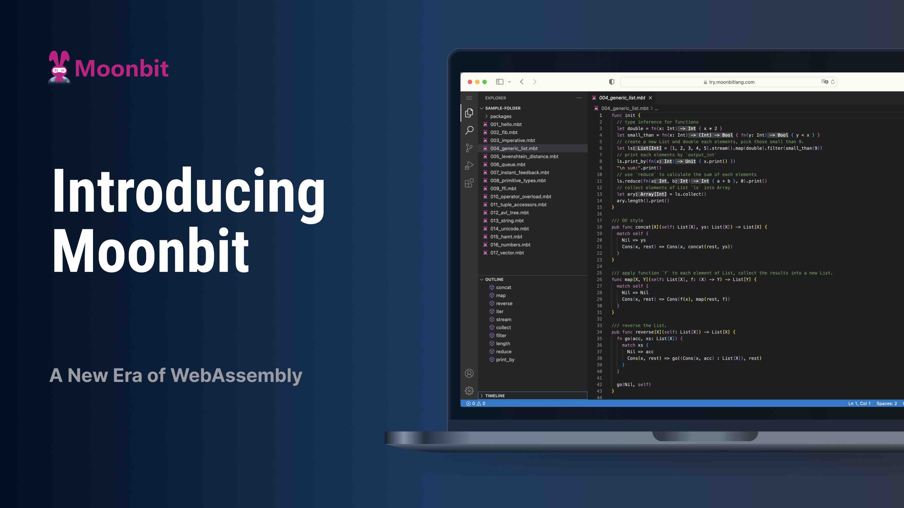

import Tabs from '@theme/Tabs'
import TabItem from '@theme/TabItem'

# Moonbit: the fast, compact & user friendly language for WebAssembly



<!--truncate-->

The importance of [WebAssembly](https://webassembly.org/) (Wasm), a cross-platform Instruction Set Architecture (ISA), is escalating in [Cloud and Edge computing](https://wasi.dev/), given its efficiency, security, compactness, and open standard. However, its true potential remains untapped. Low level Wasm languages like Rust and C/C++ are challenging to learn and can be slow for developers because of their long compilation time. On the other hand, high level languages like Golang produce code that's inefficient and bulky, failing to harness the key benefits of Wasm's speed and compactness.

Moonbit aims to be the _Wasm-first_ language that solves all those challenging issues. It’s fast to build and run, generating compact Wasm output, as easy as Golang and with none of the existing options’ legacy cruft. Together with Wasm's natural efficiency, security, and compactness, Moonbit is well-positioned to fulfill Wasm's long-standing promises for Cloud and Edge computing.

Moonbit is led by [Hongbo Zhang](https://twitter.com/bobzhang1988) and his experienced team, who have over a decade of professional experience in language design and development. Zhang contributed to several programming languages, including [OCaml](https://ocaml.org), [ReScript](https://rescript-lang.org) (was ReasonML/BuckleScript) and [Flow](https://flow.org). He was the chief architect for key components of the Rescript language toolchain, including its lightning-fast compiler, standard library, and build system.

Moonbit is also influenced by Golang and Rust. It integrates the simplicity of Golang, particularly in its package system and Rust’s expressiveness, including [robust pattern matching](https://en.wikipedia.org/wiki/Pattern_matching), [type inference](https://en.wikipedia.org/wiki/Type_inference#:~:text=Type%20inference%20refers%20to%20the,of%20computer%20science%20and%20linguistics.), generics, and trait-like ad-hoc polymorphism. Moonbit's fault tolerant type system is designed for speed, parallelizability, and incremental checking to provide [best IDE support](https://try.moonbitlang.com).

## Main focus of Moonbit

### Fast - _fast to build and run_

Moonbit aims to be fast _across all the stack_ including both dev performance and runtime performance.

Moonbit is engineered for whole program optimizations on multi-level intermediate representations(IR), a method that enhances the memory layout to minimize cache misses and provides a superior context for data and control flow analysis. This surpasses most existing link-time-optimization (LTO) structures by facilitating comprehensive understanding of the program's structure, enabling more effective optimizations. Optimizing on multiple level IRs also allows the identification and removal of higher-level redundancies not visible at lower levels.

Quick build performance, especially IDE functionality, is essential for the developer experience. Unlike ReScript and Rust, Moonbit allows function-level parallel semantic analysis. Due to its incremental reanalysis at this granularity, Moonbit is capable of handling vast monorepos and delivers millisecond response times, significantly enhancing IDE scalability.

### Compact - _tiny Wasm output_

Moonbit is designed for effective dead code elimination. It omits language features that hinder this analysis and has a standard library structured for easy dead code removal. Through whole program optimization, Moonbit considerably reduces the final code size, enhancing security and reducing attack vulnerabilities. This also ensures rapid startup in serverless computing environments.

### User friendly - _simple to learn and easy to use_

Moonbit makes programming easier with its automatic memory management, setting it apart from Rust. Unlike Golang, it steers clear of risky elements like pointers or left values. It also provides rich safe features including pattern match, algebraic data types and ad-hoc polymorphisms for data oriented programming.

Beyond a language, Moonbit also serves as a platform, providing an extensive toolset even at its early stage. This includes a high-speed build tool, a package manager, a compiler, an IDE, and a unique, container-free Cloud IDE with offline capabilities, accessible from any location with a browser, distinguishing it from conventional Cloud IDEs.

## A taste of MoonBit

The advantages of MoonBit can be illustrated with a simple Fibonacci example. Below is the `fib` function implemented in three languages (MoonBit, Go, and Rust):

```mdx-code-block
<Tabs>
<TabItem value='MoonBit'>
```

```moonbit
fn fib(num : Int) -> Int {
  fn aux(n, acc1, acc2) {
    match n {
      0 => acc1
      1 => acc2
      _ => aux(n - 1, acc2, acc1 + acc2)
    }
  }

  aux(num, 0, 1)
}
```

```mdx-code-block
</TabItem>
<TabItem value='Go'>
```

```go
func fib(n int) int {
  var aux func(n, acc1, acc2 int) int
  aux = func(n, acc1, acc2 int) int {
    switch n {
    case 0:
      return acc1
    case 1:
      return acc2
    default:
      return aux(n-1, acc2, acc1 + acc2)
    }
  }
  return aux(n, 0, 1)
}
```

```mdx-code-block
</TabItem>
<TabItem value='Rust'>
```

```moonbit
fn fib(n: i32) -> i32 {
  fn aux(n: i32, acc1: i32, acc2: i32) -> i32 {
    match n {
      0 => acc1,
      1 => acc2,
      _ => aux(n - 1, acc2, acc1 + acc2),
    }
  }
  aux(n, 0, 1)
}
```

```mdx-code-block
</TabItem>
</Tabs>
```

Below is the result of our benchmark available on [github](https://moonbitlang.github.io/moonbit-docs/benchmark/fibonacci/).

<figure style={{ position: 'relative', height: '300px', margin: 0 }}>
  <div
    style={{ position: 'absolute', height: '100%', width: '85%', left: '5%' }}
  >
    <div
      style={{
        position: 'absolute',
        left: 0,
        top: 0,
        width: '1px',
        bottom: 0,
        background: 'rgba(127,127,127,0.25)'
      }}
    ></div>
    <div
      style={{
        position: 'absolute',
        right: '100%',
        fontSize: 'small',
        marginRight: '6px',
        top: '8px'
      }}
    >
      Compute time
    </div>
    <div
      style={{
        position: 'absolute',
        right: '100%',
        fontSize: 'small',
        marginRight: '6px',
        top: '108px'
      }}
    >
      Wasm size
    </div>
    <div
      style={{
        position: 'absolute',
        right: '100%',
        fontSize: 'small',
        marginRight: '6px',
        top: '208px'
      }}
    >
      Compilation speed
    </div>
    <div
      style={{
        position: 'absolute',
        left: 0,
        height: '18px',
        width: '2.73%',
        background: '#E66465',
        top: 0
      }}
    ></div>
    <div
      style={{
        position: 'absolute',
        left: 0,
        height: '18px',
        width: '2.43%',
        background: '#FFCF00',
        top: '24px'
      }}
    ></div>
    <div
      style={{
        position: 'absolute',
        left: 0,
        height: '18px',
        width: '97.8%',
        background: '#0E38E1',
        top: '48px'
      }}
    ></div>
    <div
      style={{
        position: 'absolute',
        fontSize: 'small',
        left: '2.73%',
        marginLeft: '3px',
        top: '-3px',
        fontWeight: 600
      }}
    >
      177.9 ms
    </div>
    <div
      style={{
        position: 'absolute',
        fontSize: 'small',
        left: '2.43%',
        marginLeft: '3px',
        top: '22px'
      }}
    >
      160.8 ms
    </div>
    <div
      style={{
        position: 'absolute',
        fontSize: 'small',
        left: '97.8%',
        marginLeft: '3px',
        top: '46px',
        width: '15%',
        overflow: 'hidden',
        whiteSpace: 'nowrap'
      }}
    >
      6357.8 ms
    </div>
    <div
      style={{
        position: 'absolute',
        fontSize: '12px',
        right: '0px',
        marginLeft: '3px',
        top: '68px',
        whiteSpace: 'nowrap',
        fontStyle: 'italic'
      }}
    >
      Time to compute fib(46) 10000000 times
    </div>
    <div
      style={{
        position: 'absolute',
        left: 0,
        height: '18px',
        width: '0.5%',
        background: '#E66465',
        top: '100px'
      }}
    ></div>
    <div
      style={{
        position: 'absolute',
        left: 0,
        height: '18px',
        width: '1%',
        background: '#FFCF00',
        top: '124px'
      }}
    ></div>
    <div
      style={{
        position: 'absolute',
        left: 0,
        height: '18px',
        width: '96.5%',
        background: '#0E38E1',
        top: '148px'
      }}
    ></div>
    <div
      style={{
        position: 'absolute',
        fontSize: 'small',
        marginLeft: '3px',
        left: '0.5%',
        top: '98px',
        fontWeight: 600
      }}
    >
      253 bytes
    </div>
    <div
      style={{
        position: 'absolute',
        fontSize: 'small',
        marginLeft: '3px',
        left: '1%',
        top: '122px'
      }}
    >
      498 bytes
    </div>
    <div
      style={{
        position: 'absolute',
        fontSize: 'small',
        marginLeft: '3px',
        left: '96.5%',
        top: '146px',
        width: '15%'
      }}
    >
      1447712 bytes
    </div>
    <div
      style={{
        position: 'absolute',
        fontSize: '12px',
        right: '0px',
        marginLeft: '3px',
        top: '168px',
        whiteSpace: 'nowrap',
        fontStyle: 'italic'
      }}
    >
      Size of output Wasm file
    </div>
    <div
      style={{
        position: 'absolute',
        left: 0,
        height: '18px',
        width: '10%',
        background: '#e66465',
        top: '200px'
      }}
    ></div>
    <div
      style={{
        position: 'absolute',
        left: 0,
        height: '18px',
        width: '90%',
        background: '#FFCF00',
        top: '224px'
      }}
    ></div>
    <div
      style={{
        position: 'absolute',
        left: 0,
        height: '18px',
        width: '25%',
        background: '#0E38E1',
        top: '248px'
      }}
    ></div>
    <div
      style={{
        position: 'absolute',
        fontSize: 'small',
        marginLeft: '3px',
        left: '10%',
        top: '198px',
        fontWeight: '600'
      }}
    >
      1.06 s
    </div>
    <div
      style={{
        position: 'absolute',
        fontSize: 'small',
        marginLeft: '3px',
        left: '90%',
        top: '222px'
      }}
    >
      9.01 s
    </div>
    <div
      style={{
        position: 'absolute',
        fontSize: 'small',
        marginLeft: '3px',
        left: '25%',
        top: '246px'
      }}
    >
      2.56 s
    </div>
    <div
      style={{
        position: 'absolute',
        fontSize: '12px',
        right: '2px',
        marginLeft: '3px',
        top: '268px',
        whiteSpace: 'nowrap',
        fontStyle: 'italic'
      }}
    >
      Time to compile 626 packages
    </div>
  </div>
</figure>
<figcaption
  style={{ textAlign: 'center', marginBottom: '20px', color: '#222' }}
>
  <p style={{ margin: 0, color: 'var(--ifm-font-color-base)' }}>
    🟥 MoonBit 🟨 Rust 🟦 Go
  </p>
</figcaption>

From the above example, we can see that MoonBit has the following advantages:

- Better local type inference: MoonBit infers the type of local function `aux`
- Compact wasm size: MoonBit produces the smallest wasm output
- Good performance: Faster than go and comparable to rust
- User friendly: MoonBit supports recursive closure like Go, which is very difficult to implement in Rust; MoonBit also supports exhaustive pattern match like Rust, which is much more powerful than Go's switch case.

## Current status and roadmap

[Moonbit](https://moonbitlang.com/), is a fast moving target, but you can try it with our [online IDE](http://try.moonbitlang.com), or download the [CLI tools](/download). The docs are [hosted on github](https://github.com/moonbitlang/moonbit-docs) and the vscode extension is [available](https://marketplace.visualstudio.com/items?itemName=moonbit.moonbit-lang).

The development of an entire language toolchain, previously spanning years or even a decade, has been streamlined through our accrued experience and the establishment of a dedicated talented team from Moonbit's inception. We expect Moonbit to reach _beta status_ by the end of Q2 of 2024, indicating a phase of relative stability, minimal bugs, and a robust Foreign Function Interface (FFI) for interactions with the Wasm host. We will make the source code publicly available once we reach beta quality. Our strategic plans involve Wasm GC integration for Wasm 2.0 and our homebrewed GC for Wasm 1.0, in line with Wasm proposals.

## Community and early feedback

You are welcome to post questions on [our forum](https://discuss.moonbitlang.com/), join [our discord](https://discord.gg/CVFRavvRav) or follow our [Twitter account](https://x.com/moonbitlang).
