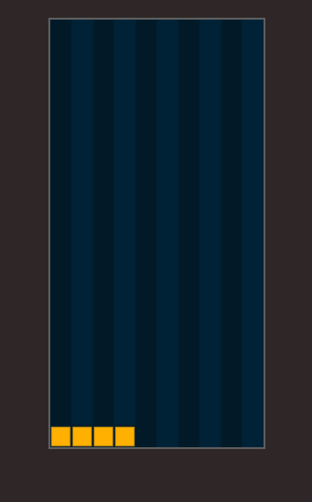

import Cover from './cover.png'
import Result from './result.mov'

# Let's code Tetris Game in MoonBit!


People who grew up in the '80s and '90s remember Tetris. For decades, the game has challenged our hand-eye coordination and ability to make snap decisions. Tetris hasn't gone anywhere—it's still around, playable on just about any device.

Last week, a MoonBit user named Luoxuwei shared his Tetris implementation code using MoonBit on GitHub, presenting an interesting coding exercise. Today, we'll utilize Luoxuwei's code as a practical example to illustrate how to program Tetris using MoonBit.

<!--truncate-->

<video controls src={Result} style={{width: '100%'}}></video>

## What is Tetris?

To begin, let's delve into the essence of Tetris.

Tetris was invented by the Russian Alexey Pazhitnov (Алексей Пажитнов). The game's original name, "Тетрис" in Russian (pronounced Tetris in English), is rooted in the Greek word "tetra," meaning "four," and Alexey's fondness for tennis, his favorite sport. So, he combined the words "tetra" and "tennis" to create the name Tetris, which is how the name Tetris for the game originated.

The rules of Tetris are straightforward: various shapes made up of small squares continuously fall from the top of the screen, and players must adjust the position and orientation of these shapes to form complete rows at the bottom of the screen. When rows are completed, the completed rows would disappear, making room for new falling shapes and earning players score points. If the blocks are not cleared and continue to stack up to the top of the screen, the player loses, and the game ends.

## How to write Tetris using MoonBit

Use `struct Tetris` to store the entire game state:

```moonbit
struct Tetris {
  mut dead:Bool
  mut grid:List[Array[Int]]
  mut piece_pool:List[PIECE]
  mut current:PIECE
  mut piece_x:Int
  mut piece_y:Int
  mut piece_shape:Array[Array[Int]]
  mut score:Int
  mut row_completed:Int
}
```

Use `grid` to hold the color of each block color in one screen

For example:

```
0 0 0 0 0 0 0 0 0 0 0
0 0 0 0 0 0 0 0 0 0 0
1 1 1 1 0 0 0 0 0 0 0
```

You can use them to represent the following picture:



### Generating Tetris

Use `generate_piece` to generate tetris:

```moonbit
pub fn generate_piece(self:Tetris) -> Bool {
  self.current = self.get_next_piece(true)
  self.piece_shape = self.current.piece_shape()
  self.piece_x = grid_col_count/2 - self.piece_shape[0].length()/2
  self.piece_y = 0
  return check_collision(self.grid, self.piece_shape, (self.piece_x, self.piece_y))
}
```

First, obtain the next piece via `get_next_piece()`, which retrieves the next piece from the `piece_pool`. What you obtain here is just an enumeration type.

```moonbit
pub fn get_next_piece(self:Tetris, pop:Bool) -> PIECE {
  if self.piece_pool.length() == 0 {
    self.generate_piece_pool()
  }

  let Cons(cur, n) = self.piece_pool
  if pop {
    self.piece_pool = n
  }
  cur
}
```

Second, utilize `piece_shape` to access the specific shape. Each type of Tetris block is represented using a two-dimensional array, with the array values corresponding to color indices.

```moonbit
pub fn piece_shape(self:PIECE) -> Array[Array[Int]] {
  match self {
    I => [[1, 1, 1, 1]]
    L => [[0, 0, 2],
          [2, 2, 2]]
    J => [[3, 0, 0],
          [3, 3, 3]]
    S => [[0, 4, 4],
          [4, 4, 0]]
    Z => [[5, 5, 0],
          [0, 5, 5]]
    T => [[6, 6, 6],
          [0, 6, 0]]
    O => [[7, 7],
          [7, 7]]
  }
}
```

For example, L represents as an L-shaped graph, as shown below:


Third, caculate the x-coordinate and y-coordinate of the piece.

Fourth, call `check_collision` to determine whether a collision exists.

### Controlling Tetris

We use the `step` function to move and rotate the pieces, performing different actions based on the value of the `action`.

```moonbit
pub fn step(tetris:Tetris, action:Int) {
  if tetris.dead {
    return
  }

  match action {
    //move left
    1 => tetris.move_piece(-1)
    //move right
    2 => tetris.move_piece(1)
    //rotate
    3 => tetris.rotate_piece()
    //instant
    4 => tetris.drop_piece(true)
    _ => ()
  }
  tetris.drop_piece(false)
}
```

1. Move tetris blocks

```moonbit
pub fn move_piece(self:Tetris, delta:Int) {
  var new_x = self.piece_x + delta
  new_x = max(0, min(new_x, (grid_col_count - self.piece_shape[0].length())))
  if check_collision(self.grid, self.piece_shape, (new_x, self.piece_y)) {
    return
  }
  self.piece_x = new_x
}
```

2. Rotate tetris blocks

```moonbit
pub fn rotate_piece(self:Tetris) {
  let r = self.piece_shape.length()
  let c = self.piece_shape[0].length()
  let new_shape = Array::make(c, Array::make(r, 0))
  var i = 0
  while i<c {
    new_shape[i] = Array::make(r, 0)
    i = i+1
  }

  var i_c = 0
  while i_c < c {
    var i_r = 0
    while i_r < r {
      new_shape[i_c][i_r] = self.piece_shape[r-i_r-1][i_c]
      i_r = i_r + 1
    }
    i_c = i_c + 1
  }
  var new_x = self.piece_x
  if (new_x + new_shape[0].length()) > grid_col_count {
    new_x = grid_col_count - new_shape[0].length()
  }

  if check_collision(self.grid, new_shape, (new_x, self.piece_y)) {
    return
  }
  self.piece_x = new_x
  self.piece_shape = new_shape
}
```

3. Drop tetris blocks

```moonbit
pub fn drop_piece(self:Tetris, instant:Bool) {
  if instant {
    let y = get_effective_height(self.grid, self.piece_shape, (self.piece_x, self.piece_y))
    self.piece_y = y + 1
  } else {
    self.piece_y = self.piece_y + 1
  }

  if instant == false && check_collision(self.grid, self.piece_shape, (self.piece_x, self.piece_y)) == false {
    return
  }

  self.on_piece_collision()
}
```

Here is what we need to focus:

The parameter `instant` is used to determine if it's a quick-drop block.

Use `on_piece_collision()` to find the full rows. Then eliminate them.

### Clearing Blocks

When a row becomes fully occupied, it becomes necessary to clear the blocks. We achieve this by utilizing the `on_piece_collision` function.

Firstly, add this block:

```moonbit
pub fn on_piece_collision(self:Tetris) {
  // ...

  //Add the current shap to grid
  fn go1(l:List[Array[Int]], r:Int) {
    match l {
      Cons(v, n) => {
        if r < y {
          return go1(n, r + 1)
        }

        if r >= (y + len_r) {
          return
        }
        var c = 0
        while c < len_c {
          if self.piece_shape[r - y][c] == 0 {
            c = c + 1
            continue
          }
          v[c + self.piece_x] = self.piece_shape[r - y][c]
          c = c + 1
        }
        return go1(n, r + 1)
      }
      Nil => ()
    }
  }
  go1(self.grid, 0)
}
```

Delete the rows already full:

```other
pub fn on_piece_collision(self : Tetris) {
  //...

  //Delete the complete row
  self.row_completed = 0
  fn go2(l:List[Array[Int]]) -> List[Array[Int]] {
    match l {
      Nil => Nil
      Cons(v, n) => {
        if contain(v, 0) {
          return Cons(v, go2(n))
        } else {
          self.row_completed = self.row_completed + 1
          return go2(n)
        }
      }
    }
  }
  var new_grid:List[Array[Int]] = Nil
  new_grid = go2(self.grid)
}
```

## Drawing with Moonbit External Ref

Using Canvas based on the information stored in `Tetris` to draw.

```moonbit
pub fn draw(canvas : Canvas_ctx, tetris : Tetris) {
    var c = 0

    //draw backgroud
    while c < grid_col_count {
      let color = if (c%2) == 0 {0} else {1}
      canvas.set_fill_style(color)
      canvas.fill_rect(c, 0, 1, grid_row_count)
      c = c + 1
    }

    draw_piece(canvas, tetris.grid, (0, 0))
    draw_piece(canvas, tetris.piece_shape.stream(), (tetris.piece_x, tetris.piece_y))

    if tetris.dead {
      canvas.draw_game_over()
    }
}


fn draw_piece(canvas:Canvas_ctx, matrix:List[Array[Int]], offset:(Int, Int)) {

    fn go(l:List[Array[Int]], r:Int, canvas:Canvas_ctx) {
      match l {
        Cons(v, n) => {
          var c = 0
          while c < v.length() {
            if v[c] == 0 {
              c = c+1
              continue
            }
            canvas.set_fill_style(v[c]+1)
            canvas.fill_rect(offset.0 + c, offset.1 + r, 1, 1)
            canvas.set_stroke_color(0)
            canvas.set_line_width(0.1)
            canvas.stroke_rect(offset.0 + c, offset.1 + r, 1, 1)
            c = c + 1
          }
          go(n, r+1, canvas)
        }
        Nil => ()
      }
    }
    go(matrix, 0, canvas)
}
```

## JavaScript Listening and Rendering

Add listening for keyboard events:

```javascript
window.addEventListener('keydown', (e) => {
  if (!requestAnimationFrameId) return
  switch (e.key) {
    case 'ArrowLeft': {
      tetris_step(tetris, 1)
      break
    }
    case 'ArrowRight': {
      tetris_step(tetris, 2)
      break
    }
    case 'ArrowDown': {
      tetris_step(tetris, 4)
      break
    }
    case 'ArrowUp': {
      tetris_step(tetris, 3)
      break
    }
  }
})
```

Update the screen, here to call the `draw` function (referred to `tetris_draw`) using Moonbit.

```javascript
function update(time = 0) {
  const deltaTime = time - lastTime
  dropCounter += deltaTime
  if (dropCounter > dropInterval) {
    tetris_step(tetris, 0)
    scoreDom.innerHTML = 'score: ' + tetris_score(tetris)
    dropCounter = 0
  }
  lastTime = time
  tetris_draw(context, tetris)
  requestAnimationFrameId = requestAnimationFrame(update)
}
```

Complete code: [moonbit-docs/examples/tetris](https://github.com/moonbitlang/moonbit-docs/tree/main/examples/tetris)

If you want to have a try, please click on the following link: [https://www.moonbitlang.com/gallery](https://www.moonbitlang.com/gallery/).

We’re also looking forward to your coding practice! If you have anything want to share, we warmly invite you to post your practice on MoonBit forum: [https://discuss.moonbitlang.com/](https://discuss.moonbitlang.com/)
