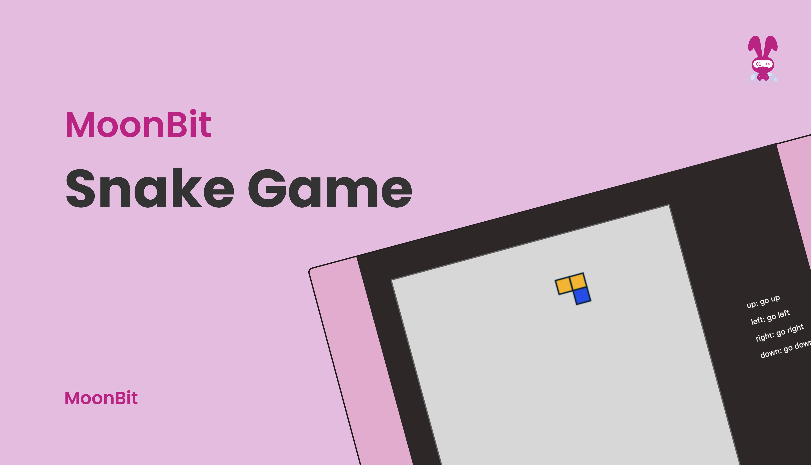
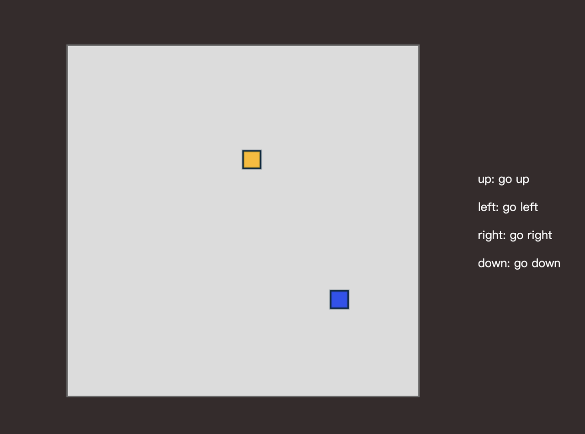

# Snake: Building Snake in MoonBit!



<!--truncate-->

## What is Snake?

Snake is a classic arcade game that originated in 1976 with the release of Blockade. This genre experienced a resurgence in the 1990s with the introduction of mobile phones featuring small screens, and nowadays, it is a game that can be installed on most smartphones. There are variations in different versions.

In the game, players control a long, straight line commonly referred to as a snake or worm. The snake continually moves forward, and players can only control the direction of the snake's head (up, down, left, or right). The objective is to navigate the snake, collecting items (often called "beans") while avoiding collisions with the snake's own body or other obstacles. Each time the snake consumes a food item, its body length increases. Consuming multiple food items gradually accelerates the snake's movement speed, increasing the game's difficulty. Game designs typically include modes with walls on all four sides (impassable), modes with certain parts of the walls being traversable, and modes where all walls can be penetrated. Some variations of the game allow the snake to pass through its own body without resulting in a game over, such as Snake vs. Color and Snake Evolution Theory. Today, we will show you how to implement Snake game using MoonBit.

The complete code example：https://github.com/moonbitlang/moonbit-docs/tree/main/examples/snake

If you want to have a try, please click on the following link: [https://www.moonbitlang.com/gallery/snake/](https://www.moonbitlang.com/gallery/snake/).

## How to implement Snake using MoonBit？

Use `struct GameState` to build this game:

```moonbit
struct GameState{
  mut grid:  Array[Int]
  mut body:  List[Position]
  mut dir:   Direction
}

```

Use `grid` to initialize the color of every grid:

```moonbit
0 0 0 0 0 0
0 2 0 1 0 0
0 0 0 0 0 0

```

`0` represents the simple grid, `1` represents snake's body, `2` represents the food

Game interface after initialization：



### Generating Food

```moonbit
fn random() -> Double = "Math" "random"
fn floor(i: Double) -> Int = "Math" "floor"

fn generate_Food(self: GameState){
  while true {
    let i : Int = floor(random() * 20.0)
    let j : Int = floor(random() * 20.0)

    if(self.grid[j * grid_col_count + i] == grid_num(Default)){
      self.setGridType({x: i, y: j}, Food)
      return
    }
  }
}

```

Firstly, use two external reference functions to randomly generate the horizontal and vertical coordinates for the new food. Then, use `grid_num` to determine whether the newly generated coordinates can be placed. Finally, use the `setGridType`method to designate it as food.

### Control the snake's movement

```moonbit
pub fn tran_step(self : GameState, a : Int){
  let mut action : Direction = Default
  match a {
    1 => action = Up
    2 => action = Down
    3 => action = Left
    4 => action = Right
    _ => action = Default
  }

  self.step(action)
}

pub fn step(self : GameState, action : Direction) {

  match action {
    // move up
    Up =>{
      if length(self.body) == 1{
        self.dir = Up
      }else{
        if self.dir == Left || self.dir == Right || self.dir == Up{
          self.dir = Up
        }else{
          self.dir = self.dir
        }
      }

      }

    // move down
    Down =>{
      if length(self.body) == 1{
        self.dir = Down
      }else{
        if self.dir == Left || self.dir == Right || self.dir == Down{
          self.dir = Down
        }else{
          self.dir = self.dir
        }
      }

      }

    // move left
    Left =>{
      if length(self.body) == 1{
        self.dir = Left
      }else{
        if self.dir == Up || self.dir == Left || self.dir == Down{
          self.dir = Left
        }else{
          self.dir = self.dir
        }
      }

      }

    // move right
    Right =>{
      if length(self.body) == 1{
        self.dir = Right
      }else{
        if self.dir == Up || self.dir == Right || self.dir == Down{
          self.dir = Right
        }else{
          self.dir = self.dir
        }
      }
      }

    _ =>{
      self.dir = self.dir
      }

  }

  self.go_step()
}
```

First, the `trans_step` method is used to identify the response of the external keyboard and correspond to different input direction instructions.

Secondly, use the `step` method to filter whether the input direction is legal. The game stipulates that the snake cannot turn 180 degrees, but when the length of the snake's body is 1, the snake can move freely up, down, left, and right.

Finally, call the `go_step` method to complete the snake's movement.

```moonbit
fn go_step(self: GameState){
  let head : Position = get_head(self.body)
  let newHead : Position = {x: head.x , y: head.y }

  newHead.x = dir_posi(self.dir).x + newHead.x
  newHead.y = dir_posi(self.dir).y + newHead.y

  newHead.x = (newHead.x + grid_col_count) % grid_col_count
  newHead.y = (newHead.y + grid_col_count) % grid_col_count

  if self.grid[newHead.y * grid_col_count + newHead.x] == 1{
    initialize(self)
    return
  }else if self.grid[newHead.y * grid_col_count + newHead.x] == 2{

    self.setGridType(newHead, Body)
    self.body = Cons(newHead, self.body)
    generate_Food(self)
  }else {

    self.setGridType(newHead, Body)
    self.body = Cons(newHead, self.body)
    self.setGridType(get_tail(self.body), Default)
    self.body = delete_tail(self.body)
  }

}
```

In the `go_step` method, first obtain the position of the new head through the `Position` of `self.dir`, and secondly determine whether the position of the new head is an ordinary grid, a snake's body, or food.

- If it is a normal grid, set the new head as part of the snake and remove the snake's original tail.
- If it is the snake's body, end the current game round, and reinitialize the entire game.
- If it is food, consume the food and set its position as part of the snake's body.

## Draw graphics with MoonBit External Ref

Declare external function references

```moonbit
type Canvas_ctx

fn set_stroke_color(self : Canvas_ctx, color : Int) = "canvas" "set_stroke_color"

fn set_line_width(self : Canvas_ctx, width : Double) = "canvas" "set_line_width"

fn stroke_rect(self : Canvas_ctx, x : Int, y : Int, width : Int, height : Int) = "canvas" "stroke_rect"

fn fill_rect(self : Canvas_ctx, x : Int, y : Int, width : Int, height : Int) = "canvas" "fill_rect"

fn set_fill_style(self : Canvas_ctx, color : Int) = "canvas" "set_fill_style"

```

Then proceed with drawing.

```moonbit
pub fn draw(canvas : Canvas_ctx, snake : GameState) {
  let mut c = 0

  // draw backgroud
  while c < grid_col_count {
    canvas.set_fill_style(0)
    canvas.fill_rect(c, 0, 1, grid_row_count)
    c = c + 1
  }

  draw_piece(canvas, snake.grid, (0, 0))
}

pub fn draw_piece(canvas : Canvas_ctx, matrix : Array[Int],
        offset : (Int, Int)) {

  let mut r = 0
  let mut c = 0
  let mut c0 = 0
  while c < matrix.length() {
    if matrix[c] == 0 {
      c = c + 1
      continue
    }
    c0 = c % grid_col_count
    r = c / grid_col_count
    canvas.set_fill_style(matrix[c] + 1)
    canvas.fill_rect( offset.0 + c0, r, 1, 1)
    canvas.set_stroke_color(1)
    canvas.set_line_width(0.1)
    canvas.stroke_rect( c0, r, 1, 1)
    c = c + 1
  }
}

```

## JavaScript Keyboard Listening and Updating

```moonbit
window.addEventListener("keydown", (e) => {
  if (!requestAnimationFrameId) return
  switch (e.key) {
    case "ArrowLeft": {
        snake_step(snake, 3)
        snake_draw(context, snake)
        break
    }
    case "ArrowRight": {

        snake_step(snake, 4)
        snake_draw(context, snake)
        break
    }
    case "ArrowDown": {

        snake_step(snake, 2)
        snake_draw(context, snake)
        break
    }
    case "ArrowUp": {

        snake_step(snake, 1)
        snake_draw(context, snake)
        break
    }

  }
})

```

`update` the screen, calling the `snake_step` and `snake_draw` methods

```moonbit
function update(time = 0) {
  const deltaTime = time - lastTime
  dropCounter += deltaTime
  if (dropCounter > dropInterval) {
    snake_step(snake, 5);
    dropCounter = 0
  }
  lastTime = time
  snake_draw(context, snake)
  requestAnimationFrameId = requestAnimationFrame(update)
}

```
