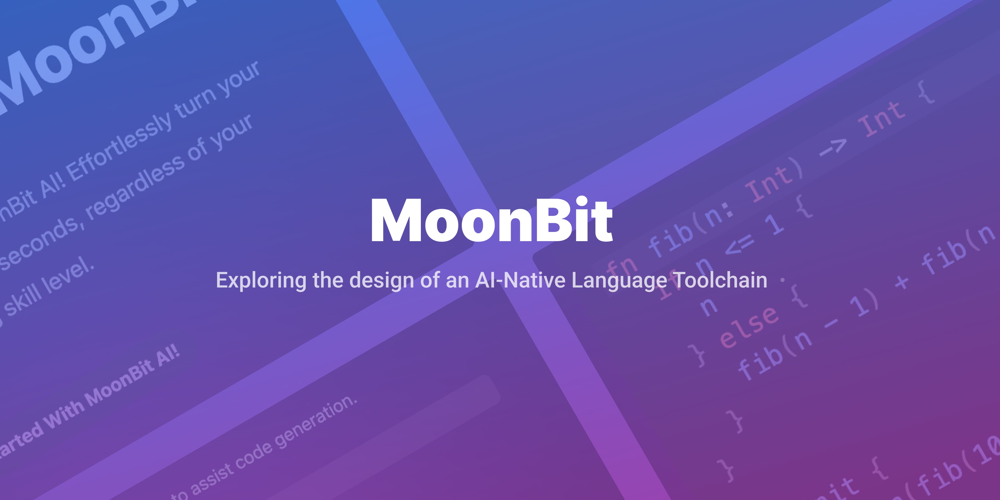
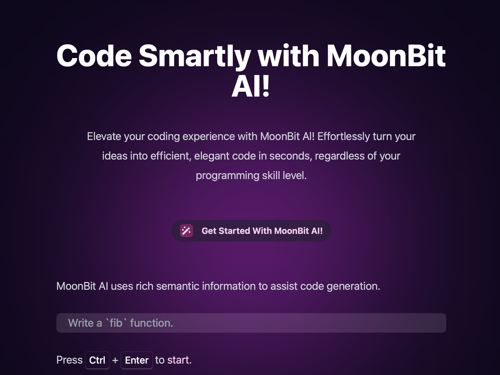
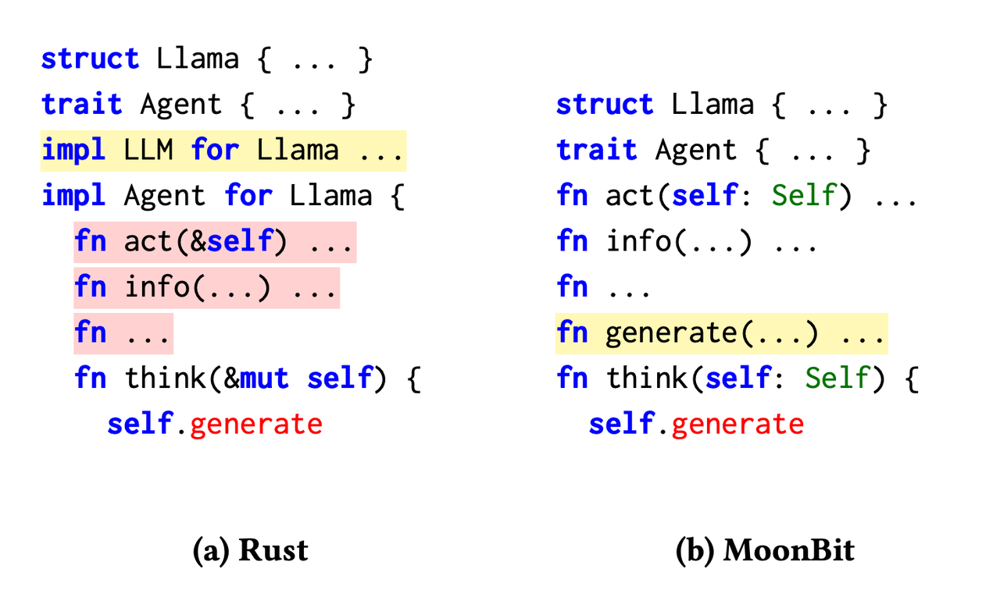
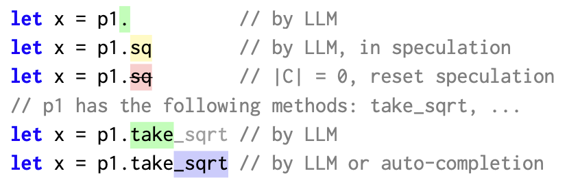
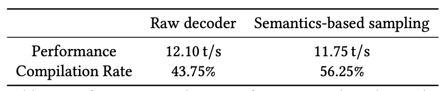

import aiVideo from './ai.mp4'

# MoonBit: Exploring the design of an AI-Native Language Toolchain

<!--truncate-->

Our team's paper, *MoonBit: Explore the Design of an AI-Friendly Programming Language*, has been accepted for the [LLM4Code](https://llm4code.github.io/) 2024!

MoonBit was launched in Oct/2022, coinciding with the announcement of ChatGPT. MoonBit platform emerged as more than just a programming language but also a developer toolchain including the IDE, compiler, build system, package manager and more. We were in a unique position to reimagine how the whole programming language toolchain should work best with AI.

Let's watch the video below to see what an end-to-end dev experience would be like with MoonBit AI:

<video controls src={aiVideo} style={{width: '100%'}}></video>

We have set up a simple demonstration web page of MoonBit AI at [ai.moonbitlang.com](https://ai.moonbitlang.com/), and you're more than welcomed to play around with it! We look forward to your valuable feedback! Please feel free to contact us on [our forum](https://discuss.moonbitlang.com/)/[our discord](https://discord.gg/CVFRavvRav)/[Twitter account](https://x.com/moonbitlang).

In the following part of the blog, we will mainly focus on two main aspects:

1. how does the design of the MoonBit makes it an excellent, AI friendly programming language
2. what powers the MoonBit AI.

## MoonBit: Flattened Design, Adapted for Transformer Architecture

MoonBit, as a new development platform in the AI era, is designed with an emphasis on clarity and simplicity. It particularly emphasizes a clear distinction between *toplevel* and *local* definitions with mandatory type signatures for definitions at the toplevel. MoonBit also adopts structural interface implementation, where a type implements an interface by implementing its methods, thus eliminating the necessity for extra nested code blocks.

Most existing large models are based on the autoregressive Transformer architecture. This means that as the context window grows, the complexity of generating a single token increases quadratically. In other words, inference in large models becomes progressively slower. A programming language without nesting not only has better readability but is also more KV-cache friendly at various levels (RAG, decoder correction, backtrack), achieving higher inference speed.

Let's see an example.

A programmer is using Rust (left) to implement the method `think` for type `Llama` as part of the `Agent` trait. They realize that type `Llama` lacks the `generation` method defined in the `LLM` trait. Being in a nested code block, they need to return to the toplevel to implement the `LLM` trait for type `Llama`.

In contrast, MoonBit (right) enables programmers and LLMs to develop their programs *linearly*, without frequent back-and-forth navigation. With the structural interface, functions implementing an interface are not confined to a specific code block. This allows a nearly linear generation of interfaces and their respective implementations, thereby effectively minimizing the KV cache misses.

## MoonBit AI: Rapid and Real-Time Semantic Completion

MoonBit AI is powered by two customized sampling algorithms: local sampling and global sampling. Local sampling uses AI-generated code for real-time adjustments to ensure that the code adheres to syntactic norms, while global sampling further verifies the semantic correctness of the code. As the large language model (LLM) generates new tokens, the MoonBit sampler will collect and utilize information from both local and global to ensure that each produced token is not only syntactically correct but also free from obvious type errors. This method offers a more reliable and accurate code generation, reducing the need for subsequent debugging and error correction.

For example, as the LLM writing programs, it might generate a bad token. We maintain a speculation buffer to store last token. Once the token is completed by the LLM, we check if the token is valid. If it is we accept it and commit to the user, if not we backtrack and try again. To prevent the LLM from making the same mistake, we will inform the LLM about the possible continuation to make a better choice.

Our experimental shows that the MoonBit sampler has achieved a significant improvement in compilation rates, with a modest performance penalty of approximately 3%.

## This is only a start!

Furthermore, we are in the process of creating a package manager, which is instrumental in aggregating additional data to fine-tune the model. Future objectives include the enhancement of MoonBit's AI capabilities, incorporating functionalities such as code assistance, review, question and answer interfaces, test generation, and validation mechanisms. In parallel, we are planning a fast interpreter to provide real-time feedback during runtime. This will further increase the reliability of the AI-generated code.

Please stay tuned.
