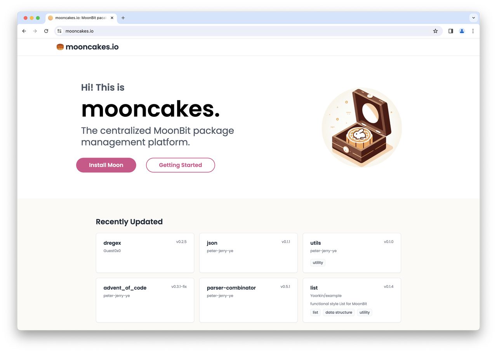
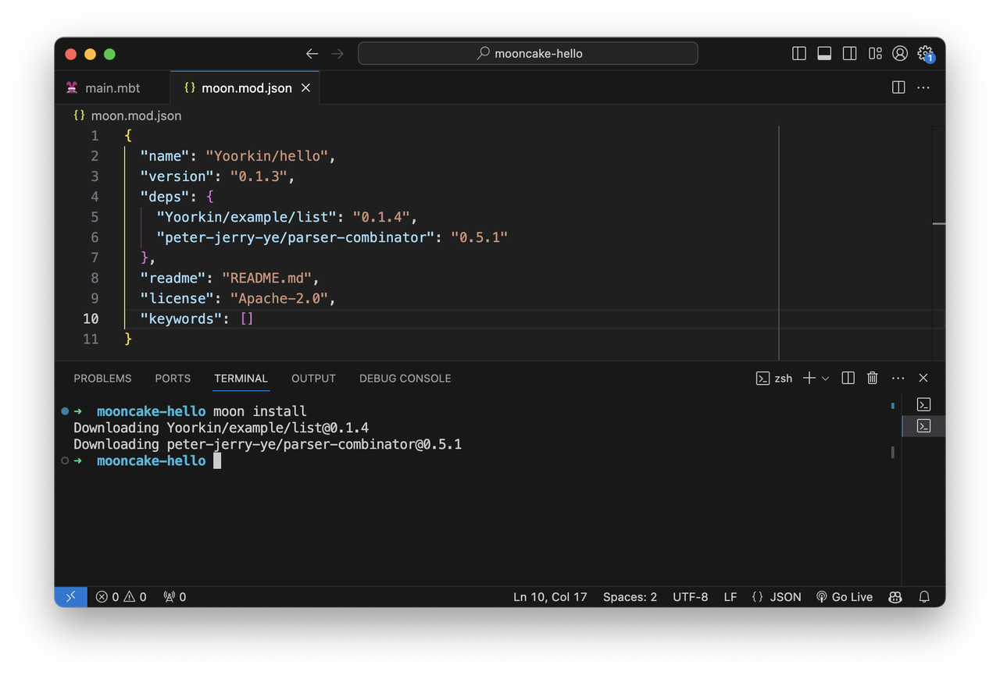
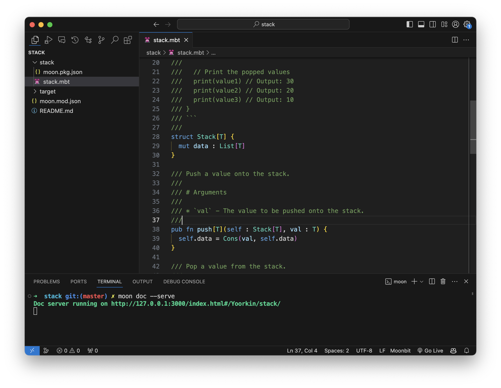
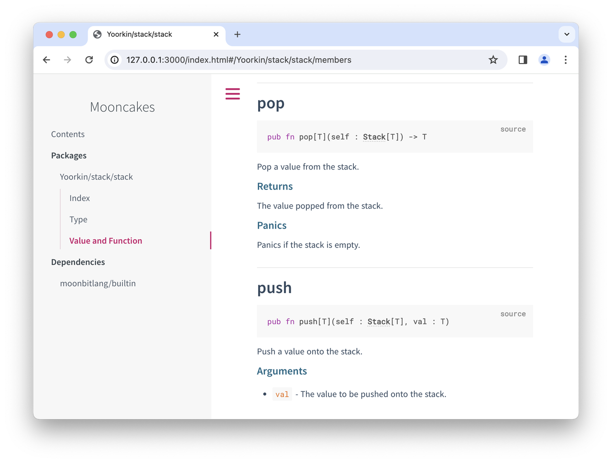

# Introducing MoonBit package manager: mooncakes.io

<!--truncate-->

Today, we are thrilled to announce that mooncakes.io (the package management and sharing platform for MoonBit) has been officially launched! Alongside it, we're also introducing Moondoc, which serves as a crucial tool for documenting the various packages and libraries within mooncakes.io, ensuring that developers can easily understand and utilize the vast array of resources available.

The greatest value of MoonBit lies in its ecosystem. The earlier and more people get involved, the more we can develop the MoonBit platform and share its growth together. Although it is still at a very early stage and there is still a long way to go, we are eager to share it with everyone right now!

Next, let's dive deeper into mooncakes.io.

## mooncakes.io: where the MoonBit community share

mooncakes.io is a centralized MoonBit package management platform. Here, users can easily upload, share, use, and explore various MoonBit modules. To facilitate this seamless interaction, MoonBit's build system`moon`, has integrated commands for interacting with mooncakes.io, eliminating the complexities of manual dependency downloads and configurations. Unlike other package managers, MoonBit's dependency resolution employs a [minimal version selection algorithm](https://research.swtch.com/vgo-mvs) similar to Go's, ensuring precise dependency builds without unnecessary upgrades, thus guaranteeing a stable and reproducible development environment.

mooncakes.io hosts all the MoonBit modules published by users, which can also be referred to as "mooncakes." The content published to mooncakes.io is modular, with each module potentially containing multiple packages. Each user on mooncakes.io has their own independent namespace, with the naming format for uploaded modules being `<username>/<package_name>`. The module versions released on mooncakes.io are defined according to [Semantic Versioning 2.0.0](https://semver.org/spec/v2.0.0.html), and MoonBit will resolve specific versions based on compatibility.

Moreover, mooncakes.io also serves as a documentation hosting platform. Once a user successfully publishes a module, mooncakes.io will automatically generate a documentation page for that module. We hope that such a centralized platform can provide users with a simple and consistent user experience.

To further enhance the user experience, we also offer a toolchain deeply integrated with mooncakes.io.

## Integrated Toolchain for mooncakes.io

**1. MoonBit's build system, `moon`**:

- `moon login`: Log in to mooncakes.io.
- `moon register`: Register account on mooncakes.io
- `moon publish`: Release a package to mooncakes.io, adhering to Semantic Versioning 2.0.0 principles. Each new version must sequentially increase.
- `moon add`: Add a dependency. It will trigger dependency resolution, module and version identification, followed by the download of necessary modules from mooncakes.io, and automatic `moon.mod.json` updates.
- `moon remove`: Remove a dependency.
- `moon tree`: List all dependencies in a tree structure.
- `moon update`: Update the local index. The index records all package versions and their dependencies on mooncakes.io. The index file is managed using git, so after the first update is completed, subsequent `moon update` commands can perform incremental updates, which requires the git command in your environment.
- `moon install`: Automatically install all dependencies listed in the `deps` field of `moon.mod.json`.

**2. `moondoc` Documentation Generation Tool**

`moondoc` serves as a command-line tool that collects documentation comments from MoonBit projects and generates documentation information. When generating documentation, `moondoc` not only analyzes type information in top-level declarations but also provides links to the corresponding type documentation.

Users can add documentation comments that start with `///` in front of any top-level `fn`, `let`, `enum`, `trait`, etc. These comments follow the Markdown format, as shown below:

Once the documentation is seamlessly constructed on mooncakes.io, users have the convenience of navigating directly to detailed documentation. By simply clicking on a type within any top-level signature—for instance, the Stack type, denoted with an underscore in the self parameter—users are instantly redirected to the comprehensive documentation page for the Stack type, as illustrated below:

The Moon build system seamlessly incorporates commands for generating documentation locally via `moon doc` and for previewing this documentation with `moon doc --serve`.

This comprehensive framework facilitates all aspects of dependency management, module uploading, and the creation and preview of documentation, all achievable through the integrated capabilities of the Moon build system.

## What’s Next?

### Integration with MoonBit Tools

Building documentation should be as easy as building code. A key initiative moving forward is the integration of [mooncakes.io](https://mooncakes.io/) with core MoonBit tools. This integration aims to enable developers to effortlessly document their code right from the start of a project.

If you want to learn more about how to use mooncakes.io, detailed instructions and resources can be found at this link: [https://www.moonbitlang.com/docs/package-manage-tour](https://www.moonbitlang.com/docs/package-manage-tour)

### Get involved and make a difference together!

Your experience, feedback, and contributions are greatly encouraged!

- Get started by trying out [https://mooncakes.io](https://mooncakes.io)
- Get help with using mooncakes.io in the [forum](https://discuss.moonbitlang.com/) or [discord](https://discord.gg/whKR7auvcT)
- [File a bug report](https://github.com/moonbitlang/moonbit-docs/issues) for problems you find, or ideas for improvements

### Questions?

The [MoonBit forum](https://discuss.moonbitlang.com/) are open for any inquiries regarding this post. We invite you to post your questions and join the conversation, helping us shape the future of MoonBit together.
