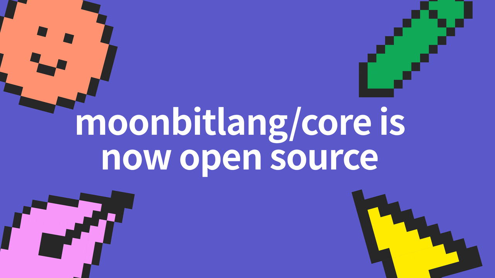

# Open sourcing MoonBit Core

MoonBit is a Rust-like language (with GC support) and toolchain optimized for WebAssembly experience. Today, we're excited to open source [MoonBit Core](https://github.com/moonbitlang/core), under Apache License 2.0. Since [its launch](https://www.moonbitlang.com/blog/first-announce) in October 2022, the [MoonBit platform](https://github.com/moonbitlang/moonbit-docs) is iterating so fast that we have shipped a full blown [Cloud IDE](http://try.moonbitlang.com/), compiler, [build system](https://www.moonbitlang.com/download/), [package manager,](https://mooncakes.io/) and documentation generator.

MoonBit is close to beta status and the language features are stabilizing. We've established the essential infrastructure to support core library development, ensuring increased stability in language features. We are happy to open source the core and make the development public so that we can have more feedback from daily users.

<!--truncate-->

## Why are we doing this?

Our goal is to cultivate the MoonBit ecosystem, with a key focus on expanding the standard library. The scope of the standard library is vast, including high-quality data structures, hash algorithms, mathematics, testing frameworks, and more.

To achieve this goal, we are happy to invite people who are passionate about MoonBit to join our community and collaborate with us. Together, we aim to accomplish something truly significant.

We also value feedback from early users, which will help us refine MoonBit more effectively. Therefore, we are open to taking specific suggestions and insights from the broader community. By building in public, we invite you to be part of the language's growth from its earliest stages.

## The Road to 2024: Shaping Our Future Together!

Although in an early stage, we are moving really fast! We expect MoonBit will reach beta status in the mid of 2024. Besides our optimized [WebAssembly](https://webassembly.org/) backend, we are actively working on more backends to bring MoonBit to a larger audience.
Open sourcing core is our first step; we will progressively open source more exciting stuff.

You are welcome to join us! Check out [contribution guide](https://github.com/moonbitlang/core/blob/main/CONTRIBUTING.md) for more details. Together, we will shape the future of MoonBit as we move forward into 2024 and beyond.

## Ready to explore MoonBit?

Get started with MoonBit on VS Code today. [Download now](https://marketplace.visualstudio.com/items?itemName=moonbit.moonbit-lang)!
