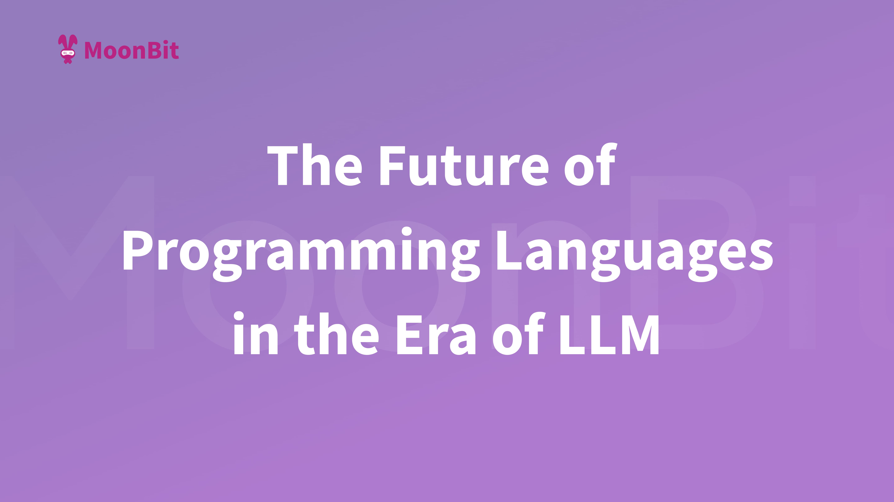
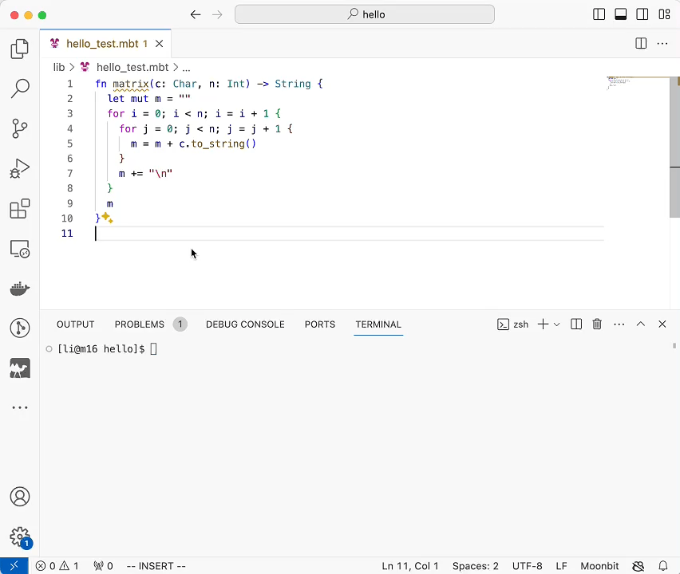
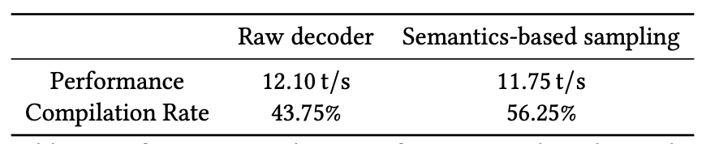

import mario from './mario.mp4'

# The future of programming languages in the era of LLM

<!--truncate-->

## **Introduction**

Born in the big bang moment of generative AI, one of the big questions MoonBit is trying to answer is how to best integrate large model intelligence and IDE intelligence to maximize developing efficiency. In the upcoming [LLM4Code 2024](https://llm4code.github.io/) on April 20th, MoonBit team will present our latest research results: _MoonBit: Explore the Design of an AI-Friendly Programming Language_. In this blog, [Hongbo Zhang](https://twitter.com/bobzhang1988), the lead of MoonBit and the chief architect for the Rescript language toolchain, will share his thoughts on the future trend of programming languages in the era of large models.

## **LLM is changing our workflow**

In 2017, Andrej Karpathy's blog "[Software 2.0](https://karpathy.medium.com/software-2-0-a64152b37c35)" predicted how artificial intelligence would change the workflow of software development. Generative AI tools like ChatGPT and Copilot now prove everyone how it is like. In the future, coding workflow will have three major changes:

1. AI coding tools will be able to generate a large number of short-term software and testing solutions instead of long-term reusable solutions. Due to the highly automated production process, the costs and delays of inference will be significantly reduced.
2. The success of engineering will not be challenged theoretically, but rather in practical optimization and iteration. Large code models will be refined into smaller ones, allowing their execution on edge devices.
3. Programming languages will be easier to learn. Traditionally, the key to learning a new language is to master its ecosystem, including syntax and how to use libraries. Generative AI will significantly simplify this process. For example, for JSON parsing, generative AI can automatically recommend suitable libraries. The handy assistant will not only help choose the right tools but also explain new syntax.

With these changes, it makes sense for programming to shift the focus from tools themselves to the end-to-end experience. When developing an application, developers may only need to illustrate their ideas, then AI will generate the corresponding code. In such a workflow, end-users will see programming tools as intermediaries rather than the focal point. However, this does not imply programming tools are less important. It is still crucial to understand the principles behind these tools to effectively instruct AI agents, solve complex problems, and foster innovation.

MoonBit actively responds to the future trend of end-to-end workflow. When I was working on the supply chain of ReScript, I became aware that it is necessary for the compiler build system and IDE responsiveness to cooperate effectively with synergy. Unlike traditional programming languages, MoonBit provides a full blown of compilation tools in the first place including compilers, build systems, IDEs, debuggers, and deployment tools, allowing for execution both in the cloud and at the edge, facilitating better interaction with diverse resources.

<video controls src={mario} style={{width: '100%'}}></video>

In designing MoonBit language, we aim to articulate various logics through a unified approach and support cross-platform compilation. Therefore, developers can use a unified platform model to solve issues and save their time from the job of learning various platforms in detail. We also design MoonBit language in a simple and clear way, which not only allows big models to understand MoonBit easily, but also streamlines the workload involved in language learning, suggestion engineering, and fine-tuning training processes.

## **What will the future programming language be like**

Generative AI led a technological revolution in the past year of 2023. Following the lauch of [OpenAI ChatGPT](https://openai.com/research/gpt-4) and [Meta LLaMA](https://llama.meta.com/), Large Language Models (LLM) embraced unprecedented growth and community expension. As the fundamental infrastructure of software development, programming languages always follow closely with the growth and need of technology. Mainframes introduced Fortran; personal computers introduced C; the Internet introduced Java and Python. Those programming languages succeeded because of their adaptation to the prevailing technology trends.

In May 2023, Chris Lattner, the founder of LLVM, launched [Mojo](https://www.modular.com/blog/a-unified-extensible-platform-to-superpower-your-ai) — “a new programming language for all AI developers”. Chris, upon founding "Modular AI," recognized the fragmentation of AI infrastructure ecosystems and the complex deployment of technology stacks, which constrained AI development. With this in mind, Mojo opted for the Python ecosystem, which dominates AI, by offering a superset of Python syntax, direct invocation of Python libraries, and enabling developers to fully leverage the vast and comprehensive Python ecosystem without starting from scratch.

Mojo is a representative new language in the domain of developing better AI models. However, AI model development demands high computing power, high costs of hardware and software, as well as training costs. Ultimately, the development of AI models will still rely on institutions with ample research funding and needs. For developers in the industry, they need **a programming language designed for practical industrial scenarios**, allowing them to fully tap into the potential of AI large models to enhance development efficiency.

### **Challenges**

To illustrate the features such a language should possess, we first need to discuss the challenges that large models pose to programming languages.

In Steve John's widely-discussed article "[Will LLM kill Python?](https://blog.metamirror.io/will-llms-kill-python-c805c8609d11)", he states that Python is inefficient in the era of LLM, as the majority of future programs are expected to be generated with AI assistance. Python, being a dynamically-typed language, lacks features conducive to verification and cannot produce efficient code. Therefore, Python's quick-to-learn advantage becomes less significant, and some of its language strengths are no longer as apparent. Traditional programming languages (such as Python) are mostly designed to interact better with humans, whereas in the future, **programming languages need to address how to communicate better with large models**.

When large models are used in the coding domain, the first challenge they bring is the _security issue_. In future development scenarios, more than 70% of the code may be generated by large models, and the generated code is likely to contain security vulnerabilities. Security vulnerabilities may not necessarily come from the code itself but from dead code in a dependency. Therefore, future programming languages should provide safeguards for the security issue in AI generated code.

A more significant challenge lies in the _illusion issue_, namely the limitation of contextual understanding. Even if a model has the capacity for millions of tokens, its contextual understanding capabilities are still relatively limited. When we use AI-assisted tools for development, the most common issue is AI's incorrect completions, especially for dynamically-typed languages like Python and JavaScript, where AI often completes a method that doesn't actually exist and fails to be covered during testing. Therefore, future programming languages should allow large models to better understand context through code analysis to extract theoretical knowledge.

### **Three characteristics**

In the face of the two major challenges of the security issue and illusion issue in AI coding, I believe that a truly AI-friendly programming language should tend towards the following three characteristics: being easy to test, rapid static analysis, and security, thereby allowing developers to generate more reliable and accurate code.

1. Being easy to test: A programming language that is easy to test is crucial for confirming the correctness of code quickly during development. A language that is easy to test can significantly save developers' time from debugging and ensuring code quality.
2. Rapid static analysis: The ability for rapid static analysis allows developers to promptly discover and correct potential errors in the code. This ability to "correct illusions" is very helpful in maintaining the clarity and accuracy of the code.
3. Security: Programming languages and development environments should be able to effectively isolate and reduce security vulnerabilities. For example, utilizing sandboxing security techniques to isolate execution environments can protect the development process and the final product from malicious code and attacks.

## **MoonBit: a programming language for AI-native application**

For MoonBit, our original proposal aligns closely with the demands of large models. From the scratch, MoonBit was envisioned not just as another programming language but as a developer tool platform that enables IDE to respond quickly and static analysis tools to comprehend code swiftly. This concept is essentially in line with the goal of large models—enhancing machines' understanding of code. If a language can be statically analyzed quickly from its initial design, then large models can also understand it more rapidly, making them complementary to each other.

Shortly after MoonBit's development began, the release of ChatGPT provided us with an opportunity to further contemplate how a new programming language should facilitate better context for large models and how to validate and test AI-generated code, as well as how IDE will interact with users under the influence of large models. Regarding the security and illusion issues of AI code generation, MoonBit has adopted the following solutions in its design:

### **Solution 1: Security**

MoonBit's ability for rapid static analysis is designed with triple security measures.

1. A secure type system

Through structured interfaces and the type system, MoonBit allows large models to more accurately recognize patterns and structures in code, thereby generating more accurate and efficient code. This design not only improves the quality of generated code but also facilitates maintenance and expansion of code in the future.

2. Sandboxing security technique

Designed as a language for WebAssembly, MoonBit utilizes WebAssembly-based sandboxing security techniques to isolate execution environments, protecting the development process and final products from malicious code and attacks.

3. Dead code elimination

MoonBit links high-level IR files together using a linker and optimizes the overall structure, effectively eliminating dead code and omitting language features that hinder the analysis to significantly reduce the size of the final code. The triple security measures provide assurance for maintaining code security and improving code accuracy.

### **Solution 2: Verifiability and testability**

MoonBit is equipped with [expect testing](https://www.moonbitlang.com/blog/expect-testing) which operates independently without the need for any external dependencies, enabling direct testing out of the box. This is a feature typically only available in more mature languages.

### **Solution 3: Eliminating Illusions**

1. Local resampling and global resampling

MoonBit has implemented AI-generated code correcting through local resampling and global resampling. This strategy ensures real-time adjustments of AI-generated code to comply with syntax rules while further validating the semantic correctness. To illustrate with a specific example: Suppose we encounter a variable "p" and wish to autocomplete its attributes. When a large model is used for code completion, it may provide several options, such as "x", "y", or "co". Although each option may be syntactically correct, not all completions are type-correct within the current context. MoonBit, through real-time static analysis techniques, can accurately identify that "p" is of type "point" and knows that the "point" type has an attribute named "cordx." Therefore, MoonBit can intelligently infer that a completion starting with "co" is the correct choice.

2. Real-time semantic analysis tool

We have also developed a real-time semantic analysis tool based on tokens, ensuring higher accuracy of outputs from large models. Unlike traditional methods, MoonBit's sampler simultaneously collects and utilizes information from both local and global contexts, closely collaborating with parsers and static analyzers. When LLM generates new tokens, it leverages real-time feedback from parsers and static analyzers to ensure that each generated token is not only syntactically correct but also free from obvious type errors. Traditional methods lack this cooperation, often directly outputting decoded tokens, which can result in the generation of incorrect programs.

The experimental results indicate that MoonBit's sampler has achieved a significant improvement in compilation rates, with performance loss being only about 3%. For tasks involving enhanced suggestions, we observed an average delay of approximately 0.86 seconds for each suggestion enhancement. However, it is commonly observed that each type of suggestion enhancement typically triggers only once. This is because the model typically adapts and learns from the context after enhancement.

3. "Blocks"

MoonBit's design based on "blocks" may become a new direction for programming languages. Unlike traditional text-based programming languages, MoonBit handles code hierarchically, allowing functions to move between each other in a modular fashion, with each "block" running in its own independent environment. This approach not only makes the code easier to scale but also simplifies the process of providing context information to AI, which is crucial for accurately providing simple contexts to AI.

## **Future of MoonBit**

In 2024, MoonBit's goal is to enhance the usability of programming languages. Specifically, MoonBit's future development will primarily focus on the following three directions:

1. Community ecosystem and package management: We are preparing MoonBit crash courses and strive to build a comprehensive community ecosystem and package management system.
2. Cloud computing deployment and development tools improvement: MoonBit will prioritize real-time development, compilation, and debugging, aiming to achieve complete tools and products for instant deployment to the cloud.
3. Optimization of AI and edge applications: MoonBit will focus on fine-tuning and optimizing AI performance, aiming to achieve better application performance on client and edge devices. Additionally, we are making efforts in building servers that allow users to develop AI agent applications.

Additional resources:

- [Get started with MoonBit](https://www.moonbitlang.com/download/).
- Check out the [MoonBit Docs](https://github.com/moonbitlang/moonbit-docs).
- [Join](https://discord.gg/5d46MfXkfZ) our Discord community.
- Explore MoonBit programming projects in the MoonBit [Gallery](https://www.moonbitlang.com/gallery/).
- MoonBit core is now open source for more feedback from daily users. Check out the [Contribution Guide](https://github.com/moonbitlang/core/blob/main/CONTRIBUTING.md) for more information on how to contribute.
