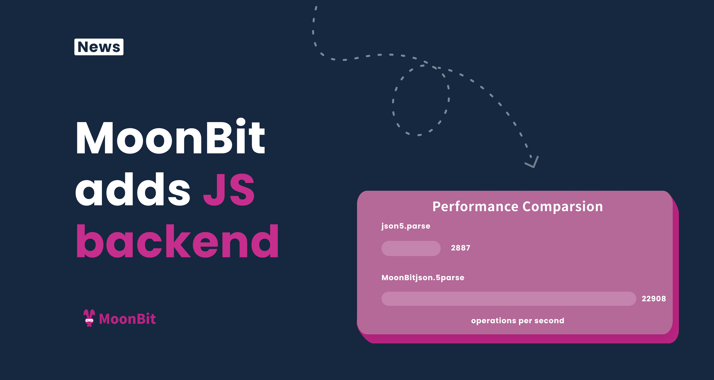
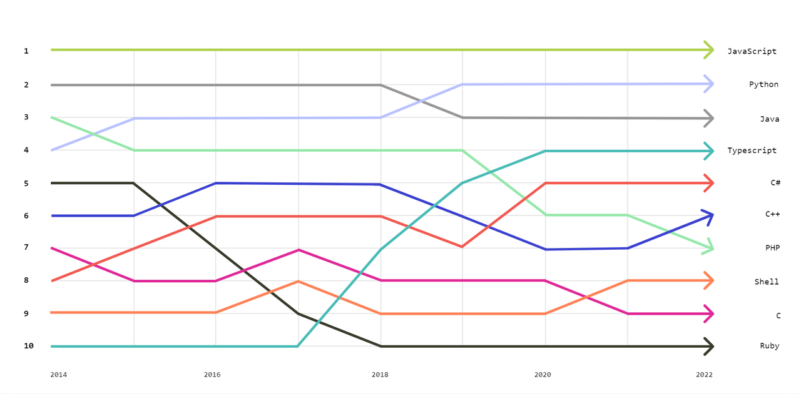
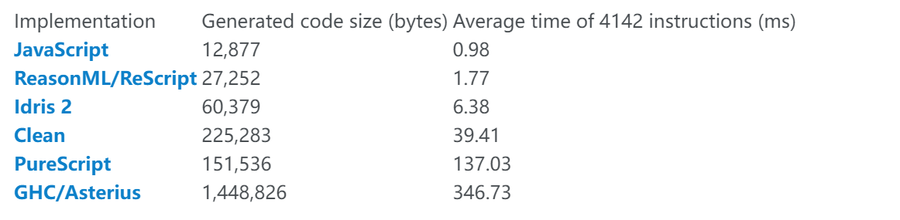
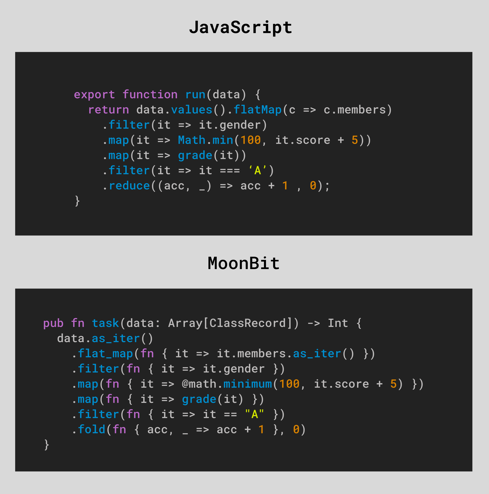
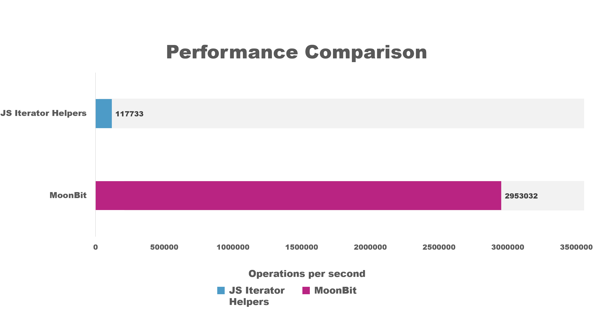
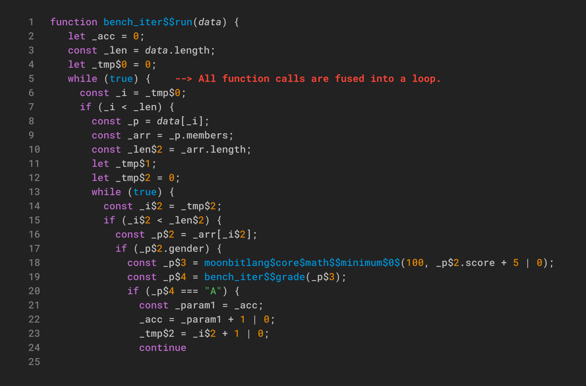
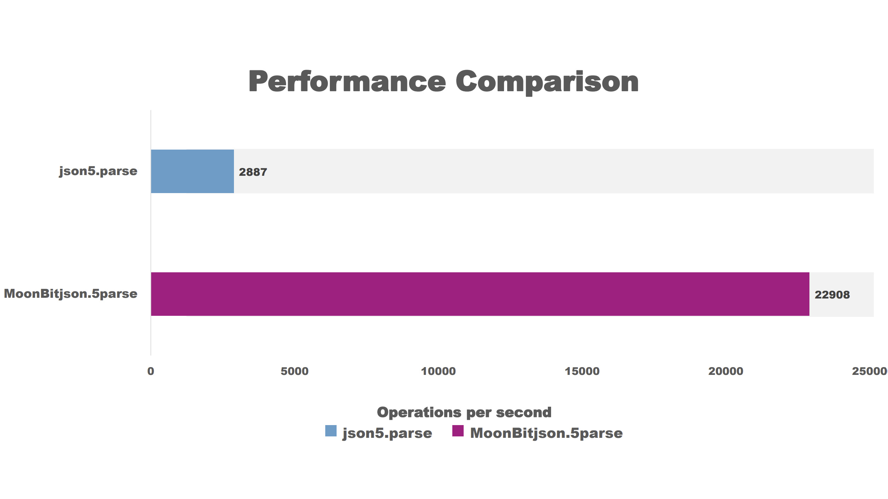
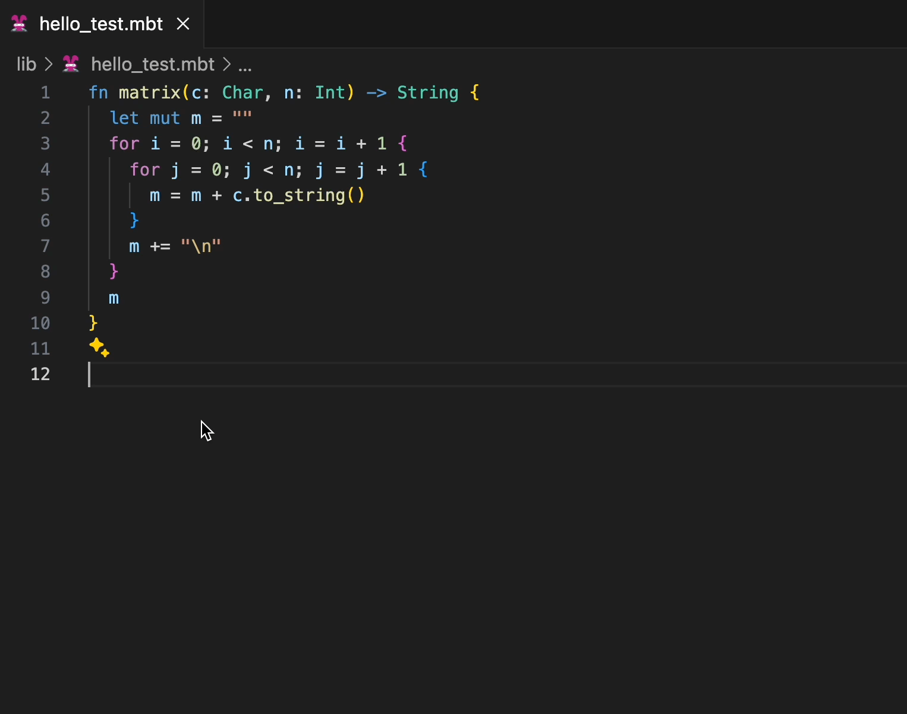

# MoonBit adds JS backend, up to 25x faster than native JS

<!--truncate-->

When [MoonBit officially launched in August 2023](https://www.moonbitlang.com/blog/first-announce), our critical mission was unleashing the potential of WebAssembly in cloud and edge computing as a Wasm-first programming language and toolchain. By integrating the essence of Rust and Go, MoonBit has not only achieved simplicity and usability in design but also been equipped with a robust fault-tolerant type system. At the same time, MoonBit is working on automatic code generation and adjustment [leveraging artificial intelligence](https://www.moonbitlang.com/blog/ai-coding), taking one step further in combining IDE intelligence with large model intelligence.

With our team’s effort, MoonBit has achieved remarkable progress in its native support for WebAssembly within just one year and a half. We've significantly improved the speed of building and running, as well as producing compact Wasm output. During this journey, we've come to realize that the potential of MoonBit extends beyond Wasm, and fostering support for multiple backends could further cultivate a thriving MoonBit ecosystem.

Therefore, we are thrilled to announce that **MoonBit now supports the JavaScript backend**! What we've achieved is more than mere support but an unprecedented performance boost, akin to [what we’ve achieved with Wasm](https://github.com/moonbitlang/moonbit-docs/tree/main/benchmark/fibonacci). **MoonBit showcases over a nearly eightfold performance advantage over Json5 on the JavaScript backend.** This marks an evolutionary step towards MoonBit's goal of achieving comprehensive coverage in software development.

## Why support JavaScript: the largest development community

After almost 30 years of JavaScript, it still has no sign of wear and tear. [GitHub’s State of the Octoverse listed JavaScript as the most used programming language in 2022](https://octoverse.github.com/2022/top-programming-languages), confirming its unwavering position as one of the most popular programming languages in the job market and software development field.

Data source: [https://octoverse.github.com/2022/top-programming-languages](https://octoverse.github.com/2022/top-programming-languages)

With its widespread popularity, JavaScript boasts an extensive and diverse ecosystem; it's no wonder why most programming languages consider JavaScript backend support a major step. However, most JavaScript alternatives fail to match the native performance of JavaScript, with some compiled code being up to 350 times larger than native JavaScript in benchmark tests. If a transpiled programming language only marginally improves maintainability at the significant expense of size and performance, then in most cases, native JavaScript remains the go-to language for developers.

Data source: [https://unsafeperform.io/blog/2022-07-02-a_small_benchmark_for_functional_languages_targeting_web_browsers/](https://unsafeperform.io/blog/2022-07-02-a_small_benchmark_for_functional_languages_targeting_web_browsers/)

MoonBit aims to address both code size and performance issues with our support for compiling to the JavaScript backend. Our benchmark results indicate that MoonBit JS significantly outperforms native JavaScript.

## Benchmark: Code execution speed exceeds JavaScript by 25 times

According to [the JavaScript proposal for Iterator Helpers](https://github.com/tc39/proposal-iterator-helpers), JavaScript can natively support iteration operations without the need for intermediate arrays. MoonBit has also introduced the same feature in sync, further enhancing its applicability and efficiency in modern JavaScript development environments.

Here is a common case: when processing a large amount of student grade data, traditional JavaScript code typically requires multiple steps to handle the data, such as filtering students with an A grade. This approach is intuitive, but it is not efficient in performance as it requires generating multiple intermediate arrays. For instance, first, iterate through the grades of 1000 students, convert the grades to levels, then sort them by A, B, C, D, E, and filter out students with an A grade, finally calculate the number of students with an A grade. In this case, after comparing MoonBit's JavaScript implementation with native support for Iterator Helpers in JavaScript, the JavaScript code written by MoonBit shows that its execution speed is 25 times faster than using native Iterator Helpers.

MoonBit has introduced a zero-cost abstraction similar to Rust's `Iter` type, which is a library specially optimized for common data processing situations. The design of this type fully leverages MoonBit's advanced abstraction capabilities while ensuring no additional runtime overhead. By using `Iter`, multiple processing steps can be combined into a cohesive workflow, significantly reducing the generation of intermediate arrays and thus improving performance. MoonBit's implementation enables developers to write logically clear and efficient code without worrying about performance overhead.

The zero-cost `Iter` type is particularly effective in handling large amounts of data and performing complex data transformations, optimizing the data processing process. With the `Iter` type, developers can more conveniently build efficient and maintainable systems, fully leveraging MoonBit's performance advantages.

Benchmark source: [https://github.com/moonbit-community/benchmark-202404.git](https://github.com/moonbit-community/benchmark-202404.git)

- **Code generation speed:** We compared the execution speed of code generated by MoonBit with JavaScript and found it to be over **25 times** faster. This approach not only simplifies the code but also enhances processing efficiency, allowing developers to focus more on the code logic instead of performance.

- **Operations per second (Ops/Sec) in one second:** MoonBit's performance is **25 times** that of native JavaScript, meaning MoonBit can perform far more operations per second than native JavaScript.

Here is an example of JavaScript code using MoonBit and its compilation result:

### JavaScript code generated with MoonBit's Iter type

## MoonBit JS vs. Json5: almost 8x faster

The case above may be too narrow. Here is a real-world situation: The latest performance test results show that MoonBit's core standard library has surpassed the performance of the top 0.1% Json5 library on npm. We found that **the JavaScript compiled by MoonBit is almost 8 times faster than the Json5 library**. This significant performance improvement in task execution efficiency means that MoonBit can perform more parsing tasks in the same amount of time, greatly enhancing data processing efficiency.

Benchmark source: [https://github.com/moonbit-community/benchmark-202404.git](https://github.com/moonbit-community/benchmark-202404.git)

### Why MoonBit runs faster than Json5?

The key to MoonBit's performance advantage lies in optimizing data processing by directly converting strings to integers for processing. Since JavaScript itself does not have a character type, characters in JavaScript exist as strings, which means any character operation is actually performed at the string level, naturally slower than directly operating on integers. In addition, MoonBit utilizes compilation techniques to optimize the code processing process. For example, during compilation, character constants are converted to their Unicode codepoint values. This allows these pre-compiled integer values to be directly utilized at runtime, rather than dynamically processing characters at runtime. Similarly, for switch statements, integer switch operations can be compiled into faster instructions, while string switch operations are as efficient as a series of if statements, which is much slower. MoonBit also introduces several generic techniques unrelated to JavaScript, such as constant folding, tail recursion conversion to loops, unpacking Option[Char], and iterator fusion, thereby improving overall compilation and execution efficiency.

In addition to these implemented techniques, the MoonBit team is continuously exploring new methods to enhance our performance even further. To ensure steady performance improvement and prevent performance regression, MoonBit has established a set of monitoring mechanisms to rigorously evaluate new changes in performance.

We believe MoonBit not only has outstanding runtime performance but also excels in compilation performance, enabling instant compilation to JavaScript with no waiting time for responses. MoonBit JavaScript draws on our past architecture experience in MoonBit IDE and toolchain, as we considered the collaboration of IDE, build system, and language design collaboration in the first place, to achieve highly parallelized and incremental type checking and inference.

## Out-of-the-box toolchain support

Most programming languages were only able to support sourcemap debugging functionality after a long period of development. MoonBit not only supports JavaScript backend but is also equipped with out-of-the-box toolchain support including the debugger and local test codelens support.

### Comprehensive sourcemap support and user-friendly debugger

Last year, [MoonBit introduced the Debugger](https://x.com/moonbitlang/status/1731646437656826164), a feature typically only available in more mature languages. MoonBit provides sourcemap support for JS backend on day one. Currently, this feature supports source mapping, setting breakpoints based on source code, and sourcemap output for debugging in browsers. MoonBit's sourcemap and debugging support enhance developers' debugging experience, ensuring that the generated JavaScript code closely mirrors the source code, with consistent variable and field names, facilitating source code inspection and debugging using browser DevTools.

Source: [https://github.com/moonbit-community/moonbit-js-debug-demo.git](https://github.com/moonbit-community/moonbit-js-debug-demo.git)

### Local test codelens support

[MoonBit IDE](https://try.moonbitlang.com/) now supports test codelens for local environments and automatic updates for [expect test](https://www.moonbitlang.com/blog/expect-testing). Users no longer need to write commands in the terminal themselves, but simply click the "Run Test | Update Test" button to achieve millisecond-level compilation, with almost no waiting time for a response..

## Try it today

Ready to experience MoonBit's remarkable performance in JavaScript firsthand? Try out the example provided at [this link](https://github.com/moonbit-community/benchmark-202404/tree/master/bench_json5).

## MoonBit Prospects

MoonBit is expanding its ecosystem by supporting WebAssembly and JavaScript backends. In the future, MoonBit plans to expand to more backend platforms such as Native and JVM and develop its own runtime and cloud deployment environments to further strengthen the toolchain support. MoonBit is not merely a programming language; it provides a comprehensive development toolchain, including [MoonBit IDE](http://try.moonbitlang.com/), compiler, [build system](https://www.moonbitlang.com/download/), and [package manager](https://mooncakes.io/), offering developers an all-in-one software development platform.

[The MoonBit standard library has been open source](https://www.moonbitlang.com/blog/moonbitlang-core-opensource) since March, and we have merged more than 200 repositories from our passionate contributors. The following plan is to open source the MoonBit build system and compiler step by step. By the Q3 of 2024, we expect MoonBit to reach beta status.

**Additional resources:**

- [Get started with MoonBit](https://www.moonbitlang.com/download/).
- Check out the [MoonBit Docs](https://github.com/moonbitlang/moonbit-docs).
- [Join](https://discord.gg/5d46MfXkfZ) our Discord community.
- Explore MoonBit programming projects in the MoonBit [Gallery](https://www.moonbitlang.com/gallery/).
- [MoonBit core](https://github.com/moonbitlang/core) is now open source for more feedback from daily users. Check out the [Contribution Guide](https://github.com/moonbitlang/core/blob/main/CONTRIBUTING.md) for more information on how to contribute.
