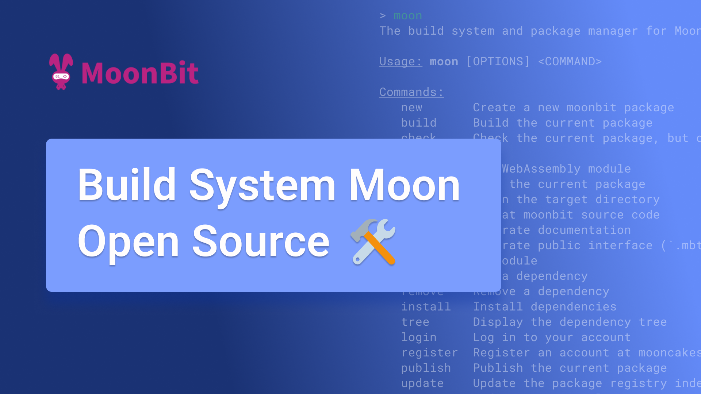
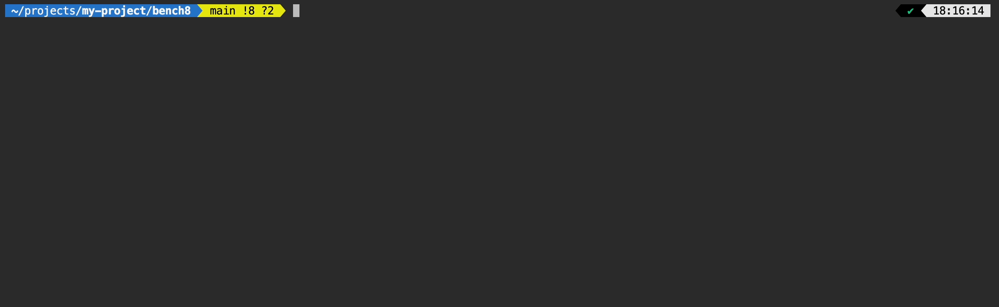
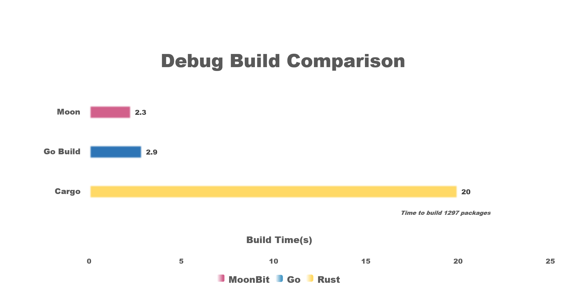
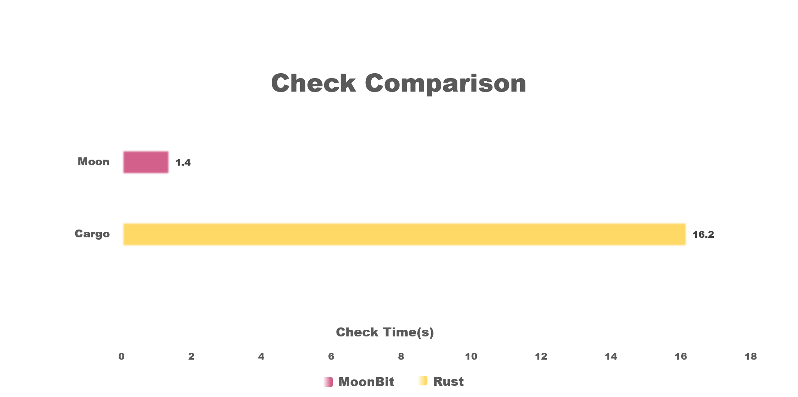
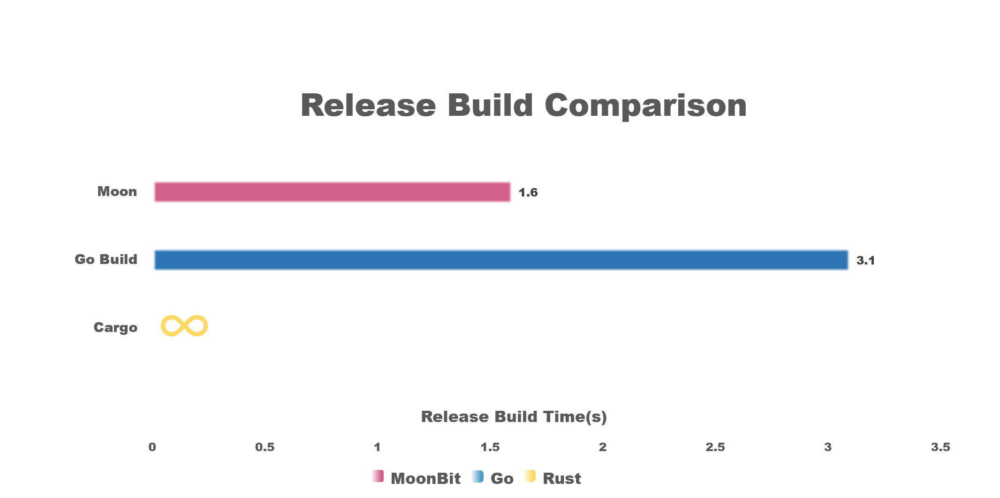

# MoonBit's build system, Moon, is now open source



## Moon: MoonBit Build System

Moon, the build system for MoonBit, is now publicly available via [the Moon GitHub repository](https://github.com/moonbitlang/moon/blob/main/docs/dev/README.md) under the AGPL License. Moon provides compilation, automated testing tools (including integrated [expect test](https://www.moonbitlang.com/blog/expect-testing)), coverage testing, package management, and more for MoonBit projects.

MoonBit integrates a comprehensive toolchain from the start, providing a streamlined coding experience with its compiler, [cloud IDE](https://try.moonbitlang.com/), build system, [package system](https://mooncakes.io/), and [AI assistant](https://ai.moonbitlang.com/). As an essential component of the MoonBit language compilation toolchain, Moon integrates closely with the IDE, offering detailed project structure and dependency information for code analysis within the IDE.

Written in Rust, Moon benefits from Rust's memory safety, high performance, concurrency capabilities, and cross-platform support, ensuring a stable and fast build process.

Moon's parallel and incremental build capabilities are bolstered by the [n2](https://github.com/evmar/n2) project (both n2 and ninja were created by Evan Martin, with n2 being more lightweight and excelling in incremental builds). Modifications to n2 will maintain the original open-source license, see [moonbitlang/n2](https://github.com/moonbitlang/n2).

## Why Choose Moon



1. Speed

MoonBit's compiler is incredibly fast due to a meticulously designed compilation process and optimization strategies. Acting as the bridge between the user and the compiler, Moon aims for a streamlined design, minimizing its own overhead to maximize compilation speed.

Additionally, Moon provides IDEs with comprehensive project structure and dependency details, crucial for latency-sensitive IDE environments. By optimizing the performance of core build steps, Moon ensures a smooth user experience ven in highly interactive development environments.

2. Parallel Incremental Builds

Bolstered by the n2 project, the parallel incremental build feature of Moon is key to its efficiency. By automatically analyzing and understanding dependencies among build tasks, Moon intelligently parallelizes independent tasks, fully leveraging the power of modern multi-core processors to significantly speed up builds. Importantly, Moon only rebuilds files that have changed since the last build or have updated dependencies, greatly enhancing build efficiency and making Moon capable of handling large projects that require frequent builds.

3. Integration and Testing Support

Closely integrated with automated testing tools, Moon can automatically execute unit tests, integration tests, and end-to-end tests during code submission and builds, ensuring every line of code is rigorously vetted.

For code quality assurance, MoonBit provides code formatting and static analysis tools that automatically check for consistent code styles and identify potential logical errors and security vulnerabilities. These features are especially crucial in CI/CD pipelines, allowing for early detection and reporting of code quality issues before code is merged into the main branch, ensuring the team can collaboratively develop high-quality code.

## Benchmark Performance

### Build Matrix Performance Testing

We tested moon against Rust's Cargo and Go's build system in compiling projects with complex dependencies. The test involves the generation of DR _ DC directories, the "directory matrix", and each directory contains MR _ MC modules, the "module matrix". The module in row r and column c of the module matrix depends on all modules in the previous row of the same directory. The first row of modules in a directory depends on all modules in the preceding row of directories.

The test setup also permits a lot of parallelism for actually executing the rules: the modules in the same row can be compiled in parallel, as well as the directories in the same row. For detailed testing criteria, see [omake1](http://blog.camlcity.org/blog/omake1.html), and the project generator code is available at [moonbit-community/build-matrix](https://github.com/moonbit-community/build-matrix).

In our tests, with DR, DC, MR, and MC all set to 6 and the `main` module, each project yields 1297 (6^4 + 1) packages. The test environment was a MacBook Pro Apple M3 Max with 128GB RAM running macOS 14.4.1. Results were as follows:



**Debug Build:** Moon performed excellently, taking 2.3 seconds. Go took 2.9 seconds, and Cargo was the slowest at 20.0 seconds.



**Type Check:** Moon was the fastest at 1.4 seconds. Cargo took 16.2 seconds. Go lacks a direct equivalent for type-checking commands like `moon check` and `cargo check`, so the result was `-`.



**Release Build:** Moon excelled again, taking only 1.6 seconds. Go took 3.1 seconds, and `cargo build --release` failed to complete due to memory exhaustion, resulting `∞`.

Notably, Moon's release builds were faster than its debug builds.

For projects with DR, DC, MR, and MC all set to 8 (4097 modules total), `moon build` took 5.7 seconds, `go build` took 11.2 seconds, and `cargo build` took 1043 seconds. In this test, both Moon and Go completed in seconds, while Cargo could not finish the build within a reasonable timeframe.

### Standard Library Performance Testing

Currently, [moonbitlang/core](https://github.com/moonbitlang/core) is the largest MoonBit project. As of 2024/07/03, it has 38,177 lines of code, 46 packages, 195 .mbt files, and 2576 tests. Type checking the project takes only 0.28 seconds, and running all tests takes just 1.27 seconds.

## Try Moon Now

Download the MoonBit toolchain via the [MoonBit CLI tools](https://www.moonbitlang.com/download/#moonbit-cli-tools) installation script, or install the MoonBit plugin in VS Code and follow the prompts for one-click installation.

Usage: `moon help`

```plain text
The build system and package manager for MoonBit.

Usage: moon [OPTIONS] <COMMAND>

Commands:
  new       Create a new moonbit package
  build     Build the current package
  check     Check the current package, but don't build object files
  run       Run WebAssembly module
  test      Test the current package
  clean     Clean the target directory
  fmt       Format moonbit source code
  doc       Generate documentation
  info      Generate public interface (`.mbti`) files for all packages in the module
  add       Add a dependency
  remove    Remove a dependency
  install   Install dependencies
  tree      Display the dependency tree
  login     Log in to your account
  register  Register an account at mooncakes.io
  publish   Publish the current package
  update    Update the package registry index
  coverage  Code coverage utilities
  bench     Generate build matrix for benchmarking (legacy feature)
  upgrade   Upgrade toolchains
  version   Print version info and exit
  help      Print this message or the help of the given subcommand(s)

Options:
      --source-dir <SOURCE_DIR>  The source code directory. Defaults to the current directory
      --target-dir <TARGET_DIR>  The target directory. Defaults to `source_dir/target`
  -q, --quiet                    Suppress output
  -v, --verbose                  Increase verbosity
      --trace                    Trace the execution of the program
      --dry-run                  Do not actually run the command
  -h, --help                     Print help
```

## How to Contribute

We welcome various forms of contributions from the community, such as documentation, testing, and issues. For detailed information, please refer to the [contribution guide](https://github.com/moonbitlang/moon/blob/main/docs/dev/README.md).

## MoonBit Open Source Roadmap

MoonBit was officially released last year, and we [opened the standard library to the public](https://github.com/moonbitlang/core) on March 8th this year. Thanks to enthusiastic contributions from the community, a complete data structure library has been successfully implemented, further enriching the application scenarios of the MoonBit language and maturing its ecosystem. Following the open-source release of the build system, we will release the MoonBit Beta preview version on August 18th next month, marking a relatively mature stage for the MoonBit language, suitable for early users and developers to develop and test actual projects. By the end of this year, on November 22nd, the core part of the MoonBit compiler will be publically available.

**Additional resources:**

- [Get started with MoonBit](https://www.moonbitlang.com/download/).
- Check out the [MoonBit Docs](https://github.com/moonbitlang/moonbit-docs).
- Learn MoonBit with the [open course](https://moonbitlang.github.io/moonbit-textbook/).
- Join our [forum](http://discuss.moonbitlang.com) and [Discord](https://discord.gg/5d46MfXkfZ) community.
- Explore MoonBit programming projects in the MoonBit [Gallery](https://www.moonbitlang.com/gallery/).
