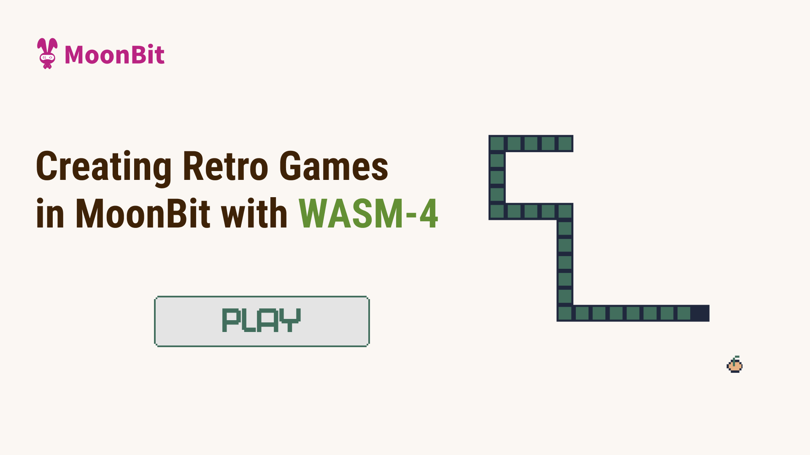
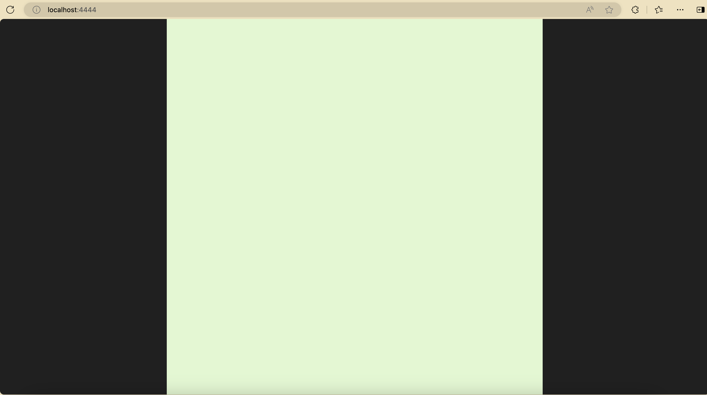
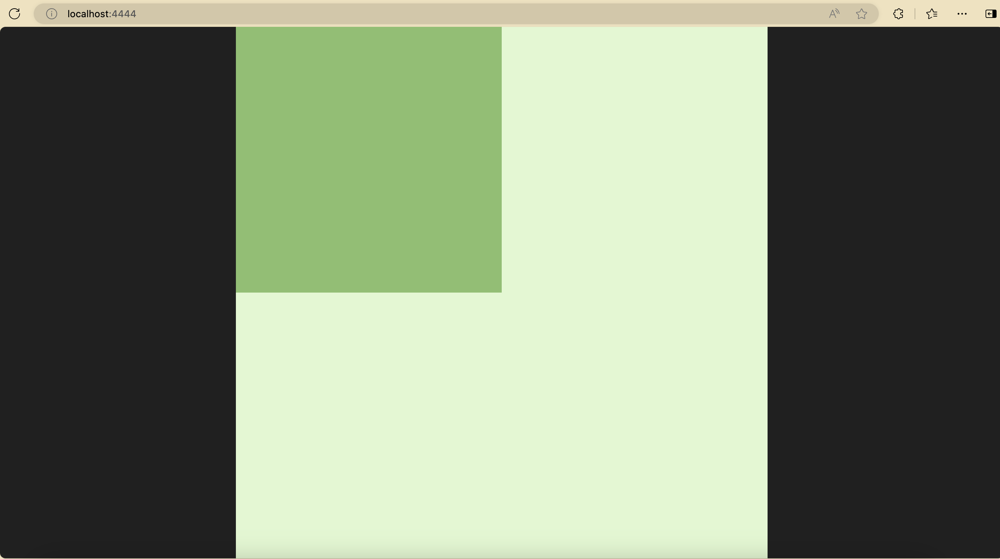
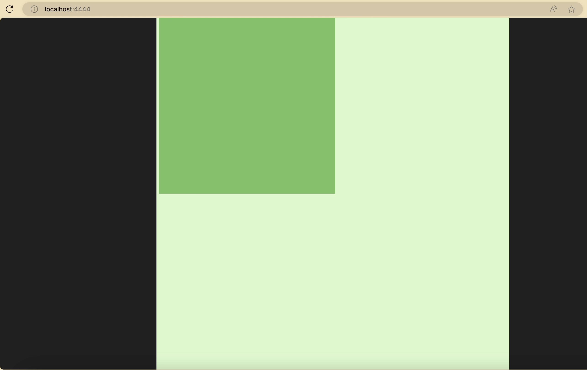
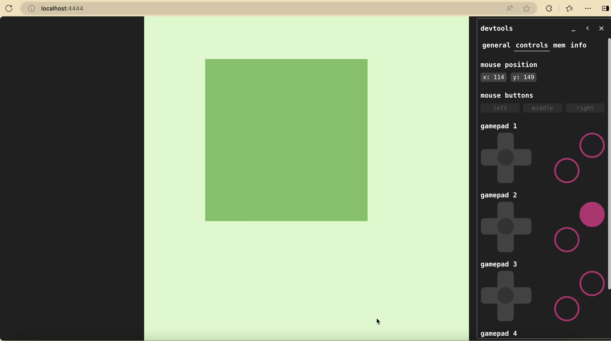

# Creating games in MoonBit with Wasm4



If you have been visiting [mooncakes](https://mooncakes.io) or our [gallery](https://www.moonbitlang.com/gallery), you may have noticed that we've published a package called [`wasm4`](https://mooncakes.io/docs/#/moonbitlang/wasm4/) and a new demo called [`Wasm4 Snake`](https://www.moonbitlang.com/gallery/wasm4-snake/). Today I'd like to introduce you to this amazing game development framework.

## What is Wasm4

[WASM-4](https://wasm4.org/) is a framework for building retro games using WebAssembly. It provides a gaming console with 160 x 160px, and less then 64K memory. Using WebAssembly, the new web standard of an instruction set, the game is able to be run on all the Web browser and even some low-end devices, and any language that compiles to WebAssembly can be used to develop the game, including MoonBit. We are proud to announce the MoonBit Wasm4 SDK.

## How to develop

[Our gallery](https://www.moonbitlang.com/gallery/wasm4-snake/) supports live reload where you can have a taste via our cloud IDE.

For developing locally, we expect [Node.js](https://nodejs.org/en) and [MoonBit](https://www.moonbitlang.com/download/) toolchain to be downloaded.

### Creating project

We first create a new project with MoonBit in the current directory, and we install the `wasm4` with `npm`

```bash
moon new --user moonbit --name demo --lib --path .
npm install -D wasm4
```

We will have the following directory structure (`node_modules` not included):

```bash
.
├── .gitignore
├── lib
│  ├── hello.mbt
│  ├── hello_test.mbt
│  └── moon.pkg.json
├── moon.mod.json
├── moon.pkg.json
├── package-lock.json
├── package.json
├── README.md
└── top.mbt
```

The `moon.mod.json` provides the definition for the whole project, and the `moon.pkg.json` provides the definition for each package. The `top.mbt` will be the main entrance of the game, and we can write helper functions in the `lib`, while the `hello_test.mbt` provides a blackbox testing example. We will not be using `lib` for this example.

### Adding Wasm4 dependency

We also need to add the dependency `moonbitlang/wasm4`:

```bash
moon update && moon add moonbitlang/wasm4
```

This will result in the following `moon.mod.json` at the time of writing:

```json
{
  "name": "moonbit/demo",
  "version": "0.1.0",
  "deps": {
    "moonbitlang/wasm4": "0.2.0"
  },
  "readme": "README.md",
  "repository": "",
  "license": "Apache-2.0",
  "keywords": [],
  "description": ""
}
```

We need to modify the `moon.pkg.json` as follows to meet the requirements:

```json
{
  "import": [
    "moonbitlang/wasm4"
  ],
  "link": {
    "wasm": {
      "exports": [
        "start",
        "update"
      ],
      "import-memory": {
        "module": "env",
        "name": "memory"
      },
      "heap-start-address": 6560
    }
  }
}
```

There are a few things to notice here:

- We import the pacakge `moonbitlang/wasm4/lib` as `wasm4`, so we will be using the functions and types with `@wasm4` qualifier.

- We declare that we treat this package as a linking target for the Wasm backend with a few configurations:

  - We export functions `start` and `update` as required by Wasm4.

  - We import the Wasm memory to meet Wasm4's ABI, and the memory will come from module `env` with name `memory`.

  - We define that the heap for MoonBit will be starting from 6560 to meet Wasm4's ABI. The space lower than 6560 (0x19a0) is reserved for Wasm4.

We modify the `top.mbt` correspondingly:

```moonbit
pub fn start() -> Unit {

}

pub fn update() -> Unit {

}
```

Now we can execute with:

```bash
moon build --target wasm
npx wasm4 run target/wasm/release/build/demo.wasm
```

Or you may execute with the debug mode if anything goes wrong and you'd like to see the stacktrace with function names:

```bash
moon build --target wasm -g
npx wasm4 run target/wasm/debug/build/demo.wasm
```



And the browser should open automatically with a game display. There's nothing moving now, so let's add something!

### Example: Moving block

Let's draw a block on the screen:

```moonbit
pub fn start() -> Unit {

}

pub fn update() -> Unit {
  @wasm4.set_draw_colors(index=1, 2)
  @wasm4.rect(0, 0, 80, 80)
}
```



And this is what you may see. Wasm4 has four palettes and four drawing colors. Depending on the specific API, the corresponding drawing color will be used. What happens here is that we set the draw color 1 to the color of the 2nd palette, and then we drew an 80 x 80 rectangle starting from position `(0, 0)`. Remember that the origin of coordinate of display is at the top left corner and that y-axis points downward in the world of programming.

The `moonbitlang/wasm4` provides a high level abstraction so that you can write at ease. To avoid confusion, the indexes of draw colors and palettes start with 1. It is also possible to set each of the 160 x 160 pixels. Checkout the [Wasm4 document](https://wasm4.org/docs/guides/basic-drawing) and the [SDK API](https://mooncakes.io/docs/#/moonbitlang/wasm4/) for more information.

We now have a block that sits still. But we are developing a game, so we'd like to make it move. The `start` function will be called once during initialization, and the `update` function will be called at 60Hz. So we can write like this to make it move

```moonbit
struct Position {
  mut x : Int
  mut y : Int
}

let pos : Position = { x: 0, y: 0 }

pub fn update() -> Unit {
  if pos.x + 80 <= 160 {
    pos.x += 1
  }
  @wasm4.set_draw_colors(index=1, 2)
  @wasm4.rect(pos.x, pos.y, 80, 80)
}
```

And it will become (though much faster than the screenshot):



### Reacting to User Inputs

A game will have to interact with the user somehow. And Wasm4 provides two buttons (`X` `Z`) in addition to four direction buttons. Let's try to move at your will!

```moonbit
pub fn update() -> Unit {
  if @wasm4.get_gamepad(index=1).button_right && pos.x + 80 < 160 {
    pos.x += 1
  } else if @wasm4.get_gamepad(index=1).button_down && pos.y + 80 < 160 {
    pos.y += 1
  } else if @wasm4.get_gamepad(index=1).button_left && pos.x >= 0 {
    pos.x -= 1
  } else if @wasm4.get_gamepad(index=1).button_up && pos.y >= 0 {
    pos.y -= 1
  }
  @wasm4.set_draw_colors(index=1, 2)
  @wasm4.rect(pos.x, pos.y, 80, 80)
}
```



### More with development

For debugging, you can use `@wasm4.trace` to write debug messages to the console. You can also press `F8` to see the details of what is happening, as in the previous screenshot.

For publishing, you can execute `npx wasm4 bundle --html game.html target/wasm/release/build/demo.wasm` to generate a standalone HTML page. With a static file server, people will be able to enjoy the game you designed.

Notice that Wasm4 supports up to four players at the same time over network without extra configuration. This means you may be able to create your own [snake duel of the Zenless Zone Zero](https://x.com/ZZZ_EN/status/1726087909009486282) and enjoy it with your friends! Check out the [Wasm4 document](https://wasm4.org/docs) and the [SDK API](https://mooncakes.io/docs/#/moonbitlang/wasm4/) for more information.

## Conclusion

What are you waiting for? Try to develop with [our gallery](https://www.moonbitlang.com/gallery/wasm4-snake/) which supports live reload. Enjoy!

**Additional resources:**

- [Get started with MoonBit](https://www.moonbitlang.com/download/).
- Check out the [MoonBit Docs](https://github.com/moonbitlang/moonbit-docs).
- Learn MoonBit with the [open course](https://moonbitlang.github.io/moonbit-textbook/).
- Join our [Discord](https://discord.gg/5d46MfXkfZ) community.
- Explore MoonBit programming projects in the MoonBit [Gallery](https://www.moonbitlang.com/gallery/).
