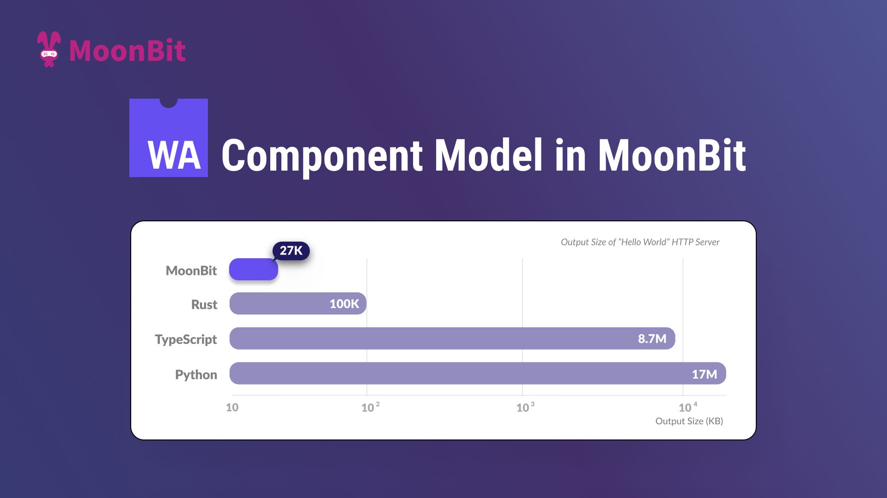
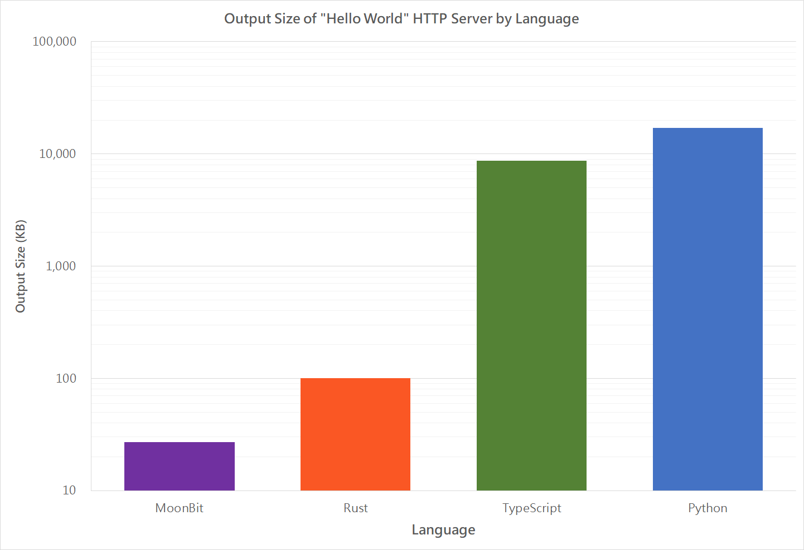

# Developing Wasm component model in MoonBit with minimal output size



## Wasm Component

WebAssembly is a new low-level virtual instruction set standard for a sandbox model. It is low-level, meaning it is close to native speed. It is virtual, meaning it can be run on many runtimes, including the browsers or on the operating sytems with projects such as [wasmtime](https://wasmtime.dev/) or [wamr](https://github.com/bytecodealliance/wasm-micro-runtime). It is a sandbox model, meaning that it can not interact with outside world unless using FFI. The FFI, however, can only return numbers, making the usage through linear memory a more efficient way. Many programming languages can compile to it, including Java, JavaScript/TypeScript, Python, Rust and, of course, [MoonBit](https://www.moonbitlang.com).

So how can we combine the Wasm components that are implemented in different programming languages? Enter the Component Model, a proposal to unify the surface. With the Component Model, we define a high-level API, and components can be combined with other components as long as the interfaces match.

This blog will follow a step-by-step guide on writing a small HTTP server that prints "Hello World" with MoonBit and demonstrate how MoonBit achieves high compatibility and interoperability while significantly reducing output size.

## How-to

We will write a small HTTP server that prints "Hello World" with MoonBit. The prerequisites are:

- [wit-deps](https://github.com/bytecodealliance/wit-deps)

- [wit-bindgen with MoonBit](https://github.com/peter-jerry-ye/wit-bindgen/tree/moonbit) (You will need to build it from source for now, so [Rust toolchain](https://www.rust-lang.org/tools/install) is also needed)

- [wasm-tools](https://github.com/bytecodealliance/wasm-tools)

- [wasmtime](https://wasmtime.dev/)

- and of course, the [MoonBit toolchain](https://www.moonbitlang.com/download).

### Define WIT

First, you need to define the interface with `WIT`. See the [manual](https://component-model.bytecodealliance.org/design/wit.html) for detailed explanations.

We specify our dependencies under `wit/deps.toml`. Today we are just using `wasi-http` version 0.2.0.

```toml
http = "https://github.com/WebAssembly/wasi-http/archive/v0.2.0.tar.gz"
```

You need to update the dependencies with `wit-deps`, and you'll see all the dependencies in the `wit/deps` folder.

Then we specify our "world", corresponding to the resulting Wasm, under `wit/world.wit`:

```wit
package moonbit:example;

world server {
  export wasi:http/incoming-handler@0.2.0;
}
```

A world may include other worlds, or import/export interfaces. Here we export the interface `incoming-handler` of `wasi:http` version 0.2.0, since as an HTTP server, exporting an incoming handler is needed so that the runtime can use it to treat the incoming requests and generate responses.

### Generate code

You need to generate the code with [wit-bindgen](https://github.com/peter-jerry-ye/wit-bindgen/tree/moonbit). Currently, you need to install the project with:

```bash
cargo install wit-bindgen-cli --git https://github.com/peter-jerry-ye/wit-bindgen/ --branch moonbit
```

After having the `wit-bindgen` command, simply execute it with the proper subcommand (`moonbit`) and location of the WIT files (`wit`). There are also arguments to specify whether the types should derive the `Show` trait or the `Eq` trait.

```bash
wit-bindgen moonbit wit --derive-show --derive-eq --out-dir .
```

And here's what you will get:

```bash
.
├── ffi
│  ├── moon.pkg.json
│  └── top.mbt
├── gen
│  ├── ffi.mbt
│  ├── interface_exports_wasi_http_incoming_handler_export.mbt
│  ├── moon.pkg.json
│  └── worlds_server_export.mbt
├── interface
│  ├── exports
│  │  └── wasi
│  │     └── http
│  │        └── incomingHandler
│  │           ├── moon.pkg.json
│  │           ├── README.md
│  │           └── top.mbt
│  └── imports
│     └── wasi
│        ├── clocks
│        │  └── monotonicClock
│        │     ├── moon.pkg.json
│        │     ├── README.md
│        │     └── top.mbt
│        ├── http
│        │  └── types
│        │     ├── moon.pkg.json
│        │     ├── README.md
│        │     └── top.mbt
│        └── io
│           ├── error
│           │  ├── moon.pkg.json
│           │  └── top.mbt
│           ├── poll
│           │  ├── moon.pkg.json
│           │  ├── README.md
│           │  └── top.mbt
│           └── streams
│              ├── moon.pkg.json
│              ├── README.md
│              └── top.mbt
├── moon.mod.json
├── wit // contents ignored here
└── worlds
   └── server
      ├── import.mbt
      ├── moon.pkg.json
      └── top.mbt
```

The generated project has four folders:

- `ffi` and `gen` are the generated files to help with the Wasm bindings that you can safely ignore. The `gen` directory contains the entrance of the project.

- `interface` contains all the interfaces that are imported into the selected world. It is divided to `imports` and `exports` where the `imports` provide all the imported functions and types, while the `exports` is where you need to fill the stub functions that will be exported.

- `worlds` contains the world. Similar to `interface`, it contains a `import.mbt`, providing the imported functions and types of the world level, and `top.mbt`, containing the stub export functions.

Then you can develop as a normal MoonBit application, and `moon check --target wasm` should finish successfully. To see what APIs you have and the documentation of the types or functions, you can run `moon doc --serve` to see the documentation. Don't forget to execute `moon fmt` to make the code look better.

### Develop

Here's our code for a minimum Hello-World server for demonstration:

```moonbit
pub fn handle(
  request : @types.IncomingRequest,
  response_out : @types.ResponseOutparam
) -> Unit {
  let response = match request.path_with_query() {
      None | Some("/") => make_response(b"Hello, World")
      _ => make_response(b"Not Found", status_code=404)
    }
    |> Ok
  response_out.set(response)
}

fn make_response(
  body : Bytes,
  ~status_code : UInt = 200
) -> @types.OutgoingResponse {
  ...
}
```

See the full example on [Github](https://github.com/moonbitlang/moonbit-docs/tree/464356567270284446244cccecd101c04e9806f8/examples/wasi-http).

### Componentize

What we have achieved is a core Wasm, namely a Wasm following the WebAssembly standard. However, we need to turn it into a component so that it can be shared along with necessary information.

You need to use [wasm-tools](https://github.com/bytecodealliance/wasm-tools) to embed the core Wasm into a component. First, we embed the WIT information into the custom section of our core Wasm. You need to specify the encoding as UTF-16 at this step. Then we turn the core Wasm into a component Wasm.

```bash
moon build --target wasm
wasm-tools component embed wit target/wasm/release/build/gen/gen.wasm -o target/wasm/release/build/gen/gen.wasm --encoding utf16
wasm-tools component new target/wasm/release/build/gen/gen.wasm -o target/wasm/release/build/gen/gen.wasm
```

You may also use [JCO](https://bytecodealliance.github.io/jco/) for this step if you prefer using `npm` or `pnpm`.

### Use

With the Wasm we created, you can serve it with [Wasmtime](https://wasmtime.dev/):

```bash
wasmtime serve target/wasm/release/build/gen/gen.wasm
```

You may also use [JCO](https://bytecodealliance.github.io/jco/) to serve it on Node.js or Deno, or serve it with [WasmCloud](https://wasmcloud.com/) or [Spin](https://developer.fermyon.com/spin/v2/index).

## Compare



We implement a simple HTTP server that simply replies "Hello World". Comparing with the `http-hello-world` provided by [WasmCloud](https://github.com/wasmCloud/wasmCloud/tree/main/examples), we have the following sizes:

| Language   | Output size |
| ---------- | ----------- |
| Python     | 17M         |
| TypeScript | 8.7M        |
| Rust       | 100K        |
| MoonBit    | 27K         |

## Conclusion

We've demonstrated how to create a Wasm following the Component Model standard with MoonBit. The Component Model provides a new standard for creating interoperable Wasm. By pulling the WIT files from Spin, for example, we can easily build a serverless AI application in 5 minutes.

By supporting the WebAssembly component model, MoonBit enhances its application scenarios in microservice architectures and cloud-native applications with high compilation performance and compact code size, allowing for quick deployment and execution in various environments.

On August 18, MoonBit will reach the beta preview version, indicating language stability for broader testing and real-world use. In the future, we will continue to expand the MoonBit ecosystem and optimize documentation and toolchain for a better user experience. Stay tuned!

**Additional resources:**

- [Get started with MoonBit](https://www.moonbitlang.com/download/).
- Check out the [MoonBit Docs](https://github.com/moonbitlang/moonbit-docs).
- Learn MoonBit with the [open course](https://moonbitlang.github.io/moonbit-textbook/).
- Join our [Discord](https://discord.gg/5d46MfXkfZ) community.
- Explore MoonBit programming projects in the MoonBit [Gallery](https://www.moonbitlang.com/gallery/).
