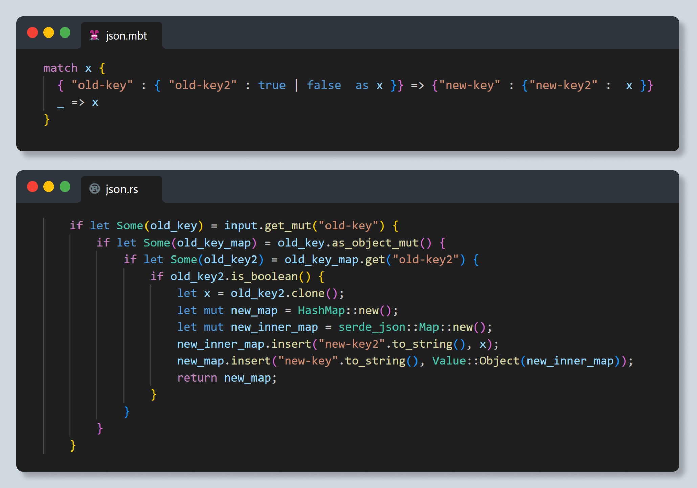
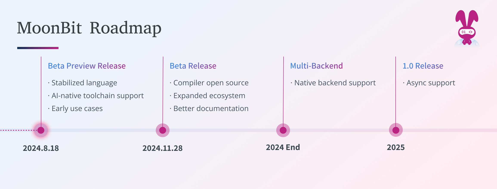

import aiNative from './ai-native.mp4'

# MoonBit Beta Preview: stabilized language and AI-native toolchain

On the 18th of August 2023 we [launched MoonBit](https://www.moonbitlang.com/blog/first-announce): a Wasm-first language toolchain focused on efficiency and simplicity. We received lots of [positive feedback](https://news.ycombinator.com/item?id=37174619) and [worked hard](https://github.com/moonbitlang/core) to improve MoonBit and its toolchain.

Throughout this year, we've refined the language design, stabilized major features, and prepared for deep vertical integration of the toolchain with AI, with a focus on cloud and edge computing use cases. As we celebrate MoonBit's first birthday, we're proud to introduce the MoonBit Beta preview version, positioning MoonBit as an AI and cloud-native development platform.

## Major Language Features Stabilized

After a year of rapid iteration, MoonBit has established foundational language features on par with those of most mainstream languages at their 1.0 versions. With the release of the beta preview version, the language has reached a level of stability, with only minor changes expected. This stability paves the way for broader developer participation in building the ecosystem. Here are some of MoonBit's core and most challenging features:

### Modern Generic System

The design of type system is one of the most complex parts in modern language. Many mainstream industrial languages, like [Java](https://legacy.cs.indiana.edu/classes/jett/sstamm/) and [Go](https://go.dev/blog/intro-generics), gradually introduced generics support many years after their 1.0 release, [causing fragmentation within their ecosystems](https://news.ycombinator.com/item?id=33122514). MoonBit, however, has completed its generics and trait support in the beta version, offering zero-cost generics while maintaining extremely fast compilation speed.

### Precise Error Handling

If you’ve been following our [recent updates](/weekly-updates/), you'll notice lots of efforts on crafting rigorous error handling. In most programming languages, error handling isn't adequately supported during static analysis, resulting in untracked exceptions that can lead to potential reliability issues in software. MoonBit, through precise control flow analysis, tracks function errors entirely at compile-time. This process is almost entirely inferred by the compiler, sparing developers from cumbersome error-handling annotations, while preserving error safety.

### Efficient Iterators

Traditional programming languages often experience performance degradation with iterators due to frequent boxing operations, resulting in significantly worse performance compared to regular loops. MoonBit, however, introduces zero-cost iterators, enabling developers to write elegant code without compromising on performance.

## Highlights

MoonBit has been committed to leveraging its strengths in language performance, output size, and data processing.

### Fast & Smallest Components

MoonBit aims for full-stack efficiency, including both compilation and runtime performance. In our [benchmark](https://github.com/moonbitlang/moonbit-docs/tree/main/legacy/benchmark/fibonacci) test, MoonBit compiles 626 packages in just 1.06 seconds, nearly **nine times faster than Rust** in terms of compilation speed, while **the compute time is 1/35 of Go**.

MoonBit has a significant advantage in reducing the size of Wasm code output. In our recent support for [the Wasm component model](https://www.moonbitlang.com/blog/component-model), MoonBit achieves notable size optimizations in generated code. While compiling a simple "Hello World" HTTP server, MoonBit’s output file size is just **27KB**, which is significantly smaller compared to 100KB for Rust, 8.7MB for TypeScript, and a massive 17MB for Python in [WasmCloud's http-hello-world example](https://github.com/wasmCloud/wasmCloud/tree/main/examples).

### Data-Oriented

As a multi-paradigm programming language, MoonBit maintains simplicity while providing an optimal data processing experience. With native support for **JSON processing, the Iter type, and pattern matching**, MoonBit achieves safe and efficient data processing while the flexibility of dynamic languages and the safety and efficiency of static languages, enabling intuitive and concise data parsing and transformation.

MoonBit’s syntax design for data processing aims to resolve performance issues caused by generating multiple intermediate arrays. In the performance comparison of Iter, MoonBit’s data processing speed is [25 times faster than JavaScript](https://github.com/moonbit-community/benchmark-202404).

## AI-Native IDE

In our initial release, MoonBit offered an all-in-one solution for development, debugging, and deployment. Beyond multi-backend support, a general-purpose language design, MoonBit provides a toolset including the compiler, build system, IDE, debugger, and deployment tools. In the past year, we refined debugging and testing support, open-sourced [the standard library](https://github.com/moonbitlang/core) and [build system](https://github.com/moonbitlang/moon), [launched a package manager](https://www.moonbitlang.com/blog/intro-to-mooncakes), and enhanced our cloud IDE with an AI assistant. Here are the key updates to our toolchain.

The initial release of MoonBit offered a [Cloud IDE](https://try.moonbitlang.com/) running directly on the edge. With a highly parallelized architecture and native support for separate compilation, MoonBit IDE can handle large-scale codebases without relying on containers, making it well-suited for cloud-native environments and edge computing needs.

In addition to traditional IDE features, the MoonBit AI Assistant is now integrated into the MoonBit IDE, providing automated test generation, documentation generation, and code explanation features. This comprehensive support for software development, testing, and documentation streamlines the development process, enabling developers to focus on more critical and creative aspects of their work without the burden of maintenance.

<video controls src={aiNative} style={{width: '100%'}}></video>

MoonBit has provided debugging tools typically available only in the mature stages of other languages. In the beta preview version, MoonBit supports [out-of-the-box debugging in IDE](https://x.com/moonbitlang/status/1806479707489374338). Users can instantly start debugging by executing `moon run --target js --debug` in the JavaScript Debug Terminal.

## Application Scenarios

MoonBit is a development platform covering all scenarios with a focus on cloud and edge computing. In each field, MoonBit aims for excellence, ensuring performance that outpaces other languages by at least an order of magnitude.

### Cloud Computing

With the recent component model support, our community member has developed [an experimental MoonBit-Spin SDK](https://github.com/gmlewis/spin-moonbit-sdk). By breaking applications into independent, reusable components, MoonBit better utilizes computing resources in cloud computing development, enhances system flexibility and security, simplifies the scaling and integration process, and significantly improves cloud computing development efficiency while reducing operational costs.

### Edge Computing

With community support, MoonBit now has a real-world use case in edge computing through the [Extism PDK plugin](https://github.com/extism/moonbit-pdk). The PDK support allows MoonBit to more efficiently utilize hardware resources in edge computing applications, enabling distributed computing and local processing. This improves performance, response speed, device compatibility, and data security, significantly enhancing development and deployment efficiency to meet the demands for low latency and high performance.

## Roadmap

MoonBit currently supports both Wasm and [JS](https://www.moonbitlang.com/blog/js-support) backends, with future plans to add support for native backends, aiming to cover all possible application scenarios. Whether it's UI development, client-side applications, edge computing, or system programming, users will find the right solution on MoonBit.

The MoonBit beta preview is less of an endpoint and more of a beginning. While there's still plenty of work ahead, we believe the most exciting developments won't come from the MoonBit team alone. Rather, we believe that this stable foundation will allow the MoonBit community and ecosystem to grow even faster than before.

**Additional resources**

If you're not already familiar with MoonBit, here is our quick guide:

- [Get started with MoonBit](https://www.moonbitlang.com/download/).
- Check out the [MoonBit Docs](https://github.com/moonbitlang/moonbit-docs).
- Explore MoonBit projects in [Gallery](https://www.moonbitlang.com/gallery/).
- Play with [MoonBit IDE](https://try.moonbitlang.com/).
- [Join](https://discord.gg/5d46MfXkfZ) our Discord community.
