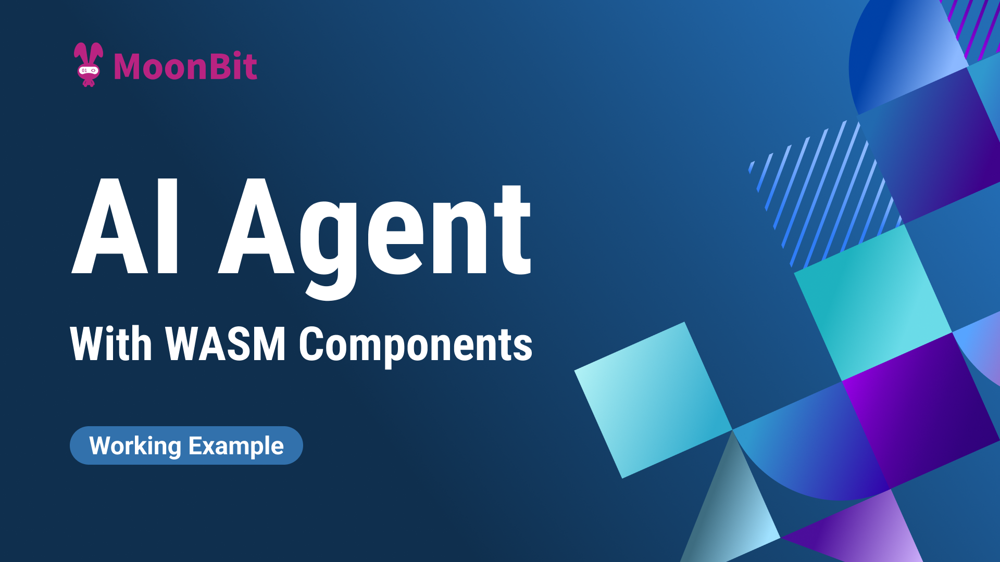
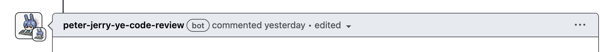
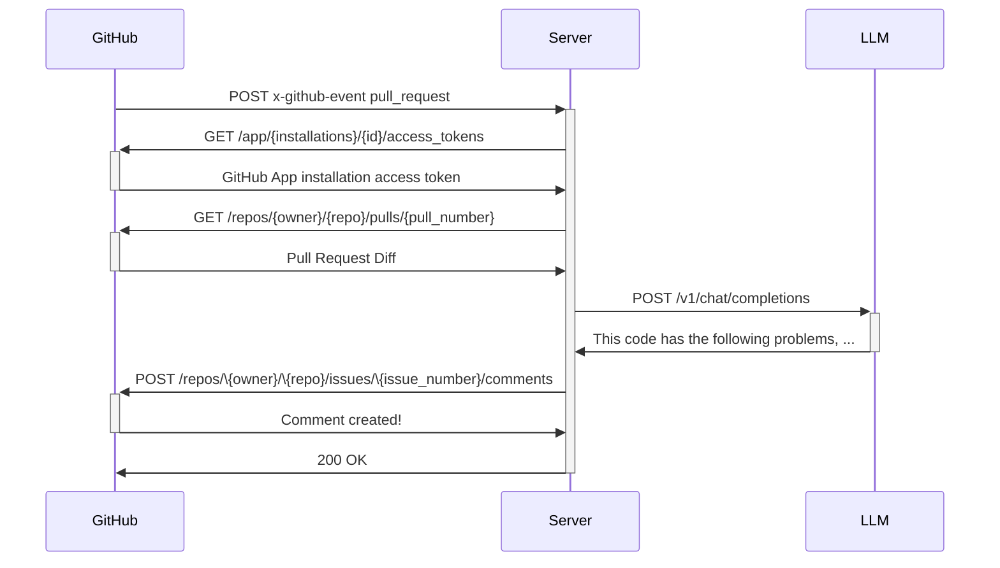

# AI Agent with MoonBit using Wasm Components

If you have been dropping in MoonBit's repositories, you might have noticed a wierd bot called "peter-jerry-ye-code-review" that comments on every new pull request. It will also update the comment if any new commits are pushed. That's right, it's our own experimental code review bot written in MoonBit. Today we will explain how it works.

You can find a snapshot of the full code sources in [its repository](https://github.com/moonbitlang/example-ai-agent), and the README should explain the detail of the techniques.

## Motivation

When pull requests come in, we want them to be reviewed promptly. It would be helpful if some preliminary checks could be provided in real-time so that the creator can get instant feedback and update their work.

To achieve this, we use a bot that automatically reviews the pull request. It turns out that this is a perfect serverless task: the server gets notified by the pull request, retrieves the necessary information, and post a comment. Nothing needs to be stored. So, we're using MoonBit with components, as WebAssembly fits perfectly in these scenarios, with a bonus of a fast cold startup.

## How it works

### The Architecture

We develop this example based on the open-source runtime, [Spin](https://developer.fermyon.com/spin/v2/index). It is built on the [wasi-http](https://github.com/WebAssembly/wasi-http) standard and provides additional capabilities such as interfaces for connecting to Redis or relational databases. We are deploying our example on [Fermyon Cloud](https://developer.fermyon.com/cloud/index), which offers a free plan for starters. Alternatively, one may choose the open-source [Spin Kube](https://www.spinkube.dev/) and self-host it on a Kubernetes cluster.

With the [wit-bindgen](https://github.com/bytecodealliance/wit-bindgen) support for MoonBit, we can integrate Spin functionalities seeminglessly by grabbing the WIT files and generating the binding code.

### The workflow

The following diagram illustrates the workflow.

After creating an GitHub App and having it installed by the user, we can receive [webhook events](https://docs.github.com/en/webhooks). GitHub sends webhook events based on configuration. Upon receiving the payload, we can verify it and gather the necessary information: the repository name, the installation ID, the pull request number, and the actual event.

With the installation ID, we can obtain an access token for our App, allowing us to access what the user has granted us, such as read/write pull request permissions, especially if it were installed in a private repository.

We can determine our actions based on the event. For example, "opened" means a new PR and "synchronize" means an update to an existing PR. For the former, we can create a fresh comment, while in the latter, we update an existing comment. The meaning and payloads are described in [the document](https://docs.github.com/en/webhooks/webhook-events-and-payloads).

With the information in the payload, we can retrieve, from GitHub, what happened with the pull request. For example, we can obtain its changes in diff or patch format. We can list commits and retrieve the respective changes and messages, and so on.

We then send the gathered information to the LLM provider we've chosen via an HTTP request. The response is used to create or update a comment on the pull request.

## Conclusion

MoonBit, with Component Model support, can fit in many scenarios. With the increasing support for the standard from various runtimes, MoonBit can be widely applied to develop serverless applications or edge-computing applicaitons. This AI Agent is just one example of such applications, and there are more to come.

**Additional resources:**

- [Get started with MoonBit](https://www.moonbitlang.com/download/).
- Check out the [MoonBit Docs](https://github.com/moonbitlang/moonbit-docs).
- Learn MoonBit with the [open course](https://moonbitlang.github.io/moonbit-textbook/).
- Join our [Discord](https://discord.gg/5d46MfXkfZ) community.
- Explore MoonBit programming projects in the MoonBit [Gallery](https://www.moonbitlang.com/gallery/).
