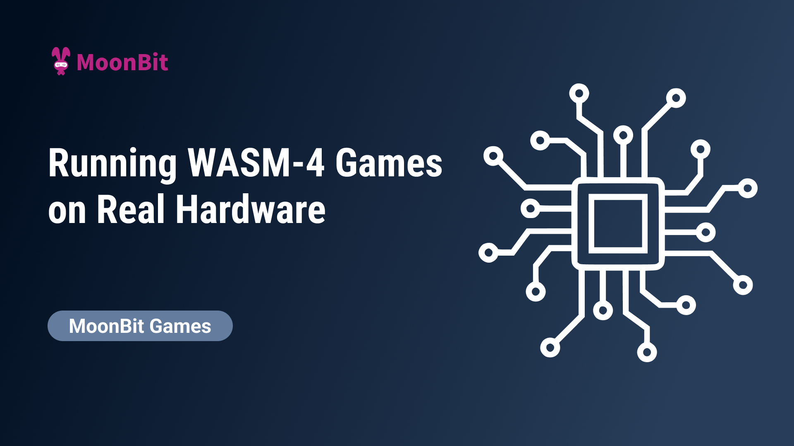

# Running MoonBit Games on Real Hardware with WASM-4

In our [previous blog](https://www.moonbitlang.com/blog/wasm4) on MoonBit supporting WASM-4, we introduced how to write a mini retro game using the WASM-4 framework.

[The hardware specifications simulated by WASM-4](https://wasm4.org/docs/#hardware-specs) include a 160x160 pixel display, 64 KB of linear memory, support for keyboard, mouse, touchscreen, and up to four game controllers as input devices, audio output, and 1 KB of storage. A natural idea is to port WASM-4 to microcontrollers, replacing the simulated I/O devices with real hardware. In this article, we will explore how to run these mini-games written in MoonBit on actual hardware, using the ESP32-C6 chip, which features a RISC-V 32-bit single-core processor with a frequency of up to 160 MHz, 320 KB of ROM, and 512 KB of SRAM.

Below is a video showcasing the Snake game, developed with MoonBit, running on the ESP32-C6 development board.

## The Porting Process

The WASM-4 project repository provides two runtime environments: one for web applications and another for native execution. The WASM-4 runtime is an environment that can run games compliant with the WASM-4 specifications. The native runtime, implemented in C, can be modified to run on a microcontroller by removing unnecessary components.

### LCD Display

The WASM-4 native runtime comes with a graphical user interface (GUI) for displaying game graphics on the screen. However, when porting to hardware, we can replace this GUI with a real LCD screen, eliminating the need for the GUI components.

The first step is to remove GUI-related components. WASM-4 has an internal framebuffer for temporarily storing display data, which is rendered by [MiniFB](https://github.com/emoon/minifb). We only need to keep this framebuffer for storing image data while removing the MiniFB-related code. Before debugging on the microcontroller, we can output the data from the framebuffer as image files. Once the images are confirmed to be correct, our task simplifies to displaying an array of pixel data on the screen. The display device used here is a 1.54-inch LCD driven by ST7789, with a resolution of 240x240, as shown below:

When centering the 160x160 image from WASM-4, there will be a 40-pixel margin around it. It’s also important to note that since the selected LCD only supports RGB565 color format, there may be color discrepancies.

### Game Controller

WASM-4 supports various input devices, including keyboards, mice, touchscreens, and controllers. In this article, silicone buttons simulate the game controller.

The controller has directional buttons (up, down, left, right) and two action buttons (X and Z). WASM-4 uses one byte in its linear memory to represent the controller state, where the 0th and 1st bits correspond to the X and Z buttons, while bits 4 to 7 correspond to the directional buttons. Each bit indicates whether the corresponding button is pressed. We set the corresponding bits in the button press event. For simplicity, each button is assigned a GPIO interface.

### Replacing the wasm3 Interpreter with WAMR

As the wasm3 project is no longer actively maintained and lacks some needed features, we will replace the WASM-4 native runtime's wasm execution engine with WAMR. Similar to wasm3, we only need to provide the same FFI in the WAMR environment. For example, functions for drawing lines (`line`, `hline`, `vline`), rectangles (`rect`), and blitting images (`blit`, `blitSub`) are required.

## Conclusion

At this point, we have implemented basic game display and control functions. You can view the [complete code here](https://github.com/lijunchen/moonbit-wasm4-esp32). There are many exciting directions to explore further; for instance, this article has not fully utilized the rich wireless interfaces of the ESP32 chip. We could implement WiFi for hot loading of WASM game modules. Additionally, external speakers for audio output have not yet been integrated.

**Additional resources:**

- [Get started with MoonBit](https://www.moonbitlang.com/download/).
- Check out the [MoonBit Docs](https://github.com/moonbitlang/moonbit-docs).
- Learn MoonBit with the [open course](https://moonbitlang.github.io/moonbit-textbook/).
- Join our [Discord](https://discord.gg/5d46MfXkfZ) community.
- Explore MoonBit programming projects in the MoonBit [Gallery](https://www.moonbitlang.com/gallery/).
