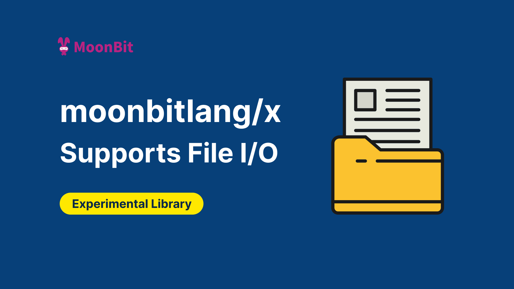

# moonbitlang/x Now Supports File I/O



Recently, there has been a growing demand from the community for file I/O in MoonBit. In response, we have introduced a basic `fs` package in [moonbitlang/x](https://github.com/moonbitlang/x). The package, [moonbitlang/x/fs](https://github.com/moonbitlang/x/tree/main/fs), supports Wasm, Wasm-GC, and JS backends, and includes the following commonly used APIs:(Note: This library is currently experimental, and its API may undergo further updates and adjustments.)

- `write_string_to_file`, `write_bytes_to_file`
- `read_file_to_string`, `read_file_to_bytes`
- `path_exists`
- `read_dir`
- `create_dir`
- `is_dir`, `is_file`
- `remove_dir`, `remove_file`

## Usage Example

1. Declare Dependency

Execute the following command in the command line:
```json
moon update
moon add moonbitlang/x
```

Or manually declare the dependency in `moon.mod.json`:

```json
"deps": {
    "moonbitlang/x": "0.4.10"
}
```

2. Import the dependency in the `moon.pkg.json` of the relevant package:

```json
"import": [
    "moonbitlang/x/fs"
]
```

```moonbit
test "write_and_read" {
  let path = "1.txt"
  // write content to the file
  @fs.write_string_to_file(
    path="1.txt",
    content=
      #|target/
      #|.mooncakes/
      #|
    ,
  )
  // make sure the file has been create
  assert_true!(@fs.path_exists(~path))
  let byte = @fs.read_file_to_bytes!(~path)
  // verify file content
  inspect!(
    byte,
    content=
      #|b"\x74\x61\x72\x67\x65\x74\x2f\x0a\x2e\x6d\x6f\x6f\x6e\x63\x61\x6b\x65\x73\x2f\x0a"
    ,
  )
  @fs.remove_file!(~path)
  assert_false!(@fs.path_exists(~path))
  try {
    @fs.read_file_to_string!(~path) |> ignore
  } catch {
    @fs.IOError::NotFound(_) as e =>
      inspect!(e, content="`1.txt` does not exist")
    _ => return
  }
  let bytes = Bytes::from_array([65, 97].map(fn(x) { x.to_byte() }))
  @fs.write_bytes_to_file(~path, content=bytes)
  assert_true!(@fs.path_exists(~path))
  let content = @fs.read_file_to_string!(~path)
  inspect!(content, content="Aa")
  @fs.remove_file!(~path)
  assert_false!(@fs.path_exists(~path))
  try {
    @fs.remove_file!(~path) |> ignore
  } catch {
    @fs.IOError::NotFound(_) as e =>
      inspect!(e, content="`1.txt` does not exist")
    _ => return
  }
}
```

For more examples, refer to [fs/fs_test.mbt](https://github.com/moonbitlang/x/blob/main/fs/fs_test.mbt), which contains black-box tests of the `fs` library. These test cases intuitively demonstrate how external users should interact with the library.

## Background: MoonBit Project's Testing Mechanism

A MoonBit project can currently have three types of tests: white-box tests, black-box tests, and inline tests.

### White-box Tests

Written in `*_wbtest.mbt`. The build system will package and compile `*.mbt` and `*_wbtest.mbt` together from the current package, allowing access to the private members of the current package in `*_wbtest.mbt`. These tests can use dependencies declared in the `import` and `wbtest-import` fields in `moon.pkg.json`. The `wbtest-import` dependencies are only used in white-box tests and are not included in the final build artifact.

### Black-box Tests

Written in `*_test.mbt`. When compiling `*_test.mbt`, the build system will automatically treat its containing package as a dependency. `*_test.mbt` can only access the public members of its package (simulating the perspective of an external user). These tests can use dependencies declared in the `import` and `test-import` fields of `moon.pkg.json` (including the package itself, which does not need to be explicitly listed in `test-import`). The `test-import` dependencies are only used in black-box tests and are not included in the final build artifact.

### Inline Tests

These can be written directly in `*.mbt` (excluding the previously mentioned `*_wbtest.mbt` and `*_test.mbt`). They can access the private members of the current package and use dependencies declared in the `import` field of `moon.pkg.json`.

| Test Type    | File Extension  | Access Permissions         | Dependency Source                        | Packaged in Final Artifact |
|--------------|------------------|----------------------------|-----------------------------------------|----------------------------|
| White Box Testing | *_wbtest.mbt | Current package private members | moon.pkg.json import & wbtest-import   | No                         |
| Black Box Testing | *_test.mbt   | Public members              | moon.pkg.json import & test-import      | No                         |
| Internal Testing  | *.mbt        | Current package private members | moon.pkg.json import                    | Yes                        |

**Additional resources:**

- [Get started with MoonBit](https://www.moonbitlang.com/download/).
- Check out the [MoonBit Docs](https://github.com/moonbitlang/moonbit-docs).
- Learn MoonBit with the [open course](https://moonbitlang.github.io/moonbit-textbook/).
- Join our [Discord](https://discord.gg/5d46MfXkfZ) community.
- Explore MoonBit programming projects in the MoonBit [Gallery](https://www.moonbitlang.com/gallery/).
