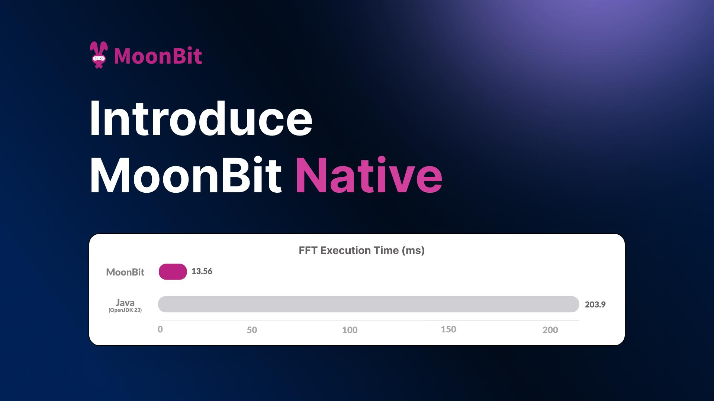
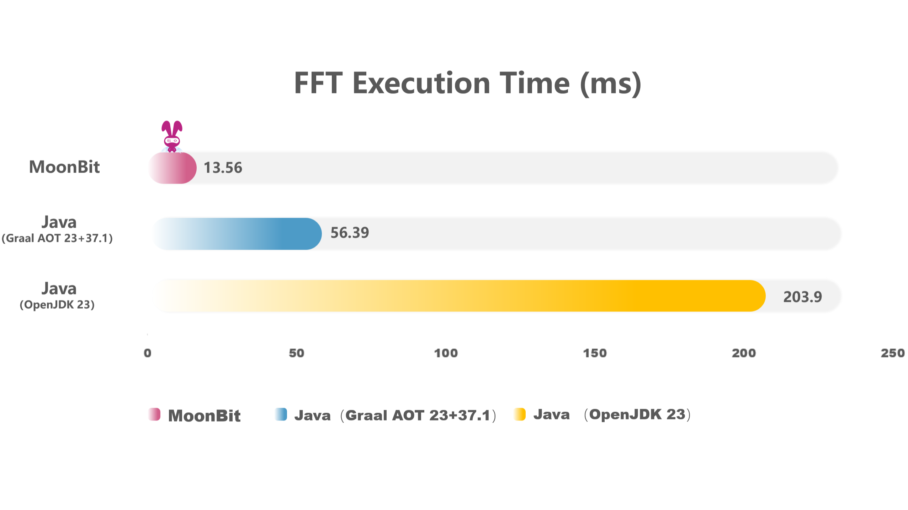
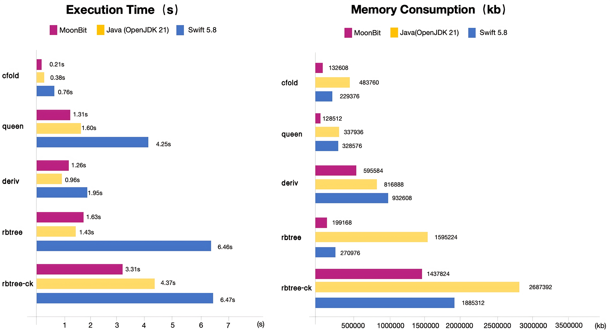

# Introduce MoonBit native, up to 15x faster than Java in numerics!



MoonBit, launched in August 2023, is an AI and cloud-native language toolchain with multi-backend support, delivering exceptional performance on both [WebAssembly](https://www.moonbitlang.com/blog/first-announce) and [JavaScript](https://www.moonbitlang.com/blog/js-support).

Today, we are happy to announce the release of **MoonBit native backend** that compiles MoonBit directly to machine code. The MoonBit native backend allows for native compilation and direct execution on hardware without the need for a virtual machine. We are also excited to see that MoonBit native backend showcases a significant performance advantage over traditional languages, running **15x faster compared to Java in some scenarios**.

## Why Native Backend

Programming languages are generally divided into two categories: virtual machine based and native. Virtual machine-based languages, such as Java, Kotlin, and most scripting languages, require a VM at runtime to interpret programs dynamically. Native languages, such as C/C++, Rust, and Go, compile to machine code directly and can be executed directly on hardware, without the need for a VM. In most cases, the performance and development experience of a programming language largely depend on the quality of the compiler. Native compilation offers more performance potential, but it also imposes more challenges on compiler implementation.

### Expanded Ecosystem

Currently, MoonBit supports WebAssembly and JavaScript backends, which both have broad ecosystem support. However, in scenarios where high performance is critical, these backends may face limitations. By supporting the native backend, MoonBit can meet the demand of **high-performance applications**, further enhancing its performance and expanding its application scenarios.

### Balance Performance & Developer Experience

Balancing performance and developer experience is a common challenge in the design of native languages. In typical native languages like C, C++, and Rust, users must invest significant effort in managing memory and other resources, manually controlling many low-level details, which decreases the development experience and efficiency. Some managed languages, such as Java, Kotlin, and Swift, also offer options to compile to native, but their execution time and memory consumption still lag significantly behind true native languages. In MoonBit native backend, we adopt a more modern top-level design, achieving **a dual advantage of performance and developer experience**.

## Benchmark

Time to show the data. In actual performance comparisons, MoonBit native backend significantly outperforms programming languages like Java and Swift in numerical computation and memory management performance, while effectively balancing performance advantages with developer experience.

### Numerical Computations: 15x faster than Java

The performance advantage of native languages over virtual machine-based languages is particularly evident in numeric computing, due to native languages' ability to optimize memory layout and utilize hardware acceleration instructions.

Below is a comparison of MoonBit and Java implementations of FFT (Fast Fourier Transform) using the Cooley-Tukey algorithm. FFT is widely used in signal processing and compression. In the [benchmark](https://github.com/moonbit-community/moonbit-native-benchmark1), MoonBit shows over **15x** performance improvement compared to Java and over **4x** compared to the most advanced commercial AOT Java compiler, GraalVM. The algorithm involves heavy numeric computations and array operations, making it a good indicator of language performance baseline:



MoonBit achieves significant performance gains without sacrificing development experience. MoonBit automatically manages memory just like Java, so users are not burdened with manual memory management. Moreover, MoonBit's modern language design offers more advanced features than Java to enhance developer experience.

For numeric computation, performance depends primarily on two factors: optimization of the computations themselves and overhead from the language itself. C/C++ excels in this domain, not only due to compiler optimizations but also because the language itself imposes minimal overhead. For higher-level languages with automatic memory management, eliminating the overhead of advanced language features is key to improving performance. Additionally, due to the cache mechanism of modern CPU, data layout is also crucial to performance. MoonBit achieves both high runtime performance and an excellent development experience through our modern top-level design:

- MoonBit's language design is concise, minimizing additional performance overhead, and its data structures are more compact and cache friendly.

- MoonBit uses a multi-layer IR (Intermediate Representation) architecture with global optimization in its compiler, making it capable of eliminating the overhead of advanced features like generics, and optimizing data layout globally.

### Memory Management: Outperforming Java & Swift

While numeric computation tasks reflect the performance baseline of a language, real-world applications often involve a lot of memory allocation and operations on in-memory data structures. Thanks to a customized memory management system, MoonBit native backend also excels in memory operation performance and usage, outperforming Java with its high-performance garbage collector (GC) and Swift, another language with automatic memory management that compiles to native binary.



The [benchmarks](https://github.com/moonbit-community/moonbit-native-benchmark2) here come from the paper *[Perceus: Garbage Free Reference Counting with Reuse](https://www.microsoft.com/en-us/research/uploads/prod/2020/11/perceus-tr-v1.pdf)*. The benchmark programs contain heavy memory allocation, showcasing memory management performance well.

Automatic memory management systems generally fall into two categories: tracing GC and reference counting. Tracing GC tends to offer better throughput but consumes more memory, while reference counting has lower memory consumption and better responsiveness, though its throughput is usually bad.

Due to MoonBit's multi-layer optimizations and custom memory management system, MoonBit achieves performance better than or close to Java's high-performance tracing GC in most scenarios, and far surpasses Swift's reference counting. Moreover, **MoonBit's memory consumption is slightly better than Swift's, and uses way less memory than Java in some benchmarks**.

In embedded and IoT devices, both computation and memory resources are very limited. Therefore, programming languages need to perform well in both excution time and memory consumption to suit embedded/IoT development well. Due to hardware constraints, developers often resort to low-level languages like C/C++ for better performance. However, this significantly increases cognitive load and reduces development efficiency. MoonBit native presents a new possibility to balance execution performance, memory consumption, and your development experience.

From the two tasks above, we can see that although MoonBit native backend is still in its early stages, it holds enormous potential to fully unleash hardware performance in the future.

## Integrate Low-Level Ecosystems with Security and Reliability

The native ecosystem, dominated by C/C++, plays a crucial role in the whole software ecosystem. Low-level APIs in operating systems, high-performance computing libraries, and AI tensor libraries like llama.cpp and ggml all rely on the C ABI for interfacing. MoonBit native can seamlessly integrate with third-party libraries using C ABI, unlocking new application scenarios for MoonBit.

MoonBit native employs a multi-layer IR design, with the last IR layer being a subset of C. This allows MoonBit to interoperate smoothly with C without heavy FFI (Foreign Function Interface) overhead, taking full advantage of existing high-performance C libraries. In the future, MoonBit will offer standardized C language calling conventions, enabling the integration of existing open-source AI inference libraries for high-performance computing and edge AI inference, as well as for writing high-performance applications and services that directly call operating system APIs.

Compared to system programming languages like C/C++, **MoonBit focuses on memory safety and reliability while maintaining high performance**. MoonBit ensures memory safety primarily through compiler optimizations that remove the overhead of GC without compromising the developer experience. In key scenarios, MoonBit gradually introduces [modality](https://blog.janestreet.com/oxidizing-ocaml-locality/) and other cutting-edge designs to enhance determinism. This approach lowers MoonBit’s learning curve, allowing more developers to benefit from its ecosystem.

## Try MoonBit Native Today

[Download](https://www.moonbitlang.com/download/) MoonBit, or install the [MoonBit plugin in VS Code](https://marketplace.visualstudio.com/items?itemName=moonbit.moonbit-lang&ssr=false#overview) and follow the prompts for one-click installation.

Create a new project.

```bash
moon new hello-native
cd hello-native
```

Next, execute:

```bash
moon build --target native
```

And get `target/native/release/build/main/main.exe`, a binary executable file. This file can be executed directly.

```bash
$ ./target/native/debug/build/main/main.exe
Hello, World!
```

Or you can directly execute `moon run --target native main`.

## What's next

MoonBit native backend completes the final piece of its ecosystem. With support for native, WebAssembly, and JavaScript backends, MoonBit can now cater to the multi-scenario needs of most developers. Notably, with MoonBit’s modular toolchain design, all three backends share most of the foundational framework, meaning most of our frontend optimizations can benefit users across all three backends.

The MoonBit team will continue working on improving the user experience and performance optimziations. Starting next month, we will also start working on async support. We aim to reach the beta level of quality in the middle of next year. [Follow us on X](https://x.com/moonbitlang) to get our latest updates!

**More resources：**

- [Get started with MoonBit](https://www.moonbitlang.com/download/).
- Check out the [MoonBit Docs](https://github.com/moonbitlang/moonbit-docs).
- Join our [Discord](https://discord.gg/5d46MfXkfZ) community.
- Explore MoonBit projects in the [Gallery](https://www.moonbitlang.com/gallery/).
