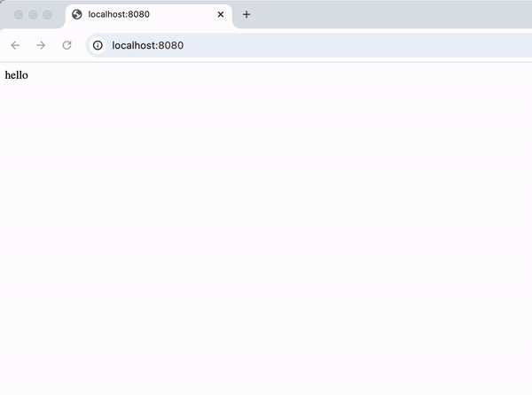
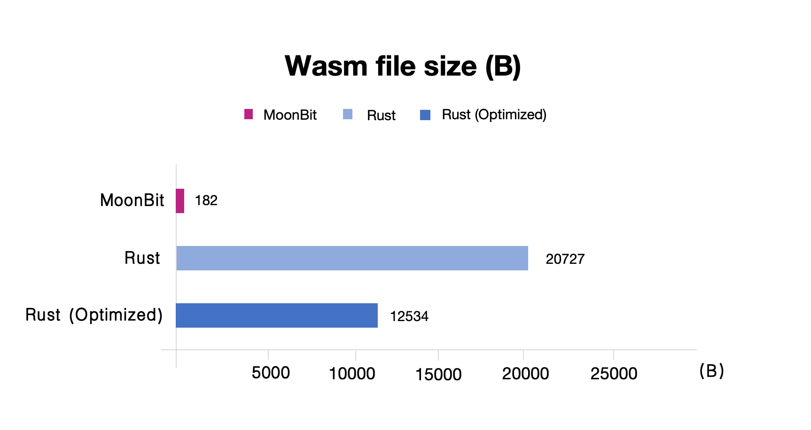

# Introduce JS String Builtins Proposal in MoonBit


Wasm has long been known for its high performance, but its interoperability costs with JavaScript have limited its full potential. With Chrome (131) now supporting Wasm's new JS string builtins proposal by default, MoonBit has fully adapted the JS string builtins proposal in the compiler. Benchmark shows that the file generated by MoonBit is **60 times smaller than the one generated by Rust**.

## Background

Since [the Wasm GC proposal](https://github.com/WebAssembly/gc) was implemented last year, many programming languages have supported compilation to Wasm code using the standard GC. MoonBit was one of the first to release the wasm-gc backend. However, the standard GC only provides basic data types like structs and arrays, and there is no standardized implementation for complex types such as strings. Considering the different encoding formats of strings and the various implementation approaches, standardizing strings in Wasm is an extremely complex task.
In this context, there are two main approaches for handling string types:

- **Custom String Type Using Structs or Arrays**

One approach is to use the basic data types (like structs or arrays) provided by the GC standard to implement a custom string type. For example, languages that use UTF-16 encoding could implement strings as an `(array 16)`. This approach offers high flexibility and can be optimized for better string operation performance. However, when interacting with JavaScript host Web APIs (such as fetch) or the DOM APIs, the custom string type often needs to be converted into a JavaScript string, which typically requires multiple memory copies, leading to performance overhead.

- **External Reference to JavaScript String**

The second approach is to use JavaScript strings via external references (externref). String-related operations (such as substring and concatenation) are handled by importing JavaScript functions. This method avoids the need for conversion when working with JavaScript Web APIs, but it introduces the overhead of indirect function calls every time a string operation is invoked. Indirect calls are less optimized by the Wasm engine and have higher performance costs compared to direct function calls.

Clearly, neither of the two approaches is ideal. In this context, [the JS string builtins proposal](https://github.com/WebAssembly/js-string-builtins/blob/main/proposals/js-string-builtins/Overview.md) was introduced and has already been implemented in major browser environments. The proposal aims to address the performance issues with the second approach by allowing Wasm modules to import functions from a predefined module called `wasm:js-string`. This module includes common string operations like `length`, `concat`, and `substring`. Unlike regular functions, the Wasm engine is aware of these functions and can handle them more efficiently, sometimes inlining them to improve performance.

| Method | Pros | Cons |
| ------ | ----- |---- |
| custom string type | Full control, no JS dependency, efficient for isolated use | Manual memory management, larger binary size, difficult to interact with host JS environment |
| externref | Seamless JS interaction, easy to pass strings between Wasm & JS | Increased overhead at boundary, less control, less efficient |
| **JS string builtins** | **Efficient, lightweight, smaller binary size, automatic memory management** | **Dependency on JS, not suitable for non-JS environments** |

## How to use

MoonBit now supports the JS string builtins proposal. Below are two examples demonstrating how to use JS string builtins in both Deno and browser environments. Full code examples are available at [the MoonBit demo repository](https://github.com/moonbit-community/demo-js-builtin-string).

### Deno Environment

First, create a new project using `moon new --lib demo-js-builtin-string`. Next, create a package called `palindrome` and write a function in MoonBit to check if a string is a palindrome:

```moonbit
// demo-js-builtin-string/palindrome/palindrome.mbt
pub fn palindrome(s : String) -> String {
  let len = s.length()
  for i in 0..<(len / 2) {
    if s[i] != s[len - i - 1] {
      return "false"
    }
  }
  return "true"
}
```

This function has the type `(String) -> String`. When compiled to the wasm-gc backend, the MoonBit String type will be translated into an array type in Wasm. This array type is not directly compatible with JavaScript's String object, the exported `palindrome` function cannot be used directly in the JavaScript environment. However, after enabling js-string-builtins, MoonBit's String type will be compiled as a JavaScript String object, allowing for seamless interoperability. To enable this feature, add the following to the `moon.pkg.json` file:

```json
// demo-js-builtin-string/palindrome/moon.pkg.json
{
  "link": {
    "wasm-gc": {
      "exports": ["palindrome"],
      "use-js-builtin-string": true
    }
  },
}
```

Then, build the package with `moon build` and test this function in a JavaScript environment:

```javascript
// demo-js-builtin-string/a.js
const { instance } = await WebAssembly.instantiateStreaming(
  fetch(
    new URL(
      "./target/wasm-gc/release/build/palindrome/palindrome.wasm",
      import.meta.url
    )
  ),
  {},
  {
    builtins: ["js-string"],
    importedStringConstants: "_",
  }
);
console.log(instance.exports.palindrome("hello"));
console.log(instance.exports.palindrome("ada"));
```

By setting `builtins: ["js-string"]`, JS-string-builtins is enabled in the JavaScript environment. The `importedStringConstants` field is used for string literals, where `"_"` is the default name used by MoonBit's compiler for string constants (we will talk more about string constants in later sections).

Run the program using the latest Deno with:

```bash
$ deno run -A --v8-flags=--experimental-wasm-imported-strings a.js
false
true
```

### Browser Environment

Now, let’s use MoonBit to interact with the DOM API in a browser environment. Create a package called `dom`, define the DOM object as an abstract type, and import a `set_css` function from the JavaScript environment to manipulate the DOM. For instance, we can use this function to implement a `change_color` function.

```moonbit
// demo-js-builtin-string/dom/dom.mbt
type DOM
fn set_css(dom : DOM, key : String, value : String) -> Unit = "dom" "set_css"
pub fn change_color(dom : DOM) -> Unit {
  set_css(dom, "color", "red")
}
```

Enable the Js-string-builtins feature in the `moon.pkg.json` file:

```json
// demo-js-builtin-string/dom/moon.pkg.json
{
  "link": {
    "wasm-gc": {
      "exports": ["change_color"],
      "use-js-builtin-string": true
    }
  }
}
```

In the JavaScript environment, import the `set_css` function to modify the DOM and call the `change_color` function to change the color of a text element:

```javascript
// demo-js-builtin-string/b.mjs
const { instance } = await WebAssembly.instantiateStreaming(
  fetch(
    new URL("./target/wasm-gc/release/build/dom/dom.wasm", import.meta.url)
  ),
  {
    dom: {
      set_css: (dom, key, value) => {
        dom.style[key] = value;
      },
    },
  },
  {
    builtins: ["js-string"],
    importedStringConstants: "_",
  }
);
document.getElementById("hello").addEventListener("click", () => {
  instance.exports.change_color(document.getElementById("hello"));
});
```

Meanwhile, we use the following HTML file to demonstrate this example. In this HTML file, we create a simple `<div>` element and include our previously written JavaScript module using the `<script>` tag. This way, when the user clicks on the "hello" text, it triggers the `change_color` function we defined in MoonBit, changing the text color to red.

```html
<!-- demo-js-builtin-string/index.html -->
<html>
  <body>
    <div id="hello">hello</div>
    <script src="b.mjs" type="module"></script>
  </body>
</html>
```

We can use a simple HTTP server to host our HTML and JavaScript files. For example, we can quickly create a local server using Python's http.server module by running the following command:

```bash
python -m http.server 8000
```

Then, open the browser at [http://localhost:8000](http://localhost:8000) to see the example. Clicking the "hello" text will change its color to red, demonstrating how MoonBit with JS-string-builtins can interact with the DOM.



### More Details

Using `moon build --output-wat`, you can view the generated textual Wasm code. For example, you’ll see that the `palindrome` function uses the length and `charCodeAt` functions from the `wasm:js-string` module, and string literals like `"true"` are declared with `import "_" "true"`, the same with `"false"`:

```bash
;; target/wasm-gc/release/build/palindrome/palindrome.wat
(func $moonbit.js_string.length (import "wasm:js-string" "length")
 (param externref) (result i32))
(func $moonbit.js_string.charCodeAt (import "wasm:js-string" "charCodeAt")
 (param externref) (param i32) (result i32))
(global $moonbit.js_string_constant.0 (import "_" "true") (ref extern))
(global $moonbit.js_string_constant.1 (import "_" "false") (ref extern))
```

Two things to note here:

- The special import module `"_"` corresponds to the `importedStringConstants` field provided in JavaScript when loading a Wasm module. This field is used to declare a special module name. By using this specific module name, the JS builtin string proposal overrides the import syntax to declare string literals, as shown in the above `.wat` file. MoonBit uses `"_"` as the default value for `importedStringConstants`, in order to reduce the size of the generated Wasm binary file. However, if `"_"` conflicts with other modules that need to be imported, this field can be configured in the `moon.pkg.json` file. For example:

```json
// moon.pkg.json
{
  "link": {
    "wasm-gc" : {
      "use-js-builtin-string": true,
      "imported-string-constants": "some-other-name"
    }
    ...
  }
}
```

In this case, the same module name should be passed in JavaScript as the value of `importedStringConstants`:

```bash
  {
    builtins: ["js-string"],
    importedStringConstants: "some-other-name",
  }
```

- In MoonBit, `println` function directly uses `console.log`. However, this function is not included in the original proposal, so when using Wasm code generated by a MoonBit program with `println` in a JavaScript environment, `console.log` needs to be provided via an import object, like this:

```javascript
const { instance } = await WebAssembly.instantiateStreaming(
  ...,
  {
    console: {
      log: console.log,
    },
  },
  {
    builtins: ["js-string"],
    importedStringConstants: "_",
  }
);
```

## Size Comparison

By using the JS string builtins proposal, the binary size of Wasm generated by MoonBit for the wasm-gc backend is further reduced. Here, we compare it with Rust. For example, in MoonBit, we can implement the following `print_and_concat` function:

```moonbit
// demo-js-builtin-string/print_and_concat/print_and_concat.mbt
pub fn print_and_concat(a : String, b : String) -> String {
  let c = a + b
  println(c)
  return c
}
```

The string printing and concatenation functionality is provided by the JavaScript host environment, so the generated code is very small. After compiling with MoonBit, the resulting Wasm binary is only 182 bytes. After compression with `wasm-opt`, its size is reduced to just 117 bytes:

```javascript
$ wc -c target/wasm-gc/release/build/print_and_concat/print_and_concat.wasm
182 target/wasm-gc/release/build/print_and_concat/print_and_concat.wasm
$ wasm-opt -Oz target/wasm-gc/release/build/print_and_concat/print_and_concat.wasm -o - -all | wc -c
117
```

Next, we implement similar functionality in Rust:

```javascript
// demo-js-builtin-string/rust-example/src/lib.rs
use wasm_bindgen::prelude::*;

#[wasm_bindgen]
pub fn print_and_concat(a: &str, b: &str) -> String {
    let c = format!("{}{}", a, b);
    println!("{}", c);
    c
}
```

We use `wasm-pack` to compile this Rust program to Wasm and measure its size:

```shell
$ wasm-pack build --target web
$ wc -c ./pkg/rust_example_bg.wasm
20727 ./pkg/rust_example_bg.wasm
```

The resulting Wasm binary is approximately 20 kB. To further reduce the size, we can add some optimization options to the `Cargo.toml` file:

```toml
// demo-js-builtin-string/rust-example/Cargo.toml

[profile.release]
lto = true
opt-level = 'z'
```

Using the nightly Rust compiler, we can run the following command to trim some unnecessary modules during compilation and obtain a Wasm file:

```shell
$ wasm-pack build --target web --release --manifest-path ./Cargo.toml -Z build-std=panic_abort,std -Z build-std-features=panic_immediate_abort
$ wc -c ./pkg/rust_example_bg.wasm                                                                                    ~/playground/moonbit-playground/js-builtin-string/demo-js-builtin-string/rust-example
12534 ./pkg/rust_example_bg.wasm
$ wasm-opt -Oz pkg/rust_example_bg.wasm -o - -all | wc -c                                                             ~/playground/moonbit-playground/js-builtin-string/demo-js-builtin-string/rust-example
12706
```



**The resulting Wasm file size from Rust is about 12 kB, which is 60 times larger than the file generated by MoonBit.** Although much of this size difference is due to memory management code, Rust does not provide a toolchain adapted to Wasm's native GC. In contrast, MoonBit allows users to choose whether to use Wasm’s native GC when targeting the Wasm platform so as to generate very compact and efficient binary code.

**More resources：**

- [Get started with MoonBit](https://www.moonbitlang.com/download/).
- Check out the [MoonBit Docs](https://github.com/moonbitlang/moonbit-docs).
- Join our [Discord](https://discord.gg/5d46MfXkfZ) community.
- Explore MoonBit demos in the [Gallery](https://www.moonbitlang.com/gallery/).
