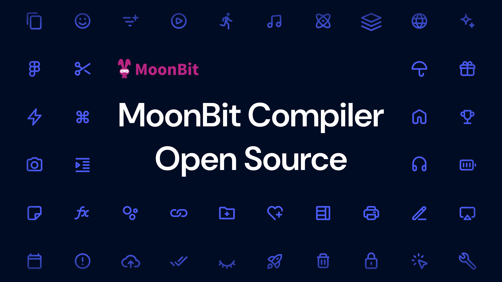

# MoonBit compiler is available on GitHub

We’re excited to announce that the MoonBit compiler, complete with a Wasm backend, is now open source and available on GitHub! Initially developed as a private project over the past two years, this approach allowed us to move quickly and focus on building a strong foundation. Now, we’re ready to gradually open the doors and invite the community to help shape its future. The source code is released under a permissive variant of the Server Side Public License, and we aim to embrace even greater openness as the community grows.

You can find the code [on GitHub](https://github.com/moonbitlang/moonbit-compiler).

## Motivations

Why are we open-sourcing the Wasm backend? WebAssembly has great potential to be safe, fast, and cross-platform, but not fully delivered by existing languages. MoonBit aims to be a Wasm-optimized language in the first place. In our [first blog post](https://www.moonbitlang.com/blog/first-announce), we launched MoonBit as a fast, compact, and user-friendly language for WebAssembly. In the past year, while MoonBit launched [JS](https://www.moonbitlang.com/blog/js-support) and [native](https://www.moonbitlang.com/blog/native) backends, WebAssembly has been our priority and most polished backend. MoonBit has supported [the Wasm component model](https://www.moonbitlang.com/blog/component-model) and reduced the code size to 27kB in the http-hello-world example—much smaller than [other languages](https://github.com/wasmCloud/wasmCloud/tree/main/examples), making MoonBit-wasm ready for production usage.

## Why a Relaxed SSPL

We currently use a modified SSPL (Server Side Public License) with **two key exceptions**:

 1. Artifacts produced by the MoonBit compiler may be licensed by the user under any license of their choosing, MoonBit users have the freedom to choose the license for their own  MoonBit source code and generated artifacts.

 2. Modifications to the compiler are allowed for non-commercial purposes.

While we value openness, we chose this adjusted SSPL instead of a fully permissive license for two main reasons:

 1. MoonBit is still in beta-preview. Introducing forks at this point could risk destabilizing the project. We aim to reach a more mature and stable status before welcoming community contributions.

 2. We want to safeguard against large cloud vendors leveraging our work for commercial purposes in a way that could undermine our efforts.

In the past two years, our team worked hard to improve MoonBit and its toolchain, staying true to our vision of creating a fast, simple, and efficient language. By open sourcing MoonBit, we would like to reassure our users that our team remains dedicated to MoonBit's pace of growth and innovation. We also want to ensure our users that MoonBit is not going to adopt [open-core](https://en.wikipedia.org/wiki/Open-core_model) model, all MoonBit users will get the best-developed compiler and IDE support. MoonBit team will try to generate revenue through hosting services and hardware SDKs over the long term.

Visit [MoonBit Public Source License](https://www.moonbitlang.com/licenses/moonbit-public-source-license-v1).

## Roadmap

Building a programming language is a long journey. It took Rust 9 years and Go 5 years to reach 1.0. Made by a young and driven team, MoonBit is steadily moving forward. We understand that community adoption and expansion are key to a new language, and we’re fully committed to nurturing an engaged and collaborative community around MoonBit. So far, we have open-sourced [the core library](https://github.com/moonbitlang/core) and most tools, including [build tools](https://github.com/moonbitlang/moon), [lex](https://github.com/moonbit-community/moonlex), [markdown](https://github.com/moonbit-community/cmark), and more to come. Having the compiler source available is important for security measures. Open-sourcing the Wasm backend is another major step, and it is on our roadmap to open source more in the future.

**New to MoonBit?**

- [Download MoonBit](https://www.moonbitlang.com/download/).
- Explore [MoonBit Beginner's Guide](https://docs.moonbitlang.com/en/latest/tutorial/tour.html).
- Play with [MoonBit Language Tour](https://tour.moonbitlang.com/).
- Check out [MoonBit Docs](https://docs.moonbitlang.com/en/latest/index.html).
- Join our [Discord](https://discord.gg/5d46MfXkfZ) community.
