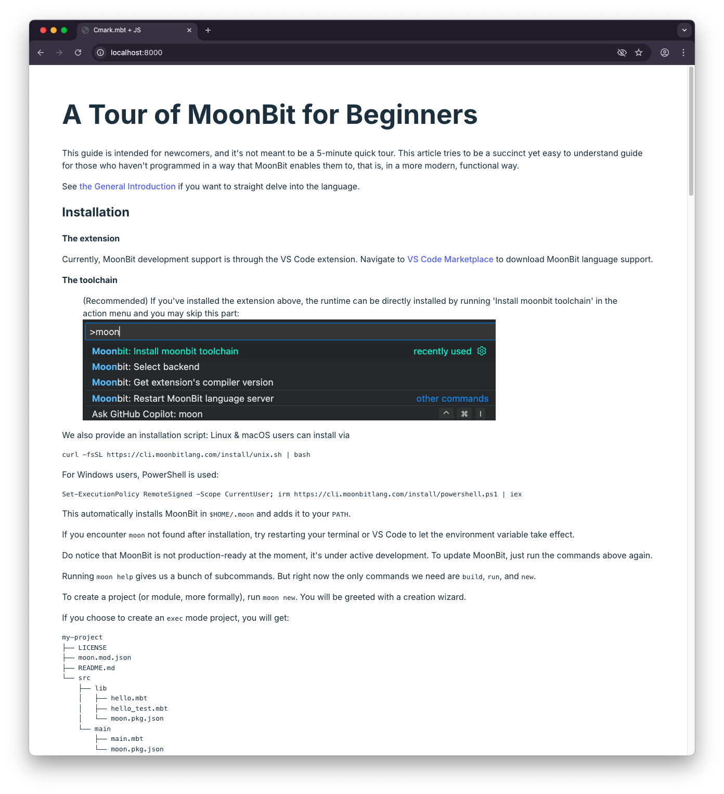

---
description:
  Consuming a High Performance Wasm Library in MoonBit from JavaScript
slug: call-wasm-from-js
image: /img/blogs/2025-01-22-call-wasm-from-js/cover.png
tags: [MoonBit, Wasm, JavaScript]
---

# Consuming a High Performance Wasm Library in MoonBit from JavaScript


In [one of our previous blog posts][js-string-builtins], we have already started
exploring the use of JavaScript strings directly within MoonBit's Wasm GC
backend. As we have previously seen, not only is it possible to write a
JavaScript-compatible string-manipulating API in MoonBit, but once compiled to
Wasm, the resulting artifact is impressively tiny in size.

In the meantime, however, you might have wondered what it will look like in a
more realistic use case. That is why we are presenting today a more realistic
setting of rendering a Markdown document on a JavaScript-powered web
application, with the help of the MoonBit library [Cmark] and Wasm's JS String
Builtins Proposal.

## Motivation

[Cmark] is a new MoonBit library for Markdown document processing, which makes
it possible to parse both vanilla CommonMark and various common Markdown syntax
extensions (task lists, footnotes, tables, etc.) in pure MoonBit. Furthermore,
open to external renderers since its early days, it comes with a ready-to-use
official HTML renderer implementation known as `cmark_html`.

Given Markdown's ubiquitous presence in today's cyberspace and the web world in
particular, a conversion pipeline from Markdown to HTML remains an important
tool in virtually every JavaScript developer's toolbox. As such, it also
constitutes a perfect scenario for showcasing the use of MoonBit's Wasm GC APIs
in frontend JavaScript.

## Wrapping over Cmark

For the sake of this demo, let's start with a new project directory:

```console
> mkdir cmark-frontend-example
```

In that very directory, we will first create a MoonBit library `cmarkwrap` that
wraps [Cmark]:

```console
> cd cmark-frontend-example && moon new cmarkwrap
```

This extra project `cmarkwrap` is required mostly because:

- [Cmark] in itself doesn't expose any API across the FFI boundary, which is the
  common case for most MoonBit libraries;
- We will need to fetch the [Cmark] project from the [mooncakes.io] repository
  and compile it locally to Wasm GC anyway.

`cmarkwrap`'s structure is simple enough:

- `cmark-frontend-example/cmarkwrap/src/lib/moon.pkg.json`:

  ```json
  {
    "import": ["rami3l/cmark/cmark_html"],
    "link": {
      "wasm-gc": {
        "exports": ["render", "result_unwrap", "result_is_ok"],
        "use-js-builtin-string": true
      }
    }
  }
  ```

  This setup is pretty much identical to the one we have seen in [the previous
  blog][js-string-builtins], with the `use-js-builtin-string` flag enabled for
  the Wasm GC target, and the relevant wrapper functions exported.

- `cmark-frontend-example/cmarkwrap/src/lib/wrap.mbt`:

  ```rs
  ///|
  typealias RenderResult = Result[String, Error]

  ///|
  pub fn render(md : String) -> RenderResult {
    @cmark_html.render?(md)
  }

  ///|
  pub fn result_unwrap(res : RenderResult) -> String {
    match res {
      Ok(s) => s
      Err(_) => ""
    }
  }

  ///|
  pub fn result_is_ok(res : RenderResult) -> Bool {
    res.is_ok()
  }
  ```

  This is where things start to get interesting. The `render()` function is a
  wrapper of the underlying `@cmark_html.render()` function that, instead of
  being a throwing function, returns a `RenderResult` type.

  Unfortunately, being a Wasm object (instead of a number or a string), a
  `RenderResult` is [opaque][opaque type] to JavaScript, and thus cannot be
  directly consumed by our JavaScript caller. As a result, we also need to
  provide means to destruct that very type from within MoonBit as well: the
  `result_unwrap()` and `result_is_ok()` functions are there exactly for this
  purpose, and that is why they accept a `RenderResult` input.

## Integrating with JavaScript

Now is the time to write the web part of this project. At this point, you are
basically free to choose any framework or bundler you prefer. This demo in
particular has chosen to initialize a minimal project skeleton under the
`cmark-frontend-example` directory with no extra runtime dependencies. For now,
let's focus on the HTML and JS parts of the project:

- `cmark-frontend-example/index.html`:

  ```html
  <!doctype html>
  <html lang="en">
    <head>
      <meta charset="UTF-8" />
      <meta name="viewport" content="width=device-width, initial-scale=1.0" />
      <title>Cmark.mbt + JS</title>
    </head>
    <body>
      <div id="app"></div>
      <script type="module" src="/src/main.js"></script>
      <link rel="stylesheet" href="/src/style.css" />
    </body>
  </html>
  ```

  This simple HTML file includes a single `div` of `id="app"`, which will become
  the target to which we render the Markdown document later.

- `cmark-frontend-example/src/main.js`:

  ```js
  const cmarkwrapWASM = await WebAssembly.instantiateStreaming(
    fetch("../cmarkwrap/target/wasm-gc/release/build/lib/lib.wasm"),
    {},
    {
      builtins: ["js-string"],
      importedStringConstants: "_",
    },
  );
  const { render, result_is_ok, result_unwrap } =
    cmarkwrapWASM.instance.exports;

  function cmarkWASM(md) {
    const res = render(md);
    if (!result_is_ok(res)) {
      throw new Error("cmarkWASM failed to render");
    }
    return result_unwrap(res);
  }

  async function docHTML() {
    const doc = await fetch("../public/tour.md");
    const docText = await doc.text();
    return cmarkWASM(docText);
  }

  document.getElementById("app").innerHTML = await docHTML();
  ```

  As it turns out, integrating `cmarkwrap` into JavaScript is fairly
  straightforward. After `fetch`ing and loading the Wasm artifact, we can call
  the wrapper functions right away. The `result_is_ok()` function helps us
  identify if we are on the happy path: if we are, we can unwrap the HTML result
  across the FFI boundary with `result_unwrap()`; otherwise, we can throw a
  JavaScript error. If everything goes as well, we can finally use the
  aforementioned `<div id="app"></div>` as our output target.

We can now compile the MoonBit Wasm GC artifact and launch the development
server:

```console
> moon -C cmarkwrap build --release --target=wasm-gc
> python3 -m http.server
```

And voilà! You can now read [_A Tour of MoonBit for Beginners_][tour] rendered
by the [Cmark] MoonBit library in a JavaScript frontend application at
http://localhost:8000.



You may find the code of this demo
[on GitHub](https://github.com/moonbit-community/cmark-frontend-example).

**New to MoonBit?**

- [Download MoonBit](https://www.moonbitlang.com/download/).
- Explore
  [MoonBit Beginner's Guide](https://docs.moonbitlang.com/en/latest/tutorial/tour.html).
- Play with [MoonBit Language Tour](https://tour.moonbitlang.com/).
- Check out [MoonBit Docs](https://docs.moonbitlang.com/en/latest/index.html).
- Join our [Discord](https://discord.gg/5d46MfXkfZ) community.

[Cmark]: https://github.com/moonbit-community/cmark
[mooncakes.io]: https://mooncakes.io
[js-string-builtins]: https://www.moonbitlang.com/blog/js-string-builtins
[opaque type]:
  https://github.com/WebAssembly/gc/blob/756060f5816c7e2159f4817fbdee76cf52f9c923/proposals/gc/MVP-JS.md#explanation
[tour]:
  https://github.com/moonbitlang/moonbit-docs/blob/cb21840b01374397ff1330f5065bab8f25cb95ed/next/tutorial/tour.md
