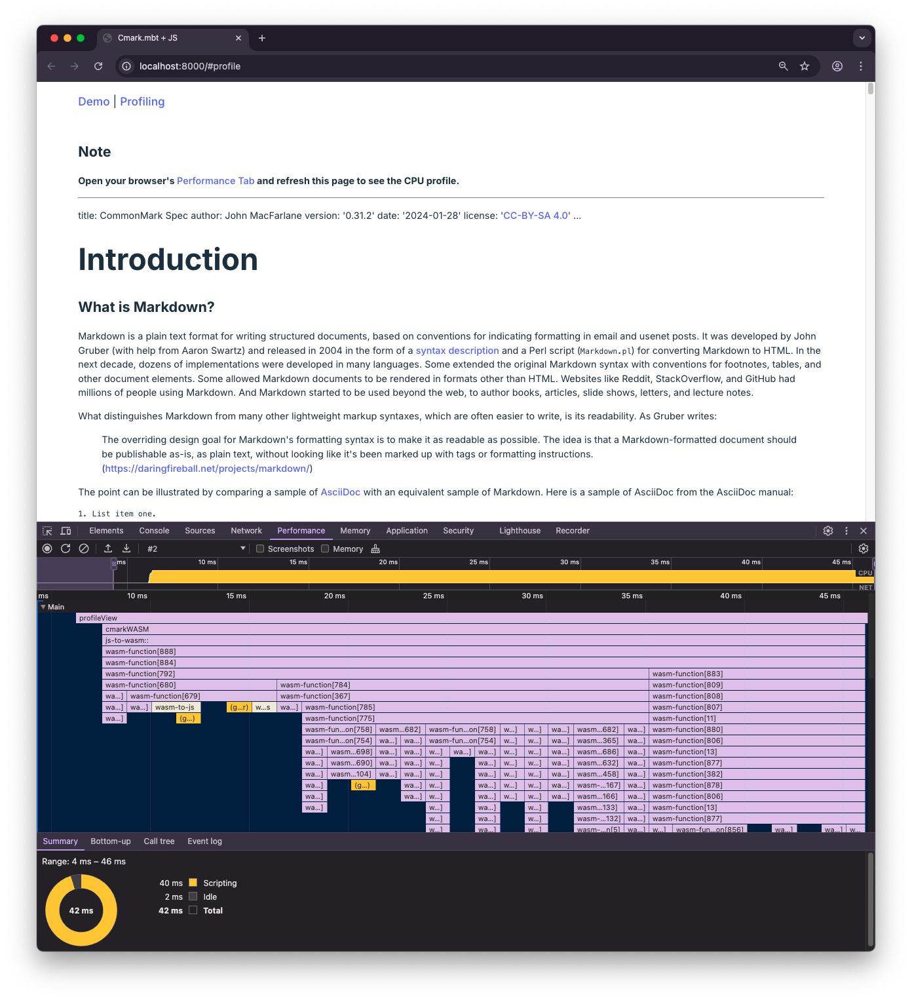
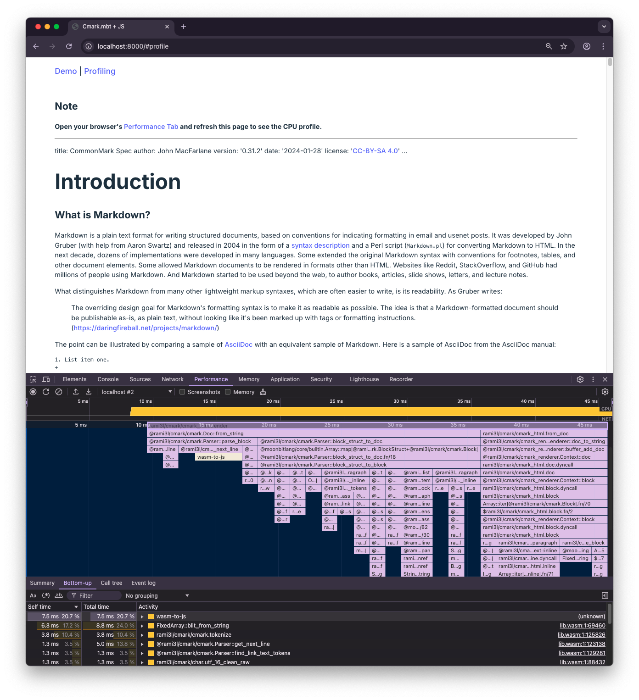
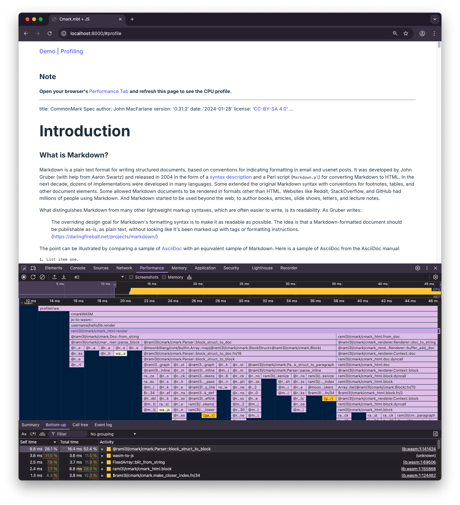

# Profiling MoonBit-Generated Wasm using Chrome


In [one of our previous blog posts][call-wasm-from-js], we have introduced how
to consume a MoonBit-powered Wasm library, [Cmark], within frontend JavaScript.
In this post, we will explore how to profile the same library directly from the
Chrome browser. Hopefully, this will help you gain insights and eventually
achieve better overall performance with MoonBit in similar use cases.

For this blog post in particular, we will focus on making minimal changes to our
previous ["Cmark for frontend" example][cmark-frontend-example], so that we may
apply Chrome's built-in V8 profiler to [Cmark]'s Wasm code.

## Profiling the Cmark library

We can easily refactor the original frontend application to include a new
navigation bar with two links, "Demo" and "Profiling". Clicking the first will
tell the browser to render the HTML for the original _A Tour of MoonBit for
Beginners_ example, and clicking the second will lead it to our new document for
profiling. (If you are curious about the actual implementation, you can find a
link pointing to the final code towards the end of this post.)

Now we are ready to write some code to actually implement Wasm profiling. Are
there any particularities involved in terms of profiling Wasm compared to
JavaScript?

As it turns out, we can use the very same APIs for profiling Wasm as we do for
JavaScript code. There is [an article][console-apis] in the Chromium
documentation that describes them in more detail, but in short:

- When we call `console.profile()`, the V8 profiler will start recording a CPU
  performance profile;
- After that, we can call the performance-critical function we would like to
  analyze;
- Finally, when we call `console.profileEnd()`, the profiler will stop the
  recording and then visualizes the resulting data in Chrome's Performance Tab.

With that in mind, let's have a look at the actual implementation of our
profiling functionality:

```javascript
async function profileView() {
  const docText = await fetchDocText("../public/spec.md");
  console.profile();
  const res = cmarkWASM(docText);
  console.profileEnd();
  return (
    `<h2>Note</h2>
<p>
  <strong
    >Open your browser's
    <a
      href="https://developer.chrome.com/docs/devtools/performance"
      rel="nofollow"
      >Performance Tab</a
    >
    and refresh this page to see the CPU profile.</strong
  >
</p>` + res
  );
}
```

As you can see, we have to minimize the scope of the code being executed when
the profiler is activated. Thus, the code is written so that the call to the
[`cmarkWASM()`] function is the only thing within that scope.

On the other hand, we have chosen the 0.31.2 version of [the CommonMark
Specification][spec] (a.k.a. `spec.md` in the code above) as the input document
for the profiling mode. This is notably because of the document's richness
particularly in the employment of different Markdown features, in addition to
its sheer length which can cause trouble for many Markdown parsers:

```console
> wc -l spec.md  # line count
    9756 spec.md
> wc -w spec.md  # word count
   25412 spec.md
```

We have reorganized our frontend application so that clicking on the "Profiling"
link in the navigation bar will trigger the `profileView()` function above,
giving the following:



If you have ever dug into performance optimization, this flame graph above
should look pretty familiar...

Wait, what are `wasm-function[679]`, `wasm-function[367]` and so on? How are we
supposed to know which function corresponds to which number?

It turns out we need to retain some debug information when building our Wasm
artifact. After all, we have been using the following command to build our
MoonBit project:

```console
> moon -C cmarkwrap build --release --target=wasm-gc
```

... and stripping is the standard behavior of `moon` when producing a release
build.

Fortunately, there is an extra flag we can use to keep the symbol information
without having to resort to a slow debug build: `--no-strip`. Let's rebuild our
project with it:

```console
> moon -C cmarkwrap build --release --no-strip --target=wasm-gc
```

> **Note**
>
> Similarly, if we would like to use `wasm-opt` on the resulting Wasm artifact,
> we can use the `--debuginfo` (or `-g`) flag of `wasm-opt` to preserve the
> function names in the optimized output.

With the function names retained, we can finally see what is really going on in
the Performance Tab!



## Analyzing the Flame Graph

The flame graph as shown in the previous screenshot can provide a nice summary
of function calls and their respective execution times in our code. In case you
are not familiar with it, the main ideas behind it are as follows:

- **The Y-axis** represents the call stack, with the topmost function being the
  one that was called first;
- **The X-axis** represents the time spent in execution, with the width of each
  box-shaped node corresponding to the total time spent in a certain function
  call and its children.

Since we are investigating the performance of the Cmark library in particular,
we should move downwards and concentrate on the node for
`@rami3l/cmark/cmark_html.render()`. Here, for example, we can clearly see that
the execution of `render()` is divided into two main parts, as represented by
two children nodes on the graph:

- `@rami3l/cmark/cmark.Doc::from_string()`, which stands for the conversion of
  the input Markdown document into a syntax tree;
- `@rami3l/cmark/cmark_html.from_doc()`, which stands for the rendering of the
  syntax tree into the final HTML document.

To get a better view, let's highlight the `render()` node in the flame graph
with a single click. This will tell Chrome to update the "Bottom-up" view to
show only the functions that are transitively called by `render()`, and we will
get something like the following:



After sorting the items by self time (i.e. total time excluding child time) in
the "Bottom-up" view, we can easily find out the functions that have consumed
the most time on their own. This suggests that their implementation might be
worth a closer look. Meanwhile, we would also want to try eliminating deep call
stacks when possible, which can be found by looking for the long vertical bars
in the flame graph.

## Achieving High Performance

During its development process, Cmark has been profiled hundreds of times using
the very method we have seen above in pursuit of satisfactory performance, but
how does it actually perform against popular JavaScript Markdown libraries?

For this test, we have chosen [Micromark] and [Remark]---two well-known Markdown
libraries in the JavaScript ecosystem---as our reference. We have used a recent
build of Chrome 133 in this test as our JS and Wasm runtimes, and have imported
[Tinybench] to measure the average throughput of each library.

Below is the average throughput of these libraries converting a single copy of
the CommonMark spec to HTML on a MacBook M1 Pro:

| Test (Fastest to Slowest)          | Samples | Average/Hz | ±/%      |
| ---------------------------------- | ------- | ---------- | -------- |
| **cmark.mbt (WASM-GC + wasm-opt)** | **21**  | **203.66** | **3.60** |
| cmark.mbt (WASM-GC)                | 19      | 188.46     | 3.84     |
| micromark                          | 10      | 15.48      | 2.07     |
| remark                             | 10      | 14.28      | 3.16     |

The results are quite clear: thanks to the continuous profiling-and-optimizing
process, Cmark is now significantly faster than both JavaScript-based libraries
by a factor of about 12x for Micromark and 13x for Remark. Furthermore,
`wasm-opt`'s extra optimization passes can give Cmark another performance boost,
bringing these factors up to about 13x and 14x respectively.

In conclusion, the performance of Cmark is a testament to the power of MoonBit
in providing visible efficiency improvements in an actual frontend development
scenario.

If you are interested in the details of this demo, you may check out the final
code [on GitHub][cmark-frontend-example-profiling]. The code based used in
benchmarking is also available [here][cmark-frontend-example-bench].

**New to MoonBit?**

- [Download MoonBit](https://www.moonbitlang.com/download/).
- Explore
  [MoonBit Beginner's Guide](https://docs.moonbitlang.com/en/latest/tutorial/tour.html).
- Play with [MoonBit Language Tour](https://tour.moonbitlang.com/).
- Check out [MoonBit Docs](https://docs.moonbitlang.com/en/latest/index.html).
- Join our [Discord](https://discord.gg/5d46MfXkfZ) community.

[Cmark]: https://github.com/moonbit-community/cmark
[Tinybench]: https://github.com/tinylibs/tinybench
[Micromark]: https://github.com/micromark/micromark
[Remark]: https://github.com/remarkjs/remark
[spec]: https://spec.commonmark.org/0.31.2
[call-wasm-from-js]: http://moonbitlang.com/blog/call-wasm-from-js
[console-apis]:
  https://developer.chrome.com/docs/devtools/console/utilities/#profile-function
[cmark-frontend-example]:
  https://github.com/moonbit-community/cmark-frontend-example
[cmark-frontend-example-profiling]:
  https://github.com/moonbit-community/cmark-frontend-example/tree/profiling
[cmark-frontend-example-bench]:
  https://github.com/moonbit-community/cmark-frontend-example/tree/bench
[`cmarkWASM()`]:
  https://www.moonbitlang.com/blog/call-wasm-from-js#integrating-with-javascript:~:text=function%20cmarkWASM(md)
