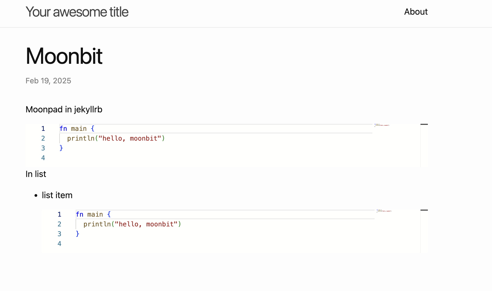

# How to Use Moonpad on Your Website


Both the [MoonBit homepage](https://www.moonbitlang.com) and [Language Tour](https://tour.moonbitlang.com) feature a component that allows you to write MoonBit code directly in the browser and compile it in real-time. This component is Moonpad, which we developed and has now been released on [npm](https://www.npmjs.com/package/@moonbit/moonpad-monaco). This blog post will guide you on how to use Moonpad on your own website.

All the code referenced in this post has been uploaded to GitHub, and you can view it at [https://github.com/moonbit-community/moonpad-blog-examples](https://github.com/moonbit-community/moonpad-blog-examples).

## What is Moonpad?

MoonBit plugin provides many features that greatly benefit developers. In addition to supporting syntax highlighting, autocompletion, and error diagnostics for MoonBit syntax, it also provides an out-of-the-box debugger, real-time value tracing, testing, and a built-in MoonBit AI assistant, all of which help reduce the workload outside of core development, creating a highly efficient and smooth development environment. If you haven't experienced the complete MoonBit plugin, you can install our [VS Code plugin](https://aka.moonbitlang.com/vsh).

Moonpad, as described in this tutorial, is an online MoonBit editor based on the [Monaco editor](https://github.com/microsoft/monaco-editor). It supports syntax highlighting, autocompletion, and error diagnostics and more for MoonBit. Moreover, it can compile MoonBit code in real-time in the browser, making it essentially a simplified MoonBit plugin running in the browser. In this tutorial, we'll walk you through how to implement Moonpad, which you might have tried it in the MoonBit homepage and language tour.

## How to Use Moonpad

### Setup

First, create a new JS project:

```bash
mkdir moonpad
cd moonpad
npm init -y
```

Install dependencies:

```bash
npm i @moonbit/moonpad-monaco esbuild monaco-editor-core
```

Here’s a brief explanation of each dependency:

- `@moonbit/moonpad-monaco` is a Monaco editor plugin that provides syntax highlighting, autocompletion, error diagnostics, and compilation features for MoonBit.
- `esbuild` is a fast JavaScript bundling tool used for packaging source code.
- `monaco-editor-core` is the core library for the Monaco editor. We use this library instead of `monaco-editor` because it doesn’t include unnecessary syntax highlighting and semantic support for languages like HTML, CSS, and JS, making the bundled output smaller.

### Writing Code

Next, we need to write code for using Moonpad and Monaco editor along with a build script.

The following code is written in the `moonpad` directory and contains extensive comments to help you better understand it.

Here’s the code for `index.js`:

```js
import * as moonbitMode from "@moonbit/moonpad-monaco";
import * as monaco from "monaco-editor-core";

// Monaco editor requires global variables; for more details: https://github.com/microsoft/monaco-editor
self.MonacoEnvironment = {
  getWorkerUrl: function () {
    return "/moonpad/editor.worker.js";
  },
};

// moonbitMode is an extension of Monaco Editor, which we call Moonpad.
// moonbitMode.init initializes various MoonBit functionalities and returns a simple MoonBit build system for compiling and running MoonBit code.
const moon = moonbitMode.init({
  // A URL string that can request onig.wasm
  // URL for onig.wasm (the WASM version of oniguruma for MoonBit syntax highlighting)
  onigWasmUrl: new URL("./onig.wasm", import.meta.url).toString(),
  // A worker running the MoonBit LSP server for language support
  lspWorker: new Worker("/moonpad/lsp-server.js"),
  // A factory function for creating a worker to compile MoonBit code in the browser
  mooncWorkerFactory: () => new Worker("/moonpad/moonc-worker.js"),
  // A configuration function to filter which codeLens should be displayed
  // Return false to disable any codeLens for simplicity
  codeLensFilter() {
    return false;
  },
});

// Note: All paths are hardcoded here, so later when writing the build script, we need to ensure these paths are correct.

// Mount Moonpad

// Create an editor model and specify its languageId as "moonbit". We can initialize the code content here.
// Moonpad only provides LSP services for models with languageId "moonbit".

const model = monaco.editor.createModel(
  `fn main {
  println("hello")
}
`,
  "moonbit",
);

// Create a Monaco editor and mount it to the `app` div element, displaying the model we just created.
monaco.editor.create(document.getElementById("app"), {
  model,
  // Moonpad provides its own theme with better syntax highlighting, compared to the default Monaco theme
  // Moonpad also provides a dark theme "dark-plus", which you can try replacing with "dark-plus"
  theme: "light-plus",
});
```

Create an `esbuild.js` file and enter the following code for our build script that bundles `index.js`:

```js
const esbuild = require("esbuild");
const fs = require("fs");

// The dist folder is our output directory. Here we clear it to ensure esbuild always starts from scratch.
fs.rmSync("./dist", { recursive: true, force: true });

esbuild.buildSync({
  entryPoints: [
    "./index.js",
    // Bundle Monaco Editor worker required for providing editing services, which is also the return value of MonacoEnvironment.getWorkerUrl in `index.js`.
    // As previously mentioned, all paths are hardcoded, so we use `entryNames` to ensure the worker is named `editor.worker.js`.
    "./node_modules/monaco-editor-core/esm/vs/editor/editor.worker.js",
  ],
  bundle: true,
  minify: true,
  format: "esm",
  // The output directory corresponds to the hardcoded paths in `index.js`.
  outdir: "./dist/moonpad",
  entryNames: "[name]",
  loader: {
    ".ttf": "file",
    ".woff2": "file",
  },
});

fs.copyFileSync("./index.html", "./dist/index.html");

// Copy various worker files needed to initialize Moonpad, since they are already bundled, we don’t need to bundle them again with esbuild.
fs.copyFileSync(
  "./node_modules/@moonbit/moonpad-monaco/dist/lsp-server.js",
  "./dist/moonpad/lsp-server.js"
);
fs.copyFileSync(
  "./node_modules/@moonbit/moonpad-monaco/dist/moonc-worker.js",
  "./dist/moonpad/moonc-worker.js"
);
fs.copyFileSync(
  "./node_modules/@moonbit/moonpad-monaco/dist/onig.wasm",
  "./dist/moonpad/onig.wasm"
);
```

Finally, create a simple `index.html` file:

```html
<!DOCTYPE html>
<html lang="en">
  <head>
    <meta charset="UTF-8" />
    <meta name="viewport" content="width=device-width, initial-scale=1.0" />
    <title>Moonpad Demo</title>
    <link rel="stylesheet" href="/moonpad/index.css" />
  </head>
  <body>
    <div id="app" style="height: 500px"></div>
    <script type="module" src="/moonpad/index.js"></script>
  </body>
</html>
```

### Build and Start the Server

Run the build script:

```sh
node esbuild.js
```

Your `dist` folder should now contain:

```
dist/
├── index.html
└── moonpad
    ├── codicon-37A3DWZT.ttf
    ├── editor.worker.js
    ├── index.css
    ├── index.js
    ├── lsp-server.js
    ├── moonc-worker.js
    └── onig.wasm

2 directories, 8 files
```

The `codicon-37A3DWZT.ttf` file hash at the end may not match exactly in your case, but that's not a problem.

Now, start a simple HTTP server in the `dist` folder::

```sh
python3 -m http.server 8081 -d ./dist
```

Open [http://localhost:8081](http://localhost:8081) in your browser, and you should see Moonpad successfully rendered.


## Using Moonpad on Your Website

Let’s see how to integrate Moonpad into your website, using [Jekyll](https://jekyllrb.com/) and [Marp](https://marpit.marp.app/) as examples.

### Principle

In the previous section, we created a `moonpad` folder containing all the files necessary to use Moonpad. Any webpage can import `moonpad/index.js` and `moonpad/index.css` and modify the mount logic in `index.js` to use Moonpad.

To use Moonpad on your webpage, you need to:

1. Modify the mount logic in `moonpad/index.js` based on your website framework.

2. Import `moonpad/index.js` and moonpad/index.css on the page where you want to use Moonpad.

3. Place the `moonpad` folder in the website’s static resource directory and ensure its path is `/moonpad`.

### Using Moonpad in Jekyll

[Jekyll](https://jekyllrb.com/) is a simple, blog-aware static site generator. It uses Markdown or Textile, along with the Liquid template engine, to generate static web pages. Jekyll combines content with templates to generate static files that can be directly deployed to any web server. It is particularly well-suited for GitHub Pages, allowing users to easily create and maintain blogs or websites.

#### Observing the Structure of Code Blocks Rendered by Jekyll

For the following Markdown code block in Jekyll:

````markdown
```moonbit
fn main {
  println("hello, moonbit")
}
```
````

It generates the following HTML structure:

```html
<pre><code class="language-moonbit">fn main {
  println("hello, moonbit")
}
</code></pre>
```

If we want all MoonBit code blocks in Jekyll to be rendered in Moonpad, we need to replace the generated `pre` element with a `div` and mount Moonpad on this `div`.

Here is the implementation of this logic:

```js
// Loop through all moonbit code blocks
for (const pre of document.querySelectorAll("pre:has(code.language-moonbit)")) {
  // Get the content of the code block
  const code = pre.textContent;
  // Create a div element, which will serve as the mount point for Monaco editor
  const div = document.createElement("div");
  // Set the div's height based on the code content
  const height = code.split("\n").length * 20;
  div.style.height = `${height}px`;
  // Replace the code block with the div
  pre.replaceWith(div);
  // Create a Monaco editor model using the obtained code content
  const model = monaco.editor.createModel(code, "moonbit");
  // Create Monaco editor and mount it to the div, displaying the previously created model
  monaco.editor.create(div, {
    model,
    theme: "light-plus",
  });
}
```

Simply replace the mounting logic in `index.js` with the above code.

#### Importing Moonpad

Jekyll supports using HTML directly in Markdown, so we can import Moonpad directly in the Markdown. Just add the following code at the end of the Markdown file where Moonpad is needed.

```html
<link rel="stylesheet" href="/moonpad/index.css" />
<script type="module" src="/moonpad/index.js"></script>
```

#### Place the Moonpad Folder in Jekyll’s Static Directory

After running `jekyll build`, Jekyll will place all static assets in the `_site` directory. We only need to copy the `moonpad` folder into the `_site` directory.

The directory structure of the `_site` folder should look like this after copying:

```
_site/
├── ... # Other static assets
└── moonpad
    ├── codicon-37A3DWZT.ttf
    ├── editor.worker.js
    ├── index.css
    ├── index.js
    ├── lsp-server.js
    ├── moonc-worker.js
    └── onig.wasm
```

#### Result

After completing the above steps, you can use Moonpad in Jekyll. The result will look like this:



### Using Moonpad in Marp

[Marp](https://marp.app/) is a Markdown conversion tool that can convert Markdown files into slides. It is based on the [Marpit](https://marpit.marp.app/) framework, supports custom themes, and allows you to create and design slides using simple Markdown syntax, making it ideal for technical presentations.

#### Observing the Structure of Code Blocks Rendered by Marp

For the same code block as in the previous Jekyll section, Marp renders the HTML structure as follows:

```html
<marp-pre>
  ...
  <code class="language-moonbit">fn main { println("hello, moonbit") } </code>
</marp-pre>
```

Clearly, if we want all MoonBit code blocks to use Moonpad for rendering, we need to replace `marp-pre` with `div` and mount Moonpad on this `div`.

Here is the implementation of this logic, which is very similar to the Jekyll example:

```js
for (const pre of document.querySelectorAll(
  "marp-pre:has(code.language-moonbit)",
)) {
  const code = pre.querySelector("code.language-moonbit").textContent;
  const div = document.createElement("div");
  const height = code.split("\n").length * 20;
  div.style.height = `${height}px`;
  pre.replaceWith(div);
  const model = monaco.editor.createModel(code, "moonbit");
  monaco.editor.create(div, {
    model,
    theme: "light-plus",
  });
}
```

Just replace the mounting logic in `index.js` with the above code.

#### Importing Moonpad

Marp also supports using HTML in Markdown, but this feature must be explicitly enabled. Add the following code at the end of the Markdown file where Moonpad is needed:

```html
<link rel="stylesheet" href="/moonpad/index.css" />
<script type="module" src="/moonpad/index.js"></script>
```

And enable the `html` option when building:

```sh
marp --html
```

#### Place the Moonpad Folder in Marp’s Static Directory

There are two common ways to preview slides in Marp: one is by using the built-in server feature, and the other is by exporting the Markdown file as HTML and setting up your own server.

For the built-in server feature, place the `moonpad` folder in the folder specified by the `marp --server` command.

For the case where you export Markdown as HTML, ensure that the `moonpad` folder and the exported HTML file are in the same directory.

#### Result

After completing the above steps, you can use Moonpad in Marp. The result will look like this:


Unfortunately, in Marp, the hover tooltip position in Monaco editor is not correct. We are currently unsure how to resolve this issue.

## How to Use Moonpad to Compile MoonBit Code

As mentioned earlier, `moonbitMode.init` returns a simple build system, which we can use to compile and run MoonBit code. It exposes two methods: `compile` and `run`, which are used to compile and run MoonBit code, respectively. For example:

```js
// compile also accepts more configuration via parameters, such as compiling files with tests. Here, we only compile a single file.
const result = await moon.compile({ libInputs: [["a.mbt", model.getValue()]] });
switch (result.kind) {
  case "success":
    // If compilation is successful, the JavaScript code compiled by the backend compiler will be returned.
    const js = result.js;
    // You can use the run method to execute the compiled JS and get the standard output stream.
    // Note that the smallest unit of this stream is not characters, but each line of string output from the standard output.
    const stream = moon.run(js);
    // Collect the content from the stream into a buffer and output it to the console.
    let buffer = "";
    await stream.pipeTo(
      new WritableStream({
        write(chunk) {
          buffer += `${chunk}\n`;
        },
      }),
    );
    console.log(buffer);
    break;
  case "error":
    break;
}
```

Open the console, and you will see the output: `hello`.

For more usage of the `compile` function and how to display the code output on the page, refer to the language tour code: [moonbit-docs/moonbit-tour/src/editor.ts#L28-L61](https://github.com/moonbitlang/moonbit-docs/blob/a5dab53482b694d5f065cc4ba6a540b72193c321/moonbit-tour/src/editor.ts#L28-L61)

**New to MoonBit?**

- [Download MoonBit](https://aka.moonbitlang.com/vsh).
- Explore
  [MoonBit Beginner's Guide](https://docs.moonbitlang.com/en/latest/tutorial/tour.html).
- Play with [MoonBit Language Tour](https://tour.moonbitlang.com/).
- Check out [MoonBit Docs](https://docs.moonbitlang.com/en/latest/index.html).
- Join our [Discord](https://discord.gg/5d46MfXkfZ) community.
