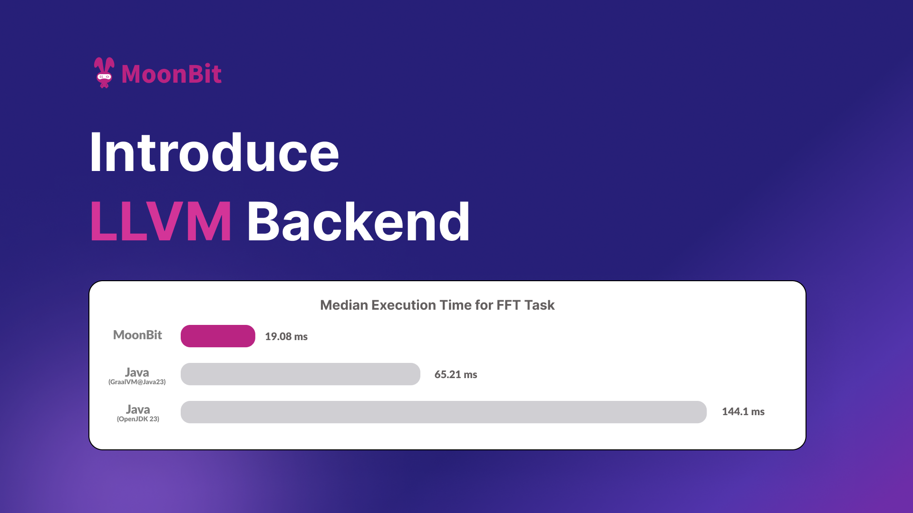
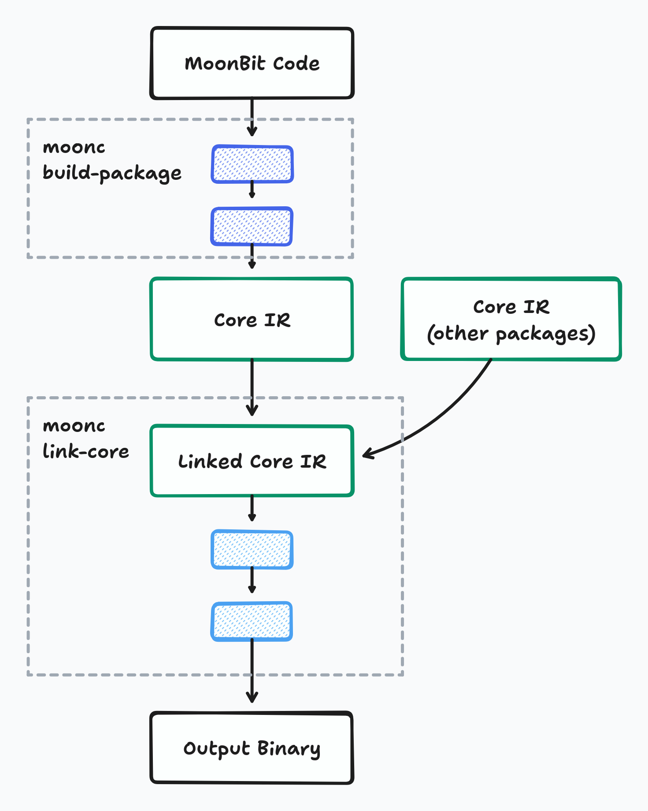
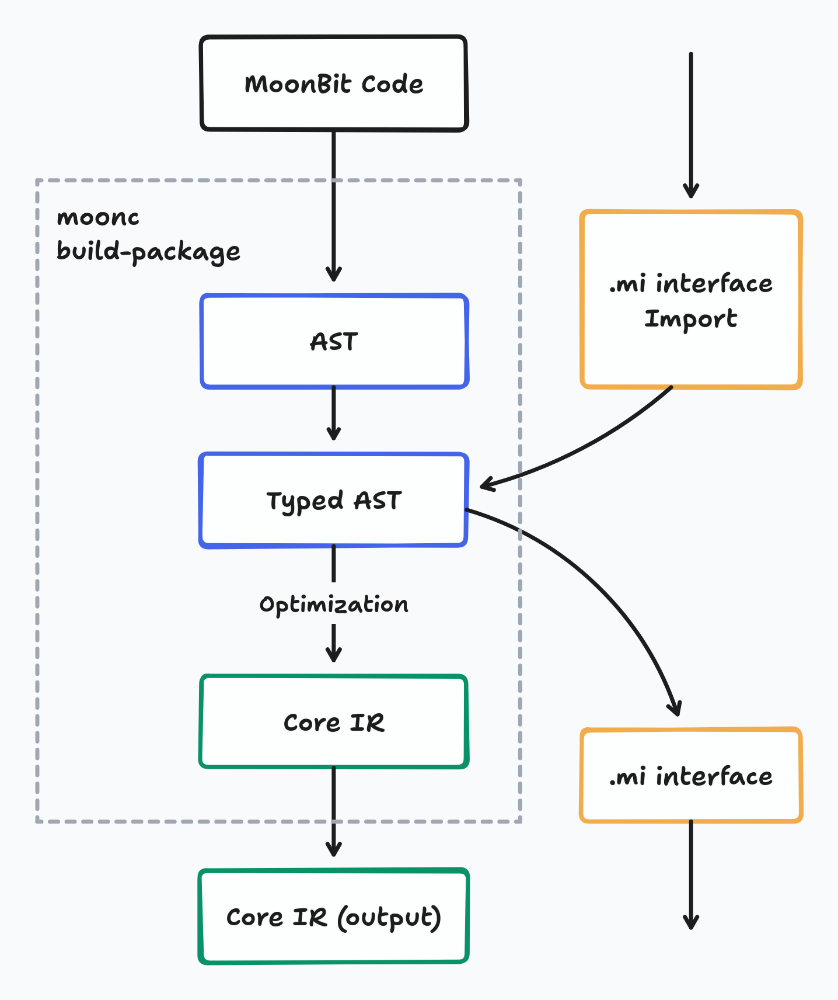
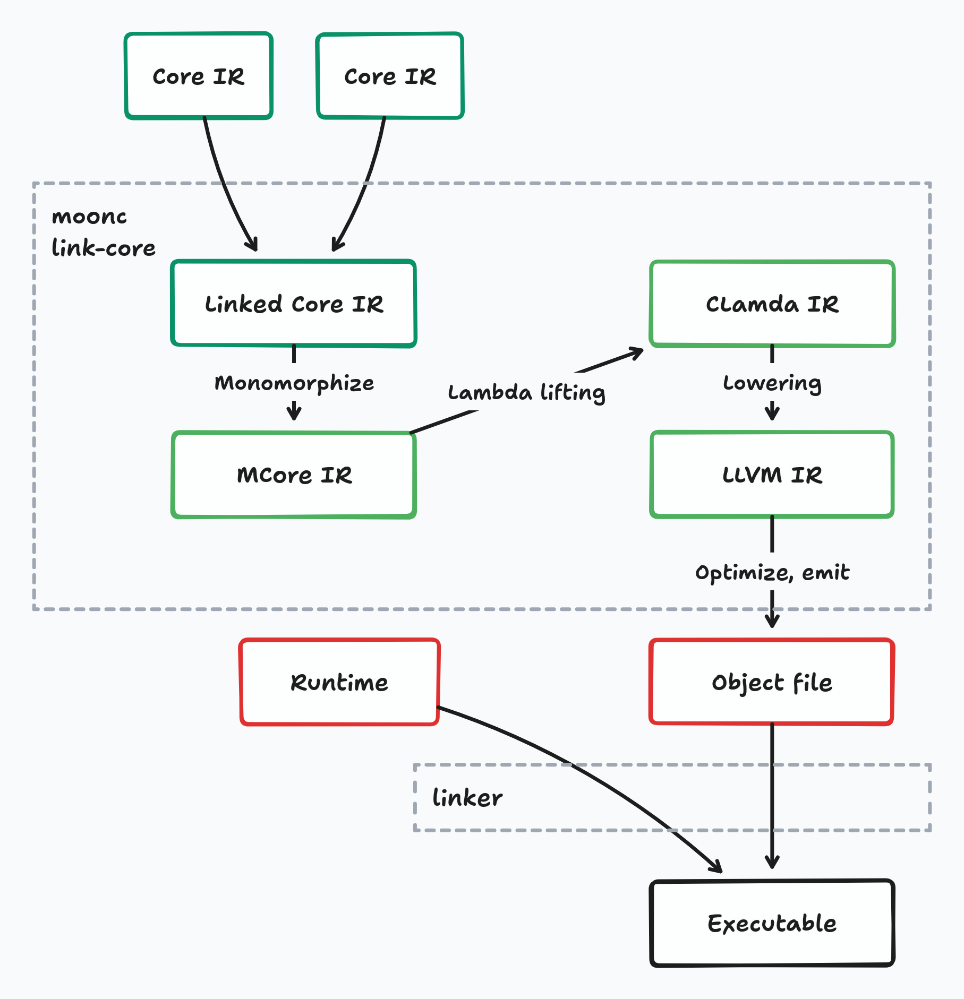
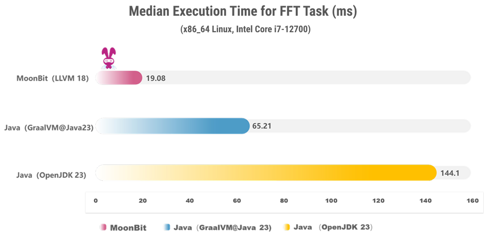
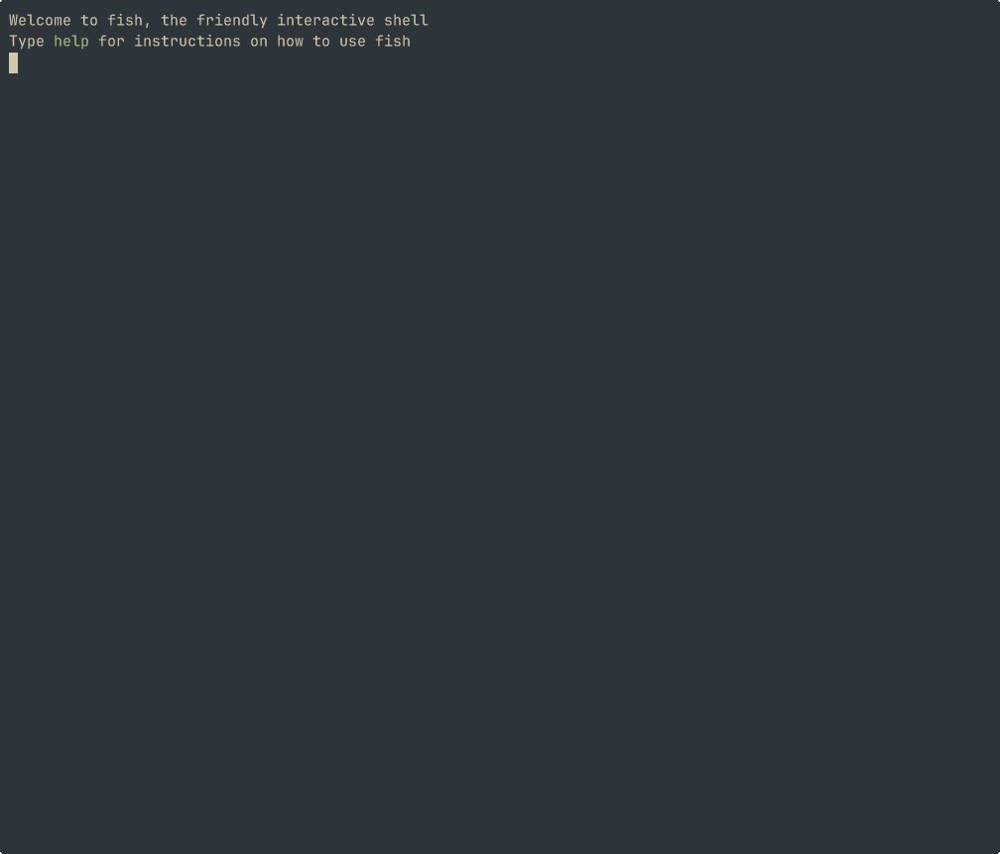

# Announcing LLVM backend for MoonBit

In the past two years, MoonBit has demonstrated significant performance advantages across [WebAssembly](https://www.moonbitlang.com/blog/first-announce), [JavaScript](https://www.moonbitlang.com/blog/js-support), and [native](https://www.moonbitlang.com/blog/native) backends. We believe that for a new language to be truly valuable, it must offer a generational leap in both **core performance** and **developer experience**. Today, we are excited to introduce **MoonBit LLVM backend** support with **8×** the performance of Java in the FFT benchmark, and out-of-the-box debugging.

## Why do we need an LLVM backend?

Compiling to C is a common way to bootstrap a programming language
through native compilation pipelines.
The C programming language is mature,
and widely-supported in a large number of platforms,
making it the _de facto_ "portable assembly code".

However, using C as a compilation target comes at a cost.
While C is a standardized language,
its history of more than 50 years had led to a fragmented ecosystem,
where each C compiler has its own interpretation of
and extensions to the language.
The C standard that all compilers agree on,
as a result, has many undefined or implementation-defined behaviors
that can easily trap programmers.
Examples of these include integer overflow, bitfields, enum underlying types,
and many more.
So, when transpiling a program to C,
maintaining consistent semantics across platforms becomes a significant challenge.

LLVM, on the other hand, is a modern compilation infrastructure
designed specifically for code optimizations,
and generating consistent code across platforms.
It's the workhorse powering many successful programming languages including
the C-family (C, Objective-C, C++, though Clang), Rust, Julia, Swift, Zig.

LLVM's intermediate representation (IR) --
which is essentially a low-level programming language
designed to represent the program during compiler optimization --
is a well-defined language with far less undefined behaviors than C.
Via bindings to the LLVM library,
compilers can construct the program in LLVM IR, optimize the program,
and generate binary object files,
all without ever leaving the process.
This makes the compilation pipeline simpler,
and without having to deal with the fragmented world of C compilers.

By having direct access to LLVM's compilation infrastructure,
we can maintain full control over optimization and code generation,
preserving important program information that would be lost when going through C.
The LLVM infrastructure helps us handle the heavy lifting of
applying low-level code optimizations (the same ones that make C and Rust fast),
generating debug information,
and generating code for different platforms,
so that we can focus more on improving MoonBit as a programming language.

By adding LLVM to the list of our backends,
we also gain several important capabilities.
LLVM's support for debugging information makes it easier for us
to map lines to source code,
enhancing debugging experience of native binaries through `gdb` or `lldb`.
In the future, it will also provide us with debugging information
down to values of variables and data structures.
LLVM also has support for garbage collectors and exceptions,
which will make it easier for us to experiment with different runtime choices.

## The pipeline of compiling to LLVM

It's now good time for us to introduce the compilation pipeline of the MoonBit language.

### Overview

The compilation pipeline of a MoonBit program can be split into two parts.

The first part is on-demand and incremental,
compiling each individual package from the source code,
and outputs an intermediate representation which we call Core IR,
via the command `moonc build-package`.
Core IR is an intermediate representation in ANF-style (Administrative Normal Form)
that we use to perform compiler optimizations.
In this part, we perform various optimizations on the IR.

The second part is linking the packages into the final binary,
via the command `moonc link-core`.
Here, Core IRs from different packages are linked together and optimized again,
using dead code elimination, inlining and other optimization techniques.
The result is then passed down the compilation pipeline,
ultimately generating an output binary.

### Compilation of packages

Within each package's compilation process,
the compiling starts with the abstract syntax tree (AST) --
the original code represented in a structured way in memory.

Then, the types within each expression of the code are inferred
from code structure and imported libraries.
This gives us the Typed AST (TAST) --
AST with each expression annotated with its type.

From TAST, we then lower it into Core IR,
the main intermediate representation,
and perform several high-level transforms and optimizations.
These optimization include desugaring async functions,
unboxing data structures that do not escape,
and removing dead code not referenced by others.
The result Core IR from these optimizations
becomes the compiled form of each library.

### Linking and codegen

Unlike many other compiled programming languages
that don't do much after linking,
there's a stack of lowering and optimizing passes after the linking of Core IRs
that gradually turns the IR into target code.

Upon compilation, Core IR from different packages are first linked together.
Then, it goes
through optimization and monomorphization (removing generic functions) into MCore IR,
and then through another pass removing closures and lowering into CLambda IR.
Garbage collection intrinsics are also added during this stage.

The CLambda IR is the last step before emitting code for different backends.
For WASM, JS and C backends, the output code is self-contained,
so there's only one more lowering step to generate the output code,
and then emit it into the output file.

For LLVM, things are a little more complex than them:
CLambda IR is converted to LLVM IR
and passed through more optimization passes in the LLVM library.
After all LLVM optimizations, the code is emitted to object file,
and finally linked with the prebuilt runtime into a working executable.

## Performance

The LLVM backend of MoonBit has achieved impressive performance results. For example, using [a classic FFT algorithm benchmark](https://github.com/moonbit-community/moonbit-native-benchmark1), we ran the same Cooley-Tukey algorithm in both MoonBit and Java. MoonBit demonstrated an over **8x performance improvement** compared to Java and was more than **3x faster** than Java compiled with the GraalVM static compiler.

FFT (Fast Fourier Transform) is an efficient algorithm for computing the Discrete Fourier Transform of a sequence. It is widely used in fields such as signal processing and data compression. The FFT algorithm involves extensive numerical computations and array operations, making it an excellent benchmark for evaluating a language’s fundamental performance.

| Platform | Time (ms) |
| -------- | --------- |
| MoonBit (LLVM 18) | 19.08 |
| Java (GraalVM @ Java 23) | 65.21 |
| Java (OpenJDK 23) | 144.1 |

## Debugging support

**For the JavaScript backend targeting the virtual machine, MoonBit provides an "out-of-the-box" debugging experience via Chrome Debugger.** However, the debugging experience for the native C backend is not yet as seamless. In the C backend, users can debug the compiled C files, but there is a lack of precise mapping between the generated C code and the original source files.

With the help of LLVM, **the MoonBit compiler now supports injecting DWARF format symbol tables into the final binary.** This means MoonBit can now insert debugging information into the output binary, allowing instructions in the binary to be directly mapped to the source file, including line and column numbers. This significantly improves the accuracy of source code mapping in the compiled output.

Thanks to this debugging information mechanism, the MoonBit toolchain now enables developers to perform source-level debugging using standard debugging tools like LLDB.
The debugger can automatically resolve symbol mappings. When execution reaches a predefined source location, breakpoints are triggered accurately. For example, developers can insert breakpoints in LLDB to pause execution at specific locations in their code.

The current debug info support is still preliminary,
but already pretty usable.
We have plans to bring more detailed information to it,
including better symbols and name mangling,
and more importantly,
support showing the values of local variables and data structures.

## Future prospects

**The most significant improvement brought by LLVM is that MoonBit can compile directly to native binary files without relying on a C compiler. This eliminates various compatibility issues associated with C compilers.** Once support for distributing precompiled runtime libraries is implemented, MoonBit programs will be completely independent of the C compiler, generating native executables using only a linker.

With LLVM doing heavier lifting,
we can also spare more time on experimenting new changes to the runtime.
As LLVM has full integrated support for [exception handling](https://llvm.org/docs/ExceptionHandling.html),
we can convert the implementation of functions with error into try-catches and get better performance.
LLVM also has integrated support for [tracing garbage collection](https://llvm.org/docs/GarbageCollection.html),
which means we can also try using a tracing GC instead of Perceus and RC for memory management.

## Conclusion

The addition of LLVM backend marks an important milestone for MoonBit,
expanding our compilation capabilities while complementing our existing C backend.

LLVM brings additional strengths to our ecosystem--from industrial-strength optimizations to improved debugging support.
While there is still work to be done,
this new backend opens up exciting possibilities for the future
With both C and LLVM backends in our hands,
MoonBit is now better equipped to serve diverse use cases and deployment scenarios.

We're excited to see what our users will build with these new capabilities,
and we look forward to leveraging LLVM's rich feature set
to make MoonBit an even more powerful and developer-friendly language.

**New to MoonBit?**

- [Download MoonBit](https://aka.moonbitlang.com/vsh)
- Explore [MoonBit Beginner's Guide](https://docs.moonbitlang.com/en/latest/tutorial/tour.html)
- Play with [MoonBit Language Tour](https://tour.moonbitlang.com/)
- Check out [MoonBit Docs](https://docs.moonbitlang.com/en/latest/index.html)
- Join our [Discord community](https://discord.gg/5d46MfXkfZ)
