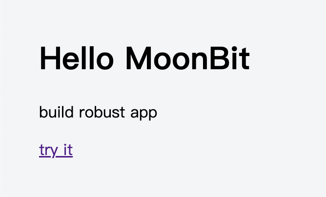

# Introduce The Elm Architecture to MoonBit: build robust web app with simple principles


Elm is a purely functional programming language designed specifically for building front-end web applications. It compiles to JavaScript and emphasizes simplicity, performance, and robustness.

Purely functional means that functions have no side effects, making the code easier to understand and debug. With strong static type checking, Elm ensures that your application will not throw runtime exceptions, providing greater reliability. The Elm Architecture enforces a unidirectional data flow, making state management predictable and straightforward.

Inspired by Elm, we developed a front-end web framework called [Rabbit-TEA](https://github.com/moonbit-community/rabbit-tea) using MoonBit.

## Why MoonBit

The rise of functional programming has also driven React's evolution from class-based paradigms to React Hooks. There are already some functional frameworks in javascript, so why do we need MoonBit?

Despite the availability of functional-style frameworks and libraries in the javascript ecosystem, the lack of features like pattern matching in Javascript itself makes the coding experience less ideal. Consider the following equivalent MoonBit and Javascript code:

**MoonBit**

```moonbit
let x = match y {
  a => value1
  b => value2
  c => value3
}
f(x)
```

**JavaScript**

```Javascript
var x = null;
if (y == a) { x = value1 }
else if (y == b) { x = value2 }
else { x = value3 }
// the x could be changed accidentally here!
return f(x);

// or
const x = y == a ? value1 : (y == b ? value2 : value3);
return f(x);
```

Here's another example of MoonBit. The function `validate_utf8` checks if the input `bytes` is a valid utf8 sequence:

```moonbit
fn validate_utf8(bytes : Bytes) -> Bool {
  loop bytes {
    [0x00..=0x7F, ..xs]
    | [0xC0..=0xDF, 0x80..=0xBF, ..xs]
    | [0xE0..=0xEF, 0x80..=0xBF, 0x80..=0xBF, ..xs]
    | [0xF0..=0xF7, 0x80..=0xBF, 0x80..=0xBF, 0x80..=0xBF, ..xs] => continue xs
    [_, ..] => false
    [] => true
  }
}
```

MoonBit is an expression-oriented language where variables are immutable by default. It fully supports pattern matching, a long-standing feature in functional programming languages, ensuring the generation of highly efficient JavaScript code. Moreover, the MoonBit compiler supports multiple backends, including JavaScript, WebAssembly, and native.

## How Rabbit-TEA Works

The Elm Architecture is extremely simple.  It consists of three components: Model, View, and Update.

- **Model:** The app's state, composed of immutable data structures.
- **View:** The app's view, which declares how the Model is displayed as HTML and what messages user interactions trigger.
- **Update:** The app's logic, which processes user-triggered messages and transforms the old Model into a new one.

Here is a complete counter app:

```moonbit
typealias Model = Int
let model = 0

enum Msg {
  Increment
  Decrement
}

fn update(msg : Msg, model : Model) -> (Cmd[Msg], Model) {
  match msg {
    Increment => (none(), model + 1)
    Decrement => (none(), model - 1)
  }
}

fn view(model : Model) -> Html[Msg] {
  div([
    h1([text(model.to_string())]),
    button(click=Msg::Increment, [text("+")]),
    button(click=Msg::Decrement, [text("-")]),
  ])
}

fn main {
  @tea.startup(model~, update~, view~)
}
```

This program defines not only the Model, Update, and View but also the `Msg` type. `Msg` acts as an event type. When user clicks the increase button, it triggers the runtime to send `Increment` message and current model to `update` function. In the `update` function, instead of directly modifying the `model`, a new `model` is created based on the old value and returned. The entire function is side-effect-free. Finally, the new model will be rendered as HTML by `view` function.

The `update` function also returns a `Cmd` type, which represents an unexecuted action. We will introduce it later.

### Declarative Views: HTML EDSL

An EDSL (Embedded Domain-Specific Language) is a DSL designed using the existing syntax of a programming language, requiring no additional preprocessing or compilation steps. Rabbit-TEA uses MoonBit's labeled argument syntax sugar to define a set of helper functions for HTML. These functions leverage types to guide users on parameter usage, avoiding the misuse of ambiguous and confusing `String` types. For example:

```moonbit
fn view() -> Html[Msg] {
  div([
    h1([text("hello MoonBit")]),
    p([text("build robust app")]),
    a(href="moonbitlang.com", target=Blank, [text("try it")]),
  ])
}
```



Take the `<a>` tag as an example. Its helper function is defined as follows. Apart from the unique `childrens` parameter, all other parameters are labeled arguments. Labeled arguments can be declared optional or given default values as needed.

```moonbit
pub(all) enum Target {
  Self
  Blank
}

pub fn a[M](
  style~ : Array[String] = [],
  id? : String,
  class? : String,
  href~ : String,
  target~ : Target = Self,
  childrens : Array[Html[M]]
) -> Html[M]
```

In the future, we will consider introducing JSX-like syntax in MoonBit to improve readability.

### Messages and Pattern Matching

The TEA architecture fully utilizes pattern matching and tagged union types. User-defined Msg types can carry additional data as needed, making update functions safer and more flexible when handling messages.

For example, consider an `input` element. If we want to process its value and display the result in another `p` element as the user types, we can add an enum constructor `GotInputChange` with `String` data to the Msg type. The type of `GotInputChange` matches the type of the `change` parameter in the `input` element: `(String) -> Msg`. When the user modifies the `input` value, it is wrapped in `GotInputChange` and sent to the `update` function for processing.

```moonbit
enum Msg {
  GotInputChange(String)
}

fn update(msg : Msg, model : String) -> (Cmd[Msg], String) {
  match msg {
    GotInputChange(value) => {
      ...
      (none(), value)
    }
  }
}

fn view(model : String) -> Html[Msg] {
  div([
    p([text(model)])
    input(input_type=Text, value=model, change=Msg::GotInputChange),
  ])
}
```

Thanks to MoonBit's exhaustiveness checking, when a new enum constructor is added to `Msg`, the IDE will prompt you to handle the new case in pattern matching, reducing runtime errors.

### Managing Side Effects

Like Elm, Rabbit-TEA uses the `Cmd` type to manage side effects, such as modifying external states or interacting with external systems. Examples include requesting the browser to record URL history, scrolling the browser view, or sending HTTP requests to a server and processing the response. All these operations are encapsulated as Cmds. A `Cmd` represents an unexecuted action that is only triggered by Rabbit-TEA's runtime when returned by the `update` function.

Here’s an example where clicking a card transitions the UI to a loading state and then loads the card's content via an HTTP request. `@http.get` returns a `Cmd`, with the first parameter being the request URL and the second parameter specifying the expected data format and response handler.

```moonbit
enum Msg {
  GotCardText(Result[String, String])
  ClickCard(Int)
}

pub fn update(msg : Msg, model : Model) -> (Cmd[Msg], Model) {
  match msg {
    ClickCard(id) => (@http.get("/api/card/\{id}", expect=Text(GotCardText)), Loading)
    GotCardText(Ok(text)) => (none(), Editing(text))
    GotCardText(Err(_)) => (none(), NotFound)
  }
}
```

When the server responds, it triggers the `GotCardText` message, carrying a `Result[String, String]` type. This prompts us to handle the response: if the card text is successfully returned, we update the `model` to display the content in the `view`; if the request fails, we navigate to the `NotFound` page.

The `Cmd` pattern encourages users to avoid mixing side effects and model updates in a single function, ensuring consistent program state by preventing multiple data sources for the model.

### Interacting with JavaScript World

The Cmds mentioned above are not specially treated by the framework but are implemented based on the `Cmd` interface. You can define your own Cmds to enable Rabbit-TEA to interact with the external JavaScript world. MoonBit allows inline JavaScript code to be written and bound to function definitions. For example:

```moonbit
extern "js" fn set_timeout(f : () -> Unit, ms : Int) = "(f,ms) => setTimeout(f, ms)"
```

`set_timeout` binds to JavaScript's `setTimeout` function. The parameter `f` represents the action to trigger, and `ms` specifies the delay before triggering. We can define a `delay` function that takes a `msg` (the message to trigger) and `ms` (the delay) and returns a Cmd.

```moonbit
fn delay[M](msg : M, ms : Int) -> Cmd[M] {
  Cmd(fn(events){
    set_timeout(fn(){ events.trigger_update(msg) }, ms)
  })
}
```

We can use this `delay` function to display a message 5 seconds after the user clicks a button:

```moonbit
enum Msg {
  Timeout(String)
  SetTime
}

fn update(msg : Msg, model : String) -> (Cmd[Msg], String) {
  match msg {
    Timeout(tips) => (none(), tips)
    SetTime => (delay(Timeout("You clicked the button 5s ago."), 5000), "")
  }
}

fn view(model : String) -> Html[Msg] {
  div([
    text(model),
    button(click=Msg::SetTime, [text("show tips after 5s")]),
  ])
}
```

However, when writing inline JavaScript, care must be taken to avoid runtime errors. We plan to provide richer Cmds in Rabbit-TEA so that users generally won't need to write these bindings themselves.

### Lightweight Runtime

We did not specifically optimize the size of the compiled JavaScript files when developing Rabbit-TEA. Thanks to MoonBit's global DCE (Dead Code Elimination) optimization, we found that a counter app, including the virtual DOM and MoonBit's standard library, generates only 33KB of code (minified, not gzipped), smaller than Vue's 50–60KB.

### Conclusion

While implementing Rabbit-TEA, we also rewrote MoonBit's package registry website, mooncakes.io, using it. Both [mooncakes.io](http://mooncakes.io) and Rabbit-TEA are still works in progress. We hope that as mooncakes.io is applied in practice, Rabbit-TEA will mature into a reliable UI framework. In the future, we also plan to explore more possibilities for the TEA architecture, such as native backend support, server-side rendering, time-travel debugging, and other exciting features.

If you're interested in this framework and MoonBit, we welcome you to join the MoonBit community.

**New to MoonBit?**

- [Download MoonBit](https://aka.moonbitlang.com/vsh).
- Explore
  [MoonBit Beginner's Guide](https://docs.moonbitlang.com/en/latest/tutorial/tour.html).
- Play with [MoonBit Language Tour](https://tour.moonbitlang.com/).
- Check out [MoonBit Docs](https://docs.moonbitlang.com/en/latest/index.html).
- Join our [Discord](https://discord.gg/5d46MfXkfZ) community.
