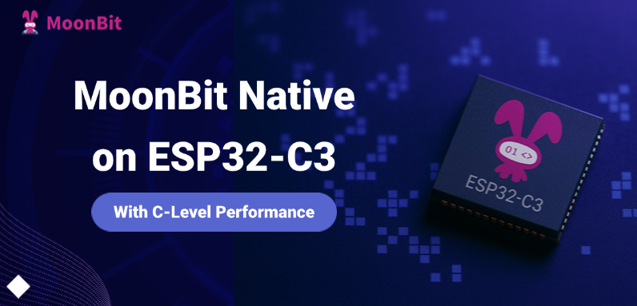

import Video1 from "./video1.mp4"
import Video2 from "./video2.mp4"

# MoonBit Native on ESP32-C3: With C-Level Performance



Previously, in the article  [Running MoonBit Games on Real Hardware with WASM-4](https://www.moonbitlang.com/blog/wasm4-hardware)"," we demonstrated how to successfully run MoonBit-compiled WebAssembly (WASM) programs on physical hardware, exploring MoonBit's potential in the embedded domain.
With the official release of the **MoonBit Native backend** (see: [Introduce MoonBit native, up to 15x faster than Java in numerics!](https://www.moonbitlang.com/blog/native)), **we are no longer restricted to using WebAssembly as an intermediate layer. MoonBit code can now run directly on embedded hardware, eliminating the overhead of virtual machines**. This shift brings significant performance improvements, lower resource consumption, and opens up broader opportunities for MoonBit to integrate deeply with embedded and IoT ecosystems, enabling direct hardware interaction.
In this article, we will showcase an example of running **Conway’s Game of Life** on an **ESP32-C3** microcontroller using the MoonBit Native backend, highlighting the advantages of this new capability.

## Overview of the Project

To demonstrate the advantages of MoonBit Native in embedded development, we implement the classic **Game of Life** on the **Espressif ESP32-C3** chip—or alternatively in the **QEMU** emulator for development convenience.
**Game of Life** is a well-known cellular automaton where the state of each cell in a 2D grid evolves over discrete time steps based on simple rules considering its eight neighboring cells. The basic rules are:

- A live cell dies if it has fewer than 2 or more than 3 live neighbors.
- A dead cell becomes alive if it has exactly 3 live neighbors.

The **ESP32-C3** is a popular low-cost, low-power RISC-V microcontroller with relatively limited resources. Due to its computational and memory access demands, Game of Life serves as an excellent benchmark for evaluating embedded system performance and programming language efficiency.
Our objective is to implement the core logic of Game of Life in MoonBit, and display the results on:

- A real ESP32-C3 board connected to an ST7789 LCD, or
- A virtual LCD through QEMU for easier development and verification

## Prerequisites

Before proceeding, ensure that your system has the [Espressif IoT Development Framework (ESP-IDF)](https://docs.espressif.com/projects/esp-idf/en/v5.4.1/esp32/get-started/index.html#installation)  installed. This guide assumes ESP-IDF version **v5.4.1**.
For those intending to use QEMU simulation, please refer to Espressif's documentation on setting up the [QEMU emulator](https://docs.espressif.com/projects/esp-idf/en/v5.4.1/esp32c3/api-guides/tools/qemu.html)  .
We will generate C code using the MoonBit Native backend and utilize the [moonbit-esp32](https://mooncakes.io/docs/moonbitlang/esp32) package to package MoonBit projects into static libraries that integrate with standard ESP-IDF projects.
The `moonbit-esp32` package plays a critical role, especially its`components`directory, which acts as a bridge between MoonBit and ESP-IDF components. It provides safe and ergonomic bindings for hardware peripherals and system services, including:

- `gpio` (General Purpose I/O),
- `spi` (Serial Peripheral Interface),
- `lcd` (LCD control with general interfaces and specific drivers like ST7789),
- `task` (FreeRTOS task management),
- `qemu_lcd` (LCD interface for QEMU environments).
Each module wraps the corresponding ESP-IDF C APIs into a type-safe, MoonBit-idiomatic interface, allowing embedded development while benefiting from MoonBit's modern language features.
The full source code for this project can be found in the [moonbit-esp32-example GitHub repository](https://github.com/moonbit-community/moonbit-esp32-example) under the game-of-life directory.

*Note: The development and testing process described in this article has been verified only on macOS. Users on other operating systems may need to make appropriate adjustments based on their specific platform.*

## Implementing Game of Life

The relevant code is located in the `game.mbt` file.
We first define `DEAD` as `0` and `ALIVE` as `-1` of type Int16. This choice of `-1` for `ALIVE` instead of `1` is a deliberate optimization: in the RGB565 color format, `0x0000` represents black and `0xFFFF` (i.e., `-1`) represents white. This mapping allows the game state data to be passed directly to the LCD without requiring additional color conversion.
The grid dimensions are defined by `ROWS` and `COLS`, both set to 240.
The current state of the entire grid is stored in a one-dimensional global `FixedArray` named `cells`. `FixedArray` is a fixed-size array occupying approximately **112.5KB** of memory (240 × 240 × 2 bytes). Given that the ESP32-C3 provides around **320KB** of RAM—which is not necessarily contiguous—we avoid allocating a full copy of the next-generation state. Instead, we define a **3-row rolling** buffer named `next`, consuming roughly **1.4KB** of memory. This buffer is reused across iterations using modulo arithmetic, and we employ a **deferred write-back** strategy to update completed rows in `cells`, reducing peak memory usage.

```moonbit
const DEAD : Int16 = 0
const ALIVE : Int16 = -1

pub const ROWS : Int = 240
pub const COLS : Int = 240

let cells : FixedArray[Int16] = FixedArray::make(ROWS * COLS, 0)
let next : FixedArray[Int16] = FixedArray::make(3 * COLS, 0)

```

The core code for computing the next state is as follows:

```jsx
let live_neighbors = live_neighbor_count(row, col)
let next_cell = match (cell, live_neighbors) {
  (ALIVE, _..<2) => DEAD  // Precisely match the case where live neighbors are fewer than 2
  (ALIVE, 2 | 3) => ALIVE // Use the 'or' pattern to handle both 2 and 3 neighbors in one branch
  (ALIVE, 3..<_) => DEAD  // Match the case where live neighbors are greater than 3 using a range
  (DEAD, 3) => ALIVE
  (otherwise, _) => otherwise // All cases must be covered; the compiler performs exhaustiveness checking
}

```

This logic is the core of the Game of Life rule implementation and fully demonstrates the **power and elegance of MoonBit’s pattern matching**. The game rules are mapped almost verbatim into a match statement, making the code clear, intuitive, and less error-prone.
Additionally, MoonBit provides **unsafe operations** on arrays for performance-critical paths. This eliminates the overhead of bounds checking, a common optimization technique in embedded development aimed at maximizing performance. However, it requires the developer to carefully ensure correctness.

Finally, we compare the QEMU (simulated) version and the ST7789 (hardware) version of the main.mbt file.
The logic for the QEMU virtual LCD panel is located at game-of-life/qemu/src/main/main.mbt. A key code snippet is shown below:

```moonbit
let panel = @qemu_lcd.esp_lcd_new_rgb_qemu(@game.COLS, @game.ROWS, BPP_16)
  ..reset!()
  ..initialize!()
@game.init_universe()
for i = 0; ; i = i + 1 {
  let start = esp_timer_get_time()
  panel.draw_bitmap!(0, 0, @game.ROWS, @game.COLS, cast(@game.get_cells()))
  @game.tick()
  let end = esp_timer_get_time()
  println("tick \\{i} took \\{end - start} us")
}

```

This code leverages the **MoonBit ESP32** binding to initialize a **virtual LCD panel for QEMU simulation**, followed by a reset and initialization sequence.
Notably, the MoonBit code utilizes both the **cascade operator** (`..`) and the error propagation operator (`!`).
First, the `panel` object is created. Then,`..reset!()` invokes the `reset` method on `panel` using the cascade operator. Since reset may return an error, the trailing ! ensures that:

- if the operation succeeds, execution continues;
- if it fails, the error is **immediately propagated**, halting further execution.
Likewise, `..initialize!()` is only executed if `reset!()` succeeds, and it also automatically propagates any error it may encounter.
This combination allows for chaining multiple potentially fallible operations on the same object in a way that is both **concise** (no need to repeatedly reference `panel`) and **safe** (with automatic error handling).

After initialization, the Game of Life universe is set up. The code then enters an infinite loop: in each iteration, it renders the current game state to the virtual LCD, computes the next generation, and logs the time taken for each rendering and update cycle.

The logic for interfacing with the **ST7789 LCD** is located in `game-of-life/st7789/src/main/main.mbt.` A representative code snippet is as follows:

```moonbit
let spi_config : @spi.SPI_BUS_CONFIG = { ... }
@spi.spi_bus_initialize(@spi.SPI2_HOST, spi_config, SPI_DMA_CH_AUTO) |> ignore

...

let panel = @lcd.esp_lcd_new_panel_st7789(
    io_handle~,
    reset_gpio_num=PIN_RST,
    rgb_ele_order=@lcd.BGR,
    bits_per_pixel=16,
  )
  ..reset!()
  ..initialize!()
  ..config!(on_off=true, sleep=false, invert_color=true)
@game.init_universe()
for i = 0; ; i = i + 1 {
  let start = esp_timer_get_time()
  panel.draw_bitmap!(0, 0, @game.ROWS, @game.COLS, cast(@game.get_cells()))
  @game.tick()
  let end = esp_timer_get_time()
  println("tick \\{i} took \\{end - start} us")
}

```

This code begins by defining constants for the **GPIO pins** required to interface with the physical **ST7789 LCD** and the **SPI clock frequency.**
It then performs a series of hardware initialization steps:

- Configures and initializes the **SPI bus.**
- Creates an **LCD I/O** handle using the SPI interface.
- Initializes the ST7789 panel using a dedicated driver, specifying display parameters such as reset pin, color order, and bits per pixel.
- Executes a sequence of **panel control commands**: reset, init, turn display on, exit sleep mode, and invert colors.
After hardware setup is complete, the Game of Life universe is initialized via `@game.init_universe().`
The program then enters an infinite loop, were:
- The current game state is rendered to the **physical LCD screen**.
- The game state is updated to the next generation using `@game.tick().`
- Optionally, performance metrics such as frame update time can be logged.

Additionally, readers may notice that **MoonBit supports named (tagged) parameters.**
For example, in the call to `esp_lcd_new_panel_st7789` (e.g., `reset_gpio_num=PIN_RST, rgb_ele_order=...`) and in the subsequent chained call like `..config!(on_off=true, ...)`, values are explicitly associated with their corresponding parameter names.
This approach significantly enhances **code readability and self-documentation**, making the purpose of each argument immediately clear—while also eliminating the need to worry about the order of parameters.
We can observe that the core computation (`@game.tick()`) and the loop structure remain identical between the QEMU and ST7789 versions.
The key difference lies in the **display interaction layer**:

- The **ST7789 version** requires low-level hardware configuration, including GPIO definitions, SPI bus setup, and driver-specific initialization routines.
- In contrast, the **QEMU version** interacts directly with a simulated LCD interface provided by the emulator, making the initialization process significantly simpler.

## Running the Example

You can try it yourself by cloning the example repository:

```bash
git clone <https://github.com/moonbit-community/moonbit-esp32-example.git>

```

1. QEMU Version
To allow readers to reproduce the project without physical hardware, we provide a **QEMU-compatible version**, located in the `game-of-life/qemu` directory.
Once your environment is properly set up, simply run the following commands to see it in action:
The simulation runs at approximately **33.1 FPS**, or **around 30.2 ms per frame**.
You should then see the simulation running as shown below:

```
cd game-of-life/qemu
moon install
make set-target esp32c3
make update-deps
make build
make qemu
```

<video autoPlay loop muted playsInline src={Video1} style={{width: '100%'}}></video>

In addition, we provide a C implementation of the project located in the `game-of-life/qemu-c` directory.
Testing shows that the **per-frame computation time** of the C version is approximately the same as the MoonBit version, both averaging around **30.1 ms.**

1. ST7789 Version
This version runs on a real **ESP32-C3 development board** connected to an **ST7789 LCD panel**.
In real hardware tests, the system achieves approximately **27.2 FPS**, or **36.7 milliseconds per frame**, delivering smooth visual performance on resource-constrained embedded devices.

```
cd game-of-life/st7789
moon install
make set-target esp32c3
make build
make flash monitor
```

<video autoPlay loop muted playsInline src={Video2} style={{width: '100%'}}></video>

In addition, we provide a reference implementation written in C, located in the game-of-life/st7789-c directory.
Benchmark results show that the **per-frame computation time** of the C version is nearly identical to that of the MoonBit implementation, averaging around **36.4 ms** per frame.
For details on the benchmarking methodology, please refer to: [link](https://github.com/moonbit-community/moonbit-esp32-example/tree/main/game-of-life/bench)

## Conclusion

By running Game of Life on the ESP32-C3, we have demonstrated the application of **MoonBit's Native backend** in embedded development.
Thanks to targeted optimizations, the MoonBit implementation of the Game of Life achieves performance **comparable to C**, while maintaining significantly improved code readability.
Additionally, MoonBit’s modern language features—such as **pattern matching**—greatly enhance the developer experience by making the codebase more expressive and less error-prone.
Combined with its seamless integration into ecosystems like **ESP-IDF**, MoonBit offers an efficient solution that **bridges native execution performance with a modern, ergonomic programming model**, making it a powerful option for ESP32-based embedded development.

**New to MoonBit?**

- [Download MoonBit](https://aka.moonbitlang.com/vsh).
- Explore [MoonBit Beginner's Guide](https://docs.moonbitlang.com/en/latest/tutorial/tour.html).
- Play with [MoonBit Language Tour](https://tour.moonbitlang.com/).
- Check out [MoonBit Docs](https://docs.moonbitlang.com/en/latest/index.html).
- Join our [Discord](https://discord.gg/5d46MfXkfZ) community.
