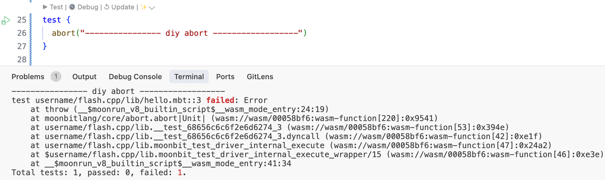
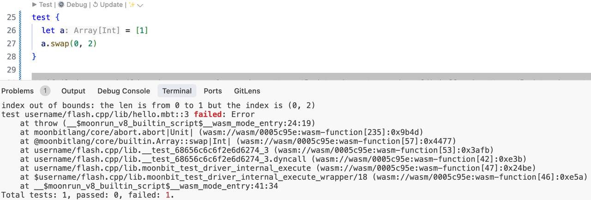

# Introducing virtual package in MoonBit


MoonBit recently introduced a new feature: virtual package. By declaring a package as a virtual package and defining a set of interfaces (via .`mbti` files), users can choose which implementation to use. If no implementation is specified, the default implementation of the virtual package is used. **This feature provides significant flexibility in separating interfaces from implementations.** *Note: This feature is currently in an experimental state.*

## Usage

Taking the [virtual_pkg_demo](https://github.com/moonbit-community/examples/tree/main/virtual_pkg_demo)   as an example, the project structure is as follows:

```
.
├── virtual // Declared as a virtual package, with virtual.mbti defining a set of interfaces
├── impl    // Provides a custom implementation for the interfaces in the virtual package
├── lib     // Depends on the interfaces in the virtual package
└── main    // Depends on the lib package, overrides the virtual package's default implementation with the impl package
```

- **Declaring a Virtual Package**: In the `moon.pkg.json` file of the `virtual` package, use the following field to declare it as a virtual package. The package must include a `.mbti` file, or an error will be reported. If `"has-default"` is set to `true`, the compiled artifacts of the default implementation will be built and linked when the package is not overridden.

    ```json
    "virtual": {
        "has-default": true
    }
    ```

- **Providing a Custom Implementation for a Virtual Package**: In the `moon.pkg.json` file of the `impl` package, set the `"implement"` field to the full package name of the virtual package. The implementation must fully satisfy the interfaces defined in the `.mbti` file of the virtual package.

    ```json
    "implement": "username/hello/virtual"
    ```

- Using a Virtual Package: In the `moon.pkg.json` file of the`lib` package, add the virtual package in the `"import"` field.
- Overriding a Virtual Package: In the `moon.pkg.json` file of the `main` package, specify the implementation package in the `"overrides"` field. If no implementation is specified and the virtual package has a default implementation, the default is used. If there is no default implementation, an error is reported.

    ```json
    {
      "is-main": true,
      "import": [
        "username/hello/lib"
      ],
      "overrides": [
        "username/hello/impl"
      ]
    }
    ```


## Specific Example

The following example illustrates the use of virtual packages in `moonbitlang/core`. The `moonbitlang/core/abort package` is defined as a virtual package. The relevant code is as follows:

- **abort.mbti**: Declares the APIs exposed by this package.

    ```
    package "moonbitlang/core/abort"

    // Values
    fn abort[T](String) -> T

    // Types and methods

    // Type aliases

    // Traits
    ```

- **abort.mbt**: Provides the default implementation for the `fn abort[T](String) -> T` API.

    ```
    pub fn abort[T](msg : String) -> T {
      let _ = msg
      panic_impl()
    }

    ///|
    fn panic_impl[T]() -> T = "%panic"
    ```


In the current default implementation, the `msg` parameter is intentionally ignored. This is because using `println(msg)` would make the generated `.wasm` file depend on the `spectest::print_char` function defined in the `moonrun` runtime. If a WebAssembly runtime other than `moonrun` (e.g., Wasmtime, Wasmer) is used, it would result in an error:

```
error: Unable to instantiate the WebAssembly module
╰─▶ 1: Error while importing "spectest"."print_char": unknown import. Expected Function(FunctionType { params: [I32], results: [] })
```

### Customizing the Implementation of moonbitlang/core/abort

The `abort(msg)` interface is used in many built-in data structures. When certain invariants are not met, it causes a runtime failure. However, with the current default implementation, the `msg` in `abort` is not output, making it difficult for users to identify the cause of the error. To address this, we can provide a custom implementation of `abort` that prints the `msg` (provided you are not using a WebAssembly runtime other than `moonrun`). The steps are as follows:
First, run `moon add moonbitlang/dummy_abort`, then add the following field to `moon.pkg.json`:

```json
"overrides": [
    // This package provides a custom implementation for the moonbitlang/core/abort virtual package
    "moonbitlang/dummy_abort/abort_show_msg"
]
```

Testing the behavior of `abort` now shows that the passed parameter is indeed printed.



Intentionally misusing `swap`on an array results in the following error message:



In the future, the MoonBit community plans to provide libraries compliant with the WASI standard to implement `println`. This will allow compiled `.wasm` files to run on WebAssembly runtimes that support this standard. Stay tuned!

**New to MoonBit?**

- [Download MoonBit](https://aka.moonbitlang.com/vsh).
- Explore [MoonBit Beginner's Guide](https://docs.moonbitlang.com/en/latest/tutorial/tour.html).
- Play with [MoonBit Language Tour](https://tour.moonbitlang.com/).
- Check out [MoonBit Docs](https://docs.moonbitlang.com/en/latest/index.html).
- Join our [Discord](https://discord.gg/5d46MfXkfZ) community.