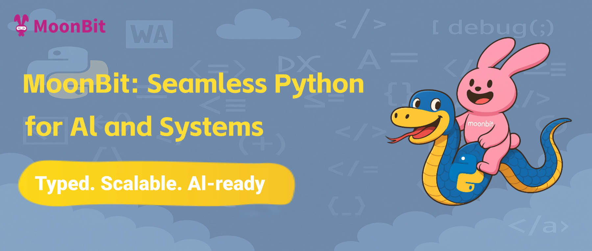

# MoonBit Programming Language: Born for AI and Large Systems, Seamlessly Integrating Python

> **Introduction:** MoonBit offers developers a new path: the ability to achieve a more rigorous, intelligent development experience suitable for large systems and AI programming, without sacrificing the ecological advantages of Python.

For nearly two decades, Python has democratized technology for developers across a vast array of application domains. Behind Python's success lies an economy of application libraries and dependency components, maintained by over ten million developers. Its rich library ecosystem comprehensively covers various development scenarios and industry needs.

However, in the era of artificial intelligence, Python's once "easy to learn and use" nature has become a double-edged sword when facing larger, more complex tasks. Simplicity lowered the development barrier but also led to structural deficiencies in type safety and system scalability. Consequently, there's a pressing industrial need for a new language: one that can both be compatible with Python's established, vast ecosystem and possess modern language features like type safety, static analysis, and high maintainability.

Empowered by the AI toolchain, MoonBit's practical application demonstrates the feasibility of fulfilling these requirements, allowing programming languages to iterate through "ecosystem inheritance" rather than "ecosystem rebuilding."

MoonBit's technical approach offers key insights for the industry:

* **Ecosystem Reuse Model:** By leveraging AI-powered automated encapsulation, MoonBit lowers the barrier for cross-language calls, avoiding reinvention and accelerating technology stack upgrades.
* **Democratization of Static Typing:** Combining a strict type system with AI code generation, MoonBit retains Python's flexibility while compensating for the systemic flaws of dynamic typing, promoting developers' transition to a safer programming paradigm.

## Seamless Integration of the Python Ecosystem

Python is easy to learn, rich in its ecosystem, and suitable for small project development, but it struggles with building complex large-scale systems. In the face of large models, Python's shortcomings become increasingly apparent:

* **Dynamic Typing →** When complexity scales up, runtime errors become frequent, lacking compile-time protection.
* **Conservative Syntax →** A lack of modern syntax makes it difficult to clearly express complex and highly abstract logic.
* **Unfriendly to AI Programming →** AI programming relies on static type systems and clear, analyzable error messages to support high-quality code generation and automatic repair. However, Python has significant deficiencies in static analysis capabilities and error prompts. Its error messages are often fragmented and unstructured, making it difficult to form effective contextual reasoning. This limits AI's participation in large projects and reduces the accuracy of automated debugging and repair.

Programming languages like Rust, C++, OCaml, and Haskell have all attempted to leverage the rich advantages of Python's ecosystem while shedding its drawbacks.

However, in the era before AI code generation tools, the effort required for subsequent library expansion and development was too great, making comprehensive completion difficult to date. Moreover, these programming languages have steep learning curves, providing little incentive for Python users to switch.

MoonBit draws upon the experience of languages like Rust and C++ in CPython integration and type management. Building on this, it further incorporates its self-developed "moon-agent" intelligent agent framework (set to be publicly launched soon).

Through an AI-driven automatic encapsulation mechanism, MoonBit can batch-generate high-quality bindings for mainstream Python libraries. Once encapsulated, combined with MoonBit's native build system, users can gain a stronger type system, more intelligent IDE support, and more accurate AI code generation capabilities without abandoning their existing Python assets.

> **Note:** The "moon-agent" intelligent agent framework will be publicly launched soon.

## International Recognition

Since open-sourcing its core compiler and releasing the WASM backend at the end of 2023, MoonBit was invited to appear at WASM I/O 2025, becoming the first Chinese developer platform to be featured at this global WebAssembly core conference.

Subsequently, MoonBit also took the stage at the recently concluded LambdaConf 2025, a top international functional programming conference, as the only invited domestic language project. It shared the stage with prominent developer representatives such as Jonathan Blow (author of the Jai programming language) and Li Haoyi (son of former Singapore Prime Minister Lee Hsien Loong and a core contributor to the Scala community). At these two international conferences, MoonBit showcased its progress in language design, asynchronous models, and toolchain construction, representing a new exploration by a Chinese language R&D project in the global evolution of programming languages.

## MoonBit's Advantages

* **AI-Native Design:** MoonBit is designed from the ground up to be highly compatible with AI programming needs. Internal real-world scenario tests have shown "thousands of lines of code running perfectly the first time with zero modifications."
* **Advanced Toolchain, Unified Experience:** From the language itself to inline code validation in documentation, and from the IDE to the build system, MoonBit offers an integrated, modern development experience.
* **Lower Learning Curve, Faster Migration Path:** Compared to languages like Rust and C, MoonBit has a gentler learning curve.

**User Experience for Different Tiers of Users:**

* **For Novice Users:** MoonBit provides a comprehensive type system, static analysis by the compiler, and detailed error messages, helping them write more robust and stable code from the outset.
* **For Advanced Users and Enterprise Users:** MoonBit enables teams to directly use their existing Python assets within MoonBit without rewriting or migrating, allowing them to safely build large-scale systems.
* **For Ecosystem Contributors:** Binding Python libraries is significantly simpler than binding C libraries. It only requires writing MoonBit code and some Python code, without dealing with low-level details like C library linkers, header file locations, or C wrappers.

The following two examples offer an intuitive experience of MoonBit's seamless integration with the Python ecosystem.

### Example 1: Double Pendulum with Turtle Graphics (Encapsulated)

)

This example calls the Python `turtle` library to simulate a physical system, with `Python turtle` being called at the lower level. This MoonBit example is implemented by encapsulating the `Pythonturtle` library. The entire drawing logic is written purely in MoonBit syntax, allowing users to create graphics without touching any Python code. This experience not only inherits the mature capabilities of Python's graphics library but also fully leverages MoonBit compiler's toolchain advantages such as type checking, auto-completion, and error prompts.

From a developer's perspective, although the underlying implementation relies on Python's native Turtle, the encapsulated interface is highly "MoonBit-ized" semantically. Calls are more concise, parameters have clear types and inferability, and the logical structure is more composable and maintainable.

This case fully demonstrates MoonBit's design philosophy for ecosystem integration. Through its self-developed encapsulation and build mechanisms, MoonBit can reuse Python's rich class library resources with minimal cost, avoiding complex operations common when binding C libraries, such as linker configurations, header file paths, and memory model differences. This significantly reduces the technical barrier to cross-language calls.

In short, MoonBit achieves a high-level encapsulation of the Python ecosystem in a way that is oriented towards modern developers, making "using external libraries" no longer a complex task, but a natural extension of "writing MoonBit code."

### Example 2: Alien Game (Direct Python Call)

For instance, directly calling the Pygame Alien game from Python:

This stands in stark contrast to traditional C library binding methods, where developers often face lengthy header files, complex function signatures, inconsistent memory models, and tedious configurations of build systems like CMake and Makefiles. This not only increases the barrier to entry but also significantly raises debugging and deployment costs.

In MoonBit, this process is greatly simplified:

* A single `pyimport` line is all it takes to get a Python library module reference.
* Developers no longer need to worry about cumbersome C/C++ header nesting issues, platform-specific linking differences, or compatibility issues between different project build systems.

The two practical examples above showcase MoonBit's seamless integration capabilities with the Python ecosystem:

* For encapsulating class libraries, MoonBit can highly "MoonBit-ize" graphics libraries like `turtle`, allowing developers to draw almost directly without touching the underlying code.
* For direct calls, MoonBit can also load complete Python modules, such as the Pygame Alien game, supporting the execution of complex logic as-is.

Compared to the extensive engineering configuration and interface docking required for traditional C library bindings, MoonBit's calling of Python modules requires no C header files, no handling of linkers or build systems, resulting in a lighter and more stable development experience.

So, is this "seamless integration" merely a simplification of technical details? By further comparing the code for calling methods in MoonBit and Python, it becomes clear that MoonBit doesn't just "enable" the use of Python libraries; it does so in a more modern way that makes the code cleaner and easier to understand.

## MoonBit vs. Python

### Comparison 1: Friendliness of Error Reporting Mechanisms

In the image, both MoonBit and Python report errors due to incorrect color parameters, but their prompting experiences are vastly different:

MoonBit's compiler identifies the problem during the build stage, directly pinpointing the specific file and line number. The error message is structured and semantically clear, for example: "The 'Greenyellw' constructor does not exist in the Color enum (the correct word is GreenYellow)." Such prompts not only facilitate quick developer localization and modification but also enable IDEs and AI tools to understand the context and generate repair suggestions.

In contrast, Python only reports errors at runtime, outputting a large call stack. The truly useful information is buried within a `ValueError` at the bottom, lacking clear context and actionable advice, which is particularly unfriendly to beginners.

From an underlying mechanism perspective, this is a fundamental difference in error handling between static and dynamic languages: MoonBit can find problems "before running," while Python usually only exposes errors "after running."

Left: MoonBit, Right: Python

### Comparison 2: Type System-Driven IDE Auto-Completion

In Python, parameters like `color='orange'` are passed as strings, completely lacking type constraints. If mistakenly written as `'oragne'`, the program will directly throw a runtime error or exhibit abnormal behavior, and the IDE cannot provide assistance during the editing stage—neither auto-completion nor static checking.

In MoonBit, if the color parameter uses the `@plt.Color` enum type (e.g., `Orange`, `Darkblue`), the IDE can provide candidate options in real-time based on type information. Developers don't need to memorize them or worry about spelling errors. At the same time, the compiler validates the legality of all parameters during the build stage, and errors can be discovered before runtime.

This design not only improves daily development efficiency but also significantly reduces the probability of "micro-errors" when building complex systems or in AI automated code generation scenarios. The type-driven auto-completion and validation mechanism are fundamental to achieving high reliability and intelligent collaborative development.

MoonBit has stronger type restrictions for parameters, and IDE prompts are more user-friendly. Even in documentation, it can still provide prompts and error checking.

## Project Links

* **python.mbt:** [https://github.com/Kaida-Amethyst/python.mbt](https://github.com/Kaida-Amethyst/python.mbt)
* **matplotlib.mbt:** [https://github.com/moonbit-community/matplotlib.mbt](https://github.com/moonbit-community/matplotlib.mbt)
