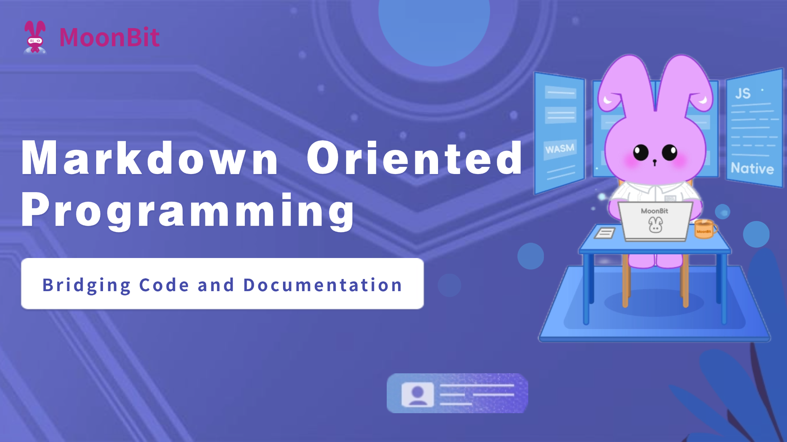
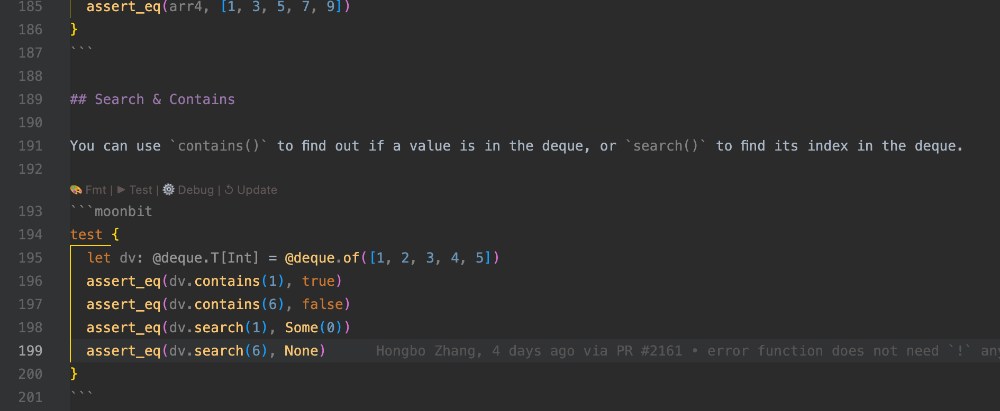
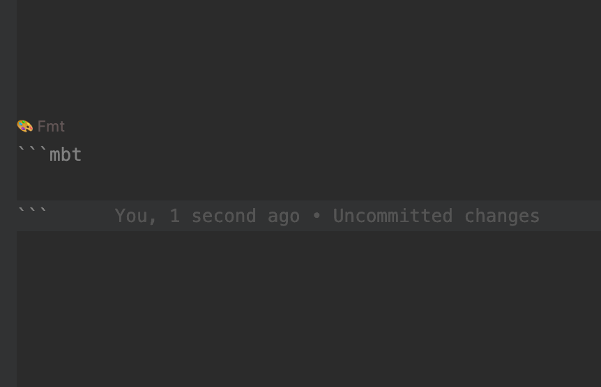
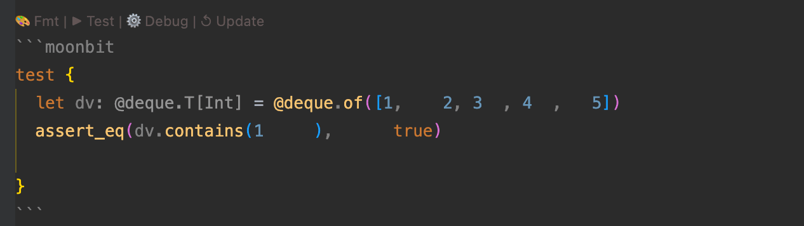
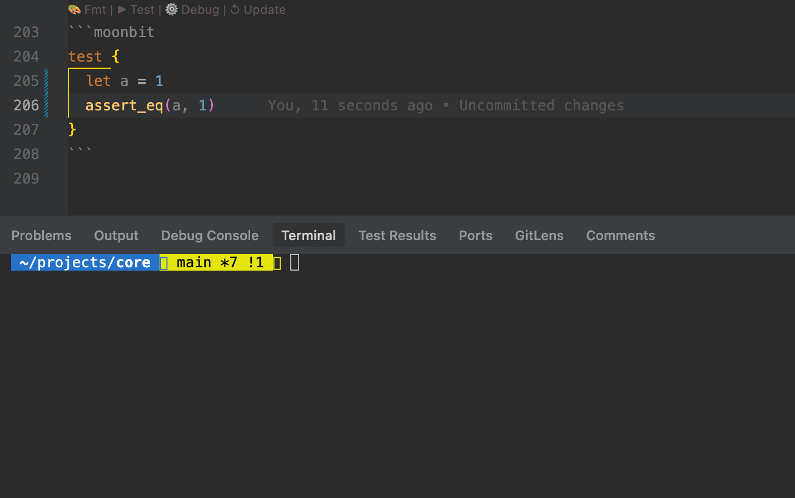
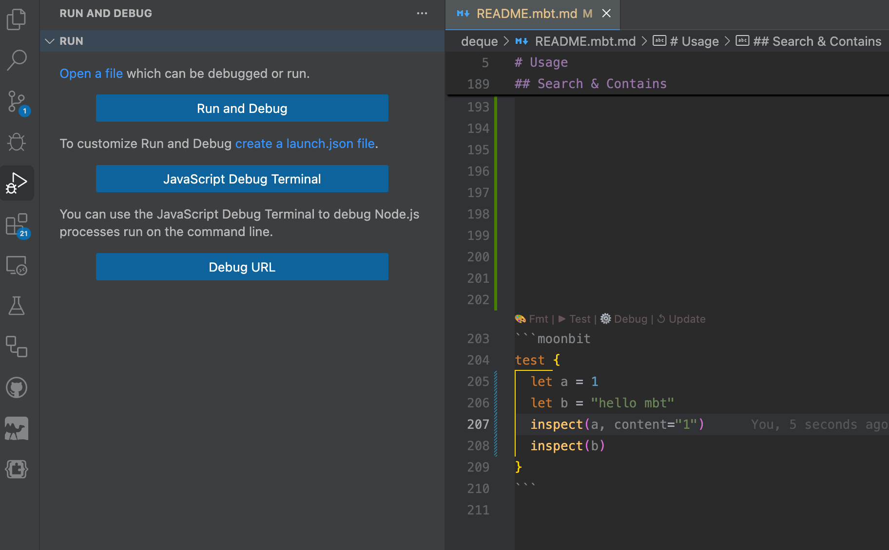
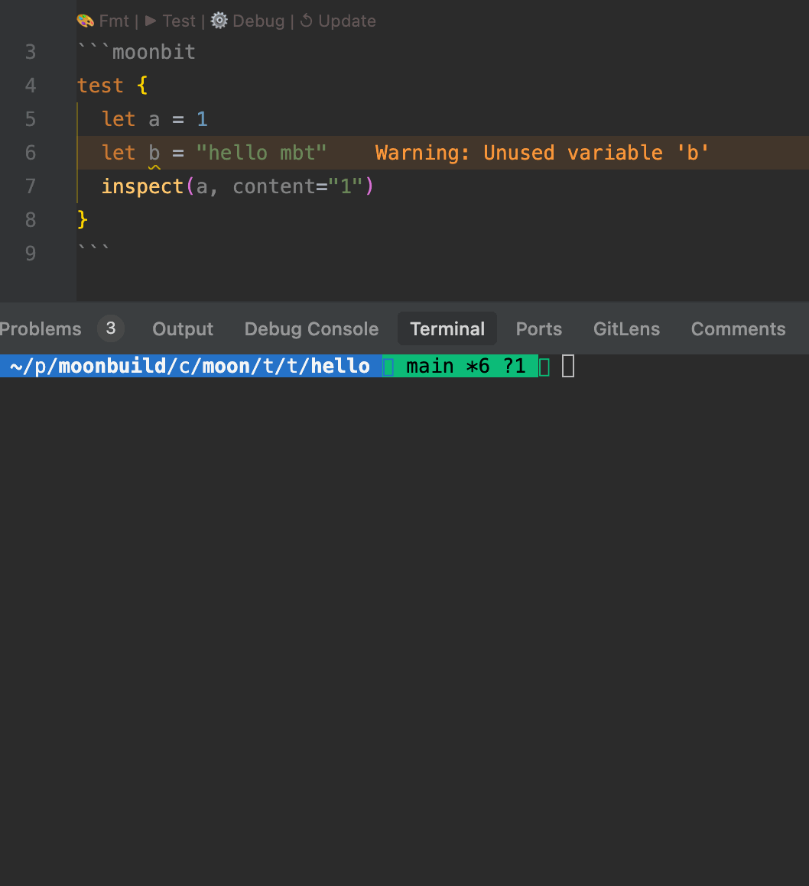
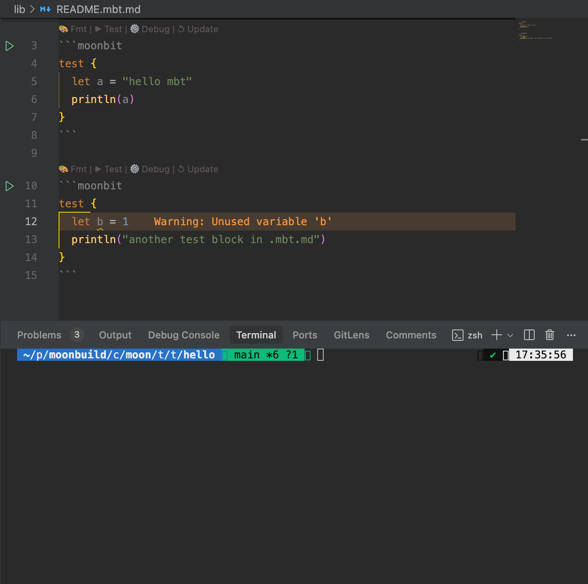

import Video1 from "./video.mp4"

# Markdown-Oriented Programming in MoonBit: Bridging Code and Documentation



MoonBit was built to make development fast and consistent—from compiler to build system to IDE, everything works together. Now it goes one step further: **you can write docs that behave like code**.With Markdown-Oriented Programming, your Markdown files can do more than explain things—they support syntax checking, autocompletion, formatting, testing, and even debugging.No more “docs over here, code over there.” Everything lives in the same workflow.
## Going Beyond Traditional Documentation
MoonBit's markdown-oriented programming approach steps beyond the conventional practice of embedding documentation directly in code comments. While comments are fine for quick notes, they’re not enough for in-depth usage explanations or runnable examples.

Languages like Rust have started to embed code in documentation, with syntax highlighting and test support. MoonBit takes this idea a step further: any code block inside Markdown documents (.mbt.md files) is treated just like regular MoonBit source code. These code blocks get compiled, analyzed, formatted, and tested, receiving full toolchain support. Essentially, we're making the saying **"Documentation is code, and code is documentation"** a reality
## Getting Started with `.mbt.md` Files
To use this feature, simply create a Markdown document within a MoonBit package and name it with the `.mbt.md`extension. This signals the MoonBit toolchain to treat the file as a documentation-enabled source unit.

Within `.mbt.md` files, any code block declared with```` ```mbt```` or ```` ```moonbit```` will be parsed and processed by the compiler just like regular `.mbt` source code.



These blocks benefit from the same development support, including but not limited to:
- **Syntax highlighting** – improves readability through native language coloring
- **Go to definition** – allows symbol navigation within the IDE
- **Code completion** – provides type-aware suggestions as you type
- **Real-time diagnostics** – displays inline errors and warnings in the editor
- **Auto-formatting** – ensures consistent code style with a single action
- **Test execution** – allows embedded code blocks to be executed as tests
- **Debugging support** – enables stepping through code directly in documentation

This makes it possible to write documentation that is not only explanatory, but also **type-safe, testable, and verifiable** within the same workflow as your application code.

## Built-In IDE Support for `.mbt.md`
MoonBit’s VS Code extension has first-class support for `.mbt.md` files, making it easy to write and maintain documentation that actually behaves like code. Here’s what you get out of the box:
1. Convenient Code Block Insertion：
  - The MoonBit IDE offers predefined code snippets. By typing `mbt` in a `.mbt.md` file and triggering autocomplete, a ```` ```mbt```` code block will be automatically inserted, streamlining the writing process.
  

2. Automated Formatting
  - Each MoonBit code block includes a CodeLens action (e.g., `Fmt`) displayed above the block. Clicking it formats the code block in one step, ensuring consistent and clean code style throughout the document.
  
3. Test Execution and Debugging：
  - `.mbt.md` files support **test blocks** that can be executed using the `moon test` command, or directly via the `Test` CodeLens action above the block.
  
- Debugging is supported: developers can set breakpoints directly within .mbt.md files and step through logic in real time.

    
 MoonBit provides **out-of-the-box native support** for `.mbt.md` files. Code written in these documentation files is treated the same as regular MoonBit source code. Internally, these blocks are handled as **black-box tests**, which means developers can reference public definitions from the current package using expressions like `@pkg.xxx`, just as they would in conventional test files.

## Toolchain Integration
MoonBit’s build system (`moon`) provides comprehensive support for `.mbt.md` files, seamlessly integrating them with standard `.mbt` source files.
- Static Analysis:：
  - When running `moon check`, the toolchain automatically analyzes MoonBit code blocks within `.mbt.md` files, reporting warnings and errors in the console.
  - The IDE also provides real-time diagnostics for type errors, undefined symbols, and other issues to ensure the correctness of documentation code.
  
- Test Execution:
  - When executing the `moon test`, the toolchain automatically runs test blocks defined in `.mbt.md` files, alongside standard test files such as `_wbtest.mbt` and `_test.mbt`.
  - Test results are consolidated and displayed uniformly, making it easy for developers to validate that documentation examples remain functional and up to date.
   
- Build Integration:
  - Code blocks within `.mbt.md` files are treated as **black-box tests** and are fully integrated into the build process. This ensures that documentation remains consistent with the corresponding source code.
- Single File Support:
  - You can run tests in a standalone `.mbt.md` file using the command:
`moon test /path/to/xxx.mbt.md`
  - If the `.mbt.md` file resides within a package, simply run `moon test` from the root of the project to automatically detect and execute the test blocks within that documentation file.Moreover, even standalone `.mbt.md` files can declare and use third-party dependencies via a header section at the top of the file, offering great flexibility when authoring documentation.
    ````yaml
    ---
    moonbit:
      deps:
        moonbitlang/x: 0.4.23 // third-party deps
      backend:
        js                    // setting backend
    ---

    ```moonbit
    test {
        let single_mbt_md = 1
        let path = "1.txt"
        let content = "Hello, MoonBit"
        @fs.write_string_to_file!(path, content)  // using `fs` pkg in `moonbitlang/x`
        let res = @fs.read_file_to_string!(path)
        inspect!(res, content=content)
        inspect!(234523)
        println("222")
    }
    ```
    ````
## Writing Technical Blogs with `.mbt.md`
  With `.mbt.md` files, developers can write technical blogs in standard Markdown format while embedding **runnable MoonBit code blocks**—all with full support from the MoonBit IDE and toolchain. This enables a blog writing experience that is directly aligned with development workflows. Key benefits include:
  - **Real-Time Validation**:
 Code blocks are automatically checked by the MoonBit toolchain. Typos and logic errors are highlighted immediately, helping ensure that published blogs don’t contain broken or invalid code.
  - **Consistent Authoring Experience**:
 While writing, developers benefit from the same IDE features as regular code files—syntax highlighting, autocompletion, go-to-definition, and more.
  - **Executable Examples**:
 Readers can copy and run the examples directly, or reproduce them by referencing the original .mbt.md file in a MoonBit project.

This approach is particularly well-suited for writing **tutorials, API references, or technical deep dives**. Many modern static site generators support rendering Markdown files into clean and readable web pages.

The following example demonstrates how to integrate `.mbt.md` files into a blog built with the Hexo framework.

<video autoPlay loop muted playsInline src={Video1} style={{width: '100%'}}></video>

## Ensuring Documentation Accuracy Through CI
For engineering teams, the core concern is not just whether documentation is well-written, but whether it can be integrated into the actual development workflow—evolving alongside the codebase, rather than becoming a one-off resource that is quickly forgotten.

In traditional projects, documentation often lags behind code changes. Examples become outdated, APIs shift, and maintenance is neglected. To address this, MoonBit introduces the `.mbt.md` file format, allowing documentation code blocks to be seamlessly integrated into the **continuous integration (CI)** process for automated validation.

Specifically, documentation code is not only executable, but also subject to compilation checks and test execution during each commit or build. This ensures that documentation remains correct and synchronized with the source code.

This mechanism is already in active use. For example, in the `moonbitlang/core` project, every package uses `.mbt.md`for its README. Code examples within these documents are compiled, executed, and verified as part of each CI run.

If an API change causes a documentation test to fail, CI will immediately report the issue—prompting developers to either fix the underlying implementation or update the documentation accordingly. This effectively eliminates the common problem of “documentation falling out of sync with code.”

## Summary
MoonBit’s markdown-oriented programming redefines the relationship between documentation and code by turning Markdown files into executable, verifiable development artifacts through the .mbt.md format.

With native IDE support, static analysis from the toolchain, and CI-based validation, developers can enjoy a consistent, code-like experience when writing technical blogs, API references, or tutorials.

This approach delivers a level of documentation integration rarely seen in other languages—making it easier to keep examples accurate, runnable, and in sync with actual code.
Explore MoonBit’s .mbt.md format and experience a seamless fusion of documentation and development.