import Codex from './codex-output.mp4'
import Cursor from './cursor-output.mp4'
import MoonbitFix from './moonbit-fix-output.mp4'


# Introducing MoonBit Pilot: The Code Agent dedicated to the MoonBit toolchain

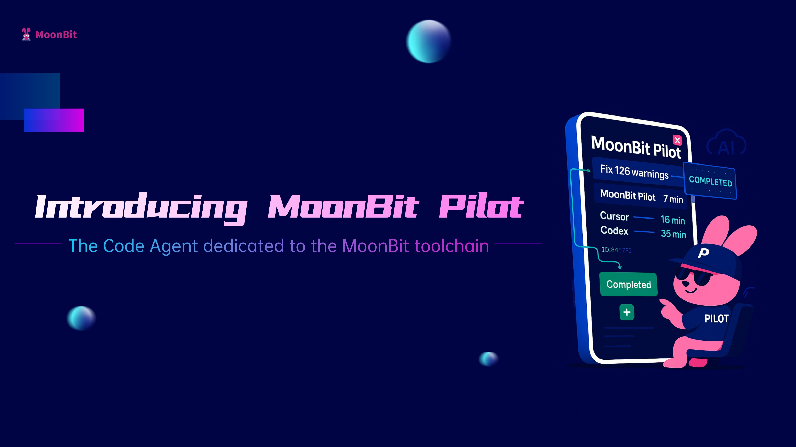

We are excited to announce **MoonBit Pilot** — an AI-native developer toolchain built directly into the MoonBit language, designed from the ground up to work seamlessly with large language models.

Unlike traditional coding assistants that sit on top of pre-AI developer tools, MoonBit Pilot is part of the language itself, with native support across the entire workflow: language design, compiler, debugger, and package management.
With LLMs integrated into every stage, MoonBit Pilot can automatically generate complete libraries with **structured docs** and **robust tests**, and **handle large-scale refactoring** that passes CI without manual edits.

It’s a first-class feature of MoonBit — just like `moon build` or `moon check` — so you can start writing and evolving programs with a single command.
```mbt
moon pilot
```
Let’s walk through a few real-world examples — starting with one-click library generation — to see what MoonBit Pilot can do.
## Zero-Intervention High-Quality Library Synthesis
As a demo of MoonBit Pilot’s software synthesis capabilities, we generated a complete TOML parser in one go.

*TOML is a configuration file format designed to be easy to read and write, while clearly expressing nested data structures. It’s widely used for project configuration, especially in the Rust ecosystem.*

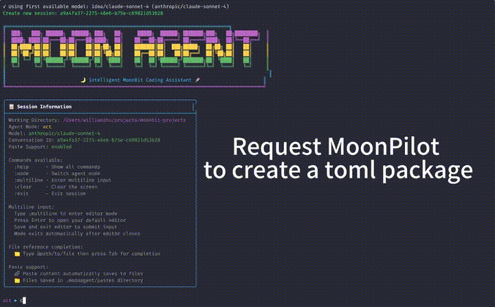

The model didn’t produce the correct output on its first attempt due to the lack of MoonBit-specific training data. By automatically invoking MoonBit’s self-developed toolchain and receiving precise feedback, it repaired and optimized the code without any human intervention — producing the correct result with effective tests in about **six minutes**

 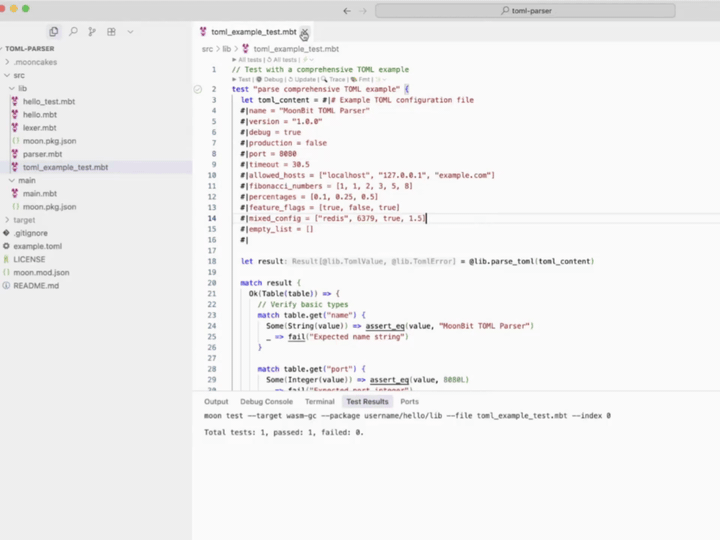.

Beyond TOML, MoonBit Pilot has also synthesized other libraries—such as an [ini-parser](https://github.com/bobzhang/ini-parser)and [lisp](https://github.com/bobzhang/lisp-machine-MoonPilot) interpreter—entirely without human input. These libraries will also be used as training data for the next generation of base models, further enhancing MoonBit Pilot’s software synthesis capabilities.

## Large-Scale Code Refactoring to Improve Code Quality

A common issue with AI-generated code is poor maintainability. One of the most reliable ways to address this is through safe, automated refactoring. In day-to-day development, large-scale API migrations are common, and many of them are repetitive enough to be handled entirely by an AI agent.
As an example, we renamed the `Array::length()` method in the Core standard library to `Array::len()`.
```mbt
can you add 'Array::len' which is the duplicate of 'Array::length' and deprecate the latter
```

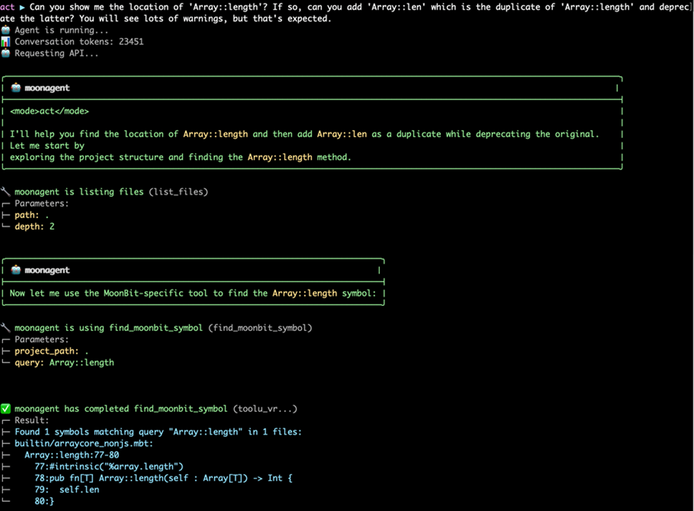

As shown, MoonBit Pilot can complete the task correctly in a very short time.
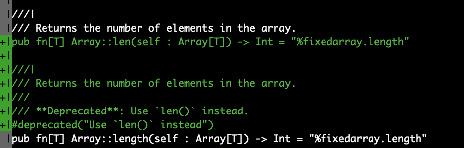


Unlike agents that depend on `grep` or other regex-based searches—which can be slow, inaccurate, and quickly fill the context window—MoonBit Pilot uses a native semantic search. This makes it possible to jump to a definition with a single command.

This not only improves the workflow but also reduces token usage, which in turn lowers inference costs—an uncommon but practical benefit for coding agent systems.

After the API changes, the frequent use of `length` across the codebase generated a large number of warnings. Here’s how MoonBit Pilot handles fixing them.
### Segmented Modification for Fast, Highly-Concurrent Refactoring

Traditional agents handle this kind of refactoring slowly. They often need to repeatedly query the build system for warnings and then call the LLM in a strict sequence—one warning at a time. Each call can take several seconds to half a minute, so a complete run may take tens of minutes.

They also tend to process warnings in an unstructured way, which leads to redundant and noisy context building up, making it harder for the model to make accurate decisions and slowing execution.

MoonBit Pilot uses its **Sub-Agent architecture** together with MoonBit’s native code segmentation to avoid conflicts and isolation issues when running fixes in parallel. This ensures that concurrent changes stay reliable and consistent.

With MoonBit Pilot, a single prompt can kick off an optimized Concurrent code-fixing workflow—covering not just the code but also related documentation updates.

The video below shows a real-world refactoring demo, where MoonBit Pilot completed **126 fixes** in just **~7 minutes** with **zero human intervention**.

<video controls src={MoonbitFix} style={{width: '100%', marginBottom: '1rem'}}></video>

### Benchmark: Faster and More Reliable Than Cursor and Codex
MoonBit Pilot’s performance sets a strong benchmark for large-scale automated refactoring.
 To put these results into perspective, we ran the exact same task—same model, same prompt—on other leading code assistants, including **Cursor** and **Codex**.

**Codex CLI** took **35 minutes** to complete only part of the fixes, requiring additional manual prompts mid-process to continue the task.

<video controls src={Codex} style={{width: '100%', marginBottom: '1rem'}}></video>

**Cursor**, under the same prompt, also ran its warning-fix tasks in a **serial** manner. After about **16 minutes**, the process hit the maximum tool invocation limit and was forced to stop — with unresolved warnings still remaining.

<video controls src={Cursor} style={{width: '100%', marginBottom: '1rem'}}></video>

Notably, while most Agent–language toolchain combinations can only handle code fixes, MoonBit Pilot goes a step further: thanks to MoonBit’s built-in support for the **Markdown-based `.mbt.md` format**, it can also ensure the correctness of embedded code within documentation files.

## Cloud-Asynchronous Programming, Zero Human Intervention
MoonBit Pilot’s faster completion times aren’t just about better prompt handling — they’re the result of a fundamentally different architecture.

Most mainstream code assistants — such as Cursor and Codex — still run as local IDE plugins, tightly coupled to environments like VSCode. They require frequent user interaction and are limited by the resources of the user’s machine, making it difficult to support true high-concurrency, multi-task automation. As a result, they remain “enhanced assistants” rather than fully managed programming solutions.

MoonBit Pilot introduces a different paradigm: it is the first natively integrated code agent to enable **asynchronous cloud execution**. Powered by a custom-built **Agent Server Protocol (ASP)**, MoonBit Pilot can operate entirely outside the GUI environment, running multiple agent tasks concurrently in the cloud while maintaining strong alignment with the user’s intent. Developers no longer need to approve every completion or click through each suggestion — simply set the task goal, and the system will asynchronously handle fixes, optimizations, and code generation in the background.

Here’s an example using the **web version** of MoonBit Pilot to automatically fix warnings in a real MoonBit project: [cmark.mbt](https://github.com/moonbit-community/cmark.mbt).

From the task overview, click **New Task** to create a job, specify the target repository, and provide a prompt describing the goal — in this case: *fix all warnings in the project*.

  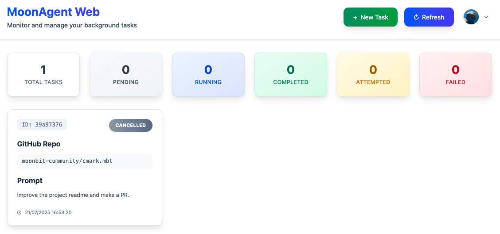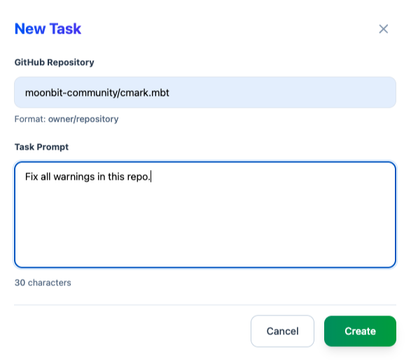

After a short while, the task status changes to **Completed**.

  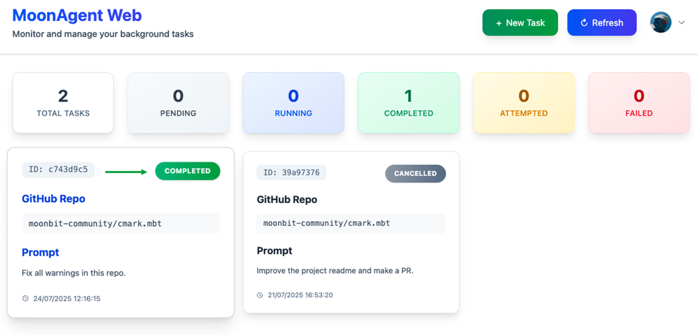

  Click on the task card to see details like execution time, conversation history, and console output.

  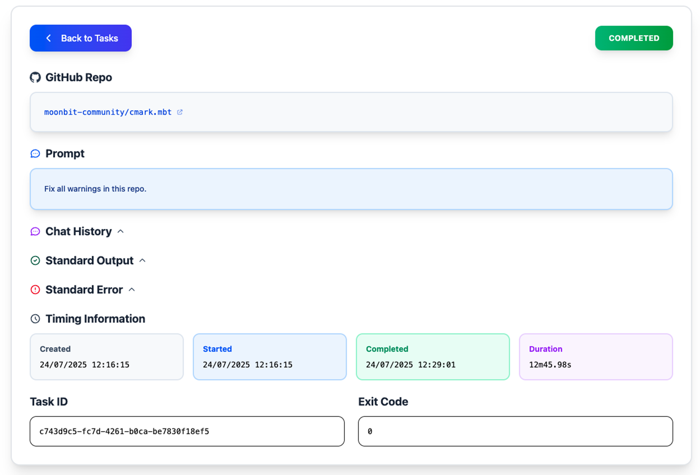

  At the end of the conversation log, you’ll find that MoonBit Pilot has automatically created a GitHub Pull Request for the applied fixes.

  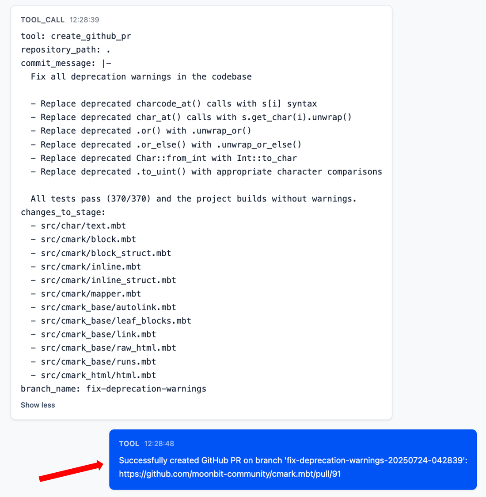

  The Pull Request comes with a full description and changes, has passed all CI checks, and is ready for direct merge.

  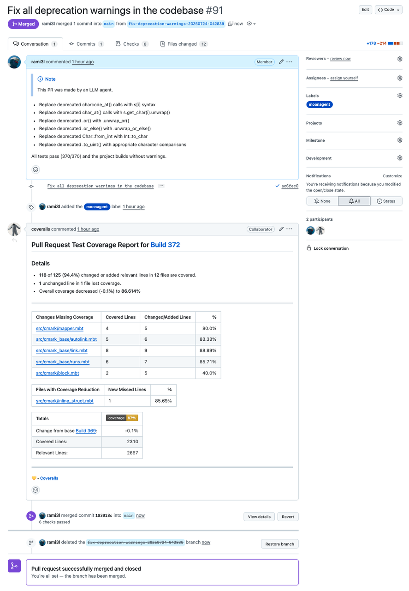

  Cloud web version available **by invitation**. Request access via email: `jichuruanjian@idea.edu.cn` (please include your GitHub ID).

  ## Quick start
1) Install the MoonBit CLI (skip if already installed). See the latest instructions on the official site: [MoonBit CLI tools](https://www.moonbitlang.com/download#moonbit-cli-tools).
2) From your MoonBit project root, run:

    ```mbt
    moon pilot
    ```
    you may also need to install [Node.js 18+](https://nodejs.org/en/download) if the nodejs is not exists by default.

3) In the interactive session, state your goal, for example:

    ```mbt
    Fix all compile warnings in this project and add unit tests for any new/modified functions.
    ```
    MoonBit Pilot will automatically call the `moon build`/`moon check`/`moon test` to obtain precise diagnostics, then iterate—generate, fix, and re-verify—until the goal is reached or you stop the session.

## Set up API key

Creating a configuration file at `~/.moonagent/models/models.json`:
```JSON
[
    {
        "name": "sonnet4",
        "description": "Claude Sonnet model for general tasks",
        "model_name": "anthropic/claude-sonnet-4",
        "model_type": "saas/openai",
        "base_url": "https://openrouter.ai/api/v1",
        "is_reasoning": false,
        "input_price": 3.0,
        "output_price": 15.0,
        "max_output_tokens": 8096,
        "context_window": 200000,
        "api_key": "your-api-key-here"
    }
]
```
Then you can get API Key from openrouter.ai:
1. Visit [openrouter.ai](https://openrouter.ai/)
2. Create an account
3. Navigate to your API keys section
4. Generate a new API key
5. Replace `"your-api-key-here"` in the `sonnet4` configuration


Over the next six months, we plans to leverage **MoonBit Pilot** to complete the **bootstrapping of the MoonBit language ecosystem**. This closed-loop application scenario will not only accelerate MoonBit’s ecosystem growth but also provide MoonBit Pilot with a vast corpus of training data and valuable operational experience.

## Links
- [MoonBit Pilot docs](https://docs.moonbitlang.com/en/latest/pilot/moonbit-pilot/index.html)

- [MoonBit Roadmap to 1.0](https://www.moonbitlang.com/blog/roadmap/)