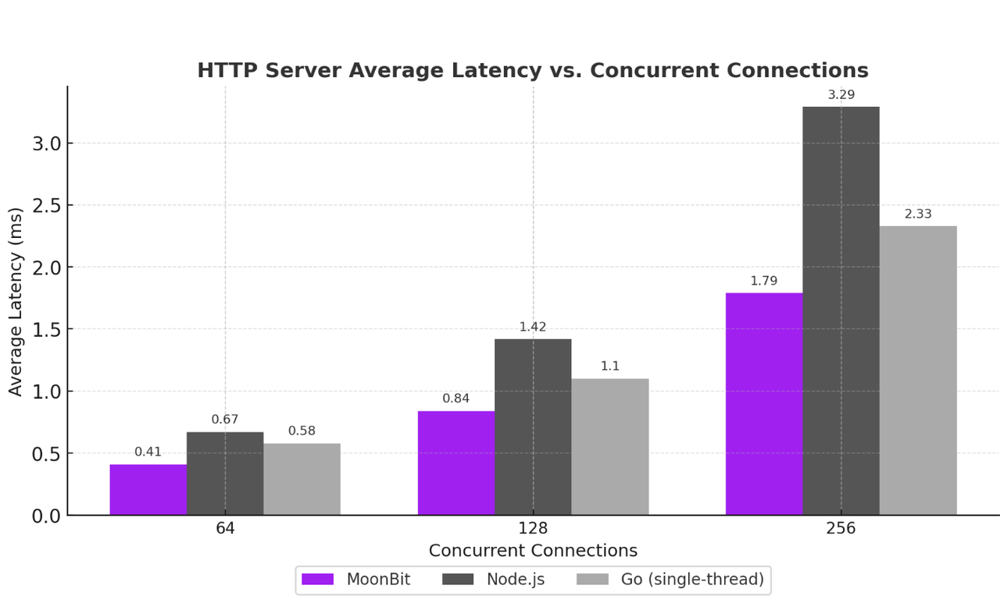

# Introducing Async Programming in MoonBit

We are excited to announce that MoonBit now provides **initial support for
asynchronous programming**. This completes a crucial piece of our language’s
feature set, following the Beta release less than six months ago. Our async
runtime is built on _structured concurrency_, enabling developers to write safer
and more reliable asynchronous programs. With this release, we are strengthening
MoonBit’s foundation for domains like cloud services and AI agents, where async
is indispensable.

## What Is Asynchronous Programming?

Asynchronous programming allows a program to pause execution and handle multiple
tasks concurrently. A common example is a network server: most of the time is
spent waiting for network I/O, not computing. If handled synchronously—serving
one request after another— the server wastes time waiting and performance
suffers. With asynchronous programming, the server can suspend a waiting task
and switch to another ready one, making full use of computing resources. This
model underpins cloud services, AI agents, and other network-intensive
applications.

Early approaches relied on OS processes and threads, but their heavy overhead
made it hard to scale. The “C10K problem”—handling 10,000 connections
simultaneously—drove the adoption of event loops in user space. Event-driven
programming dramatically reduced task management costs and became the foundation
of modern internet infrastructure.

Over time, more languages introduced native async support so developers could
write asynchronous code in a synchronous style. Go was designed this way from
the beginning, while Rust, Swift, Kotlin, and others added it later. Established
languages such as C++, JavaScript, C#, and Python also integrated async after
years of evolution. Today, async is an essential part of modern programming
languages.

## Asynchronous Programming in MoonBit

### A simpler syntax without `await`

In MoonBit, asynchronous functions are declared with the `async` keyword. Inside
an async function, we can call other async functions, such as the async I/O
primitives provided by the runtime. Async functions can only be called from
within other async functions. MoonBit also supports `async fn main` as the
program entry point, along with native `async test` syntax for testing
asynchronous code.

In many languages, in addition to declaring an `async` function with the async
keyword, developers must also mark each call with `await`. In MoonBit, no extra
keyword is needed for calling an async function. The compiler automatically
infers whether a call is synchronous or asynchronous based on its type. To keep
code readable, the MoonBit IDE renders async calls in italics, so it is still
easy to identify them at a glance.

The following example shows a test that issues a network request asynchronously.
As you can see, writing async code in MoonBit is almost as straightforward as
writing synchronous code:

```moonbit
async test {
  let (response, _) = @http.get("https://www.moonbitlang.cn")
  inspect(response.code, content="200")
}
```

## Structured Concurrency in MoonBit

Asynchronous programs often have more complex control flow than synchronous
ones, since execution can switch among many tasks. They also frequently involve
I/O, such as network communication, where unexpected conditions and errors are
common. Handling errors correctly is one of the biggest challenges in async
programming.

Traditional async systems are usually unstructured: tasks are global, and once
started, a task continues running unless it terminates itself or is explicitly
canceled. This means that when multiple tasks are launched to achieve some goal,
if one fails, the others must be canceled manually. If not, they will continue
running in the background as “orphan tasks,” wasting resources or even causing
crashes. Since async control flow is already complex, adding manual error
handling makes it even harder to write robust code. Writing async programs that
behave correctly in the presence of errors is far more difficult than writing
ones that work only in the “happy path.” Designing a system that helps
developers handle errors correctly is therefore a key concern in async
programming.

Our answer in MoonBit is `structured concurrency`. This modern paradigm
addresses exactly these challenges. In MoonBit, async tasks are no longer global
but nested, forming a tree structure. A parent task will not finish until all of
its child tasks finish. This ensures there are no orphan tasks or related
resource leaks. If a task fails, MoonBit automatically cancels all of its child
tasks and propagates the error upward, making error handling in async programs
as natural as in synchronous ones.

A good example is the `happy eyeball` algorithm, described in [RFC 8305]. When
connecting to a domain, the program first resolves the domain name into a list
of IP addresses. It then needs to select one IP from the list to establish a
connection. Happy eyeball automates this process: it attempts connections
sequentially from the list of IPs, launching a new attempt every 250
milliseconds. As soon as any attempt succeeds, it cancels the others and returns
with the successful connection.

The control flow is intricate:

- At any moment during the 250ms wait, if one connection succeeds, the algorithm
  must immediately return that connection.
- When returning the successful connection, all other attempts must be closed
  properly to avoid leaks.
- Even if one attempt fails, the algorithm must continue waiting for others or
  trying the next IP. With structured concurrency in MoonBit, implementing the
  happy eyeball algorithm becomes straightforward and reliable:

```moonbit
pub async fn happy_eyeball(addrs : Array[@socket.Addr]) -> @socket.TCP {
  let mut result = None
  @async.with_task_group(fn(group) {
    for addr in addrs {
      group.spawn_bg(allow_failure=true, fn() {
        let conn = @socket.TCP::connect(addr)
        result = Some(conn)
        group.return_immediately(())
      })
      @async.sleep(250)
    }
  })
  match result {
    Some(conn) => conn
    None => fail("connection failure")
  }
}
```

## The `happy_eyeball` Function in MoonBit

The `happy_eyeball` function takes a list of IP addresses as input, attempts
connections according to the happy eyeball algorithm, and returns the final TCP
connection. Inside the function, we use `@async.with_task_group` to create a new
task group. In MoonBit, task groups are the core of structured concurrency: all
child tasks must be created within some group, and `with_task_group` only
returns once all child tasks have finished. Within the task group, we iterate
over the list of IP addresses and use `group.spawn_bg` to launch a background
task for each connection attempt. This means that multiple connection attempts
may run concurrently. After launching each attempt, we call `@async.sleep` to
implement the 250ms wait required by the happy eyeball algorithm. Inside each
child task, we use `@socket.TCP::connect` to start the connection. If the
connection succeeds, we record it and call `group.return_immediately`, which
terminates the entire task group at once. This cancellation is
automatic—`return_immediately` cancels all remaining tasks in the group.

MoonBit’s implementation of happy eyeball is very concise—almost a direct
translation of the algorithm itself—yet it automatically handles all the tricky
details:

- `group.return_immediately` cancels all other connection attempts. If the
  program is currently waiting inside `@async.sleep`, that sleep is also
  canceled immediately, allowing the group to end without delay.
- When canceling a connection attempt, if `@socket.TCP::connect` has already
  created a socket but has not yet succeeded, the socket is automatically
  closed. No resources are leaked.
- By passing `allow_failure=true` when spawning tasks, the failure of one
  attempt does not interfere with other attempts.

For comparison, the
[Python asyncio implementation](https://github.com/aio-libs/aiohappyeyeballs/blob/main/src/aiohappyeyeballs/impl.py)
of happy eyeball takes nearly 200 lines of code and is less readable than the
MoonBit version. Another major advantage of structured concurrency is the
modularity of async code. For example, if we want to add a timeout to the
connection attempt, we can simply wrap the operation with @async.with_timeout,
without changing the rest of the implementation.

```moonbit
@async.with_timeout(3000, fn() {
  let addrs = ..
  happy_eyeball(addrs)
})
```

## Performance Comparison

Our asynchronous runtime, `moonbitlang/async`, currently supports the native
backend on Linux and macOS, using a custom thread pool together with
epoll/kqueue. Although still at an early stage of development, the runtime
already shows strong performance.

Similar to Node.js, MoonBit’s async runtime is **single-threaded and
multi-tasking**: the synchronous parts of an async program run on a single
thread. This means that as long as no async function is called, the program
behaves like a single-threaded program. In practice, this makes it easier to use
shared resources safely—no locks or race conditions to worry about. The
trade-off is that it cannot take advantage of multiple CPU cores for
computation. However, since async programs are typically I/O-bound rather than
computation-bound, a single core is often enough to achieve excellent
performance.

To illustrate, we built a simple TCP server that echoes back any data it
receives. This example contains almost no computation, making it a good test of
the runtime’s raw performance. The benchmark maintains N parallel connections to
the server, continuously sending data and receiving responses. During the test,
we record both the average throughput per connection and the average latency
(the time from sending the first packet to receiving the first reply).

For comparison, we tested the same workload against `Node.js` and `Go`. The
results are as follows:


The test results show that MoonBit consistently maintains the highest throughput
under 200 to 1000 concurrent connections, and is significantly better than
Node.js and Go in high-concurrency scenarios. This indicates that its async
runtime has excellent scalability.


In high-concurrency scenarios, MoonBit’s average latency always remains in the
single-digit milliseconds, reaching only 4.43ms even with 1000 connections; in
contrast, Node.js latency exceeds 116ms. This means that MoonBit’s async runtime
can maintain fast responses even under large-scale connections.

## HTTP Server Benchmark

The next example is an HTTP server. Compared with the TCP echo server, the HTTP
case involves additional computation, since the server must parse the HTTP
protocol rather than simply forwarding data. Thanks to the strong performance of
the MoonBit language itself, the results remain very solid.

For this benchmark, we use the [wrk](https://github.com/wg/wrk) tool to send
repeated `GET / HTTP/1.1` requests to the server over multiple connections. The
server responds with an empty reply. We measure two metrics: the number of
requests handled per second and the average latency per request.

The results are as follows:

 

Here, Go’s HTTP server `net.http` can use multiple CPU cores. For a direct
comparison with MoonBit and Node.js, the test limits Go to a single CPU core by
setting `GOMAXPROCS=1`. The code in both tests is very simple, so in the Node.js
test the proportion of JavaScript code is small, and the results mainly reflect
the performance of its backend library `libuv`, an event loop library written in
C.

## Example: Using MoonBit to write an AI agent

At present, MoonBit’s async support already covers most basic applications and
can be used to write various complete asynchronous programs. For example, below
is an AI agent written with MoonBit. The example includes only the core loop;
the full code can be read on
[GitHub](https://gist.github.com/tonyfettes/2953d5bef1610fce12cca05ea20655e2).

```moonbit
let tools : Map[String, Tool] = {
 // List of tools provided to the LLM
}

async fn main {
 // Conversation history with the LLM
 let conversation = []
 // Initial message sent to the LLM
 let initial_message = User(content="Can you please tell me what time is it now?")
 
 for messages = [ initial_message ] {
   let request : Request = {
     model,
     messages: [..self.conversation, ..messages],
     tools: tools.values().collect(),
   }
   // Send the conversation history and the new message to the LLM and get its reply
   let (response, response_body) = @http.post(
     "\{base_url}/chat/completions",
     request.to_json(),
     headers={
       "Authorization": "Bearer \{api_key}",
       "Content-Type": "application/json",
       "Connection": "close",
     },
   )
   guard response.code is (200..=299) else {
     fail("HTTP request failed: \{response.code} \{response.reason}")
   }
   let response : Response = @json.from_json(response_body.json())
   let response = response.choices[0].message
   guard response is Assistant(content~, tool_calls~) else {
     fail("Invalid response: \{response.to_json().stringify(indent=2)}")
   }

   // Output the LLM’s reply to the user
   println("Assistant: \{content}")
   
   // Add this round’s request and reply to the conversation history
   conversation..push_iter(messages)..push(response)

   // Invoke the tools requested by the LLM
   let new_messages = []
   for tool_call in tool_calls {
     let message = handle_tool_call(tools, tool_call)
     new_messages.push(message)
     println("Tool: \{tool_call.function.name}")
     println(content)
   }
   continue new_messages
 }
}
```

## Conclusion

This AI agent example looks almost identical to synchronous code, but in fact
the code is fully asynchronous. It can be freely composed in a modular way with
other async code, such as listening to user input or running multiple agents at
the same time. When the program needs to implement more complex async control
flow, MoonBit’s structured concurrency design can greatly simplify the code and
improve its robustness. Therefore, for typical async applications such as AI
agents, MoonBit’s async programming system is not only capable, but also a very
suitable choice.
