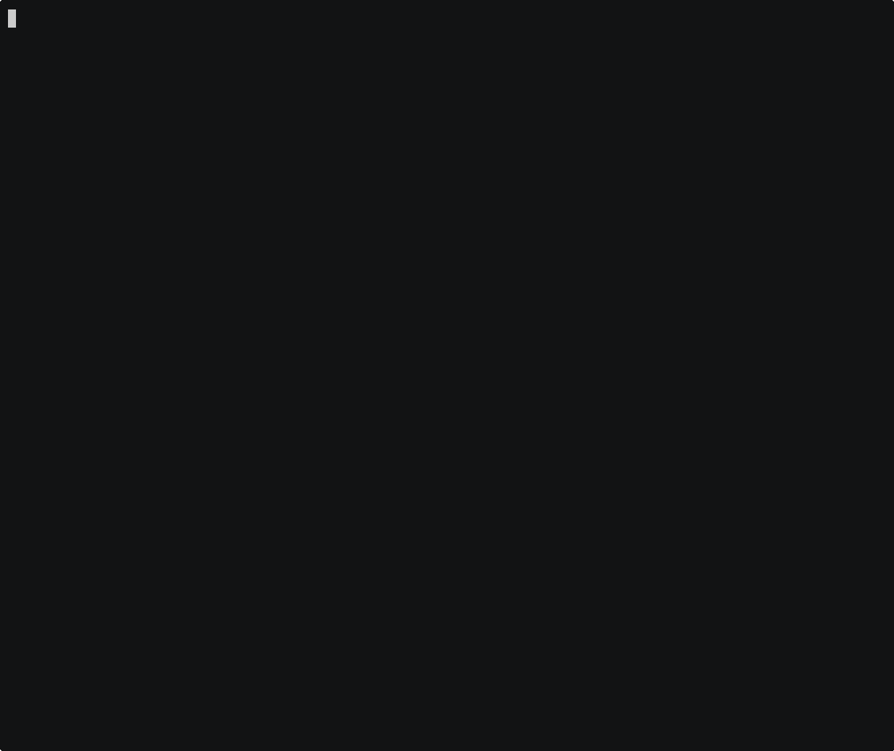

import Demo from './demo.mp4'

# Announcing LLDB based debugger for MoonBit


MoonBit has now entered its **Beta** phase, marking a major milestone in the project’s evolution. Recently, we completed the final missing piece of the core language features with the introduction of the **async programming library** moonbitlang/async. With this addition, MoonBit is expected to reach **version 1.0 by mid-next year.**

Earlier this year, we also released the **LLVM backend** for MoonBit — a native backend that works alongside the existing C backend. Unlike traditional approaches that rely on C code as an intermediate representation, the LLVM backend can **generate executable binaries directly**, without passing through C. This significantly reduces the toolchain’s dependency on C tooling, which is now required only when **building the MoonBit runtime** or **linking executables**.

When developing applications, we often encounter issues that are hard to diagnose by looking at surface symptoms alone. To truly understand what happens during program execution, effective debugging is essential. In general, there are two primary approaches to debugging:


**1. Instrumentation debugging**, where you insert print statements to output intermediate states or variable values during execution — commonly known as the printf debugging method.


**2. Debugger-based debugging**, which involves using a debugger to pause execution when an exception occurs, allowing developers to inspect and trace the program’s behavior step by step.

These two debugging approaches are **complementary in practice**:

- Instrumentation debugging excels at handling issues in higher-level application logic, as it depends on the correctness of core functionalities such as data structures, string formatting, and input/output operations.

- Debugger-based debugging, on the other hand, focuses on inspecting the low-level implementation of a program. It does not rely on the correctness of the application itself — as long as the compiler provides valid debugging symbols, the debugger can function properly.

The debugger is particularly useful when the **core functionality of an application fails** or when the program **crashes at a low level**. With a debugger, developers can:

- Set **breakpoints** to pause program execution at specific points;

- Inspect **variables, call stacks, and runtime states**;

- Use **step-by-step execution** to trace the logic flow line by line and analyze issues in detail.

In current MoonBit development, **instrumentation debugging** is already well-supported through features such as the **standard library** and `derive Show`, allowing developers to print and inspect runtime states effectively.
However, **debugger support** for MoonBit remains limited — it currently works primarily on the **JavaScript backend**, where developers can use built-in debuggers in **browsers** or **Node.js** environments.

For **native applications**, debugging has so far been possible only after compiling MoonBit code into **C source code**. This process, however, results in the **loss of critical information** about MoonBit’s data structures, leading to a suboptimal debugging experience.

The introduction of the **LLVM backend** resolves this limitation.
Thanks to LLVM’s native support for **debugging metadata**, debuggers can now access accurate **MoonBit data structure definitions** and **precise mappings between machine code and source code**.
This enables **true source-level debugging** for MoonBit programs — a key step toward bringing MoonBit’s native development experience closer to that of mature, production-grade languages.

## Debug Information Support in the LLVM Backend

The **LLVM backend** for MoonBit now provides **complete source-to-code position mapping** along with debugging information for **most types and data structures**. When you enable the debug option `(-g)` during compilation, the generated binary includes accurate mappings that allow you to inspect code locations and print most local variables in the debugger.

Through LLVM’s unified debug information system, this data is emitted in the **DWARF** format on *nix platforms (Linux and macOS), and in the **CodeView** format on Windows.

However, due to MoonBit’s language design, some **non-trivial data structures** cannot be perfectly represented through standard debug information:

The `String` type and `FixedArray[T]` type both require runtime access to the object header to determine array length, making it impossible to fully describe their layout statically.

**User-defined enumerations** (`enum`) have **specialized memory layouts**, with certain values also stored in the object header. As a result, it’s difficult for standard debugging metadata to directly map each variant and its associated internal data.

To address these challenges, we provide **custom debugger scripts** that extend LLDB’s capabilities. These scripts enable the debugger to **recognize and decode MoonBit’s specialized layouts**, allowing accurate inspection of complex runtime data structures during debugging sessions.

At present, MoonBit’s debug information support focuses primarily on ***nix platforms**, with **LLDB** (the debugger from the LLVM toolchain) as the preferred choice. The corresponding custom script is distributed with the MoonBit toolchain at: `$MOON_HOME/share/lldb/moonbit.py`

For some edge cases — such as specially laid out types like `Option[T]` — debug support is still incomplete. We plan to expand and refine these capabilities in future releases to ensure comprehensive coverage of all MoonBit runtime objects.

## How to Debug a MoonBit Application
### Runtime Environment

To use LLVM’s debugging information support, you should first build your MoonBit application using the LLVM backend.
At this stage, we only provide LLVM backend support for the **nightly channel** of the toolchain.

You can install the nightly toolchain using the following commands:
```bash
# *nix
curl -fsSL https://cli.moonbitlang.com/install/unix.sh | bash -s nightly

# Windows
$env:MOONBIT_INSTALL_VERSION="nightly"
Set-ExecutionPolicy RemoteSigned -Scope CurrentUser; irm https://cli.moonbitlang.com/install/powershell.ps1 | iex
```
After installing the nightly version of the MoonBit toolchain, you can build your application using the LLVM backend by adding the `--target llvm` option when running `moon`.

The debugger used in this section is **LLDB**.
You can find the corresponding package in your operating system’s package manager (such as apt, `homebrew`, `pacman`, etc.).
If your system does not provide LLDB, you can also install a recent version of the LLVM toolchain from the official LLVM website at: https://releases.llvm.org/
### Build

If the application you want to debug is built using `moon build`, you need to pass the `-g` option to build the application in **debug mode**.

If you are using `moon test` for testing, the default build mode is already **debug**, so you don’t need to provide any additional parameters for building.
You will be able to find the built application in the `target/debug/` directory.

If you want to debug the tests executed by `moon test` directly from the command line, you can find the exact command-line arguments required to run the corresponding test in the output of:
```BASH
/home/me/Projects/core/target/llvm/debug/test/strconv/strconv.blackbox_test.exe double_test.mbt:0-3/number_test.mbt:0-2/uint_test.mbt:0-5/int_test.mbt:0-9/README.mbt.md:0-2
```
If you use the built-in test debugging integration provided by the MoonBit plugin, you don’t need to manually retrieve the test parameters.
### Using LLDB from the Command Line

To start debugging with LLDB, run the following command in your terminal (replace `<your-program-and-args>` with your application and its command-line arguments):
```BASH
lldb -o 'command script import ~/.moon/share/lldb/moonbit.py' -- <your-program-and-args>
```
After executing the command, you will see output similar to the following in your terminal, indicating that **LLDB has successfully loaded the MoonBit debugging plugin** and is ready to run your selected application:
```plain text
(lldb) target create "target/llvm/debug/test/strconv/strconv.blackbox_test.exe"
Current executable set to '/home/me/Projects/core/target/llvm/debug/test/strconv/strconv.blackbox_test.exe' (x86_64).
(lldb) settings set -- target.run-args  "double_test.mbt:0-3/number_test.mbt:0-2/uint_test.mbt:0-5/int_test.mbt:0-9/README.mbt.md:0-2"
(lldb) command script import ~/.moon/share/lldb/moonbit.py
(lldb)
```
You can set breakpoints in your application using the filename and line number, for example:
```plain text
(lldb) b double.mbt:70
Breakpoint 1: where = strconv.blackbox_test.exe`$moonbitlang/core/strconv.parse_double + 30 at double.mbt:71:3, address = 0x0000000000025a5e
```
After that, you can start the program using the `r` command (or its full form, `run`).
The program will pause execution when it reaches the breakpoint you set.

At this point, you can use LLDB commands to inspect and test the program’s current state.
For example:
`bt` — display the call stack

`var` — view local variables

You can also control program execution flow using commands such as:

`s` — step to the next line

`si` — step to the next instruction

`n` — execute the next line (including function calls)

`c` — continue running the program


```plain text
(lldb) r
Process 1025295 launched: '/home/me/Projects/core/target/llvm/debug/test/strconv/strconv.blackbox_test.exe' (x86_64)
Process 1025295 stopped
* thread #1, name = 'strconv.blackbo', stop reason = breakpoint 1.1
    frame #0: 0x0000555555579a5e strconv.blackbox_test.exe`$moonbitlang/core/strconv.parse_double(str='9007199254740992e30') at double.mbt:71:3
   68   /// An exponent value exp scales the mantissa (significand) by 10^exp.
   69   /// For example, "1.23e2" represents 1.23 × 10² = 123.
   70   pub fn parse_double(str : String) -> Double!StrConvError {
-> 71     if str.length() == 0 {
   72       syntax_err!()
   73     }
   74     if not(check_underscore(str)) {
(lldb) bt
* thread #1, name = 'strconv.blackbo', stop reason = breakpoint 1.1
  * frame #0: 0x0000555555579a5e strconv.blackbox_test.exe`$moonbitlang/core/strconv.parse_double(str='9007199254740992e30') at double.mbt:71:3
    frame #1: 0x00005555555789f3 strconv.blackbox_test.exe`$moonbitlang/core/strconv_blackbox_test.__test_646f75626c655f746573742e6d6274_0 at double_test.mbt:21:5
    frame #2: 0x0000555555570f6f strconv.blackbox_test.exe`$moonbitlang$core$strconv_blackbox_test$__test_646f75626c655f746573742e6d6274_0$dyncall + 31
    -- snip --
(lldb) n
Process 1025295 stopped
* thread #1, name = 'strconv.blackbo', stop reason = step over
    frame #0: 0x0000555555579e0f strconv.blackbox_test.exe`$moonbitlang/core/strconv.parse_double(str='9007199254740992e30') at double.mbt:91:6
   88           None => syntax_err!()
   89         }
   90     }
-> 91     if str.length() != consumed {
   92       syntax_err!()
   93     }
   94     // Clinger's fast path (How to read floating point numbers accurately)[https://doi.org/10.1145/989393.989430]
(lldb) var
(moonbit_string_t) str = '9007199254740992e30'
($@moonbitlang/core/strconv.Number *) num = 0x0000058a3e031588
(int) consumed = 19
(lldb) var *num
($@moonbitlang/core/strconv.Number) *num = (exponent = 30, mantissa = 9007199254740992, negative = 0, many_digits = 0)
```

If you’d like to learn more about using LLDB, please refer to the following resources:

[Official LLDB Tutorial](https://lldb.llvm.org/use/tutorial.html)
 — this tutorial assumes prior experience with GDB.

Beginner-Friendly LLDB Guides, such as the University of Virginia [CS2150 course tutorial](https://aaronbloomfield.github.io/pdr/tutorials/02-lldb/index.html)

### Using VSCode with CodeLLDB

In **VSCode**, you can use the **[CodeLLDB](https://marketplace.visualstudio.com/items?itemName=vadimcn.vscode-lldb)** extension to enjoy an integrated, GUI-based debugging experience within the editor.

CodeLLDB relies on VSCode’s `launch.json` configuration file to start the debugging session.
You can add your run configuration using the following template in your project’s root directory at `.vscode/launch.json:`
```json
{
  "configurations": [
    // If you already have some configurations, you can paste the following object into them
    {
      "type": "lldb",
      "request": "launch",
      "name": "Launch",
      // Replace the two lines below
      "program": "your program to run",
      "args": ["program arguments"],
      "cwd": "${workspaceFolder}",
      "preRunCommands": [
        // Adjust according to your MoonBit toolchain installation path
        "command script import ~/.moon/share/lldb/moonbit.py"
      ]
    }
  ]
}
```
Before starting the debugging session, you can click near the line numbers in the editor to **add or remove breakpoints** at the points of interest in your code.

After that, click the **Start** button in the **Debug** tab on the sidebar to launch the debugging process.

During debugging, you can use the graphical interface to **inspect local variables and data structures**, as well as **control the program’s execution flow**.
<video controls src={Demo} style={{width: '100%', marginBottom: '1rem'}}></video>

## Summary

With the introduction of the **LLVM backend debugger**, MoonBit has achieved **native source-level debugging**, addressing the previous limitations caused by relying on C code translation. This advancement provides developers with a more efficient tool for diagnosing low-level issues. The improvement not only enhances the overall language toolchain but also delivers a better **cross-platform debugging experience** through support for both **DWARF** and **CodeView** debug information formats.

Although there is still room for improvement in handling certain complex data structures (such as `String` and `FixedArray`), the inclusion of the **LLDB integration plugin** has laid a solid foundation for a robust debugging workflow.

Looking ahead, the MoonBit team will continue refining its debugging capabilities, with plans to **expand coverage for edge cases** and further strengthen MoonBit’s advantages in areas like **async programming** for the upcoming **1.0 release**.
From steady progress in the Beta phase to rapid user growth, MoonBit is advancing with both **technical depth** and **community momentum**, positioning itself as a key player in the modern programming language ecosystem.