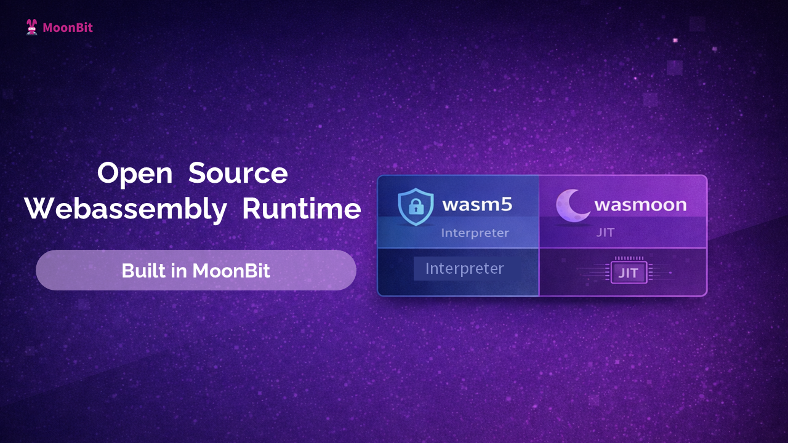

# Open Source WebAssembly Runtimes Built in MoonBit

We’re building two WebAssembly runtimes in MoonBit to let AI agents execute pre-compiled wasm tools safely and consistently across platforms.

To enable AI agents to use pre-compiled WebAssembly binaries as specialized tools without platform dependency concerns, we are developing two WebAssembly runtimes in MoonBit that ship alongside the tooling itself.

- **wasm5**: https://github.com/moonbitlang/wasm5  
- **wasmoon**: https://github.com/Milky2018/wasmoon  

---

## wasm5: A Lightweight, Cross-Platform Interpreter

The first runtime, **wasm5**, is a cross-platform interpreter supporting **WebAssembly Core 1.0**. It is designed with the following goals:

- Lightweight footprint  
- Fast startup time  
- Robust sandboxing capabilities  

This interpreter-based approach prioritizes **portability and security**, allowing AI agents to safely execute wasm-compiled tools across diverse environments without requiring complex runtime installations or system configurations.

By providing a consistent execution model regardless of the underlying platform, `wasm5` enables AI agents to invoke specialized tools with confidence that they will behave identically on any supported system. Its sandboxing design ensures that tool execution remains isolated and secure, preventing unintended interactions with the host environment.

---

## wasmoon: A JIT-Compiled Runtime for High Performance

Complementing `wasm5`, **[@Milky2018](https://github.com/Milky2018)** has developed **wasmoon**, a JIT-compiled WebAssembly runtime currently targeting the **aarch64** platform. Like `wasm5`, it supports **WebAssembly Core 1.0**, but focuses on performance through just-in-time compilation.

The JIT approach translates WebAssembly bytecode into native machine code at runtime, enabling execution speeds that approach natively compiled programs while preserving WebAssembly’s portability and safety guarantees.

---

## Complementary Design

Together, these two runtimes provide flexible deployment options for different scenarios:

- **wasm5** offers broad compatibility, strong sandboxing, and fast startup for lightweight and portable tasks.
- **wasmoon** delivers high-performance execution for compute-intensive workloads on supported architectures.

This dual-runtime strategy allows AI agents to choose the most appropriate execution engine depending on performance requirements and deployment constraints.