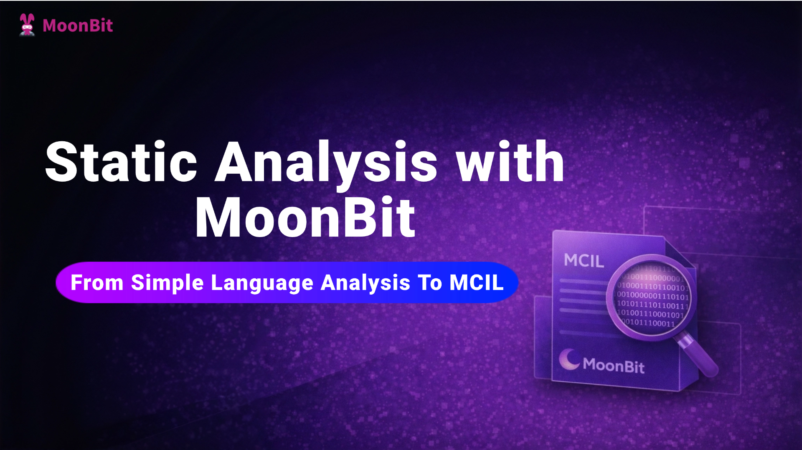
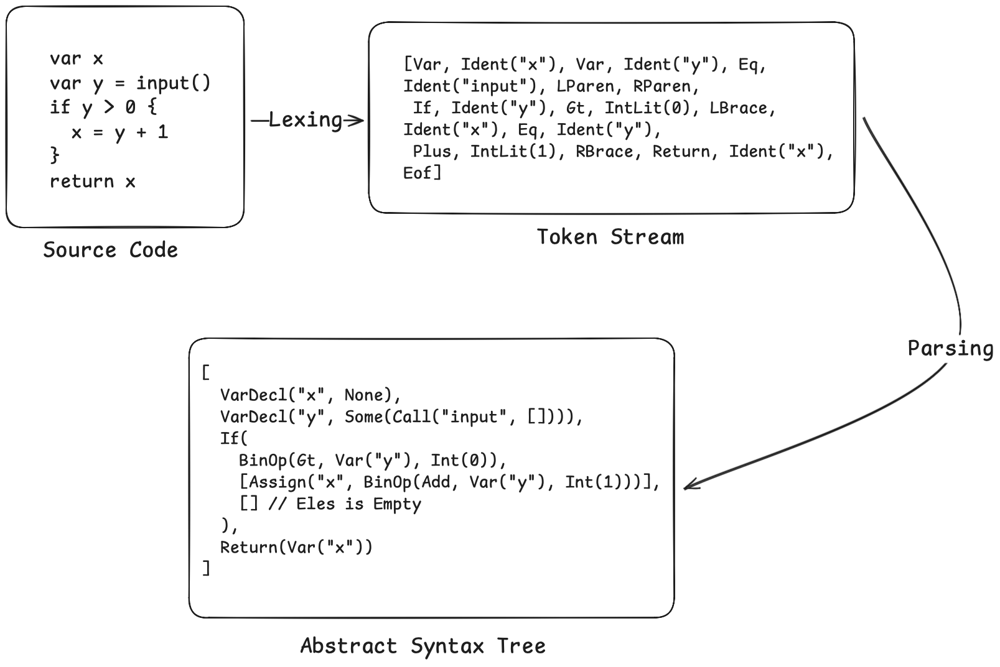
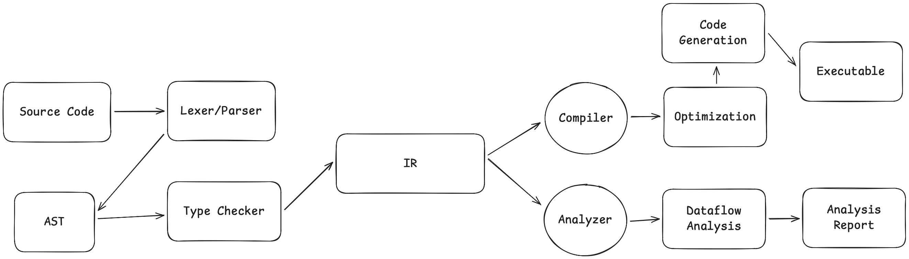
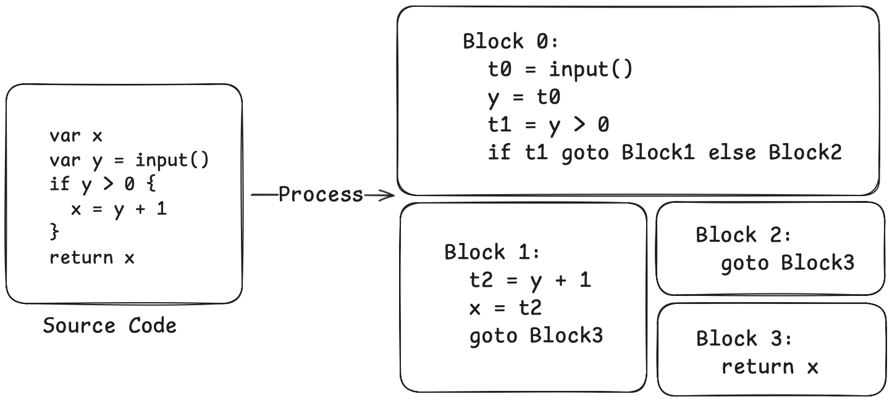
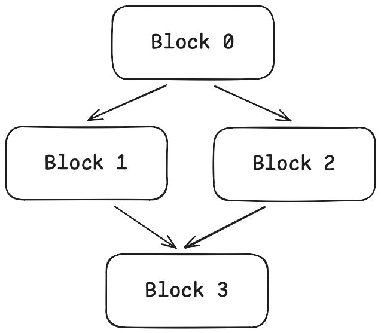
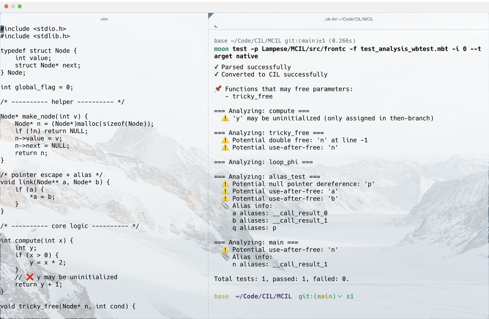

# Static Analysis with MoonBit: From Simple Language Analysis to MCIL



## I. Introduction

Have you ever wondered about the tools that seem to possess a sense of "foreknowledge" while you code? When a C/C++ compiler warns you that a "variable might be uninitialized," or a TypeScript IDE flags an object as "possibly null," they aren't actually executing your program. Instead, they simply "scan" your source code to accurately predict potential runtime risks. Behind this lies one of the most powerful and elegant technologies in the programming world: **Static Analysis**.

However, for many application developers, the inner workings of compilers and static analysis tools remain a mysterious "black box." We benefit from their insights every day, yet we don't always grasp the internal design logic and universal patterns that drive them.

This article aims to lift that veil of mystery. Whether you are a software engineer or an explorer of low-level systems, we will embark on a journey to understand from the ground up: Why does seemingly correct code get "flagged" by analysis tools? How do these tools extract analyzable logic from complex syntactic structures? More importantly, why do they all converge on similar design philosophies?

We will conclude with a case study of **MCIL (MoonBit C Intermediate Language)**—a mature analysis framework—to demonstrate how **MoonBit**, an emerging AI-native programming language, can be elegantly applied to C static analysis. We will also explore its unique potential in high-performance and resource-constrained scenarios.

By following this guide, you will not only master the core concepts of static analysis but also gain an understanding of the universal principles governing its design and implementation. Let us explore together how to enable machines to "understand" the intent of code and proactively discover hidden defects.

## II. What We Are Building

Let's start by demonstrating the final objective. Consider the following code snippet:

```JavaScript
var x
var y = input()
if y > 0 {
  x = y + 1
}
return x
```

This is a simple language of our own design. It supports variable declarations, assignments, `if` statements, `while` loops, and `return` statements. Notably, all blocks operate within a function scope, as the language lacks block-level scoping.

There is a bug in this code: the variable `x` is only assigned a value within the `then` branch of the `if` statement, while the `else` branch is empty. If `y <= 0`, the program follows the `else` path where `x` remains uninitialized, yet `return x` attempts to use its value. This is a classic "use of uninitialized variable" error—one that appears logically and syntactically sound from a compiler's perspective.

The static analyzer we are about to build will automatically detect such issues. More importantly, we will explore ***why*** static analyzers are designed this way and how this design makes the analysis both simple and robust.

## III. From Source Code to AST: Lexical and Syntactic Analysis

Before starting static analysis, we need to transform the source code into structured data. This process consists of two steps: lexical analysis and syntactic analysis.

- The **Lexer (Lexical Analyzer)** converts a stream of characters into a stream of tokens. For example, `var x = 0` would be identified as four tokens: the `Var` keyword, the identifier `Ident("x")`, the assignment symbol `Eq`, and the integer literal `IntLit(0)`. The lexer scans characters from beginning to end, skipping whitespace and comments, and determines the token type based on the current characters.
- The **Parser (Syntactic Analyzer)** transforms the token stream into an **Abstract Syntax Tree (AST)**. The AST is a tree-like representation of the program that reflects the hierarchical structure of the code. We employ a **recursive descent** approach: writing a parsing function for each grammatical component, with these functions calling each other. To handle operator precedence, we implement a function for each precedence level, where lower-precedence functions call higher-precedence ones.

Our AST is defined as follows:

```moonbit
// Expressions
enum Expr {
  Int(Int)                      // Integer: 0, 42
  Var(String)                   // Variable: x, y
  BinOp(BinOp, Expr, Expr)      // Binary operation: x + 1
  Call(String, Array[Expr])     // Function call: input()
  Not(Expr)                     // Logical NOT: !x
}

// Statements
enum Stmt {
  VarDecl(String, Expr?)        // Variable declaration: var x or var x = 0
  Assign(String, Expr)          // Assignment: x = 1
  If(Expr, Array[Stmt], Array[Stmt])  // if-else
  While(Expr, Array[Stmt])      // while loop
  Return(Expr)                  // Return
}
```

Our previous example code would be parsed into an AST like this:



The complete Lexer/Parser code, totaling approximately 400 lines, will be provided in the repository linked at the end of this article. This section is not the primary focus of the post—our interest lies in how to perform analysis once we have obtained the AST.

## IV. The Relationship Between Compilers and Static Analyzers

Before proceeding, let's look at the big picture. Traditional compilers and static analyzers take different paths, yet they share a common starting point:



Compilers and static analyzers share the first half of the pipeline—from source code to IR (Intermediate Representation). The divergence occurs after the IR: while the compiler continues downstream to eventually generate an executable, the static analyzer "diverges" from this path to analyze the IR itself, outputting warnings and error reports instead of machine code.

Both share a fundamental insight: **working directly on the AST is difficult, but it becomes much easier after transforming it into an IR**. This is precisely why frameworks like CIL (C Intermediate Language) exist—they provide an "analysis-friendly" intermediate representation that preserves the semantics of the source language while offering a structure that is easier to analyze.

### Why Not Analyze Directly on the AST?

While performing static analysis directly on the AST is theoretically possible, it is extremely painful in practice. The reason lies not in the complexity of the analysis goals themselves, but in the fact that the AST embeds control flow within its syntactic structure: `if`, `while`, `break`, `continue`, and early `return` statements force the analysis code to explicitly simulate all possible execution paths of the control flow, necessitating logic for fixed-point iteration and path merging. Consequently, the analyzer's complexity quickly becomes dominated by syntactic details rather than the analysis problem itself. Worse still, this approach is almost impossible to reuse: even if "uninitialized variable analysis" and "null pointer analysis" are abstractly the same category of data-flow analysis, their implementations on the AST would require rewriting nearly identical control-flow handling code. Thus, recursive analysis directly on the AST often leads to bloated, error-prone, and non-extensible code that lacks a unified level of abstraction.

## V. The Core Idea of CIL: "Flattening" Control Flow

CIL (C Intermediate Language) is a C program analysis framework developed at UC Berkeley. Its core idea is simple yet powerful: instead of performing analysis on the AST, first transform the AST into an Intermediate Representation (IR) that is better suited for analysis.

This IR has two key characteristics:

### 1. Replacing Nested Control Structures with "Basic Blocks"

A basic block is a sequence of code that executes linearly, with no branches in the middle and no jump targets from outside except at the beginning. In other words, if you start executing the first instruction of a basic block, you will inevitably execute all subsequent instructions in order until the end, without jumping out or having any other entry point mid-block.

Basic blocks are connected via explicit jumps. For example:

```C++
if cond {       ──▶    Block0: if cond goto Block1 else Block2
  A                    Block1: A; goto Block3
} else {               Block2: B; goto Block3
  B                    Block3: ...
}

while cond {    ──▶    Block0: goto Block1
  A                    Block1: if cond goto Block2 else Block3
}                      Block2: A; goto Block1    ← Backward jump
                       Block3: ...
```

An `if` statement becomes a conditional jump, and a `while` loop becomes a cycle—Block 2 returns to Block 1 to re-check the condition after execution.

### 2. Replacing Complex Expressions with "Three-Address Code"

Three-address code is a simplified instruction format where each instruction involves at most three "addresses" (variables). For example, a compound expression like `x = y + z * w` would be broken down into:

```Plain
t1 = z * w
t2 = y + t1
x = t2
```

Here, `t1` and `t2` are temporary variables generated by the compiler.

In our code, we define the IR as follows:

```moonbit
// Instructions: Three-address code format
enum Instr {
  BinOp(Operand, BinOp, Operand, Operand)  // dest = left op right
  Copy(Operand, Operand)                    // dest = src
  Call(Operand, String, Array[Operand])     // dest = func(args...)
}

// Terminators: The exit point of a basic block
enum Terminator {
  CondBr(Operand, Int, Int)  // if cond goto block1 else block2
  Goto(Int)                   // goto block
  Return(Operand)             // return value
}

// Basic Block
struct Block {
  id : Int
  instrs : Array[Instr]       // Sequence of instructions within the block
  term : Terminator           // Terminator instruction
  preds : Array[Int]          // Predecessor blocks
  succs : Array[Int]          // Successor blocks
}
```

Let's look at what our previous example looks like after being transformed into IR:



Now, the control flow structure is clear at a glance. Block 0 is the entry point; after execution, it jumps to Block 1 or Block 2 based on the condition. Both Block 1 and Block 2 eventually jump to Block 3, which then returns.

This structure has a specific name: **Control Flow Graph (CFG)**. The nodes of the graph are basic blocks, and the edges represent jump relationships. We can visualize it:



## VI. Data-Flow Analysis: "Flowing" Information on the CFG

With the CFG in hand, we can perform analysis in an elegant way: by letting information "flow" through the graph.

Take "uninitialized variable detection" as an example. We want to know: at every point in the program, which variables have already been defined?

We can think about this on the CFG as follows:

- At the program entry (the start of Block 0), only the function parameters are "defined"; all local variables are "undefined".
- Each assignment statement "generates" a definition. For example, after `x = 0`, `x` becomes "defined".
- Each assignment statement also "kills" previous definitions. For example, `x = 1` invalidates any prior definition of `x`.
- At control flow merge points (e.g., the start of Block 3), information needs to be "merged". Block 3 might be reached from Block 1 or Block 2. If a variable is "defined" at the end of Block 1 but "undefined" at the end of Block 2, then at the start of Block 3, it is "possibly undefined".

This is the core idea of data-flow analysis. We associate an "entry state" and an "exit state" (in this case, the set of "defined variables") with each basic block, and then define:

1. **Transfer Function**: Given a block's entry state, how do we compute its exit state? This involves simulating the effect of each instruction within the block.
2. **Merge Function**: When multiple edges converge at a single point, how do we merge their states? For instance, using an intersection ("defined only if defined in all predecessors") or a union ("defined if defined in any predecessor").

We start from the entry and iterate until the states of all blocks no longer change (reaching a "fixed point").

This process can be implemented using a general algorithmic framework (the **Worklist Algorithm**):

1. Add all blocks to the worklist.
2. Remove a block from the worklist.
3. Compute the entry state of the block based on the exit states of its predecessors and the merge function.
4. Compute the exit state of the block based on its entry state and the transfer function.
5. If the exit state has changed, add all its successor blocks to the worklist.
6. Repeat steps 2-5 until the worklist is empty.

Finally, we can abstract this framework into a generic function where the user only needs to provide the transfer and merge functions:

```moonbit
struct ForwardConfig[T] {
  init : T                    // Initial state at the entry
  transfer : (Block, T) -> T  // Transfer function: entry state -> exit state
  merge : (T, T) -> T         // Merge function: multiple states -> one state
  equal : (T, T) -> Bool      // Check if states are equal (to detect fixed point)
  copy : (T) -> T             // Copy state (to avoid shared references)
}

fn forward_dataflow[T](fun_ir : FunIR, config : ForwardConfig[T]) -> Result[T] {
  // Initialize the state of each block
  // Iterate until fixed point
  // ...
}
```

The beauty of this framework is its generality: regardless of the analysis (uninitialized variables, null pointers, integer overflows, etc.), as long as you can define the transfer and merge functions, you can reuse the same framework without rewriting complex logic for every minor conceptual change.

## VII. Forward Analysis vs. Backward Analysis

What we just discussed is "Forward Analysis": information flows from the program entry toward the exit. However, some analyses are naturally "Backward Analysis".

Consider "Liveness Analysis": we want to know, at each point in the program, which variables' values will be used later. This question must be answered by looking backward from the program exit. If a variable is never used again after a certain point, it is "dead," and any previous assignment to it is useless (dead code).

Backward analysis is symmetric to forward analysis: information flows from the exit toward the entry. The transfer function changes from "entry state → exit state" to "exit state → entry state," and the merge function operates on successors rather than predecessors.

```moonbit
struct BackwardConfig[T] {
  init : T                    // Initial state at the exit
  transfer : (Block, T) -> T  // Transfer function: exit state -> entry state
  merge : (T, T) -> T         // Merge the states of successors
  equal : (T, T) -> Bool
  copy : (T) -> T
}
```

The transfer function for liveness analysis is written as follows:

```moonbit
fn liveness_transfer(block : Block, out_state : LiveSet) -> LiveSet {
  let live = out_state.copy()
  // Process instructions from last to first (since it's backward analysis)
  for i = block.instrs.length() - 1; i >= 0; i = i - 1 {
    let instr = block.instrs[i]
    // First, remove the variable defined by this instruction
    match get_def(instr) { Some(v) => live.remove(v), None => () }
    // Then, add the variables used by this instruction
    for v in get_uses(instr) { live.add(v) }
  }
  live
}
```

Why "remove definition first, then add usage"? Consider the instruction `x = x + 1`. Before this instruction, `x` must be live (because we need to read it). But after this instruction, the *old* value of `x` is no longer needed (because we have overwritten it). Therefore, in backward analysis, we first process the definition (killing liveness) and then process the usage (generating liveness).

For the merge function, liveness analysis uses the union: a variable is live at the current point if it is live on *any* outgoing edge. This is because the program might take any branch, and as long as a variable *might* be used, it must be kept live.

## VIII. Detecting Uninitialized Variables

Now, let's implement a practical analysis: detecting potentially uninitialized variables.

The idea is as follows: we use "Reaching Definitions Analysis" to track which variable definitions could possibly reach each point in the program. If a variable is used at a certain point but no definition of that variable can reach it, then it is an uninitialized use.

Reaching Definitions Analysis is a forward analysis. Each assignment statement generates a new definition and "kills" any previous definitions of the same variable. At merge points, the sets of definitions from multiple branches are combined using a union (since a definition from any path could reach the point).

With reaching definitions information, detection becomes straightforward:

```moonbit
for block in fun_ir.blocks {
  let mut defs = reaching.defs_in[block.id]
  for instr in block.instrs {
    // Check used variables
    for var in get_uses(instr) {
      if not(defs.has_def(var)) && not(is_param(var)) {
        warn("Variable may be uninitialized: " + var)
      }
    }
    // Update definitions
    match get_def(instr) {
      Some(var) => defs = defs.update(var, current_def)
      None => ()
    }
  }
}
```

Let's test this on our previous example:

```Plain
Warning: Variable may be uninitialized: x (at Block 3, Return)
```

Excellent! This is exactly the result we were looking for.

## IX. MCIL: Real-World C Analysis

The project we used for demonstration is called **MiniCIL**, a simplified educational project modeled after CIL, with a DSL consisting of only a few basic statement types. Real-world C is far more complex. To address this, we have developed a complete MoonBit implementation of CIL: **MCIL**, which is capable of handling the full C language and performing sophisticated static analysis tasks.

The architecture of MCIL is identical to that of MiniCIL:

```Plain
C Source Code → Lexer/Parser → AST → cabs2cil → CIL IR → Analysis
```

MCIL's Lexer handles all C tokens, including `sizeof`, `typedef`, `struct`, `->`, and more. The Parser handles the complete C syntax, such as function pointers, compound literals, designated initializers, and GCC extensions. The `cabs2cil` transformation manages type inference, implicit conversions, constant folding, and scope resolution.

However, the core analysis framework and underlying principles remain the same. Once you understand MiniCIL, reading the MCIL codebase becomes much easier.

Below is an example of MCIL performing some simple static analysis on C code:



### Challenges in C Language Analysis

For readers interested in MCIL, the following major challenges in C static analysis are particularly important:

1.  **Pointers and Aliasing**: Our DSL only had simple variables, but C has pointers. When you write `*p = 1`, which variable are you modifying? If `p` could point to either `x` or `y`, the statement might modify either one. Worse, `p` and `q` might point to the same memory location (aliasing), so modifying `*p` affects the value of `*q`. Tracking pointer relationships is called **Alias Analysis**, and it is one of the most difficult problems in static analysis.
2.  **Inter-procedural Analysis**: The analysis in our tutorial only looks at a single function. But when you call `foo(x)`, will `foo` modify the memory pointed to by `x`? Will it free it? If we only analyze one function at a time, this information is lost. Inter-procedural analysis involves building a **Call Graph** and tracking data flow across function boundaries. MCIL implements basic inter-procedural analysis, capable of detecting use-after-free scenarios like using `p` after calling `free(p)`.
3.  **Complex Type System**: The C type system is full of pitfalls: array decay into pointers, complex function pointer syntax, struct memory layout, union type punning, etc. MCIL's `cabs2cil` transformation handles these by normalizing them into a unified form. For example, all implicit type conversions are turned into explicit `CastE` expressions, and array-to-pointer conversions are expressed via `StartOf`.
4.  **Undefined Behavior (UB)**: Signed integer overflow, null pointer dereference, out-of-bounds access, use-after-free—the C standard defines these as "Undefined Behavior." Compilers can assume they never happen, but static analysis tools must detect them without being so conservative that they produce too many false positives.

## X. Summary

In this article, we've explored the fundamental workflow of static analysis: starting from source code, passing through lexical and syntactic analysis to obtain an AST, transforming it into a CFG composed of basic blocks and explicit jumps, and finally using a data-flow analysis framework to iterate until a fixed point is reached. We implemented liveness analysis and uninitialized variable detection as examples to demonstrate the versatility of this approach.

While CIL dates back to the early 2000s—first published in the 2002 paper *"CIL: Intermediate Language and Tools for Analysis and Transformation of C Programs"*—it remains an excellent educational example due to its concise design. However, as compiler technology has evolved, infrastructure centered around **SSA (Static Single Assignment)**, such as LLVM/Clang, has become the industry standard. These frameworks offer superior extensibility and universality in intermediate representation, cross-stage optimization, and code generation, gradually replacing specialized tools like CIL in practical engineering. Interested readers are encouraged to further explore these modern and powerful static analysis techniques.

#### References:

Original CIL Paper: [*CIL: Intermediate Language and Tools for Analysis and Transformation of C Programs*](https://link.springer.com/chapter/10.1007/3-540-45937-5_16)

Mini MoonBit C Intermediate Language (Educational Code): [https://github.com/Lampese/MiniCIL](https://github.com/Lampese/MiniCIL)

MoonBit C Intermediate Language (MCIL): [https://github.com/Lampese/MCIL](https://github.com/Lampese/MCIL)
