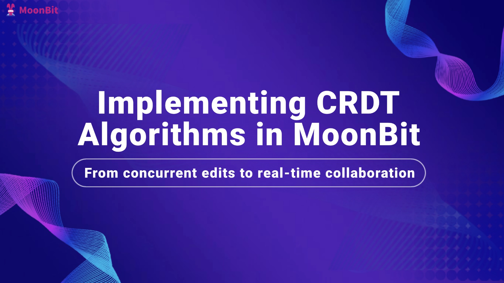
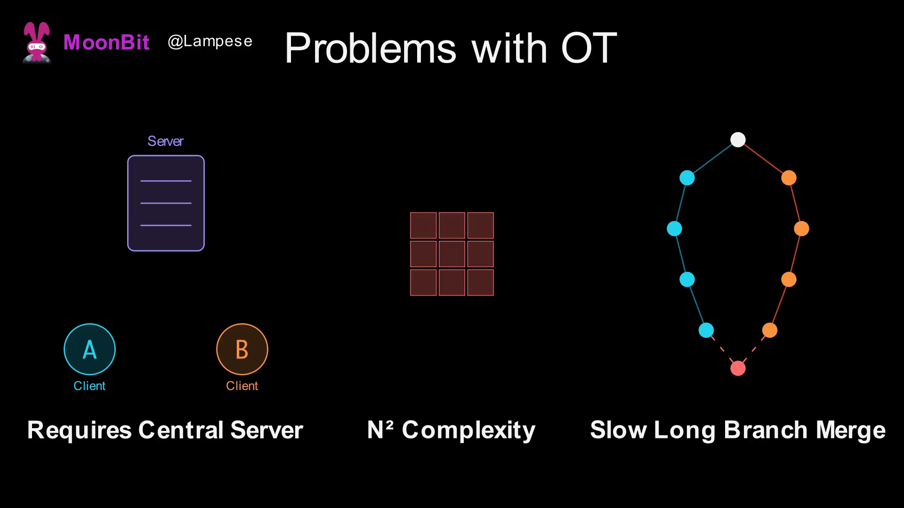
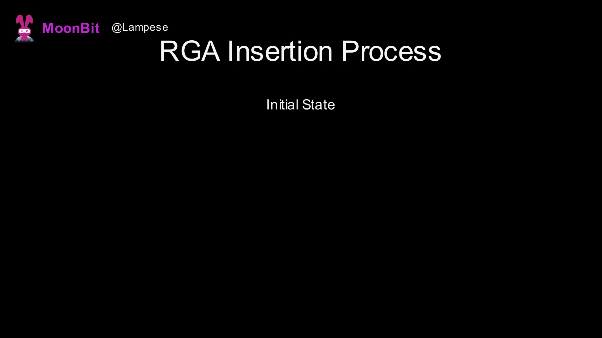
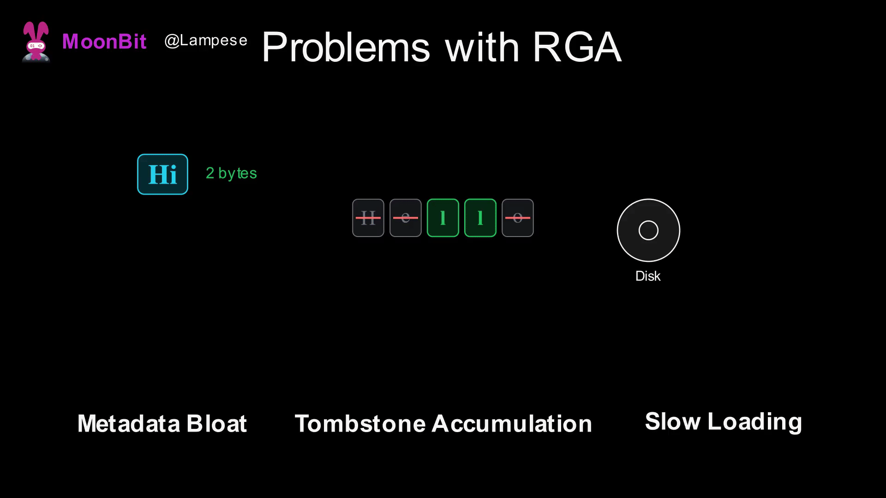
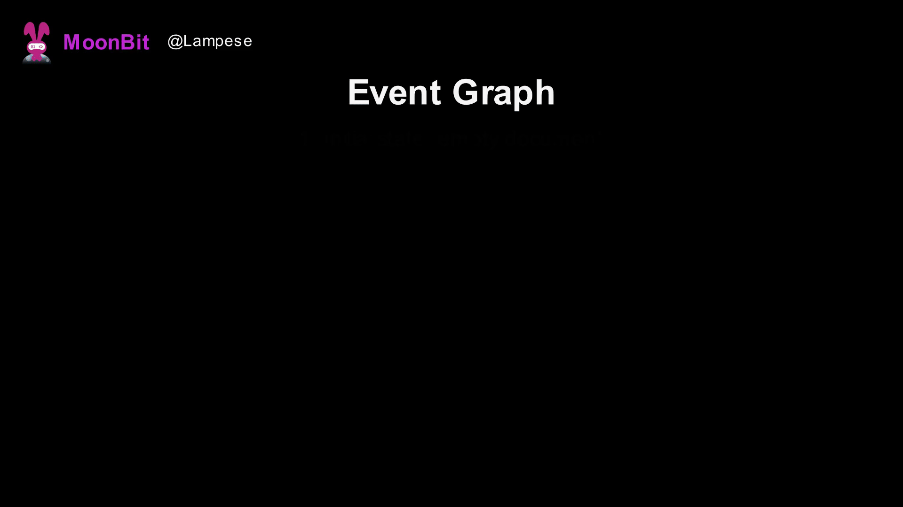
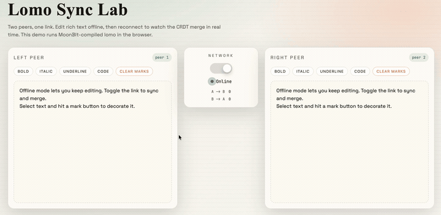

# Implementing CRDT Algorithms with MoonBit and Building Real-time Collaborative Applications



## I. Introduction

When you edit a document simultaneously with a colleague in Google Docs, or adjust an interface with a designer in Figma, have you ever wondered: why is it that when two people type at the same location at the same time, the final result doesn't overwrite each other or produce garbled characters?

Behind this lies one of the most challenging problems in distributed systems: **Concurrent Conflict**. When multiple users edit the same data simultaneously, and these edits need to be synchronized across different devices, how do we ensure everyone eventually sees the same result?

This article will take you deep into the evolution of core real-time collaboration algorithms—from the classic Operational Transformation (OT) to the classic CRDTs algorithm RGA, and finally to the modern EG-Walker. We will not only explain the principles of these algorithms but also implement their core logic using MoonBit, and ultimately demonstrate how to use them to build a simple, offline-capable collaborative editor that can merge upon reconnection.

## II. The Core Challenge of Real-time Collaboration

Suppose we want to build a multi-user collaborative text editor. Each user has a copy of the document on their own device. When a user makes an edit, the operation is synchronized to other users via the network. To ensure a smooth editing experience, user input should take effect immediately rather than waiting for server confirmation.

The problem arises: what happens when two users edit simultaneously? Consider this scenario:


This is the essence of concurrent conflict: **the same sequence of operations, applied in a different order, may produce different results**.

What we need is a mechanism where, regardless of the order in which operations arrive, everyone ultimately sees the same result, and the contributions of all editing participants are respected. This property is called **Eventual Consistency**.

## III. Solution 1: Operational Transformation (OT)

### Principle and Simple Implementation

**Operational Transformation (OT)** was the earliest algorithm used to solve real-time collaboration conflicts, born in 1989. Early collaboration tools like Google Docs and Etherpad adopted this approach. The basic idea of OT is: since operations affect each other, "transform" an operation based on those that have already occurred before applying it, making it adapt to the current state.


How OT resolves conflicts:

- The initial document is `AB`. Alice inserts `X` at position 1, making it `AXB` locally; Bob inserts `Y` at position 1, making it `AYB` locally. Now both sides need to synchronize each other's operations.
    
- When Alice receives Bob's operation `insert(1, 'Y')`, she cannot execute it directly—because she has already inserted `X` at position 1, and all subsequent characters have shifted one position to the right. OT detects that Bob's insertion position (1) is not before Alice's insertion position, so it increments the position by 1, resulting in `insert(2, 'Y')`. After Alice executes this, she gets `AXYB`.
    
- Similarly, Bob receives Alice's `insert(1, 'X')`. But Alice's insertion position (1) is not greater than Bob's (1), so it is not adjusted. Bob executes it directly, inserting `X` at position 1, also resulting in `AXYB`.
    

Let's implement this simply in MoonBit:


```rust
enum Op {
  Insert(Int, Char)  // Insert(position, character)
  Delete(Int)        // Delete(position)
}

/// Transformation function: transforms op1 into an equivalent operation after op2 has been executed
fn transform(op1 : Op, op2 : Op) -> Op {
  match (op1, op2) {
    (Insert(pos1, ch), Insert(pos2, _)) =>
      Insert(if pos1 <= pos2 { pos1 } else { pos1 + 1 }, ch)
    (Insert(pos1, ch), Delete(pos2)) =>
      Insert(if pos1 <= pos2 { pos1 } else { pos1 - 1 }, ch)
    // ... other cases are similar
  }
}
```

### Problems with OT

While OT is widely used in industry (Google Docs is based on OT), it has some fundamental issues:

1. **Requires a Central Server**: OT needs an authoritative server to determine the global order of operations. Without a server, it's impossible to determine which operation happened "first."
    
2. **Explosion of Transformation Rule Complexity**: If there are N types of operations, you need to define N² transformation rules. As operation types increase (such as bold, italics, links in rich text), the complexity rises sharply.
    
3. **Extremely Slow Merging of Long Branches**: If two users edit offline for a long time, a large number of operations must be transformed upon reconnection, leading to poor performance.
    



## IV. Solution 2: RGA: A Classic Sequence CRDT

CRDT (Conflict-free Replicated Data Type) takes a completely different approach: **instead of transforming an operation after receiving it, design a data structure such that the result is the same regardless of the order in which operations are applied**. This is like designing a special kind of "addition"—no matter what order you add the numbers, the result is the same. Mathematically, this requires operations to satisfy **commutativity** and **associativity**.

### RGA: A Classic Sequence CRDT

RGA (Replicated Growable Array) is a sequence CRDT proposed in 2011 specifically to solve conflict issues in collaborative text editing. Its core idea is simple: **use relative positions instead of absolute positions**.



Back to the example of Alice and Bob. The initial document is `AB`. Alice and Bob both insert characters at position 1—Alice inserts `X`, Bob inserts `Y`.

OT's approach is to adjust the position coordinates. But RGA takes a different path: **don't use numerical positions; use "inserted after whom" to describe the insertion point**.

Specifically:

- Alice's operation is no longer "insert X at position 1," but "insert X after A."
    
- Bob's operation is "insert Y after A."
    

Both operations want to insert after A—what happens? RGA assigns a **globally unique ID** to each character. This ID consists of two parts:

- **Peer ID**: Each user has a unique identifier (e.g., Alice is `A`, Bob is `B`).
    
- **Local Counter**: Each user maintains an incremental counter that increases by 1 for each new character inserted.
    

So `A@1` means "Alice's 1st operation," and `B@1` means "Bob's 1st operation." When two characters want to be inserted at the same position, their IDs are compared to determine the order—first compare the local counters, and if they are the same, compare the Peer IDs (as a tie-breaker). Here both counters are 1, so the Peer IDs are compared: `B > A`, therefore `B@1` is placed before `A@1`, resulting in `A → Y → X → B`, which is `AYXB`.

If implemented in MoonBit, we can first define the node type and its compare rule:


```rust
/// Unique Identifier
struct ID {
  peer : UInt64    // User ID
  counter : Int    // Local counter
} derive(Eq)

/// Compare two IDs to resolve concurrent insertion conflicts
impl Compare for ID with compare(self, other) {
  // Compare counter first, then peer (tie-breaker)
  if self.counter != other.counter {
    other.counter - self.counter
  } else if self.peer > other.peer { -1 } 
  else if self.peer < other.peer { 1 } 
  else { 0 }
}
```

When inserting, find the correct insertion point after the target—skipping all nodes with larger IDs:


```rust
/// Insert after target, returns the insertion position
fn find_insert_pos(order : Array[ID], target_pos : Int, new_id : ID) -> Int {
  let mut pos = target_pos + 1
  while pos < order.length() && new_id.compare(order[pos]) > 0 {
    pos = pos + 1  // new_id is smaller, continue looking further back
  }
  pos
}
```

We just assumed only insertion scenarios. For deletions, RGA adopts a **Tombstone** strategy: when a character is deleted, it is not actually removed but marked as "deleted."

Why can't we truly delete? Consider this scenario: Alice deletes B, while Bob (who hasn't received the deletion yet) inserts X after B. If B were truly gone, Bob's "insert after B" would lose its reference. Tombstones keep B in the data structure but skip it during rendering, so Bob's operation remains valid.


```rust
/// RGA Node
struct RGANode {
  id : ID
  char : Char
  mut deleted : Bool  // Tombstone flag
}

/// Delete: mark as tombstone
fn RGANode::delete(self : RGANode) -> Unit {
  self.deleted = true
}

/// Render: skip tombstones
fn render(nodes : Array[RGANode]) -> String {
  let sb = StringBuilder::new()
  for node in nodes {
    if !node.deleted { sb.write_char(node.char) }
  }
  sb.to_string()
}
```

In the simple implementation above, we used an array to store RGA nodes for clarity. Readers familiar with data structures will easily notice that RGA involves frequent insertions, so a linked list might be better suited for this algorithm. In actual engineering, more robust and efficient structures like B+ Trees or Skip Lists are often used to implement it.

### Problems with RGA

RGA solves the concurrent conflict problem, doesn't require a central server, and supports P2P synchronization, but it has significant drawbacks:

- **Metadata Bloat**: Each character needs to store an ID (which can easily reach 16+ bytes in practice) and a predecessor reference. For a 100,000-word document, the metadata might be larger than the content itself.
    
- **Tombstone Accumulation**: Deleted characters remain in memory forever. A document edited many times might consist of 90% tombstones, and text may have other dimensions like rich text, further exacerbating the impact of this drawback.
    
- **Slow Loading**: When loading a document from disk, the entire data structure must be rebuilt, which is an O(n) or even O(n log n) operation.
    



## V. Event Graph Walker: A Better Solution

### Principle Introduction

Event Graph Walker (Eg-walker for short) is a new CRDT algorithm proposed by Joseph Gentle and Martin Kleppmann in 2024.

As we saw earlier, OT operations are simple (using only position indices) but require a central server; CRDTs support P2P but suffer from metadata bloat. The core insight of Eg-walker is: **the two can be combined—use simple indices for storage, and temporarily construct a CRDT during merging.**

Operations are as lightweight as OT, recording only `insert(pos, char)` and `delete(pos)`. When concurrent operations need to be merged, historical states are temporarily replayed to build a CRDT state to resolve conflicts, which is discarded after the merge.

Some readers might have performance concerns regarding this "temporary CRDT construction." We must acknowledge that while temporary construction has overhead, CRDT involvement is not needed for most of the editing time—only during the synchronization of concurrent edits. Furthermore, the nature of Eg-Walker clearly supports incremental and local construction; you only need to build from a snapshot or build in the conflict region to resolve issues. It can be envisioned that as operation history becomes more complex, temporary construction will be more robust and efficient than maintaining a structure that grows indefinitely.



### Code Implementation

#### Basic Data Structures

First is the definition of operations. Unlike RGA, which uses relative positioning with "insert after a certain ID," Eg-walker directly uses numerical position indices, just like OT:


```rust
enum SimpleOp {
  Insert(Int, String)   // Insert(position, content)
  Delete(Int, Int)      // Delete(position, length)
}
```

Next is the definition of an **Event**. An event is a wrapper around an operation, adding causal relationship information:


```rust
struct Event {
  id : ID               // Unique identifier
  deps : Array[ID]      // Dependent events (parent nodes)
  op : SimpleOp         // Actual operation content
  lamport : Int         // Lamport timestamp for sorting
}
```

Then we can define an Event Graph based on them:


```rust
struct EventGraph {
  events : Map[ID, Event]  // All known events
  frontiers : Array[ID]    // Current set of latest event IDs
}
```

The `frontiers` in this definition records the "current version"—those events that are not depended upon by any other events. If the reader is familiar with Git concepts, this can be understood as the set of HEAD pointers for all current branches in Git.

#### Adding Events and Maintaining Frontiers

When a new event is received, in addition to storing it in the current event table, the frontier must be updated. Since the frontier tracks "events with no subsequent events," if a new event depends on an old head, it means that old head now has a successor and is no longer the "latest." It needs to be removed from the frontier, and the new event is added.


```rust
fn EventGraph::add_event(self : EventGraph, event : Event) -> Unit {
  self.events[event.id] = event
  self.frontiers = self.heads.retain(frontier => !event.deps.contains(frontier))
  self.frontiers.push(event.id)
}
```

#### LCA (Lowest Common Ancestor) and Topological Sorting

Merging two versions requires solving two problems:

1. **Finding the fork point (finding the LCA on the Event Graph)**: Determine where to start the replay.
    
2. **Determining the replay order (based on Lamport topological sort)**: Sort events according to causal relationships.
    

Both parts are basic graph theory problems that readers can implement quickly after researching. However, it's worth noting that in industrial implementations of the Eg-Walker algorithm, we usually don't use standard LCA algorithms; instead, we improve the data structure and apply caching mechanisms to increase efficiency.

#### Merging Algorithm

Now that we have all the components, we can implement the full merge algorithm:


```rust
fn EventGraph::merge(
  self : EventGraph,
  local_frontiers : Array[ID],
  remote_frontiers : Array[ID],  // Remote peer's frontiers, sent with events
  remote_events : Array[Event]
) -> String {
  // Step 1: Add remote events to the event graph
  for event in remote_events {
    self.add_event(event)
  }
  // Step 2: Find the LCA of local and remote versions (using VersionVector intersection)
  let lca = self.find_lca(local_frontiers, remote_frontiers)
  // Step 4: Collect all events from the LCA to both branches
  let events_to_replay = self.collect_events_after(lca)
  // Step 5: Sort topologically by Lamport timestamp
  let sorted = self.topological_sort(events_to_replay)
  // Step 6: Create temporary RGA, replay all events
  let temp_rga = RGA::new()
  for event in sorted {
    self.apply_to_rga(temp_rga, event)
  }
  // Step 7: Return final text, discard temporary RGA
  temp_rga.to_string()
}
```

The merge process can be summarized in three phases:

1. **Retreat**: Find the LCA to determine the range of events that need replaying.
    
2. **Collect**: Gather all events on both branches and sort them topologically by Lamport timestamps.
    
3. **Advance**: Create a temporary RGA, replay events in order, and resolve conflicts using CRDT logic.
    

## VI. Going Further: Lomo and Developing a Collaborative Text Editor

### What is Loro/Lomo?

Loro is a high-performance CRDT library based on the Eg-walker algorithm, implemented in Rust. It supports multiple data types (text, lists, Maps, movable lists, tree structures, etc.), provides rich collaboration features, and is used to build real-time collaborative applications. Lomo is the MoonBit port of Loro, maintaining binary compatibility with the Rust version of Loro. This means documents generated by Lomo can be read by Loro, and vice versa.

The core API of Lomo is very concise:


```rust
let doc = LoroDoc::new()
doc.set_peer_id(1UL)
// Get text container and edit
let text = doc.get_text("content")
doc.text_insert(text, 0, "Hello, World!")
doc.text_delete(text, 5, 2)
// Export updates (for synchronization)
let updates = doc.export_updates()
// Another peer imports updates
let doc2 = LoroDoc::new()
doc2.set_peer_id(2UL)
doc2.import_updates(updates)  // Both sides synchronize automatically
```

### Making a Collaborative Text Editor

Because collaboration needs often occur on the frontend, Loro released a Wasm API to ensure this excellent CRDTs library can be used in the frontend. However, Wasm compiled from Rust tends to be large and difficult to tree-shake based on specific user requirements, which has become a pain point for many frontend developers using Loro. But if the frontend uses MoonBit+Lomo with a JavaScript backend, the compiler only compiles the APIs as needed, resulting in an excellent final compilation result. Simultaneously, MoonBit's Wasm compilation results are often smaller and cleaner, yielding great results even when using a Wasm backend for distribution.

Therefore, we can try to create a collaborative text editor based on the JavaScript backend to verify this. The general implementation is shown below:

First, wrap document operations on the MoonBit side for JavaScript to call:


```rust
///| Create document
pub fn create_doc(peer_id : Int) -> Int {
  let doc = LoroDoc::new()
  doc.set_peer_id(peer_id.to_uint64())
  let text = doc.get_text("body")
  // Subscribe to local updates, automatically collecting data to be sent
  let _ = doc.subscribe_local_update((bytes) => {
    pending_updates.push(bytes)
    true
  }
  // ...
}

///| Apply editing operation
pub fn apply_edit_utf16(doc_id : Int, start : Int, delete_len : Int, insert_text : String) -> Bool {
  let doc = docs[doc_id]
  let text = texts[doc_id]
  if delete_len > 0 { doc.text_delete_utf16(text, start, delete_len)? }
  if insert_text.length() > 0 { doc.text_insert_utf16(text, start, insert_text)? }
  true
}
```

The JavaScript side handles user input and synchronization logic:


```javascript
// Handle user input
function handleInput(side, other) {
  const nextText = side.el.textContent;
  const change = diffText(side.text, nextText);  // Calculate difference between old and new text
  // Apply to CRDT (calling function exported by MoonBit)
  apply_edit_utf16(side.id, change.start, change.deleteCount, change.insertText);
  side.text = nextText;
  syncFrom(side, other);  // Synchronize to the other party
}

// Synchronization logic
function syncFrom(from, to) {
  const updates = drain_updates(from.id);  // Get updates to be sent (exported by MoonBit)
  if (state.online) {
    apply_updates(to.id, updates);  // Online: apply immediately (exported by MoonBit)
  } else {
    from.outbox.push(...updates);   // Offline: cache in outbox
  }
}
```

Finally, after some styling and page writing, we get a collaborative editor based on CRDTs:



The source code for this project is provided at the end of the article. Interested readers can refer to it and develop even more interesting projects.

## VII. Summary

Starting from the problem of concurrent conflicts, this article introduced the evolution of real-time collaboration algorithms:

- **OT**: Resolves conflicts by transforming operations, but requires a central server.
    
- **RGA**: Achieves decentralization using unique IDs and relative positions, but suffers from metadata bloat.
    
- **Eg-walker**: Combines the advantages of both, storing simple operations and temporarily constructing a CRDT during merging.
    

We implemented the core data structures and key computational parts of the above algorithms using MoonBit, introduced the Loro/Lomo libraries and their basic usage, and developed a simple collaborative editing application using Lomo.

From the birth of OT in 1989 to the formalization of CRDTs like RGA in 2011, and the innovative fusion of Eg-walker in 2024, real-time collaboration algorithms have undergone over thirty years of evolution. In recent years, with the rise of the Local-first philosophy, CRDTs are moving from academic papers into production practice—behind tools like Figma and Linear. In the future, directions such as history compression, complex data structures, and end-to-end encryption are still advancing rapidly. MoonBit's ability to compile efficiently to WebAssembly also opens new possibilities for deploying CRDTs in browsers and edge devices.

### Reference Projects/Literature

- Lomo-Demo (Editor): [Demo](https://lampese.github.io/lomo-demo) / [Source Code](https://github.com/Lampese/lomo-demo)
    
- [Loro](https://loro.dev/)
    
- [Lomo](https://github.com/Lampese/lomo)
    
- [Eg-walker Paper](https://arxiv.org/abs/2409.14252)
