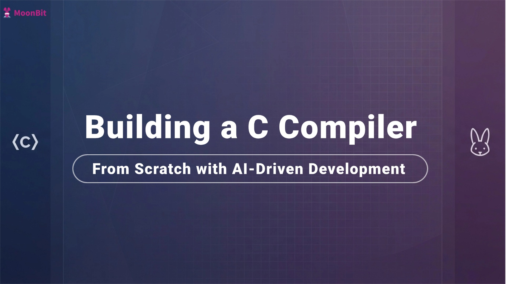

# Building a C Compiler from Scratch with AI-Driven Development

Recently, we completed `Fastcc`, a **self-hosting** C compiler built from scratch. The project was carried out with minimal human involvement and targets the **ARM64** architecture.

Github Repo: https://github.com/moonbit-community/fastcc

We set a deliberately ambitious goal: **to start from zero and build a C compiler, while keeping human involvement as limited as possible.**

The initial motivation was to understand how current AI systems behave when tasked with a large, end-to-end software project. 

Traditionally, building a full C compiler is considered a complex engineering task. It involves multiple stages — lexical analysis, parsing, semantic checks, optimization passes, and code generation — and typically requires deep domain knowledge and months (or even years) of focused work.

## Initial Setup 

The process began with a single voice instruction to the AI agent:
**“Build a C compiler from scratch, close to tcc, targeting ARM64.”**

The project was named `Fastcc`. 

We chose tcc (Tiny C Compiler) as a reference because of its fast compilation speed, which is particularly important for MoonBit’s development workflow. MoonBit’s Native backend supports both LLVM and C, and having a dedicated C compiler enables full self-hosting. 

At the same time, tcc is unsafe, poorly maintained, and leaves room for architectural improvements. To keep the scope focused, we limited the target to ARM64.

## Self-Hosting and Verification
By day seven, `Fastcc` reached a key milestone: **self-hosting**.

Here, “self-hosting” means Fastcc was able to compile the C output generated from its own source and run its test suite:
1. Use the MoonBit toolchain to build the Fastcc project (`Fastcc.mbt`) into an initial compiler executable (`Fastcc.exe`).
2. Use the MoonBit toolchain to compile the same source into C (via the Native backend’s C output), producing C files for Fastcc.
3. Use `Fastcc.exe` to compile that generated C output into a second executable (`Fastcc1.exe`).
4. Verify that `Fastcc1.exe` passes Fastcc’s own tests.
  
Fastcc could also compile the tcc source code at this stage. For performance testing we used `v.c`, a single-file snapshot of the V compiler.

In early benchmarks, Fastcc was about 60× slower than tcc on this input. After subsequent profiling and targeted optimizations, the compilation throughput improved substantially, reaching around 4× faster than clang `-O0` on the same benchmark.

## Autonomous Workflow and Design Decisions
Throughout most of the development process, the AI agent decomposed and implemented tasks autonomously. Its work included:

- Designing the abstract syntax tree (AST)
- Generating core compiler modules
- Implementing multiple optimization passes
- Debugging using `lldb` as part of its own investigation
- Profiling performance hotspots using Xcode command-line tools, based on high-level guidance
- Writing scripts to identify hot paths and guide targeted optimizations

  
Although the initial directive referenced tcc’s structure, the agent chose a **multi-pass design** rather than a single-pass model, prioritizing correctness and extensibility over strict structural similarity.

Human involvement was limited to occasional guidance and corrective direction, mainly at the level of goals and evaluation rather than step-by-step instruction.

## Outcome
By day ten, I rarely touched the keyboard.Throughout the process, the agent operated like a tireless engineering team inside the MoonBit ecosystem. 

After 10 days, it produced:
- A working C compiler implementing core language features
- **~35,000 lines of readable, structured code**

## Conclusion

It’s worth noting that this outcome was not accidental. It was made possible by MoonBit’s toolchain and language design, which together enable sustained, large-scale, agent-driven software development.
