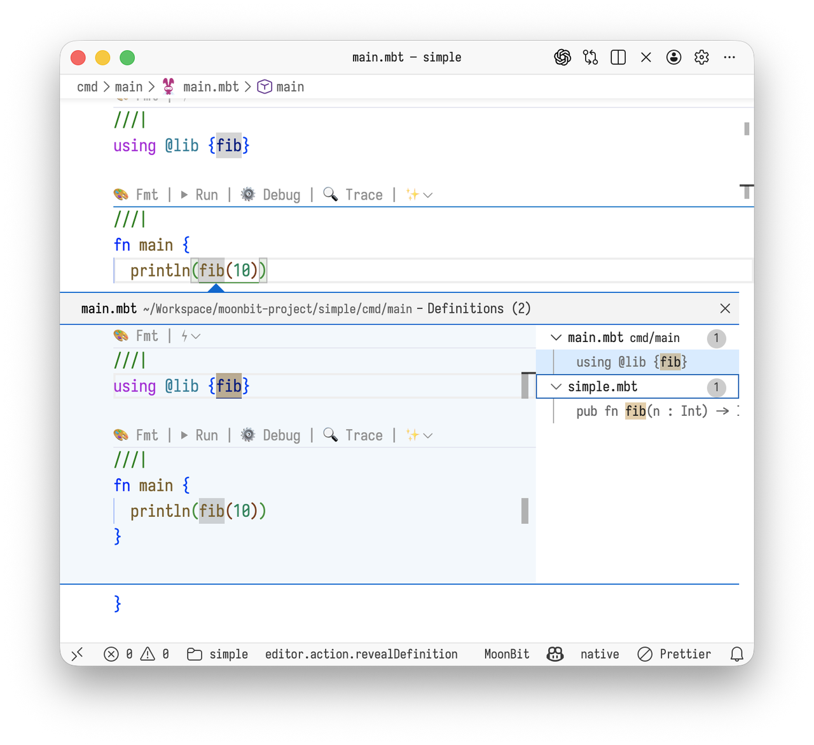

# MoonBit 0.8.0 Released


We are excited to announce the release of **MoonBit 0.8.0**.

MoonBit is a **readable, fast, scale, and AI-agent-friendly** general-purpose programming language. This release marks an important milestone on MoonBit’s path toward stability and production use.

MoonBit 0.8 is not a simple collection of incremental changes. It represents a clear transition from an experimental language to an engineering-grade language and toolchain. Significant improvements have been made across **language semantics, error handling, package management, and developer tooling**—making MoonBit better suited for large-scale codebases and agent-centric development workflows.


## Why MoonBit 0.8 Matters?
As many developers have observed, Rust provides a solid foundation for AI-assisted development through its strict semantics and strong correctness guarantees. While continuing to pursue similar reliability goals, MoonBit places additional emphasis on **much faster compilation speeds**—often **10–100× faster than Rust** in practical use—as well as a development toolchain deeply integrated with agent-based workflows.

With the release of version 0.8, these design goals are no longer abstract principles. They are now consistently reflected across the language, compiler, runtime, and IDE.


## Key Updates

**Native Backend Backtrace Support**

The MoonBit native/LLVM backend now supports automatically printing call stacks when a program crashes. Backtraces are mapped directly to the corresponding MoonBit source locations, significantly improving the debugging experience.
```plain text
RUNTIME ERROR: abort() called
/path/to/moonbitlang/core/array/array.mbt:187 at @moonbitlang/core/array.Array::at[Int]
/path/to/pkg/main/main.mbt:3 by @username/hello/out_of_idx.demo
/path/to/pkg/main/main.mbt:9 by main
```
**AI-Native Specification Support**

MoonBit introduces the `declare` keyword, which can be used to `declare` types, functions, and other program elements that are intended to be implemented later. If a `declare` declaration does not have a corresponding implementation, the MoonBit compiler will emit a warning.

The `declare` keyword provides AI-native specification support. By writing specifications in the form of `declare`, developers can clearly describe the interfaces and behavior they expect AI systems to implement. AI tools only need to read the `declare` specifications and the associated test files to begin generating code.

During development, the compiler’s warning messages guide the AI to progressively complete the required implementations. Since missing `declare` definitions are treated as warnings rather than errors, AI systems can incrementally write and test code as the implementation evolves.


## Completed Technical Changelog in MoonBit 0.8
### Language Updates
1. The `suberror Err PayloadType` syntax has been deprecated. Users need to migrate the the `enum`-like sytax for declaring error type:
    ```moonbit
    suberror Err {
      Err(PayloadType)
    }
    ```

    This change can be migrated automatically via `moon fmt`

2. Type inference for builtin error constructors (maily `Failure`) is deprecated to avoid scope pollution. When the expected error type is unknown, `raise Failure(..)` should be migrated to `raise Failure::Failure(..)`, similarly for `catch`.
3. Values of type `FuncRef[_]` can now be called directly from MoonBit code. This feature can be used for dynamic symbol loading or implementing JIT in native backend.

4. MoonBit's native backend and LLVM backend now supports backtrace. When a MoonBit program panic (performing an out-of-bound array indexing operation, failure of `guard` statement without `else`, or `try!` expression receiving an error, or manually calling `panic`/`abort`, etc.), the stack trace of the panic will be printed under debug mode. Here's an example:
    ```moonbit
    fn demo(a: Array[Int], b: Array[Int]) -> Unit {
      let _ = a[1]
      let _ = b[2]
    }

    fn main {
      let a = [1, 2]
      let b = [3]
      demo(a, b)
    }
    ```
    When run with `moon run --target native`, the program will output:
    ```plain text
    RUNTIME ERROR: abort() called
    /path/to/moonbitlang/core/array/array.mbt:187 at @moonbitlang/core/array.Array::at[Int]
    /path/to/pkg/main/main.mbt:3 by @username/hello/out_of_idx.demo
    /path/to/pkg/main/main.mbt:9 by main
    ```

5. A new keyword `declare` is introduced to replace the previous `#declaration_only` attribute. In addition, `declare` now supports declaring trait implementations. For example:
    ```moonbit
    declare type T // declare a type to be implemented
    declare fn T::f(x : T) -> Int // declare a method to be implemented

    struct S(Int)
    declare impl Show for S // declare an impl relation
    ```
6. `for .. in` loop now supports iterating over a reversed range via reversed range expressions `x>..y` and `x>=..y`:
    ```moonbit
    ///|
    test "reversed range, exclusive" {
      let result = []
      for x in 4>..0 {
        result.push(x)
      }
      debug_inspect(result, content="[3, 2, 1, 0]")
    }

    ///|
    test "reversed range, inclusive" {
      let result = []
      for x in 4>=..0 {
        result.push(x)
      }
      debug_inspect(result, content="[4, 3, 2, 1, 0]")
    }
    ```
  To make the syntax for consistent,  the syntax `x..=y` for forward, closed range expression has been migrated to `x..<=y`, the old syntax is deprecated. This change can be migrated automatically via `moon fmt`

7. Using `{ ..old_struct, field: .. }` to update a `struct` with `priv` fields (outside its package) is now forbidden

8. `lexmatch` expressions in first-match mode now supports pattern guard. `lexmatch` with guard currently has some performance penalty, so it is recommended to use it during fast prototying, and evaluate if `lexmatch` guard should be removed later. The syntax is the same as pattern guard for normal `match`, see https://github.com/moonbitlang/lexmatch_spec for more details:
    ```moonbit
    lexmatch input {
      ("#!" "[^\n]+") if allow_shebang => ...
      ...
    }
    ```
  9. `struct` now supports user defined constructors. The syntax is as follows:
      ```moonbit
      struct S {
        x : Int
        y : Int

        // declare a constructor for the `struct`
        fn new(x~ : Int, y? : Int) -> S
      }

      // implement the constructor for `struct`
      fn S::new(x~ : Int, y? : Int = x) -> S {
        { x, y }
      }

      // using the `struct` constructor
      test {
        let s = S(x=1)
      }
      ```
  The semantic of `struct` constructors is:
  - `struct` constructors can be declared by adding a `fn new` declartion to the end of the body of `struct`. The signature of the constructor has no restriction, except that it must return the `struct` itself. So features such as optional arguments, raising error can be used freely in the `struct` constructor. The parameters of `fn new(..)` inside the `struct` must not specify default value for optional arguments, but may omit parameter names
  - For `struct` with type parameters, `fn new` can specialize the type parameters or add trait bounds to them. The syntax is the same as a normal toplevel function declaration
  - If a `struct` declares a constructor via `fn new`, the constructor must be implemented by adding a `fn S::new` method declaration in the same package. The signature of `S::new` must be exactly the same as the `fn new` declaration in the `struct`
  - Using the `struct` constructor is exactly the same as using an `enum` constructor, except that `struct` constructors cannot be used for pattern matching. For example, when the expected type is known, `S(..)` can be used directly in place of `@pkg.S(..)` or `@pkg.S::S(..)`.
  - The visibility of `struct` constructor is the same as the fields of the `struct`. So the constructors of `pub struct` and `pub(all) struct` will be public, while the constructors of `struct` and `priv struct` will be private
10. Alias generated by `using` can now be `deprecated` by adding #deprecated attribute to the `using` declaration.

11. A new trait `Debug` is introduced, with auto deriving support. `Derive` is a more advanced version of the `Show` trait, it can convert MoonBit values to more structural and readable text message:
    ```moonbit
    ///|
    struct Data {
      pos : Array[(Int, Int)]
      map : Map[String, Int]
    } derive(Debug)

    ///|
    test "pos" {
      debug_inspect(
        {
          pos: [(1, 2), (3, 4), (5, 6)],
          map: { "key1": 100, "key2": 200, "key3": 300 },
        },
        content=(
          #|{
          #|  pos: [(1, 2), (3, 4), (5, 6)],
          #|  map: {
          #|    "key1": 100,
          #|    "key2": 200,
          #|    "key3": 300,
          #|  },
          #|}
        ),
      )
    }
    ```
    `derive(Debug)` additionally supports an `ignore` parameter, which accepts one or more type names. Values with an ignored type will be displayed as `...` In the derived `Debug` implementation. This is especially useful when working with types from third party packages that have no `Debug` implementation:
    ```moonbit
    ///|
    struct Data1 {
      field1 : Data2
      field2 : Double
      field3 : Array[Int]
    } derive(Debug(ignore=[Data2, Array]))

    ///|
    struct Data2 {
      content : String
    }

    ///|
    test "pos" {
      debug_inspect(
        { field1: { content: "data string" }, field2: 10, field3: [1, 2, 3] },
        content=(
          #|{
          #|  field1: ...,
          #|  field2: 10,
          #|  field3: ...,
          #|}
        ),
      )
    }
    ```

    In addition to more readable format with automatic line break, the `moonbitlang/core/debug` package also provides an `assert_eq(a, b)` function, which automatically calculate and display the diff of a and b when they are not equal.
    In the future, we will gradually deprecate `derive(Show)` and migrate to `Debug` for debugging. The `Show` trait will focus on hand-written, domain specific printing logic, such as `Json::stringify`

12. Constructors with arguments can no longer be used as higher order functions directly. An anonymous function wrapper is necessary:
    ```moonbit
    test {
      let _ : (Int) -> Int? = Some // removed
      let _ : (Int) -> Int? = x => Some(x) // correct way
      let _ : Int? = 42 |> Some // pipes are not affected
    }
    ```
    This behavior has been deprecated for some time. Notice that constructors with arguments can still be used on the right hand side of the pipe operator.

13. Effect inference has been deprecated for local `fn`. If a `fn` may raise error or perform `async` operations in its body, it must be explicitly annotated with `raise`/`async`, otherwise the compiler will emit a warning, which will turn into an error in the future. The arrow function syntax `(..) => ..` is not affected. So, we recommended using arrow functions instead of `fn` for callback functions in the future. fn can be used when explicit annotation is desirable for documentation or readability purpose.

14. The semantic for `x..f()` has been adjusted back to its original, simple semantic: x..f() is equivalent to `{ x.f(); x }`. Previously, the result of `x..f()` can be silently ignored. The compiler will now emit a warning for this kind of usage. Users should replace the last `..f() `replaced with `.f()`, or explicitly ignore the result.

15. `for`/`for .. in`/`while` loops previously support adding an `else` block to do something when the loop exits normally. To make the syntax more intuitive, the `else` keyword for these loops is replaced with `nobreak`:
    ```moonbit
    fn f() -> Int {
      for i = 0; i < 10; i = i + 1 {

      } nobreak {
        i
      }
    }
    ```
    This change can be migrated automatically via `moon fmt`.

16. A new warning `unnecessary_annotation` (disabled by default) is introduced, which identifies unnecessary annotation on `struct` literal and constructors (i.e. places where the compiler can automatically deduce the correct type from the context).

### Toolchain Updates
1. The moon.pkg DSL is now officially recommended way to write package configurations, and the old moon.pkg.json format is deprecated. You can use moon fmt to automatically migrate to the new moon.pkg format, and new MoonBit projects will now use the moon.pkg format by default. Here's a nexample for some common configuration options:
    ```moonbit
    import {
      "path/to/pkg1",
      "path/to/pkg2" @alias,
    }

    warnings = "+deprecated-unused_value"
    ```

2. `moon test` now supports using the `-j` parameter to run tests in parallel
3. `moon test` can now list all tests to run via the `--outline` parameter
4. `moon test` --index can now specify a range of test index (inclusive on the left and exclusive on the right). For example, `moon test /path/to/test/file.mbt --index 0-2` will now run the first two tests in `/path/to/test/file.mbt`
5. `moon install` now supports globally installing executables from MoonBit projects, as dependency installation is already handled automatically by `moon check` and `moon build`.

    The new behavior of `moon install` is similar to `cargo install` or `go install`. It allows users to globally install one or more binaries from [mooncakes.io](https://mooncakes.io/), a `git` repo, or a local project. The installed package must support native backend and must have `is-main` set to `true` in its package configuration. For example:
    ```moonbit
    moon install username/package (when the project root is a package)
    moon install username/cmd/main (install a specific package)
    moon install username/... (install all packages with the specified prefix)
    moon install ./cmd/main (local path)
    moon install https://github.com/xxx/yyy.git (git URLs are automatically detected)
    ```
    More usage can be found in `moon install --help`

6. `moon.pkg` now supports a `regex_backend` option to specify the backend of `lexmatch`:
    ```moonbit
    options(
      // The default is "auto", other available options are
      // "block", "table" and "runtime".
      //
      // The "block" backend has the best performance,
      // but generates larger code
      //
      // The "table" backend generates a lookup table at compile time,
      // and interpret the table dynamically at runtime.
      // It hits a good balance between performance and code size.
      //
      // The "runtime" backend generates code that
      // use the `regex_engine` package in `moonbitlang/core`
      // to compile and execute regular expressions dynamically.
      // It can save a lot of code size when regex is used heavily,
      // but has the poorest performance.
      regex_backend: "runtime",
    )
    ```
7. Previously, `moon -C <path>`does not change the working directory of `moon`, and interpret all othe path arguments relative to current working directory, which is inconsistent with many other common build systems. Now `moon -C <path>` will change the working directory of `moon`. As a consequence, `-C` must appear before the command line subcommand and all other command line arguments. A new command line option `--manifest-path` is added, which receive the path of `moon.mod.json`, and work with that project in current working directory. It can be used to run executables or tests of a MoonBit project in an alternative directory.

8. `moon run` and `moon build` now use `--debug` by default
9. The front matter syntax for declaring dependencies of `.mbt.md` files has been updated. Previously, only module level dependency can be declared, and all packages in those modules will be imported implicitly, which may result in package alias conflict. The the new version, `.mbt.md` can declare package import directly in the front matter header, with support for package alias. The version of the modules to import should be explicitly written in the import path. If a module appears multiple times in the import list, its version need to specified only once. Dependencies in `moonbitlang/core` do not need a version number:
    ```YAML
    ---
    moonbit:
      import:
        - path: moonbitlang/async@0.16.5/aqueue
          alias: aaqueue
      backend:
        native
    ---
    ```
10. Templates for `moon new` are simplified, and some simple introduction about skills is added.

11. A new subcommand `moon fetch` can be used to fetch the source code of a package without adding at as a dependency to current project. The fetched source code is saved in the `.repos` directory under project root or current working directory by default. This is useful for AI agents to learn about available third party packages.

12. `moon fmt` will now preserve empty line between statements. But multiple consecutive empty lines will be compressed into one empty line:
    ```moonbit
    // before formatting
    fn main {
      e()

      // comment
      f()


      g()
      h()
    }
    ```
    ```moonbit
    // after formatting
    fn main {
      e()

      // comment
      f()

      g()
      h()
    }
    ```
13.  `````moonbit````` inside `.mbt.md` files and docstring will now not get type checked.  `moon fmt` will automatically convert `````moonbit````` to `````moonbit nocheck````` automatically.

### Standard and Experimental Library Updates
1. `moonbitlang/async` Changes:
  - Introduce `@process.spawn`, which spawns a foreign process inside a `TaskGroup`, and returns a handle containing the PID of the process. By default, the task group will wait for the process to terminate. If the task group needs to exit early, the foreign process will be terminated automatically
  - Introduce `@fs.File::{lock, try_lock, unlock}`, which provides advisory file lock support (i.e. normal IO operations do not interact with these locks)
  - Introduce `@fs.tmpdir(prefix~)`, which creates a temporary directory with the given prefix in the system temporary file store
  - Introduce `@async.all` and `@async.any`, which are similar to `Promise.all` and `Promise.any` in JavaScript
  - Add more `examples` to the `examples` directory and a brief introduction to these examples
2. `@json.inspect` has been migrated to `json_inspect`

### IDE Updates
1. Goto definition for alias will now display the definition of the alias itself as well as its original definition:


2. `moon ide` now supports a new subcommand `moon ide hover`, which display the signature and document for a symbol in the source code:
    ```plaintext
    $ moonide hover -no-check filter -loc hover.mbt:14
    test {
      let a: Array[Int] = [1]
      inspect(a.filter((x) => {x > 1}))
                ^^^^^^
                ```moonbit
                fn[T] Array::filter(self : Array[T], f : (T) -> Bool raise?) -> Array[T] raise?
                ```
                ---

                Creates a new array containing all elements from the input array that satisfy
                the given predicate function.

                Parameters:

                * `array` : The array to filter.
                * `predicate` : A function that takes an element and returns a boolean
                indicating whether the element should be included in the result.

                Returns a new array containing only the elements for which the predicate
                function returns `true`. The relative order of the elements is preserved.

                Example:

                ```mbt check
                test {
                  let arr = [1, 2, 3, 4, 5]
                  let evens = arr.filter(x => x % 2 == 0)
                  inspect(evens, content="[2, 4]")
                }
                ```
    }
    ````
3. `moon ide` introduces a new subcommand `moon ide rename`, which generates a patch that renames a symbol. The format of the patch is compatible with the `apply_patch` tool of OpenAI codex. `moon ide rename` allows AI agents to perform large scale code refactor robustly and efficiently.
    ```plaintext
    $ moon ide rename TaskGroup TG
    *** Begin Patch
    *** Update File: /Users/baozhiyuan/Workspace/async/src/async.mbt
    @@
    /// and will result in immediate failure.
    #deprecated("use `async fn main` or `async test` instead")
    #cfg(target="native")
    -pub fn with_event_loop(f : async (TaskGroup[Unit]) -> Unit) -> Unit raise {
    +pub fn with_event_loop(f : async (TG[Unit]) -> Unit) -> Unit raise {
      @event_loop.with_event_loop(() => with_task_group(f))
    }

    *** Update File: /Users/baozhiyuan/Workspace/async/src/task_group.mbt
    @@
    ///
    /// The type parameter `X` in `TaskGroup[X]` is the result type of the group,
    /// see `with_task_group` for more detail.
    -struct TaskGroup[X] {
    +struct TG[X] {
      children : Set[@coroutine.Coroutine]
      parent : @coroutine.Coroutine
      mut waiting : Int
    @@
    pub suberror AlreadyTerminated derive(Show)

    ///|
    -fn[X] TaskGroup::spawn_coroutine(
    +fn[X] TG::spawn_coroutine(
    -  self : TaskGroup[X],
    +  self : TG[X],
      f : async () -> Unit,
    ...
    ```