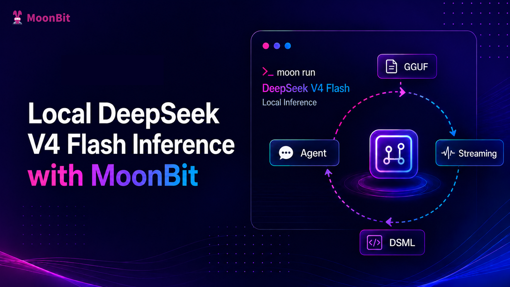

# Local Inference with DeepSeek V4 Flash Using MoonBit



We recently built a MoonBit native binding for DwarfStar 4 (DS4): [`tonyfettes/ds4`](https://github.com/moonbit-community/tonyfettes-ds4). Through this binding, MoonBit programs can now directly load local GGUF models, create inference sessions, encode chat prompts, sample tokens, and stream the generated output of DeepSeek V4 Flash.

[DwarfStar](https://github.com/antirez/ds4) is a compact inference engine by antirez (the creator of Redis), deeply optimized for the DeepSeek V4 model architecture. This means a MoonBit program can run a complete LLM inference loop locally: there is no need to send prompts to a remote API, nor to wrap model capabilities in another external service. The model file lives locally, inference happens locally, and the application-layer control flow runs right inside MoonBit.

## From Chat API to Token Stream and Tool Call

Many users are familiar with chat or coding assistant applications like ChatGPT, Codex, and Claude Code: you type a message, and the model streams its output while thinking; sometimes the model also requests to read a file, run a command, or invoke a tool.

From an application developer's perspective, this usually manifests as an API call: send messages, a system prompt, tool definitions, and sampling parameters to a model service, then receive a stream of events from the server. Different platforms call this interface chat completion, responses, messages, or other names, but underneath they all boil down to the same process: converting the conversation into a token sequence, then having the model generate one token at a time.

A typical flow goes roughly like this:

1. The application organizes user input, system instructions, history messages, and tool descriptions into the prompt the model expects.

2. The tokenizer splits the prompt into token IDs, including both ordinary text tokens and model-specific special tokens.

3. The inference engine feeds these tokens into the model and obtains a probability distribution over "what the next token should be."

4. The sampler selects a token based on parameters such as temperature and top-p.

5. This token is decoded into a text fragment and sent to the client as a stream delta.

6. The newly generated token is fed back into the model to continue predicting the next token.

7. This loop continues until an end-of-sequence token, a stop sequence, or an explicit stop from the application.

So, the "streaming output" seen in an API is essentially a wrapper around autoregressive inference. The model does not spit out a complete answer all at once; it keeps predicting the next token. The API service then wraps these tokens into an event stream that is more convenient for applications to consume.

Different models have different chat templates. When DS4 loads a GGUF vocabulary, it identifies a set of special tokens, for example:

- `<｜begin▁of▁sentence｜>`: start of conversation.
- `<｜User｜>`: what follows is a user message.
- `<｜Assistant｜>`: what follows is an assistant reply.
- `<think>` / `</think>`: controls or marks thinking content.
- `<｜end▁of▁sentence｜>`: end of generation.
- `｜DSML｜`: part of the DeepSeek tool-call markup.

Suppose the user input is:

```Plain
Write a short haiku about MoonBit
```

In DS4, when constructing the prompt to feed the model, the raw sentence is not handed to the model as-is. Instead, it gets turned into something like:

```Plain
<｜begin▁of▁sentence｜>
You are a helpful assistant
<｜User｜>
Write a short haiku about MoonBit
<｜Assistant｜>
<think>
```

Here, `<｜begin▁of▁sentence｜>`, `<｜User｜>`, `<｜Assistant｜>`, and `<think>` are special tokens in the vocabulary and are directly mapped to corresponding token IDs; ordinary text is split into multiple tokens by the BPE tokenizer. If thinking mode is disabled, DS4 places `</think>` after the assistant prefix, effectively telling the model to enter the answering phase directly.

Tool calls follow a similar idea. The model does not actually execute tools — it only generates structured intents; the host program always performs the actual tool execution. DeepSeek V4's tool-call format is not arbitrary text. DS4 locates the special token `｜DSML｜` and renders the DSML tool-call text around it, for example:

```Plain
<｜DSML｜tool_calls>
<｜DSML｜invoke name="read_file">
<｜DSML｜parameter name="path" string="true">README.md</｜DSML｜parameter>
</｜DSML｜invoke>
</｜DSML｜tool_calls>
```

There are two layers to distinguish here: `｜DSML｜` itself is a special token in the vocabulary; however, the full tags `<｜DSML｜tool_calls>`, `<｜DSML｜invoke ...>`, and `<｜DSML｜parameter ...>` are not each separate special tokens — they are a DSML text protocol composed of ordinary characters together with the `｜DSML｜` special token. After the model generates this text, the server or host program parses it into OpenAI/Anthropic-style tool-call events.

If the model is running remotely, the API service typically handles these details for the application. If the model runs locally, the host program needs to control the token stream itself, parse tool calls, execute tools, and update the context. MoonBit plays exactly this host-program role here.

## Building a Local Agent with MoonBit

The repository contains `cmd/ds4mbt`, a MoonBit coding micro-agent. It builds on the same DS4 binding layer, connecting local DeepSeek V4 Flash inference to a simple tool-calling loop.

The basic loop of `cmd/ds4mbt` can be summarized as:

1. Write the user task, working directory, and tool descriptions into the transcript.

2. Call the DS4 binding to generate one round of assistant response.

3. Parse `read`, `write`, `edit`, and `bash` invocations from the `<｜DSML｜tool_calls>` block in the response.

4. Execute those tools inside MoonBit.

5. Append observations back to the transcript.

6. Continue the next round of inference until the model stops emitting tool calls.

It defines four tools in the system prompt and asks the model to output tool calls in DSML:

```Plain
<｜DSML｜tool_calls>
<｜DSML｜invoke name="read">
<｜DSML｜parameter name="path" string="true">relative/path</｜DSML｜parameter>
</｜DSML｜invoke>
<｜DSML｜invoke name="bash">
<｜DSML｜parameter name="command" string="true">moon check --target native</｜DSML｜parameter>
</｜DSML｜invoke>
</｜DSML｜tool_calls>
```

The MoonBit side is responsible for parsing this DSML block, converting invocations into internal tool calls, and then executing file reads, writes, edits, or shell commands. Tool results are written back into the transcript as observations and become part of the model's context in the next inference round.

This structure closely mirrors how coding assistants operate. The model does not directly touch the file system, nor does it directly run commands; it only generates tool intents. The MoonBit program turns those intents into real operations and feeds the results back to the model.

To use it, first build the command:

```Bash
moon build cmd/ds4mbt --target native
```

Then let the local model execute a workspace task:

```Bash
moon run cmd/ds4mbt --target native -- \
  --model /path/to/model.gguf \
  --cwd /path/to/project \
  --prompt "Read the MoonBit package and explain the main entry point."
```

This is only a micro-agent, but it demonstrates the critical path: MoonBit can locally control the token stream, chat template, session state, and tool-call loop. Model inference is the job of the DS4 runtime; application orchestration is the job of MoonBit.

## Outlook

[`tonyfettes/ds4`](https://github.com/moonbit-community/tonyfettes-ds4) is still an early binding, and there are many areas worth further polishing.

First is a higher-level chat / agent API. The current interface is already sufficient to power a CLI and a micro-agent, but it can be further refined into a more stable library surface — for example, message abstraction, streaming callbacks, stop conditions, error types, and long-running session management.

Second is a local OpenAI/Anthropic-style interface. Since remote APIs can organize model output into token streams, message deltas, and tool-call events, a local runtime can provide similar abstractions. In the future, the MoonBit side could expose APIs closer to these application models, making it easier to swap a remote model service for a local one.

Third is a more complete agent runtime, or integration with existing agent frameworks. `cmd/ds4mbt` is currently a micro-agent; future directions include exploring permission control, tool isolation, parallel tool calls, resumable transcripts, structured logging, and more robust tool parsing.

Once DeepSeek V4 Flash can run locally inside a MoonBit program, the focus is no longer just "calling a C runtime." It is about MoonBit becoming the control layer for local model applications: organizing token streams, managing context, parsing tool calls, executing tools, and composing these capabilities into its own toolchain and applications.
