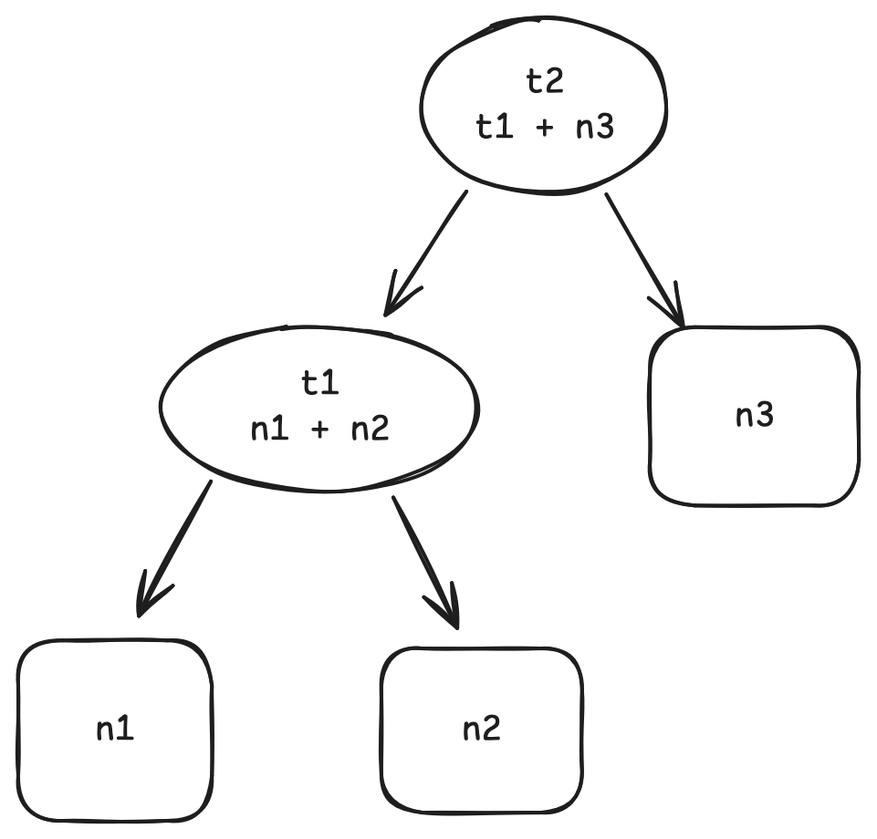
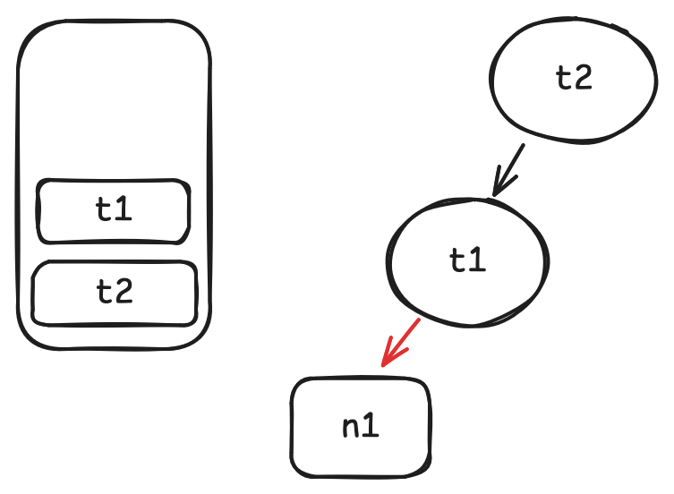
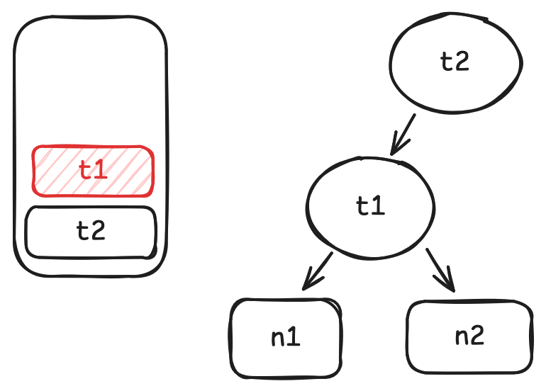

# Mini-adapton: 用 MoonBit 实现增量计算


## 介绍

让我们先用一个类似 excel 的例子感受一下增量计算长什么样子. 首先, 定义一个这样的依赖图:



在这个图中, `t1` 的值通过 `n1 + n2` 计算得到, `t2` 的值通过 `t1 + n3` 计算得到.

当我们想得到 `t2` 的值时, 该图定义的计算将被执行: 首先通过 `n1 + n2` 算出 `t1`, 再通过 `t1 + n3` 算出 `t2`. 这个过程和非增量计算是相同的.

但当我们开始改变`n1`, `n2` 或 `n3` 的值时, 事情就不一样了. 比如说我们想将 `n1` 和 `n2` 的值互换, 再得到 `t2` 的值. 在非增量计算中, `t1` 和 `t2` 都将被重新计算一遍, 但实际上 `t2` 是不需要被重新计算的, 因为它依赖的两个值 `t1` 和 `n3` 都没有改变 (将 `n1` 和 `n2` 的值互换不会改变 `t1` 的值).

下面的代码实现了我们刚刚举的例子. 我们使用 `Cell::new` 来定义 `n1`, `n2` 和 `n3` 这些不需要计算的东西, 使用 `Thunk::new` 来定义 `t1` 和 `t2` 这样需要计算的东西.

```mbt
test {
  // a counter to record the times of t2's computation
  let mut cnt = 0
  // start define the graph
  let n1 = Cell::new(1)
  let n2 = Cell::new(2)
  let n3 = Cell::new(3)
  let t1 = Thunk::new(fn() {
    n1.get() + n2.get()
  })
  let t2 = Thunk::new(fn() {
    cnt += 1
    t1.get() + n3.get()
  })
  // get the value of t2
  inspect(t2.get(), content="6")
  inspect(cnt, content="1")
  // swap value of n1 and n2
  n1.set(2)
  n2.set(1)
  inspect(t2.get(), content="6")
  // t2 does not recompute
  inspect(cnt, content="1")
}
```

在这篇文章中, 我们将介绍如何在 MoonBit 中实现一个增量计算库. 这个库的 API 就是我们上面例子中出现的那些:

```
Cell::new
Cell::get
Cell::set
Thunk::new
Thunk::get
```

## 问题分析和解法

要实现这个库, 我们主要有三个问题需要解决:

### 如何在运行时构建依赖图

作为一个使用 MoonBit 实现的库, 没有简单方法让我们可以静态地构建依赖图, 因为 MoonBit 目前还不支持任何元编程的机制. 因此我们需要动态地把依赖图构建出来. 事实上, 我们关心的只是哪些 thunk 或 cell 被另一个 thunk 依赖了, 所以一个不错的构建依赖图的时机就是在用户调用 `Thunk::get` 的时候. 比如在上面的例子中:

```mbt skip
let n1 = Cell::new(1)
let n2 = Cell::new(2)
let n3 = Cell::new(3)
let t1 = Thunk::new(fn() { n1.get() + n2.get() })
let t2 = Thunk::new(fn() { t1.get() + n3.get() })
t2.get()
```

当用户调用 `t2.get()` 时, 我们在运行时会知道 `t1.get()` 和 `n3.get()` 在其中也被调用了. 因此 `t1` 和 `n3` 是 `t2` 的依赖, 并且我们可以构建一个这样的图:


同样的过程也会在 `t1.get()` 被调用时发生.

所以计划是这样的:

1. 我们定义一个栈来记录我们当前在获得哪个 thunk 的值. 在这里使用栈的原因是, 我们事实上是在尝试记录每个 `get` 的调用栈.
1. 当我们调用 `get` 时, 将其标记为栈顶 thunk 的依赖, 如果它是一个 thunk, 再把它压栈.
1. 当一个 thunk 的 `get` 结束时, 将它出栈.

让我们看看上面那个例子在这个算法下的过程是什么样子的:

1. 当我们调用 `t2.get` 时, 将 `t2` 压栈.

   

1. 当我们在 `t2.get` 中调用 `t1.get` 时, 将 `t1` 记为 `t2` 的依赖, 并将 `t1` 压栈.

   

1. 当我们在 `t1.get` 中调用 `n1.get` 时, 将 n1 记为 `t1` 的依赖

   

1. 相同的过程发生在 `n2` 身上.

   

1. 当 `t1.get` 结束时, 将 `t1` 出栈.

   

1. 当我们调用 `n3.get` 时, 将 `n3` 记为 `t2` 的依赖.

   

除了这些从父依赖到子依赖的边之外, 我们最好也记录一个从子依赖到父依赖的边, 方便后面我们在这个图上反向便利.

在接下来的代码中, 我们将使用 `outgoing_edges` 指代从父依赖到子依赖的边, 使用 `incoming_edges` 指代中子依赖到父依赖的边.

### 如何标记过时的节点

当我们调用 `Cell::set` 时, 该节点本身和所有依赖它的节点都应该被标记为过时的. 这将在后面作为判断一个 thunk 是否需要重新计算的标准之一. 这基本上是一个从图的叶子节点向后遍历的过程. 我们可以用这样的伪 MoonBit 代码表示这个算法:

```moonbit skip
fn dirty(node: Node) -> Unit {
  for n in node.incoming_edges {
    n.set_dirty(true)
    dirty(node)
  }
}
```

### 如何决定一个 thunk 需要被重新计算

当我们调用 `Thunk::get` 时, 我们需要决定是否它需要被重新计算. 但只用我们在上一节描述的方法是不够的. 如果我们只使用是否过时这一个标准进行判断, 势必会有不需要的计算发生. 比如我们在一开始给出的例子:

```mbt skip
n1.set(2)
n2.set(1)
inspect(t2.get(), content="6")
```

当我们调换 `n1` 和 `n2` 的值时, `n1`, `n2`, `t1` 和 `t2` 都应该被标记为过时, 但当我们调用 `t2.get` 时, 其实没有必要重新计算 `t2`, 因为 `t1` 的值并没有改变.

这提醒我们除了过时之外, 我们还要考虑依赖的值是否和它上一次的值一样. 如果一个节点既是过时的, 并且它的依赖中存在一个值和上一次不同, 那么它应该被重新计算.

我们可以用下面的伪 MoonBit 代码描述这个算法:

```mbt skip
fn propagate(self: Node) -> Unit {
  // 当一个节点过时了, 它可能需要被重新计算
  if self.is_dirty() {
    // 重新计算之后, 它将不在是过时的
    self.set_dirty(false)
    for dependency in self.outgoing_edges() {
      // 递归地重新计算每个依赖
      dependency.propagate()
      // 如果一个依赖的值改变了, 这个节点需要被重新计算
      if dependency.is_changed() {
        // 移除所有的 outgoing_edges, 它们将在被计算时重新构建
        self.outgoing_edges().clear()
        self.evaluate()
        return
      }
    }
  }
}
```

## 实现

基于上面描述的代码, 实现是比较直观的.

首先, 我们先定义 `Cell`:

```mbt
struct Cell[A] {
  mut is_dirty : Bool
  mut value : A
  mut is_changed : Bool
  incoming_edges : Array[&Node]
}
```

由于 `Cell` 只会是依赖图中的叶子节点, 所以它没有 `outgoing_edges`. 这里出现的特征 `Node` 是用来抽象依赖图中的节点的.

接着, 我们定义 `Thunk`:

```mbt
struct Thunk[A] {
  mut is_dirty : Bool
  mut value : A?
  mut is_changed : Bool
  thunk : () -> A
  incoming_edges : Array[&Node]
  outgoing_edges : Array[&Node]
}
```

`Thunk` 的值是可选的, 因为它只有在我们第一次调用 `Thunk::get` 之后才会存在.

我们可以很简单地给这两个类型实现 `new`:

```mbt
fn[A : Eq] Cell::new(value : A) -> Cell[A] {
  Cell::{
    is_changed: false,
    value,
    incoming_edges: [],
    is_dirty: false,
  }
}
```

```mbt
fn[A : Eq] Thunk::new(thunk : () -> A) -> Thunk[A] {
  Thunk::{
    value: None,
    is_changed: false,
    thunk,
    incoming_edges: [],
    outgoing_edges: [],
    is_dirty: false,
  }
}
```

`Thunk` 和 `Cell` 是依赖图的两种节点, 我们可以使用一个特征 `Node` 来抽象它们:

```mbt
trait Node {
  is_dirty(Self) -> Bool
  set_dirty(Self, Bool) -> Unit
  incoming_edges(Self) -> Array[&Node]
  outgoing_edges(Self) -> Array[&Node]
  is_changed(Self) -> Bool
  evaluate(Self) -> Unit
}
```

为两个类型实现这个特征:

```mbt
impl[A] Node for Cell[A] with incoming_edges(self) {
  self.incoming_edges
}

impl[A] Node for Cell[A] with outgoing_edges(_self) {
  []
}

impl[A] Node for Cell[A] with is_dirty(self) {
  self.is_dirty
}

impl[A] Node for Cell[A] with set_dirty(self, new_dirty) {
  self.is_dirty = new_dirty
}

impl[A] Node for Cell[A] with is_changed(self) {
  self.is_changed
}

impl[A] Node for Cell[A] with evaluate(_self) {
  ()
}

impl[A : Eq] Node for Thunk[A] with is_changed(self) {
  self.is_changed
}

impl[A : Eq] Node for Thunk[A] with outgoing_edges(self) {
  self.outgoing_edges
}

impl[A : Eq] Node for Thunk[A] with incoming_edges(self) {
  self.incoming_edges
}

impl[A : Eq] Node for Thunk[A] with is_dirty(self) {
  self.is_dirty
}

impl[A : Eq] Node for Thunk[A] with set_dirty(self, new_dirty) {
  self.is_dirty = new_dirty
}

impl[A : Eq] Node for Thunk[A] with evaluate(self) {
  node_stack.push(self)
  let value = (self.thunk)()
  self.is_changed = match self.value {
    None => true
    Some(v) => v != value
  }
  self.value = Some(value)
  node_stack.unsafe_pop() |> ignore
}
```

这里唯一复杂的实现是 `Thunk` 的 `evaluate`. 这里我们需要先把这个 thunk 推到栈顶用于后面的依赖记录. `node_stack` 的定义如下:

```mbt
let node_stack : Array[&Node] = []
```

然后做真正的计算, 并且把计算得到的值和上一个值做比较以更新 `self.is_changed`. `is_changed` 会在后面帮助我们判断是否需要重新计算一个 thunk.

`dirty` 和 `propagate` 的实现几乎和上面的伪代码相同:

```mbt
fn &Node::dirty(self : &Node) -> Unit {
  for dependent in self.incoming_edges() {
    if not(dependent.is_dirty()) {
      dependent.set_dirty(true)
      dependent.dirty()
    }
  }
}
```

```mbt
fn &Node::propagate(self : &Node) -> Unit {
  if self.is_dirty() {
    self.set_dirty(false)
    for dependency in self.outgoing_edges() {
      dependency.propagate()
      if dependency.is_changed() {
        self.outgoing_edges().clear()
        self.evaluate()
        return
      }
    }
  }
}
```

有了这些函数的帮助, 最主要的三个 API: `Cell::get`, `Cell::set` 和 `Thunk::get` 实现起来就比较简单了.

为了得到一个 cell 的值, 我们直接返回结构体的 `value` 字段即可. 但在此之前, 如果它是在一个 `Thunk::get` 中被调用的, 我们要先把他记录为依赖.

```mbt
fn[A] Cell::get(self : Cell[A]) -> A {
  if node_stack.last() is Some(target) {
    target.outgoing_edges().push(self)
    self.incoming_edges.push(target)
  }
  self.value
}
```

当我们更改一个 cell 的值时, 我们需要先确保 `is_changed` 和 `dirty` 这两个状态被正确地更新了, 再将它的每一个父依赖标记为过时.

```mbt
fn[A : Eq] Cell::set(self : Cell[A], new_value : A) -> Unit {
  if self.value != new_value {
    self.is_changed = true
    self.value = new_value
    self.set_dirty(true)
    &Node::dirty(self)
  }
}
```

和 `Cell::get` 类似, 在实现 `Thunk::get` 时我们需要先将 `self` 记录为依赖. 之后我们模式匹配 `self.value`, 如果它是 `None`, 这意味着这是第一次用户尝试计算这个 thunk 地值, 我们可以简单地直接计算它; 如果它是 `Some`, 我们需要使用 `propagate` 来确保我们只重新计算那些需要的 thunk.

```mbt
fn[A : Eq] Thunk::get(self : Thunk[A]) -> A {
  if node_stack.last() is Some(target) {
    target.outgoing_edges().push(self)
    self.incoming_edges.push(target)
  }
  match self.value {
    None => self.evaluate()
    Some(_) => &Node::propagate(self)
  }
  self.value.unwrap()
}
```

## 参考

- [Adapton: Composable, demand-driven incremental computation, PLDI 2014](http://matthewhammer.org/adapton/) adapton 的原论文
- [illusory0x0/adapton.mbt](https://github.com/moonbit-community/adapton.mbt) adapton 库的 MoonBit 实现
