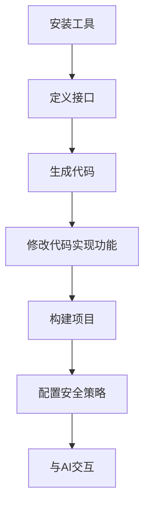

# 使用 MoonBit 和 Wassette 构建安全的 WebAssembly 工具


欢迎来到 MoonBit 和 Wassette 的世界！本教程将带您一步步构建一个基于 WebAssembly
组件模型的安全工具。通过一个实用的天气查询应用示例，您将学习如何利用 MoonBit
的高效性和 wassette 的安全特性，创建功能强大的 AI 工具。

## wassette 和 MCP 简介

MCP（Model Completion Protocol）是 AI 模型与外部工具交互的协议。当 AI
需要执行特定任务（如网络访问或数据查询）时，会通过 MCP
调用相应工具。这种机制扩展了 AI 的能力，但也带来安全挑战。

wassette 是微软开发的一个基于 WebAssembly 组件模型的运行时，为 AI
系统提供安全执行外部工具的环境。它通过沙箱隔离和精确的权限控制，解决了 AI
工具可能带来的安全风险。

wassette 让工具运行在隔离环境中，权限受策略文件严格限制，接口通过
WIT（WebAssembly Interface Type）清晰定义。同时，也利用 WIT
接口来生成工具交互的数据格式。

## 总体流程

在开始之前，让我们先了解一下整体流程：



让我们开始这段奇妙的旅程吧！

## 第1步：安装必要工具

首先，我们需要安装三个工具（我们假设已经安装 MoonBit 工具链）：

- **wasm-tools**：WebAssembly 工具集，用于处理和操作 Wasm 文件
- **wit-deps**：WebAssembly 接口类型依赖管理器
- **wit-bindgen**：WebAssembly 接口类型绑定生成器，用于生成语言绑定
- **wassette**：基于 Wasm 组件模型的运行时，用于执行我们的工具

其中，`wasm-tools` `wit-deps` `wit-bindgen` 可通过 cargo 安装（需安装 Rust）：

```bash
cargo install wasm-tools
cargo install wit-deps
cargo install wit-bindgen-cli
```

或从 GitHub Release 下载：

- wit-bindgen:
  https://github.com/bytecodealliance/wit-bindgen/releases/tag/v0.45.0
- wasm-tools:
  https://github.com/bytecodealliance/wasm-tools/releases/tag/v1.238.0
- wit-deps: https://github.com/bytecodealliance/wit-deps/releases/tag/v0.5.0

`wassette` 需从 GitHub Release 下载：

- wassette: https://github.com/microsoft/wassette/releases/tag/v0.3.4

## 第2步：定义接口

接口定义是整个工作流程的核心。我们使用 WebAssembly 接口类型 (WIT)
格式来定义组件的接口。

首先，创建项目目录和必要的子目录：

```bash
mkdir -p weather-app/wit
cd weather-app
```

### 创建 wit/deps.toml

在 `wit` 目录下创建 `deps.toml` 文件，定义项目依赖：

```toml
cli = "https://github.com/WebAssembly/wasi-cli/archive/refs/tags/v0.2.7.tar.gz"
http = "https://github.com/WebAssembly/wasi-http/archive/refs/tags/v0.2.7.tar.gz"
```

这些依赖项指定了我们将使用的 WASI（WebAssembly 系统接口）组件：

- `cli`：提供命令行接口功能。在这个例子中未使用。
- `http`：提供 HTTP 客户端和服务器功能。在这个例子中使用客户端功能。

然后，运行 `wit-deps update`。这个命令会获取依赖，并在 `wit/deps/` 目录下展开。

### 创建 wit/world.wit

接下来，创建 `wit/world.wit` 文件来定义我们的组件接口。 WIT
是一种声明式接口描述语言，专为 WebAssembly
组件模型设计。它允许我们定义组件之间如何交互，而不需要关心具体的实现细节。
具体详情可以查看 [组件模型](https://component-model.bytecodealliance.org/)
手册。

```wit
package peter-jerry-ye:weather@0.1.0;

world w {
  import wasi:http/outgoing-handler@0.2.7;
  export get-weather: func(city: string) -> result<string, string>;
}
```

这个 WIT 文件定义了：

- 一个名为 `peter-jerry-ye:weather` 的包，版本为 0.1.0
- 一个名为 `w` 的世界（world），它是组件的主要接口
- 导入 WASI HTTP 的对外请求接口
- 导出一个名为 `get-weather`
  的函数，它接受一个城市名称字符串，返回一个结果（成功时为天气信息字符串，失败时为错误信息字符串）

## 第3步：生成代码

现在我们已经定义了接口，下一步是生成相应的代码骨架。我们使用 `wit-bindgen`
工具来为 MoonBit 生成绑定代码：

```bash
# 确保您在项目根目录下
wit-bindgen moonbit --derive-eq --derive-show --derive-error wit
```

这个命令会读取 `wit` 目录中的文件，并生成相应的 MoonBit 代码。生成的文件将放在
`gen` 目录下。

注：当前生成版本存在部分警告，之后会进行修复。

生成的目录结构应该如下：

```
.
├── ffi/
├── gen/
│   ├── ffi.mbt
│   ├── moon.pkg.json
│   ├── world
│   │   └── w
│   │       ├── moon.pkg.json
│   │       └── stub.mbt
│   └── world_w_export.mbt
├── interface/
├── moon.mod.json
├── Tutorial.md
├── wit/
└── world/
```

这些生成的文件包含了：

- 基础的 FFI（外部函数接口）代码（`ffi/`）
- 生成的导入函数（`world/` `interface/`
- 导出函数的包装器（`gen/`）
- 待实现的 `stub.mbt` 文件

## 第4步：修改生成的代码

现在我们需要修改生成的存根文件，实现我们的天气查询功能。主要需要编辑的是
`gen/world/w/stub.mbt` 文件以及同目录下的
`moon.pkg.json`。在此之前，先让我们添加一下依赖，方便后续实现：

```bash
moon update
moon add moonbitlang/x
```

```json
{
  "import": [
    "peter-jerry-ye/weather/interface/wasi/http/types",
    "peter-jerry-ye/weather/interface/wasi/http/outgoingHandler",
    "peter-jerry-ye/weather/interface/wasi/io/poll",
    "peter-jerry-ye/weather/interface/wasi/io/streams",
    "peter-jerry-ye/weather/interface/wasi/io/error",
    "moonbitlang/x/encoding"
  ]
}
```

让我们看一下生成的存根代码：

```moonbit
// Generated by `wit-bindgen` 0.44.0.

///|
pub fn get_weather(city : String) -> Result[String, String] {
  ... // 这里是我们需要实现的部分
}
```

现在，我们需要添加实现代码，使用 HTTP 客户端请求天气信息。编辑
`gen/world/w/stub.mbt` 文件，编辑如下：

```moonbit
///|
pub fn get_weather(city : String) -> Result[String, String] {
  (try? get_weather_(city)).map_err(_.to_string())
}

///| 利用 MoonBit 错误处理机制，简化实现
fn get_weather_(city : String) -> String raise {
  // 创建请求
  let request = @types.OutgoingRequest::outgoing_request(
    @types.Fields::fields(),
  )
  // 为了天气，我们访问 wttr.in 来获取
  if request.set_authority(Some("wttr.in")) is Err(_) {
    fail("Invalid Authority")
  }
  // 我们采用最简单的格式
  if request.set_path_with_query(Some("/\{city}?format=3")) is Err(_) {
    fail("Invalid path with query")
  }
  if request.set_method(Get) is Err(_) {
    fail("Invalid Method")
  }
  // 发出请求
  let future_response = @outgoingHandler.handle(request, None).unwrap_or_error()
  defer future_response.drop()
  // 在这里，我们采用同步实现，等待请求返回
  let pollable = future_response.subscribe()
  defer pollable.drop()
  pollable.block()
  // 在请求返回后，我们获取结果
  let response = future_response.get().unwrap().unwrap().unwrap_or_error()
  defer response.drop()
  let body = response.consume().unwrap()
  defer body.drop()
  let stream = body.stream().unwrap()
  defer stream.drop()
  // 将数据流解码为字符串
  let decoder = @encoding.decoder(UTF8)
  let builder = StringBuilder::new()
  loop stream.blocking_read(1024) {
    Ok(bytes) => {
      decoder.decode_to(
        bytes.unsafe_reinterpret_as_bytes()[:],
        builder,
        stream=true,
      )
      continue stream.blocking_read(1024)
    }
    // 如果流被关闭，则视为 EOF，正常结束
    Err(Closed) => decoder.decode_to("", builder, stream=false)
    // 如果出错，我们获取错误信息
    Err(LastOperationFailed(e)) => {
      defer e.drop()
      fail(e.to_debug_string())
    }
  }
  builder.to_string()
}
```

这段代码实现了以下功能：

1. 创建一个 HTTP 请求，目标是 `wttr.in` 天气服务
2. 设置请求路径，包含城市名称和格式参数
3. 发送请求并等待响应
4. 从响应中提取内容
5. 解码内容并返回天气信息字符串

这段代码使用了 WASI HTTP 接口来发送请求，以同步 API 进行交互。其中，`defer`
关键字确保资源在使用后被正确释放。

## 第5步：构建项目

现在我们已经实现了功能，下一步是构建项目。

```bash
# 编译 MoonBit 代码，生成核心 WebAssembly 模块
moon build --target wasm
# 嵌入 WIT 接口信息，指定字符串编码
wasm-tools component embed wit target/wasm/release/build/gen/gen.wasm -o core.wasm --encoding utf16
# 将核心 Wasm 模块转化为 Wasm 组件模块
wasm-tools component new core.wasm -o weather.wasm
```

构建成功后，会在项目根目录生成 `weather.wasm` 文件，这就是我们的 WebAssembly
组件。

之后，我们将它加载到 wassette 的路径中。当然，也可以选择通过对话，让 AI
来进行动态加载，不仅可以加载本地文件，也可以加载远程服务器上的文件。

```bash
wassette component load file://$(pwd)/component.wasm
```

## 第6步（可选）：配置安全策略

wassette 会严格控制 WebAssembly
组件的权限，这是确保工具安全性的关键部分。这也是构建安全 MCP
工具的核心环节，通过细粒度的权限控制，我们可以确保工具只能执行预期的操作。

AI 可以在运行时通过调用默认的 wassette
的工具来进行赋权。我们可以预先执行这些命令。在我们的例子中，我们希望它能够访问
`wttr.in` 这个网站。因此，我们可以运行如下指令：

```bash
wassette permission grant network weather wttr.in
```

## 第7步：与 AI 交互

最后，我们可以使用 wassette 运行我们的组件，并与 AI 交互。以 VSCode Copilot
为例，我们修改 .vscode/mcp.json，添加服务器：

```json
{
  "servers": {
    "wassette": {
      // 假设 wassette 被添加至路径中
      // 否则请填写 wassette 可执行文件所在路径
      "command": "wassette",
      "args": [
        "serve",
        // 我们在这里禁用动态加载以及动态授权等功能
        "--disable-builtin-tools",
        "--stdio"
      ],
      "type": "stdio"
    }
  },
  "inputs": []
}
```

在刷新重启 wassette 后，我们便可以询问 AI 当前某个城市的天气。

当然，如果我们允许使用动态加载功能，我们也可以和 AI 这么说：

> 用 wassette，加载组件 `./component.wasm`（注意使用 file
> schema），并查询深圳的天气

于是，AI 便会先后调用 `load-component` 以及 `get-weather`
两个工具，获取天气，并且给出最后回答：

> 组件已成功加载，深圳的天气是：☀️ +30°C。

## 总结

到这里，我们成功创建了一个基于 WebAssembly 组件模型的安全 MCP 工具，它可以：

1. 通过定义清晰的接口
2. 利用 MoonBit 的高效性
3. 在 wassette 的安全沙箱中运行
4. 与 AI 进行交互

Wassette 目前还只是 0.3.4 的版本，还缺少 MCP
的很多概念，如提示词、工作区、反向获取用户指令和 AI
生成能力等。但是它向我们展示了一个快速通过 Wasm 组件模型构建 MCP 的例子。

MoonBit 将会持续优化对于组件模型的能力，包括添加即将到来的 WASIp3
中异步的能力，并简化开发流程。敬请期待！
