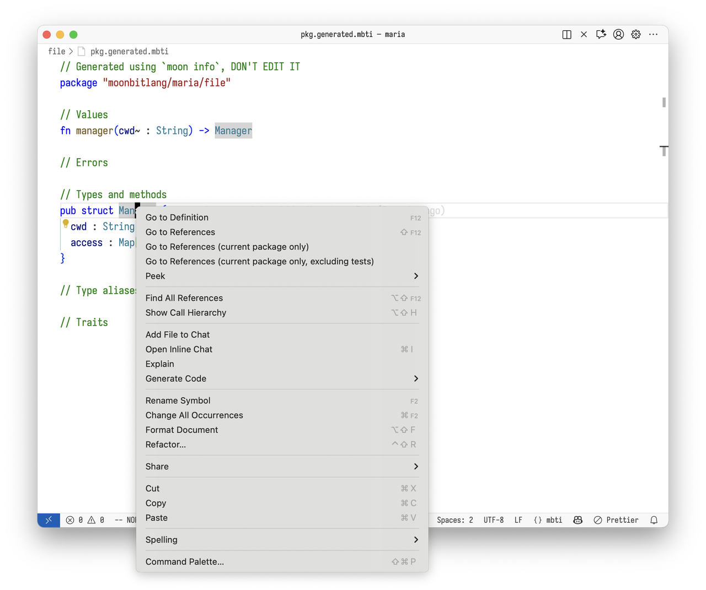
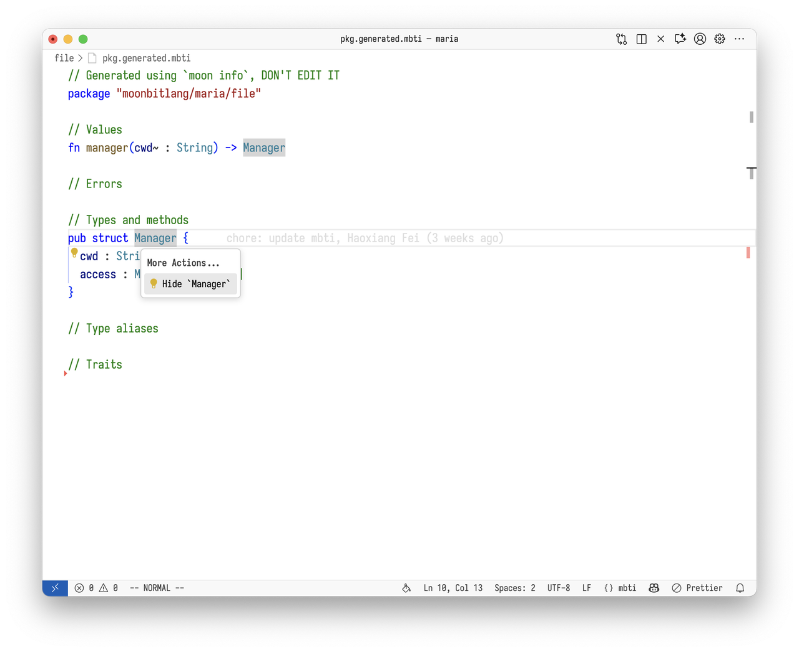

# 20251103 MoonBit 月报 Vol.05

版本号 v0.6.30+07d9d2445
## 编译器更新


#### 1. 对于 alias 系统的更新。

过去在 MoonBit 中我们针对 trait、fn 和 type 有三种不同的别名语法：

- `traitalias @pkg.Trait as MyTrait`

- `fnalias @pkg.fn as my_fn`

- `typealias @pkg.Type as MyType`


这种区分带来了不必要的复杂性和限制，例如我们无法为 const 值创建别名。在接下来的版本中，我们将引入新的 `using` 语法来统一这些别名的创建方式。

`using { ... }` 的语法用于统一 `traitalias`，`fnalias`，和**简单**的`typealias`，其具体语法如下：

```mbt
using @pkg {
  value,
  CONST,
  type Type,
  trait Trait,
}
 ```

该语法会创建重名别名，使得在当前包内可直接使用 `value`，`CONST`，`Type`，`Trait` 引用 `@pkg` 的内容。

在 `using` 前面可以增加 `pub` 使得这些别名对外可见。

在 `using` 语句中也可以使用 `as` 关键字进行重命名，例如：

 ```mbt
using @pkg {
  value as another_value
}
 ```

这样就会创建一个名为 `another_value` 的别名指向 `@pkg.value`。但我们并不鼓励使用 `as` 进行重命名，因为这会降低代码的可读性，所以目前编译器会对使用 `as` 的地方报一个警告。我们会在将来移除这个语法，目前保留它是为了让大家可以使用 `using` 来迁移 `fnalias`。

除了 `using`，本次更新还新增了 type/trait 上的 `#alias` 属性支持。因此，现在所有顶层定义都可以用 `#alias` 来创建别名了。

前面提到的**简单**的 typealias 是指只单纯的创建了类型的别名，例如 `typealias @pkg.Type as MyType`，对于更复杂的类型别名，它们无法用 `using` 来创建，于是我们引入了 `type AliasType = ...` 的语法来创建复杂类型的别名，例如：

```mbt
  type Handler = (Request, Context) -> Response
  type Fun[A, R] = (A) -> R
```

总体来说，将来我们会彻底删除 `traitalias`，`fnalias` 和 `typealias`，并用 `using`，`type Alias = ...` 和 `#alias` 来替代它们。其中：

- `using` 用于在当前包内创建另一个包的别名，例如用于引入其他包中的定义

- `type Alias = ...` 用于创建复杂类型的别名

- `#alias` 用于为当前包的内容创建别名，例如用于进行命名修改的迁移


使用 `moon fmt` 可以自动完成大部分迁移。后续我们会对旧的 `typealias`/`traitalias`/`fnalias` 语法汇报警告，并最终移除它们

#### 2. 测试名重名检查。现在编译器将对重名的测试名报告警告。

#### 3. 实验性 lexmatch 更新
实验性 lexmatch 更新支持了类似`is`表达式的 `lexmatch?` 表达式，和 case-insensitive modifier 语法`(?i:...)`。详情请查看 [proposal](https://github.com/moonbitlang/moonbit-evolution/pull/15)

```moonbit
if url lexmatch? (("(?i:ftp|http(s)?)" as protocol) "://", _) with longest {
  println(protocol)
}
```

#### 4. 增加了对anti-pattern的linting检查
编译器增加了对一些 anti-pattern 的 linting 检查，会在编译时报告警告。目前包括以下检查：

anti-pattern:

```mbt
match (try? expr) {
  Ok(value) => <branch_ok>
  Err(err) => <branch_err>
}
```

修改建议：

```mbt
try expr catch {
  err => <branch_err>
} noraise {
  value => <branch_ok>
}
```

anti-pattern:

```mbt
"<string literal>" * n
```

修改建议

```mbt
"<string literal>".repeat(n)
```


#### 5. 新增了`ReadOnlyArray` 内置类型
编译器中新增了`ReadOnlyArray` 内置类型，`ReadOnlyArray` 表示定长不可变数组，它主要应用场景是作为 lookup table 的类型使用，使用 `ReadOnlyArray` 时，如果其中元素全部都是字面量，可以保证其在 C/LLVM/Wasmlinear 后端被静态初始化。其使用方式与 FixedArray 基本一致，比如：


```moonbit
let int_pow10 : ReadOnlyArray[UInt64] = [
  1UL, 10UL, 100UL, 1000UL, 10000UL, 100000UL, 1000000UL, 10000000UL, 100000000UL,
  1000000000UL, 10000000000UL, 100000000000UL, 1000000000000UL, 10000000000000UL,
  100000000000000UL, 1000000000000000UL,
]

fn main {
  println(int_pow10[0])
}
```

#### 6.  bitstring pattern 语法形式的调整。
之前 bitstring pattern 支持使用 `u1(_)` 这种 pattern 来匹配单个 bit，与此同时，MoonBit 中在使用构造器进行模式匹配时允许省略 payload，比如：


```moonbit
fn f(x: Int?) -> Unit {
  match x {
    Some => ()
    None => ()
  }
}
```

这会导致当使用 `u1` 的时候，会比较困惑于它是个 bitstring pattern 还是单个 identifier，于是为了避免与普通 identifier 产生混淆，在新版本中，我们要求 bitstring pattern 通过后缀的形式写明，比如 `u1be(_)`。（bit 的读取顺序永远是高位优先，所以端序本身对于读取长度不超过 8 bit 的数据时没有意义，这里只在更为显示地提示当前 pattern 使用 bitstring pattern。）

另外因为小端序的语义比较复杂，所以只有当读取的 bit 数量为 8 的整数倍时才可使用小端序，比如 `u32le(_)` 。

总的来说，当前 bitstring pattern 的语法是 `u<width>[le|be]` 其中：

- `width` 的范围是 `(0..64]`

- `le` 和 `be` 的后缀是要写明的，所有 `width` 都支持 `be`，只有 `width` 是 8 的整数倍的时候支持 `le`


#### 7.`#deprecated` 新增了一个参数`skip_current_package`
之前，使用某个当前包内定义的、通过 `#deprecated` 废弃的定义时，编译器不会报警告。这是为了防止测试/递归定义中出现无法消除的警告，但有时候也需要检测当前包内对某个废弃定义的使用。因此，`#deprecated` 新增了一个参数`skip_current_package` ，它的默认值是 `true`，可以用 `#deprecated(skip_current_package=false)` 来覆盖。当 `skip_current_package=false` 时，在当前包内使用这个定义也会报警告

#### 8. moon.pkg DSL 计划

我们计划设计一个新的`moon.pkg`语法来代替原有的`moon.pkg.json` 。新的DSL将会在三个前提下改进`import`信息的编写体验：

- 兼容原有的选项

- 对构建系统的构建速度友好

- 保留`import`"对整个包内有效"的语义


目前提案的`moon.pkg`语法概览（非最终效果）：


```TypeScript
    import {
      "path/to/pkg1",
      "path/to/pkg2",
      "path/to/pkg3" as @alias1,
      "path/to/pkg4" as @alias2,
    }

    // 黑盒测试的import
    import "test" {
      "path/to/pkg5",
      "path/to/pkg6" as @alias3,
    }

    // 白盒测试的import
    import "wbtest" {
      "path/to/pkg7",
      "path/to/pkg8" as @alias4,
    }

    config {
      "is_main": true, // 允许注释
      "alert_list": "+a+b-c",
      "bin_name": "name",
      "bin_target": "target",
      "implement": "virtual-package-name", // 允许尾随逗号
    }
```

提案讨论区和详细内容：https://github.com/moonbitlang/moonbit-evolution/issues/18


## 构建系统更新

#### 1. 弃用 `moon info --no-alias`。在上次月报中，我们增加了 `moon info --no-alias`的功能，用于生成不包含默认 alias 的 `pkg.generated.mbti` 文件：

`moon info`


```mbt
    package "username/hello2"

    import(
    "moonbitlang/core/buffer"
    )

    // Values
    fn new() -> @buffer.Buffer
```

`moon info --no-alias`


```mbt
    package "username/hello2"

    // Values
    fn new() -> @moonbitlang/core/buffer.Buffer
```


在实践中我们发现该功能并没有太多用处，反而增加了维护成本，因此我们决定弃用该功能。

#### 2.更新 `moon new` 生成的模版项目
我们在 `moon new` 生成的模版项目中新增了 `.github/workflows/copilot-setup-steps.yml`，用于帮助用户快速在 MoonBit 项目中使用 GitHub Copilot。


## IDE更新

#### 1. mbti 文件支持引用查找
用户可以在mbti文件中查找某个定义在项目中的引用情况：



如图所示，我们目前支持了三种不同的查找引用的方式：

- Go to References：在该包的所有反向依赖中查找

- Go to References (current package only)：只在该包内部进行查找，包含所有的测试

- Go to References (current pacakge only, excluding tests)：只在该包内部进行查找，并跳过所有的测试

#### 2.mbti 文件支持 Hide 和 Unhide code action，便于重构包的 API





对于 mbti 中的定义，LSP会提供`Hide ...`的code action用于将其变成private，在执行了上面code action后，`Manager`将会变成一个私有定义：


如果执行code action之后没有报错，说明这是一个冗余的API，可以删除；如果有报错，用户可以通过 `Unhide ...`的code action撤销刚才的操作


#### 3. 更新测试后自动格式化被更新的代码块

  在vscode中使用 update codelens更新测试后，被更新的测试会自动格式化。

#### 4. 增加更多 attribute snippet 的补全


## 标准库更新

- 新增了 external iterator 类型 `Iterator`。我们会将 core 中常见的容器类型的迭代器从 internal 迁移到 external。这是为了可以在 `for .. in` 中使用 async 以及支持 `zip` 等 internal iterator 无法支持的 API。`for .. in` 循环现在会优先尝试调用 `.iterator()`/`.iterator2()` 方法、通过 external iterator 进行遍历。在被遍历的类型不支持 external iterator 时，则会 fallback 到原先 internal iterator 类型 `Iter`。未来，我们将通过警告等方式从 internal iterator 迁移到 external iterator，并最终只保留 external iterator


## MGPIC 2025

#### 1. [编译器快速入门](https://github.com/moonbitlang/contest-2025-data/blob/main/compiler-crash-course/readme.md) 一个关于编译器的快速入门教程

#### 2.  [编译器交互式教程](https://github.com/moonbitlang/BuildYourOwnMBT) 我们提供了一个**完整、系统、循序渐进**的教程帮助参赛选手一步一步搭建出一个功能完备的 MiniMoonBit 编译器

#### 3. 九月游戏评比，我们评选了九月份的月度游戏奖项：

- 九月最佳视觉奖：赛博拾荒者-CyberScavenger

- 九月最佳创意奖：水墨之灵-Inkfish，Flappy Bird 增强版


感兴趣的朋友可以进入 https://moonbitlang.github.io/MoonBit-Code-JAM-2025/ 试玩