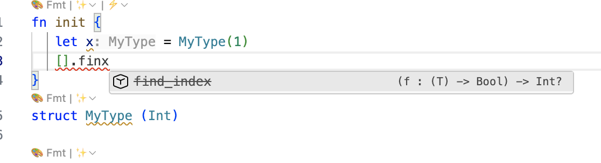
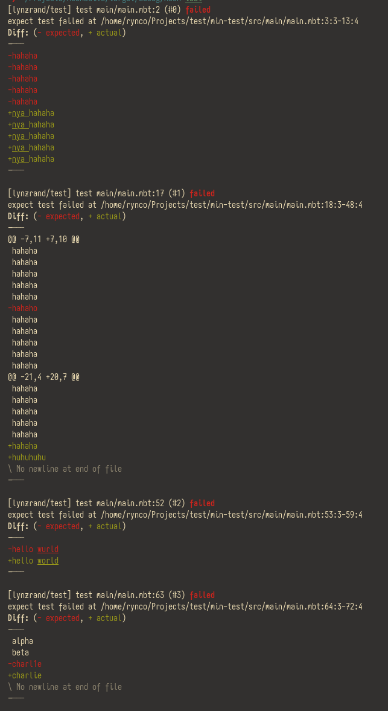

# 20251202 MoonBit 月报 Vol.06

**对应moonc版本：v0.6.33**


## 语言更新
- `ReadOnlyArray` 的功能完善。上个版本中引入了 `ReadOnlyArray` ，它主要用于声明查找表并且编译器会针对 `ReadOnlyArray` 做更多的性能优化。 在这个版本中，`ReadOnlyArray` 相关的特性支持得到了完善，使其使用体验和其他数组类型基本一致，比如对其进行模式匹配，取切片，和 splice 等操作。

  ```mbt
  fn main {
    let xs: ReadOnlyArray[Int] = [1,2,3]
    let _ = xs[1:]
    match xs {
      [1, .. rest] => ...
      ...
    }
    let _ = [..xs, 1]
  }
  ```
-  bitstring pattern 支持 signed extraction，可以将取出的 bits 当作有符号整数进行解释，比如
    ```mbt
    fn main {
      let xs : FixedArray[Byte] = [0x80, 0, 0, 0]
      match xs {
        [i8be(i), ..] => println(i) // prints -128 because 0x80 is treated as signed 8-bit int
        _ => println("error")
      }
    }
    ```

- cascade 函数调用改进
  以前在`x..f()..g()`这种形式的函数调用中，要求`f`的返回类型必须是`Unit`。现在解除了这个限制，当`f`会返回一个`Unit`以外类型的值时，将触发`invalid_cascade`警告，在运行时这个返回值会被隐式地丢弃：
  ```mbt
  struct Pos {}
  fn Pos::f(_ : Self) -> Int  { 100 }
  fn Pos::g(_ : Self) -> Unit { ()  }
  fn main {
    let self = Pos::{}
    self
    ..f() // warning, 返回值 100 被丢弃
    ..g()
  }
  ```
  如果希望在项目中禁止这样的隐式弃用，可以通过配置`"warn-list": "@invalid_cascade"`将这种警告视为错误。

- 语法解析改进
  - 改进了`StructName::{ field1: value }`漏写`::`时的错误恢复
  - 改进了`for x in a..=b {}`和`match e1 { a..=b => e2 }`写错 range 语法时的错误恢复
- `.mbt.md`代码块支持改进,
我们决定将参与编译的markdown代码块变得更显式，具体的变化如下：
  - 不再编译只标记了`mbt`或`moonbit`的代码块，需要将这些代码块显示标记为 `check`，也就是 `mbt check` 或 `moonbit check` 后才会和以前一样编译。
  - 新增 `mbt test` 和 `mbt test(async)`代码块，这些代码块除了会参与编译之外，还会在将代码块裹在一个 `test` 或 `async test` 里面，在markdown中使用这两种代码块的时候用户不需要再手动写 `test {}`或 `async test`了。

  ````markdown
    一个 Markdown 示例

        只有高亮：

        ```mbt
        fn f() -> Unit
        ```

        高亮并检查：

        ```mbt check
        fn f() -> Unit {...}
        ```

        高亮、检查并当作测试块：

        ```mbt test
        inspect(100)
        inspect(true)
        ```
  ````

  docstring 中的markdown也同样做了以上变更，不过目前尚不支持 `mbt check`，将来会支持。

- `#label_migration` 属性

  `#label_migration` 属性支持给参数 label 声明别名，主要有两种用途：
    - 一是可以给同一个参数两个不同的 label，
    - 二是当额外提供 `msg` 的时候可以用于 deprecate 某个参数 label：
  ```moonbit
  #label_migration(x, alias=xx)
  #label_migration(y, alias=yy, msg="deprecate yy label")
  fn f(x~ : Int, y? : Int = 42) -> Unit { ... }

  ///|
  fn main {
    f(x=1, y=2)   // ok
    f(xx=1, yy=2) // warning: deprecate yy label
    f(x=1)        // ok
  }
  ```
- `#deprecated` 默认行为改进

  `deprecated`默认状态下的行为改为 `skip_current_package=false`，即对当前包内的使用也会报警告。如果递归定义或者测试上出现了预期外的警告，可以用 `#deprecated(skip_current_package=true)` 显式对当前包关闭警告，或是使用新增的 `#warnings`属性来临时关闭警告。

- warnings 和 alerts 改进
  - 给 warnigns 增加助记词
    现在你可以通过它们的名字而非编号配置警告：`"warn-list": "-unused_value-partial_match"`

  - `#warnings` 属性支持

    现在支持通过`#warnings`属性来局部地开关警告。属性内部的参数是和`warn-list`配置相同的字符串，字符串内有多个警告名，每个警告名之前用一个符号表示对该警告的配置：`-name`表示关闭该警告；`+name`表示打开该警告；`@name`表示如果警告已经打开，调整成错误。

    例如，下面的例子中关闭了整个函数 f 的`unused_value`警告，把默认打开的`deprecated`警告调整为错误。现在它不会提示变量未被使用，而如果 f 内使用了弃用的 API，编译会不通过：

    ```moonbit
    #warnings("-unused_value@deprecated")
    fn f() -> Unit {
      let x = 10
    }
    ```

  - 合并 alerts 和 warnings

    弃用 alerts 相关配置，现在 alerts 成为了 warnings 的子集。使用`-a`关闭所有警告时，会将所有 alert 一同关闭。特别的，在 `warn-list`中，可以用`alert`指代所有的alert，`alert_\<category\>`指代某一类别的 alert：
    ```moonbit
    #warnings("-alert")
    fn f() -> Unit { ... } //关闭所有 alert 警告

    #warnings("@alert_experimental")
    fn g() -> Unit { ... } //关闭被#internal(experimental, "...")标记的 API 相关
    ```


  - `test_unqualified_package` 警告

    增加了`test_unqualified_package`警告，它默认是关闭的。启用时，会要求黑盒测试使用`@pkg.name`的形式引用被测试的包的 API，否则触发该警告。

- Lexmatch 改进

  实验性`lexmatch` 表达式支持 `first`（默认）匹配策略，该匹配策略下，支持 search 模式和 non-greedy quantifiers。具体细节请查看[提案文档](https://github.com/moonbitlang/moonbit-evolution/pull/15)。
  ```moonbit
  // 查找第一个块注释，并打印注释内容
  lexmatch s { // 可以省略 `with first`
    (_, "/\*" (".*?" as content) "\*/", _) => println(content)
    _ => ()
  }
  ```
- 类型推导改进

修复了预期类型是 `ArrayView[X]` 时，`X` 中的类型信息无法传播到表达式中的问题，以及预期类型是带参数的新类型时，类型参数无法传播到表达式中的问题。
- 添加了 #module 属性用于导入 JS 模块。比如可以使用如下代码导入 "path" 这个第三方 JS module 中的函数：

```mbt
#module("path")
extern "js" fn dirname(p : String) -> String = "dirname"
```

这段代码会生成如下的 JS 声明（改示例被简化过，实际代码会有一些 name mangle）：

```js
import { dirname } from "path";
```

## 工具链更新
- IDE 补全改进
IDE 现在会以删除线的形式显示弃用的 API：

- 构建系统改进
  - 增强了 expect/snapshot test diff 的可读性。现在，这些地方使用 unified diff 格式展示期望和实际值的差异，使得在 CI、文件等不输出颜色的场景下依然可读，同时在可以展示颜色时可以看到着色、划重点的对比结果。

  - 我们基本完成了构建系统后端的完整重写，可以通过 `NEW_MOON=1` 环境变量打开试用。

    新后端在构建过程中更不容易因为各类边界情况出错，稳定性更强，同时相对于当前实现的性能也有所提升。新后端现已支持了绝大部分现有的功能，且与当前实现的行为完全一致，但是在某些情况（如并行运行测试）中可能欠缺一部分的优化。

    如果在运行新后端时出现问题，包括性能问题和行为不一致的问题，请在 https://github.com/moonbitlang/moon/issues 反馈。

  - 我们为 `moon {build,check,info}` 添加了基于文件路径的筛选方式 [moonbuild#1168](https://github.com/moonbitlang/moon/pull/1168)。

    在运行 `moon build`、`moon check`、`moon info`  时，将需要处理的包所在的文件夹路径或者其中的文件路径传入，就可以只运行对应包的对应指令。这一使用方式类似于 `-p <包名>`，但是不需要输入完整的包名。这一功能与 `-p` 不能同时使用。例如：
    ```bash
    # 只构建 path/to/package 路径对应的包
    moon build path/to/package

    # 只检查 path/to 路径对应的包
    moon check path/to/file.mbt
    ```
- `moon doc`符号查找
  我们做了一个类似 `go doc` 的符号搜索命令行工具，方便AI agent或开发者快速搜索可用的API。目前支持了以下功能：
  - 在 module 里查询可用的包
  - 在 package 里查询所有可用的东西（值、类型、trait）
  - 查询一个类型的成员 (method, enum variant, strcut field, trait method)
  - 在查询alias一直到最终定义
  - 查询内建类型
  - 支持 glob pattern

  直接运行 `moon doc <符号名或者包名>` 即可查询对应符号或包的文档。
- `moon fmt`改进
  - 支持格式化文档注释中标记为 moonbit 、moonbit test 的代码块
  - `moon.pkg.json`支持配置忽略列表
    ```json
    { // in moon.pkg.json
      "formatter": {
        "ignore": [
          "source1.mbt",
          "source2.mbt"
        ]
      }
    }
    ```

- `async test` 现在支持限制同时运行的测试的最大数量，默认值为 10，可以通过 `moon.pkg.json` 中的 `"max-concurrent-tests": <number>` 来修改
## 标准库和实验库更新
- 弃用`Container::of`函数

  现在`ArrayView`是统一的不可变切片，可以从`Array` `FixedArray` `ReadonlyArray`创建，因此将`of from_array`等初始化函数(`of`)统一为`Type::from_array`，其参数从接受`Array`改成`ArrayView`。现在推荐使用`Type::from_array`从数组字母量创建容器。
- 添加了 `MutArrayView` 作为统一的可变切片

  `ArrayView` 在之前的版本中由可变类型变成了不可变类型，但有些时候又需要通过切片修改原有数组的元素，所以引入了 `MutArrayView` 作为补充。
  `MutArrayView` 可以从 `Array` `FixedArray`创建。
- `@test.T`改名为`@test.Test`、`@priority_queue.T`改名为 `@priorityqueue.PriorityQueue`
- 字符串索引改进

  `string[x]`将会返回 `UInt16`。请通过 `code_unit_at`进行迁移
- `moonbitlang/x/path` 实验库改进

  支持 Windows 路径和 POSIX 路径的处理动态切换, Python `os.path` 风格的 API 设计.
- `moonbitlang/async`更新
  - `moonbitlang/async`实验性地支持了 js 后端。目前覆盖的功能有：
    - 和 IO 无关的所有功能，包括 `TaskGroup`、`@async.with_timeout` 等控制流构造、异步队列等
    - 提供了一个和 JS 交互用的包 `moonbitlang/async/js_async`，支持 MoonBit `async` 函数和 JavaScript Promise 的双向互转，支持基于 `AbortSignal` 的自动取消处理
  - 支持了 WebSocket，可以通过 `moonbitlang/async/websocket` 包引入
  - `moonbitlang/async/aqueue` 现支持固定长度的异步队列。在队列已满时，支持阻塞写入者/覆盖最老元素/丢弃最新元素三种不同的行为，可以通过创建队列时的参数来控制
  - `moonbitlang/async/http` 中的 HTTP client 和发起 HTTP 请求 API 现支持指定 HTTP `CONNECT` 代理。能够支持全流程加密的 HTTPS 代理和需要登录的代理
  - 改进了moonbitlang/async 的 HTTP 服务器 API，现在用户的回调函数可以一次只处理一个请求，不需要手动管理连接
