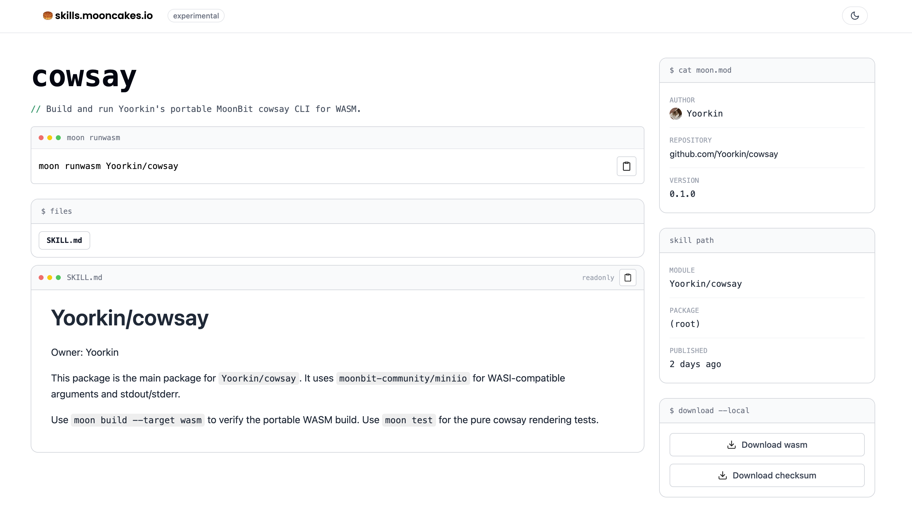

# 20260608 MoonBit v0.10.0

对应 moonc 版本：`v0.10.0+84519ca0a`

_需要说明的是，本次月报介绍的是 MoonBit 0.10 版本。它可以看作是 1.0 正式版发布前的一次关键更新，我们正在围绕语言稳定性、工具链完善和生态体验做最后阶段的打磨。按照目前规划，MoonBit 预计将在今年第三季度发布 1.0 正式版，后续进展也会通过月报持续同步给大家。_

## 语言更新

1. `trait` 和 `impl` 语法现在需要添加 `fn` 关键字：

   ```mbt
   trait I {
     fn f(Self) -> Unit
   //^^
   }

   impl I for Int with fn f(_) {}
   //                  ^^
   ```

   这一改动主要是为了方便为 `trait` 添加多态方法支持。现有代码只需要运行 `moon fmt` 即可自动完成迁移。目前旧的、没有 `fn` 的语法依然支持。下个版本中旧语法将开始产生警告，并会在未来被移除。

   `.mbtp` 文件中的 `impl` 现在也需要强制添加 `fn` 关键字。

2. 多态 `trait` 方法支持

   `trait` 中的方法现在可以有自己的类型参数了：

   ```mbt
   trait Logger {
     fn[X : Show] write_object(Self, X) -> Unit
   }

   impl Logger for StringBuilder with fn write_object(self, x) {
     self.write_string(x.to_string())
   }
   ```

   在实现一个多态的 `trait` 方法时，方法自身的类型参数无需显式标注。如果想要显式标注，需要将方法自身的类型参数标注在 `fn` 关键字后，而 `impl` 自身的类型参数依然标注在 `impl` 关键字后：

   ```mbt
   trait Poly {
     fn[X] f(Self, X) -> Unit
   }

   impl[A] Poly for Array[A] with fn[X] f(self, x : X) {
   //  ^^^ impl 的类型参数           ^^^ 方法的类型参数
     ...
   }
   ```

3. `for .. in` 循环支持状态变量的默认更新：

   ```mbt
   for i in 0..<10; p1 = 1, p2 = 0; p1 = p1 + p2, p2 = p1 {
                                 // ^^^^^^^^^^^^^^^^^^^^^
                                 // 本次新增。语义和 `for` 循环的默认更新一致。
                                 // 没有显式调用带参数的 `continue` 时，
                                 // 每次循环结束后会根据这里的声明来更新循环变量的值
     println("fib#\{i + 1} = \{p1}")
   }
   ```

4. List comprehension 支持 `for .. in` 的额外循环变量：

   ```mbt
   let fibs = [
     for _ in 0..<10
         p1 = 1, p2 = 0
         p1 = p1 + p2, p2 = p1 => {
       p1
     }
   ]
   ```

5. 使用 list comprehension 构建 `Iter` **以外**的类型时，list comprehension 内部可以包含副作用。例如 `raise` 和 `async`。

6. 字符串插值改进

   - 之前的字符串插值会编译成字符串拼接，现在改为编译成高效的 `StringBuilder` 写入。例如 `let r = "a\{b}c"`：

     ```mbt
     // 之前的编译结果
     let r = "a" + b.to_string() + "c"

     // 现在的编译结果
     let r = {
       let builder = StringBuilder(size_hint=2)
       builder.write_string("a")
       builder.write(b)
       builder.write_string("c")
       builder.to_string()
     }
     ```

   - 字符串插值 `\{...}` 内不再限制 `{`、`}`、`"` 的使用，字符串插值允许嵌套。

     ```mbt
     let xs = ["cd", "ef"]
     let r1 = "ab\{xs.join(";")}"
     assert_eq(r1, "abcd;ef")
     ```

   - 字符串插值 `\{...}` 内支持嵌套匿名函数，这种情况会被特殊处理：

     ```mbt
     let r = "a\{builder => builder.f()}"
     // 相当于
     let r = {
       let builder = StringBuilder()
       builder.write_string("a")
       (builder => builder.f())(builder)
       builder.to_string()
     }
     ```

7. 新增模板写入语法 `lhs <+ rhs`

   我们发现在 web 后端开发时，经常出现用缓冲区拼凑字符串的模式：

   ```mbt
   fn render(
     style : String,
     li_class : String,
     items : Array[String],
   ) -> String {
     let buf = StringBuilder()
     // <ul prop=foo>
     buf..write_string("<ul prop=foo>")
     //   <li class="{li_style}">{item}</li>
     for item in items {
       buf..write_string("<li class=\"")
          ..write(li_class)
          ..write_string("\">")
          ..write(item)
          .write_string("</li>")
     }
     // </ul>
     buf.write("</ul>")
     buf.to_string()
   }
   ```

   手动调用 `StringBuilder::write_string` 和 `StringBuilder::write` 非常繁琐。虽然这一场景也可以使用 HTML DSL 或者模板引擎代替，但它们会引入额外的内存分配和字符串替换开销。模板写入语法提供了一种更轻量、易读、零额外开销的解决方案，下面是使用新特性的等价代码：

   ```mbt
   fn render(
     style : String,
     li_class : String,
     items : Array[String],
   ) -> String {
     let buf = StringBuilder()
     buf <+ "<ul prop=foo>"
     for item in items {
       buf <+ $|<li class="\{li_class}">\{item}</li>
     }
     buf <+ "</ul>"
     buf.to_string()
   }
   ```

   对于 `buf <+ "a\{b}"`，它会直接被分解为 `buf..write_string("a")..write(b)`。

   操作符 `<+` 右侧允许下面的表达式：

   - 字符串 `"abc\{x}"`

   - 多行字符串 `#| multiline string...`

   - 多行字符串插值 `$| multiline string with \{x}`

   - map 字面量 `{"k1": v1, "k2": v2}`

   操作符 `<+` 左侧表达式的类型不要求是 `StringBuilder`，它可以是任意实现了下面方法的类型 `T`：

   - `T::write_string(T, String)`

   - `T::write(T, X)`

   - （可选）如果要支持写入 map 字面量，需要实现 `T::write_object_begin(T)`、`T::write_object_field(T, String, X)` 和 `T::write_object_end(T)`

   字符串插值 `\{...}` 的语法规则和普通字符串插值一致。

8. 新增条件模板写入语法 `lhs <? rhs`

   在模板写入语法的基础上，写入可以带前置条件。这在 debug logging 等场景非常有用：我们希望程序在调试模式才输出 debug 信息，而正常模式下不会付出 logging 开销。下面的例子中，`logger` 类型为 `Option[T]`，调试模式下 `logger` 的值是 `Some(...)`，正常模式为 `None`。

   ```mbt
   logger <? "[tag] message \{x}..."
   // 等价于
   if logger is Some(x) {
     x <+ "[tag] message \{x}..."
   }
   ```

9. 移除旧版 struct constructor 语法

   此前已经废弃的 `fn new(..)` 自定义构造器写法不再被支持，新的构造器写法统一为 `fn Type::Type(..)`。

10. 弃用 `try?` 语法

    编译器检查时会给出迁移建议。

11. 添加实验性内置 `V128` 类型

    目前它在 wasm/wasm-gc 后端会编译成 `v128` 类型；在生成 C 代码的 native 后端中，会在支持 NEON 的 Arm 架构上编译为 `uint8x16_t`，在支持 SSE2 的 x86 架构上编译为 `__m128i`。其他情况下会使用两个 `uint64` 进行模拟。以上内容不作 ABI 承诺，后续会通过标准库提供高效的 `V128` 操作。

## 工具链更新

1. 新的 MoonBit native 后端已经发布，并可通过 `MOONBIT_NEW_NATIVE=1` 环境变量试用，仅支持 macOS Apple Silicon；Linux 和 Windows 的支持将会逐步推出。

2. 新增 `moon test --profile` 和 `moon run --profile` 功能。macOS 上会调用 `xctrace` 对 native 程序进行 profile，Linux 平台支持也已经完成。

3. 新增 `--diagnostics-limit` 来限制 error 和 warning 数量，并减少失败时直接打印底层 `moonc` 命令带来的噪音。

4. Wasm 后端的 `println` 已替换为基于 WASI 的实现。

5. 实验性 `moon runwasm` 命令和 SKILL 市场

   使用 `moon runwasm Yoorkin/cowsay -- hello` 可以直接运行在 mooncakes.io 发布的、支持 Wasm target 的包。mooncakes.io 会自动为支持 Wasm 编译目标的包构建经过 wasm-opt 优化的 `*.wasm`，并将同目录的 `SKILL.md` 放在 [mooncakes.io/skills](https://mooncakes.io/skills) 页面展示：

   

   

6. 默认使用 `moon.mod` 代替原 `moon.mod.json`

   `moon.mod` 已支持 `supported_targets`、`preferred_target`、`readme`、`license`、`keywords`、`repository`、`description` 等顶层字段；`moon fmt` 默认启用从 `moon.mod.json` 到 `moon.mod` 的迁移，遇到问题时可通过 `NEW_MOON_MOD=0` 关闭。

7. `moon add path/to/mod` 的行为做了调整：再次添加已有依赖时只给出警告，不再隐式更新版本；需要更新时使用 `moon add --upgrade path/to/mod`。

8. Native LSP 已成为默认 LSP，并且新增 `moon.mod` 和 `moon.pkg` 的 LSP 支持。

9. 新增实验性的 `moon cram test` 命令，用于 MoonBit CLI 应用测试。该命令会首先使用 native 后端构建项目中的 CLI 程序，然后将它们放进 `PATH` 变量，之后运行 cram test。基本的使用例子请见 [moonbit-community/cram_test_poc](https://github.com/moonbit-community/cram_test_poc)。

10. 新增实验性的 `moon run --profile` 和 `moon test --profile` 工具，目前仅支持 macOS 和 Linux 平台下的 native 后端，会分别使用 `xctrace` 和 `perf` 进行 profile，并对结果中的符号进行 demangle。

## 标准库更新

1. `moonbitlang/async` 目前最新版本为 0.19.2，自上次月报（0.19.0）以来的主要更新如下：

   - 添加了监听文件系统变动的功能。可以通过 `@fs.Watcher(..)` 来监听某个目录下的所有子文件/子文件夹中的变动。目前 `@fs.Watcher` 仅提供了 `wait_any` 方法，暂不支持汇报具体的变动内容。汇报具体变动内容的功能将在未来添加。更多细节详见 `@fs.Watcher` 的文档。

   - 添加了 `@raw_fd.RawFdStream` 类型，该类型类似 `@raw_fd.RawFd`，但实现了 `@io.Reader`/`@io.Writer`。可以用于更方便地操作具有流式语义的 file descriptor。

   - 添加了 `@async.Mutex` 类型，可以用于在多个并行任务间进行同步。

   - 加入可选的 fd 泄漏检查，可通过 `MOONBIT_ASYNC_CHECK_FD_LEAK=1` 开启。开启后，如果程序忘记释放一些由 `moonbitlang/async` 管理的资源（例如文件），程序退出前会 `abort` 并提示有泄露问题。
