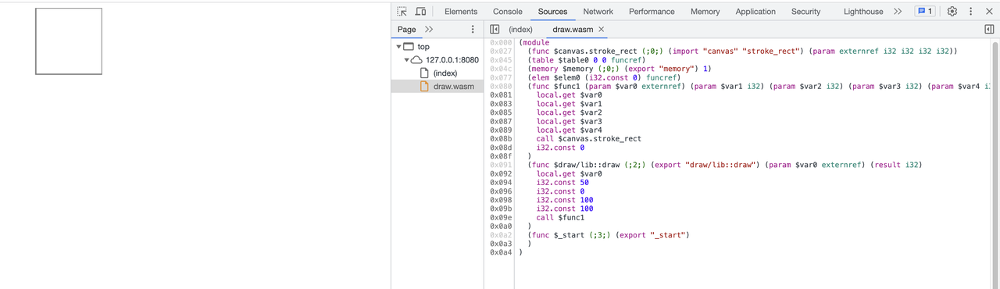
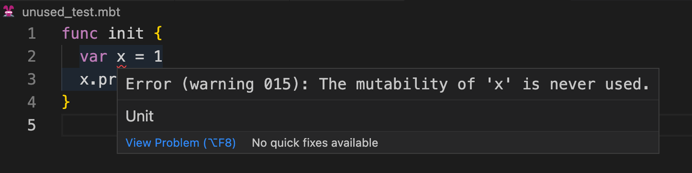
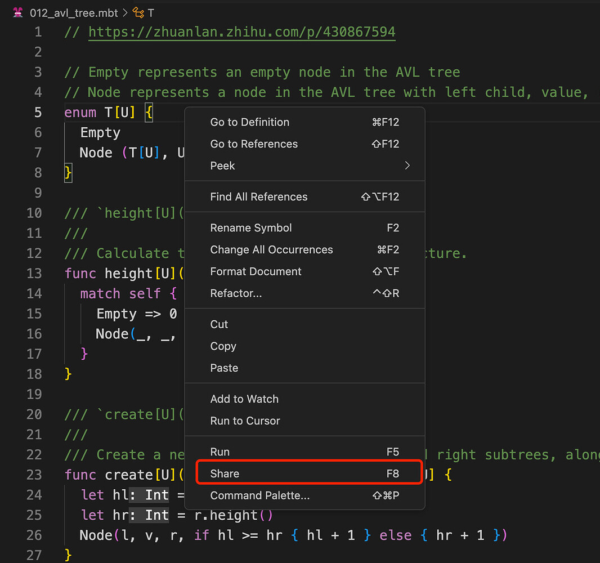
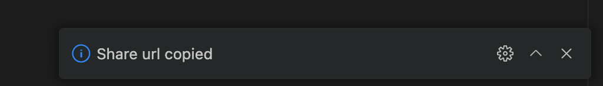

# weekly 2023-08-28

<!--truncate-->

## Moonbit更新

### 1. externref 支持

Moonbit增加对externref的支持，现在可以实现更多的和宿主语言交互。我们可以通过 extern ref 来调用 Javascript 的一些 API，比如：Canvas。我们通过一个例子来如何使用这个特性来画图。
A. 使用 `moon new draw` 来创建一个 MoonBit 项目，将 lib下面的 hello.mbt 重命名为 draw.mbt
B. 在 `lib/draw.mbt` 中添加下面的代码：

```
type Canvas_ctx

func stroke_rect(self : Canvas_ctx, x : Int, y : Int, width : Int, height : Int) = "canvas" "stroke_rect"

pub func draw(canvas : Canvas_ctx) {
  canvas.stroke_rect(50, 0, 100, 100)
}

```

C. 运行 `moon build`
D. 执行 `wat2wasm target/build/main/main.wat --output=draw.wasm`
E. 在 main 的同级目录下创建一个` index.html`

```

<html lang="en">
    <body>
    <canvas id="canvas" width="150" height="150"></canvas>
  </body>
  <script>

const spectest = {
    canvas: {
      stroke_rect: (ctx, x, y, width, height) => ctx.strokeRect(x, y, width, height)
    },
  };

const canvas = document.getElementById("canvas");
if (canvas.getContext) {
  const ctx = canvas.getContext("2d");

  WebAssembly.instantiateStreaming(fetch("draw.wasm"), spectest).then(
    (obj) => {
        const draw = obj.instance.exports["draw/lib::draw"];
        draw(ctx);
    }
  )
}

  </script>
</html>

```

F. 使用 `http-server .`/ 运行（也可以使用其他的方式将这个 html 运行起来）
打开浏览器可以看到下图的结果：


### 2. 没有被用到的 `var` 变量会提示warning

Moonbit 增加了对var定义变量的分析，当定义了变量而没有被用于重新赋值，会提示warning，比如:

```
func init {
  var x = 1
  x.print()
}
```



## 构建系统与IDE更新

### 1. moon run 性能优化

新版本构建系统更换了运行时，对于复杂计算性能有了很大提升。

比如playground的015_hamt.mbt，当入参是2000时，原来的moon run需要10.535秒，现在只需要0.015秒。

### 2. Web IDE支持代码分享

在线IDE支持把当前文件通过url的形式分享出去，当前触发路径是在编辑器通过 `F8` 或者鼠标右键选择 `Share`


创建url成功的话，网页右下角会出现提示：


此时，被分享的url将会存放到粘贴板，比如: https://try.moonbitlang.com/#049c7e88a8357df1413d15ea48115b74
