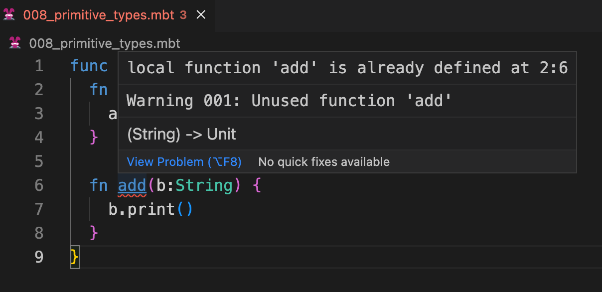
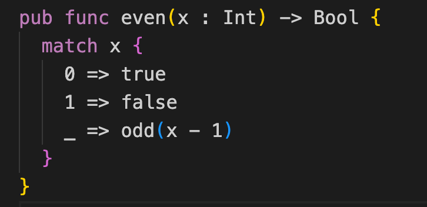
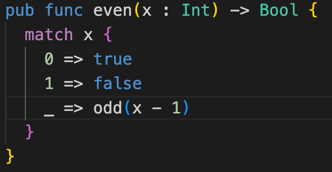
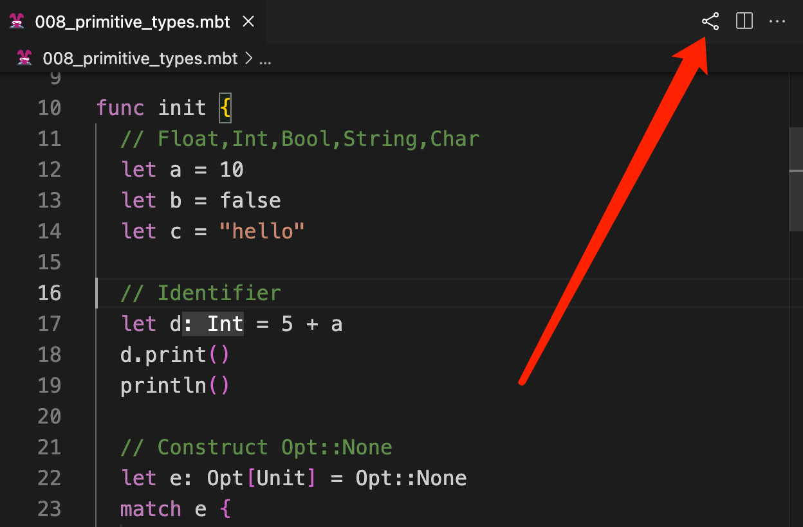
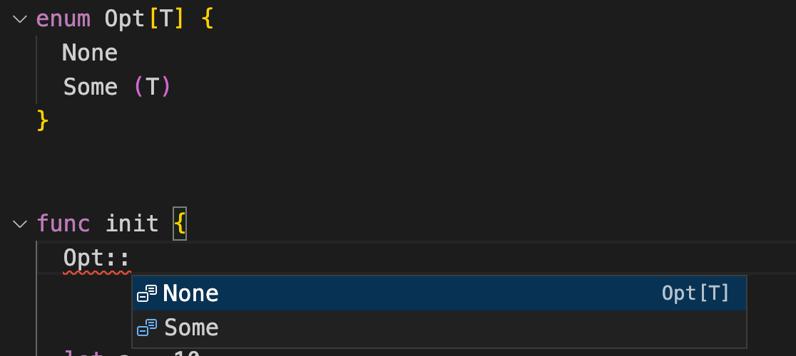

# weekly 2023-09-24

<!--truncate-->

## Moonbit更新

### 1. 允许用户自定义interface

Moonbit允许用户自定义interface，通过 `interface` 关键词来定义自定义接口，比如：

```
interface Number {
  op_add(Self, Self) -> Self
  op_sub(Self, Self) -> Self
  op_mul(Self, Self) -> Self
  op_div(Self, Self) -> Self
  op_neg(Self) -> Self
}

func f[X: Number](x: X, y: X) -> X {
  x * x + (- y / x - y)
}

func init {
  f(1, 2).print()
  f(1.0, 2.0).print()
}
```

上面的代码片段定义了一个叫作 `Number` 的 interface，它可以用来表示实现了算术操作的类型。对于任何类型 `X`，只要 `X` 实现了 `Number` 指定的五个算术操作，函数 `f` 就能在 `X` 上工作。用户可以对整数、浮点数，以及其他自定义的支持算术的类型，例如向量和矩阵，调用 `f`。

### 2. Moonbit 增加对FFI中浮点数(float)支持

```
func sqrt(x: Float) -> Float = "math" "sqrt"
func get_pi() -> Float = "math" "get_pi"

let pi: Float = get_pi()

func init {
  let x = sqrt(9.0)
  x.print()
  pi.print()
}
```

运行时需要提供对应的函数，比如:

```
#!/usr/bin/env node
const spectest = {
  math: {
    sqrt: (x) => Math.sqrt(x),
    get_pi: () => Math.PI
  },
  spectest: {
    print_i32: (x) => console.log(String(x)),
    print_f64: (x) => console.log(String(x)),
    print_char: (x) => console.log(String.fromCharCode(x)),
  },
};
(async () => {
  WebAssembly.instantiateStreaming(fetch("foo.wasm"), spectest).then(
    (obj) => {
      obj.instance.exports._start()
    }
  )
})();
```

### 3. 新增 Bytes 内置类型

Moonbit 增加 Bytes 内置类型，当前支持的方法如下:

1)`make`: 创建 Bytes

2)`length`: 获取Bytes长度

3)通过方括号+下标数字读写Bytes内容

```
func init{
  let bytes : Bytes = Bytes::make(3, 56)
  var i = 0
  bytes[1] = 57;
  bytes[2] = 58;

  let len = bytes.length()
  "length of bytes: \(len)\n".print()


  while i < 3 {
    let b = bytes[i]
    "byte \(i): \(b)\n".print();
    i = i + 1
  }
}
```

### 4. String::make以及Array::make接口更新

Moonbit移除了原先的string_make, array_make接口，迁移到新的T::method风格，比如

```
func init{
  let ary = Array::make(4,3) // [3,3,3,3]
  let str = String::make(4,'s') // "ssss"
}
```

### 5. 局部函数命名逻辑修改

Moonbit修改了局部函数逻辑，现在不允许局部函数重名。

比如这段代码会提示函数已经被定义：

```
func init {
  fn add(a:Int) -> Int {
    a + 1
  }

  fn add(b:String) {
    b.print()
  }
}
```



## Moonbit IDE 更新

### 1. 完善了Moonbit代码高亮机制，当前token的高亮对用户更友好

优化前:



优化后：


### 2. 优化代码分享交互

编辑器右上角增加分享icon：



### 3. IDE增加::语法的自动补全


