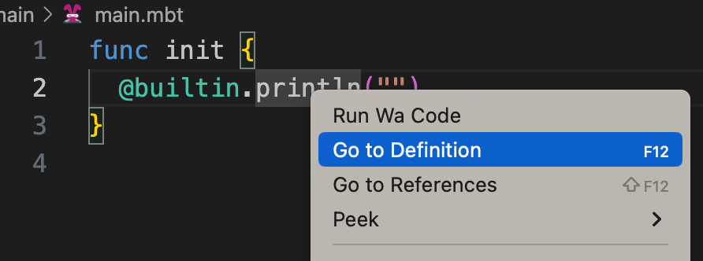
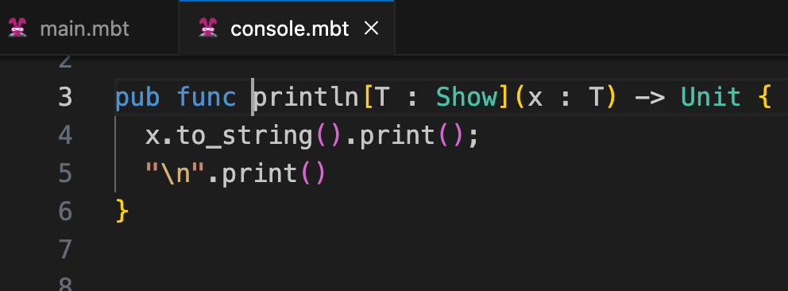
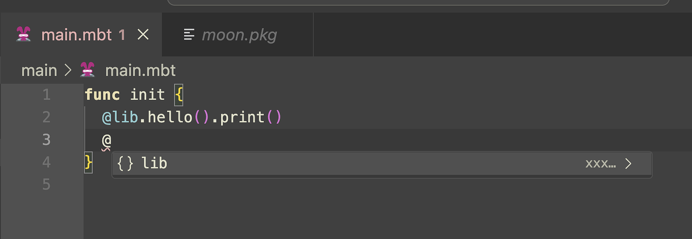
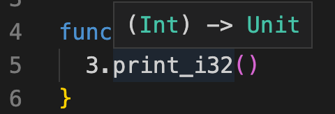
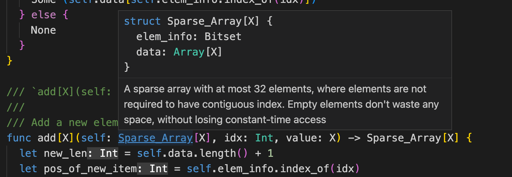
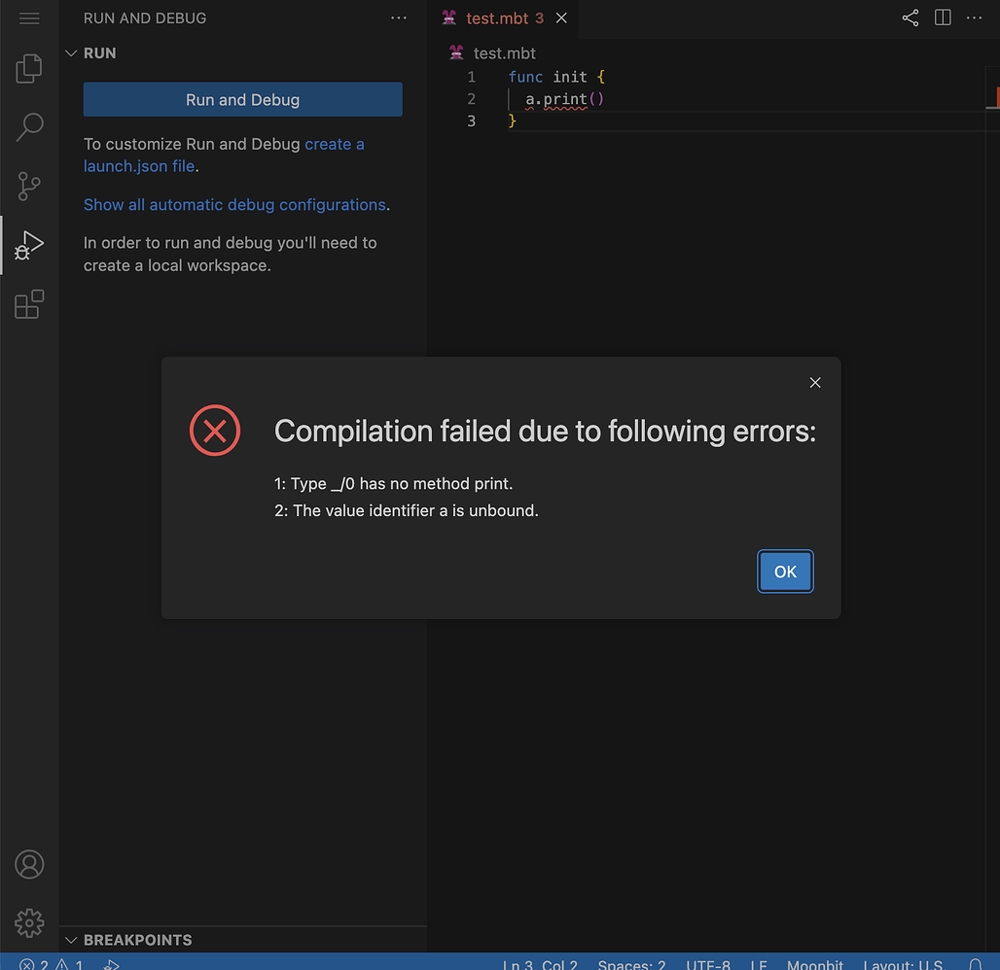

# weekly 2023-09-11

<!--truncate-->

## Moonbit更新

### 1. 新增内置函数 println[T : Show](input : T)

只要实现了to_string方法的类型都可以被println输出，比如

```
enum Tree[T]{
  Node(Tree[T],Tree[T])
  Leaf(T)
}

func to_string[T : Show](self : Tree[T]) -> String {
  match self {
    Node(l,r) => "Tree(\(l), \(r))"
    Leaf(v) => "Leaf(\(v))"
  }
}

func init {
  let tree = Tree::Node(Leaf(1),Node(Leaf(2),Leaf(3)))
  println(tree)
}
```

上述程序输出:

```
Tree(Leaf(1), Tree(Leaf(2), Leaf(3)))
```

## Moonbit IDE

### 1. IDE支持跳转至内置函数定义的源码

```
func init {
  @builtin.println("")
}
```

比如上述调用了内置函数代码可以在IDE上跳转至函数定义



可得



### 2. VS Code插件支持项目内包的自动补全

最新VS Code插件支持项目内包的自动补全，用户只需要键盘输入 `@` 就会显示包的列表，然后选择需要导入的包之后，对应的 `moon.pkg`会自动更新。比如：



### 3. Hover高亮

把鼠标停留在代码上，所显示的类型定义支持高亮了



### 4. Hover显示自定义类型

最新IDE可以通过鼠标停留在自定义类型上，会显示代码类型定义



### 5. 只有检查通过的代码才可以触发编译

现在只有通过语法检测和类型检测的代码才可以触发编译和运行，比如：

```
func init {
  a.print()
}
```

上述代码执行Run会出现如下提示：

