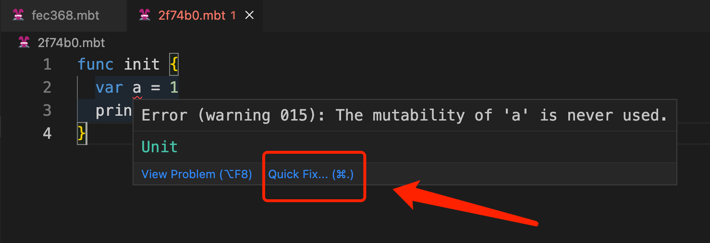
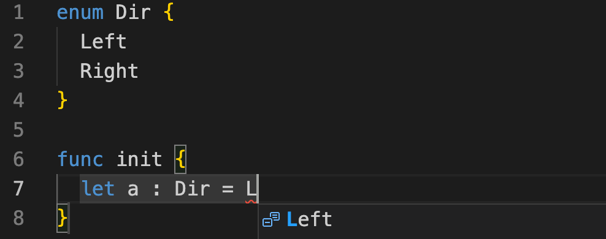

# weekly 2023-09-18

<!--truncate-->

## MoonBit更新

### 1. 新增 Int64 内置类型

MoonBit新增Int64内置类型，Int64类型的整数必须以L作为后缀，比如

```
func init {
  let a = 9_223_372_036_854_775_807L
  print(a)
}
```

上述程序输出:

```
9223372036854775807
```

### 2. 移除了内置方法t.print(), 改为函数print[T : Show](t : T)

只要实现了to_string方法的类型都可以被print输出，比如

```
enum Tree[T]{
  Node(Tree[T],Tree[T])
  Leaf(T)
}

func to_string[T : Show](self : Tree[T]) -> String {
  match self {
    Node(l,r) => "Tree(\(l), \(r))"
    Leaf(v) => "Leaf(\(v))"
  }
}

func init {
  let tree = Tree::Node(Leaf(1),Node(Leaf(2),Leaf(3)))
  // tree.print() // old method
  print(tree) // new method
}
```

上述程序输出:

```
Tree(Leaf(1), Tree(Leaf(2), Leaf(3)))
```

### 3. bool类型内置 to_string 方法

现在可以通过print、println直接打印bool类型数据，比如:

```
func init {
  println(false)
  print(true)
}
```

输出:

```
false
true
```

## IDE更新

### 1. 没被用到的 mutable 变量支持快速修复

当前如果定义了var变量，而后续代码中没有修改其内容，IDE可以提供快速修复功能。

比如如下代码：

```
func init {
  var a = 1
  print(a)
}
```



当我们点击 Quick Fix，代码可以被自动修复为:

```
func init {
  let a = 1
  print(a)
}
```

### 2.自动补全增加对枚举 constructor的支持

自动补全增加对枚举 constructor的支持，比如我们通过enum定义如下类型：

```
enum Dir {
  Left
  Right
}
```

当我们在init函数敲击 `L`时，自定义的 Left会出现自动补全。


