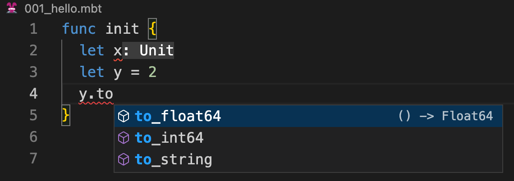
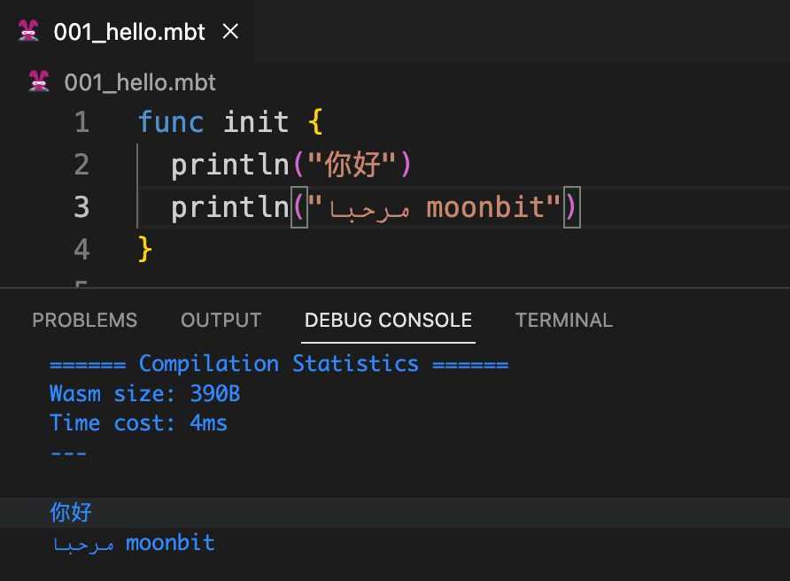

# weekly 2023-10-09

<!--truncate-->

## MoonBit更新

### 1. MoonBit引入新的手写语法分析器（Parser）

MoonBit引入新的手写语法分析器（Parser），新的语法分析器带来了更好的错误恢复，比如下面例子中，即使由于x 没有被赋值而提示错误，依然不影响下面2行代码的 y的自动补全功能。



### 2. MoonBit标准库开发中

为了方便用户开发更大规模的项目，Moonbit正在开发标准库，预期会在近期合入。

第一批对外的标准库预计会包含如下容器 Stack, Queue, Deque, Heap。

**Stack**

```
func init {
  let stack = Stack::make()
  repeat(5, fn(i) { stack.push(i + 1) })
  while stack.is_empty().not() {
    print(stack.peek())
    stack.pop()
  }
  print('\n')
}
```

输出：54321

**Queue**

```
func init {
  let queue = Queue::make()
  repeat(5, fn(i) { queue.push(i + 1) })
  while queue.is_empty().not() {
    print(queue.peek())
    queue.pop()
  }
  print('\n')
}
```

输出：12345

**Heap**

```
func init {
  let heap = MinHeap::make()
  heap.push(3)
  heap.push(1)
  heap.push(4)
  heap.push(2)
  heap.push(5)
  while heap.is_empty().not() {
    print(heap.peek())
    heap.pop()
  }
  print('\n')
}
```

输出：12345

### 3. 集成即将落地的 Wasm GC 提案

Wasm GC 标准实现正在快速推进中，预计会在这个月完成。

## IDE更新

### 1. IDE支持utf8字符串输出

MoonBit IDE支持utf8字符串打印输出，比如:

```
func init {
  println("你好")
  println("مرحبا moonbit")
}
```

运行结果如下：


