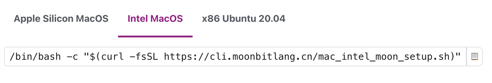

# weekly 2023-10-23

<!--truncate-->

## MoonBit更新

### 1. 根据社区用户的反馈，将顶层函数的关键字从 func 改为 fn，使其与局部函数保持一致，同时也能避免给开发者带来不必要的困惑。

修改前

```
func fib(num : Int) -> Int {
  fn aux(n, acc1, acc2) {
    match n {
      0 => acc1
      1 => acc2
      _ => aux(n - 1, acc2, acc1 + acc2)
    }
  }
  aux(num, 0, 1)
}

func init {
  println(fib(46))
}
```

修改后

```
fn fib(num : Int) -> Int {
  fn aux(n, acc1, acc2) {
    match n {
      0 => acc1
      1 => acc2
      _ => aux(n - 1, acc2, acc1 + acc2)
    }
  }
  aux(num, 0, 1)
}

fn init {
  println(fib(46))
}
```

### 2. 根据社区用户的反馈，将 `Float64` 类型名修改为 `Double`

修改前

```
let pi : Float64 = 3.14
```

修改后

```
let pi : Double = 3.14
```

### 3. 支持 Intel 芯⽚的 Mac 的工具链下载

链接是https://www.moonbitlang.cn/download/



我们预计在下周完成对 Windows 的支持

## IDE与构建系统

### 1. 将 `moon.pkg` 和 `moon.mod` 改成 JSON 格式

将 `moon.pkg` 和 `moon.mod` 改成 JSON 格式 `moon.pkg.json` 和 `moon.mod.json`。从自定义格式转换为 JSON 的原因是 MoonBit 的工具链正在快速演进，使用 JSON 可以减少维护成本并简化与其他工具的集成。

修改前moon.mod

```
module hello
```

修改后moon.mod.json

```
{
  "name": "hello"
}
```

修改前moon.pkg

```
package main

import "hello/lib"
```

修改后moon.pkg.json

```
{
  "name": "main",
  "import": {
    "hello/lib": ""
  }
}
```
