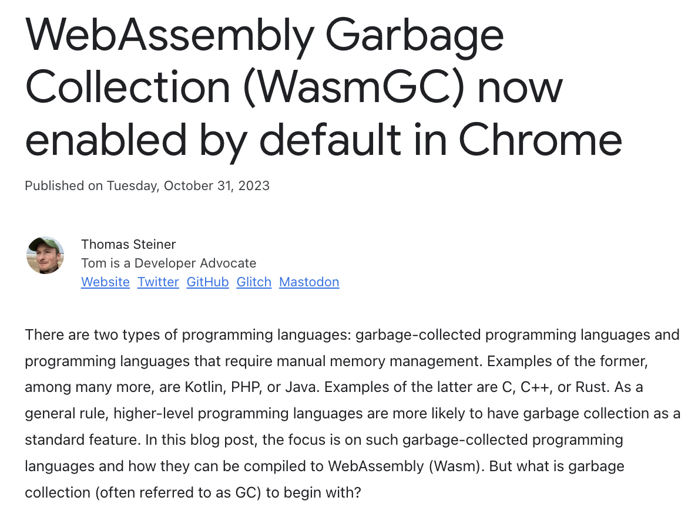
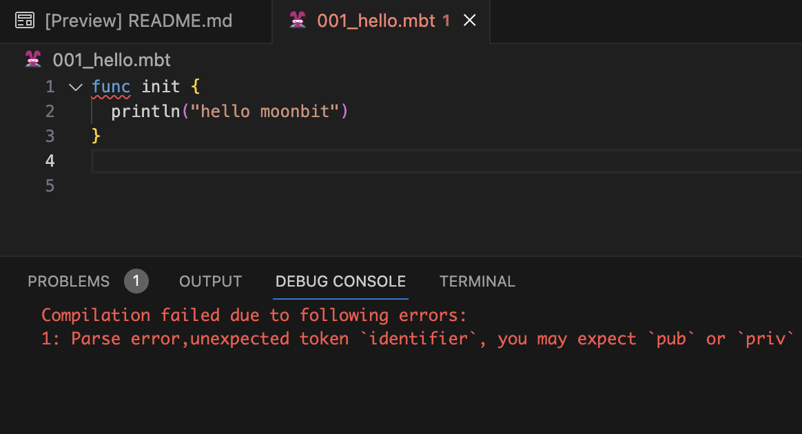

# weekly 2023-11-06

<!--truncate-->

## 01 Wasm GC

### 提供Wasm GC支持

WebAssembly垃圾回收（简称WasmGC）现在已默认在 Chrome 中启用（官方公告的详细内容可在复制该链接进行查看：https://developer.chrome.com/blog/wasmgc/)，我们也在第一时间提供对WasmGC的支持。

### 添加 moon build --target wasm-gc构建选项

添加`moon build--target wasm-gc`构建选项，用于生成符合**Wasm GC标准**的指令。

MoonBit Wasm GC教程可以复制链接了解：

https://github.com/moonbitlang/moonbit-docs/tree/main/examples/wasm-gc

## 02 MoonBit 调试器

### MoonBit正在推进源码调试支持

MoonBit正在推进源码调试支持，目前已经支持源码映射，基于源码设置断点等。下一步将支持查看局部变量和全局变量，届时就可以尝鲜使用了，敬请期待😚

MoonBit月兔

## 03 MoonBit 更新

### MoonBit现在只允许使用 fn 声明函数

MoonBit 删除`func`关键字，现在只允许使用 `fn` 声明函数。

## 04 IDE与构建系统

### moon check--daemon命令支持Windows

用于启动代码检查守护进程的命令`moon check --daemon`支持 Windows。
