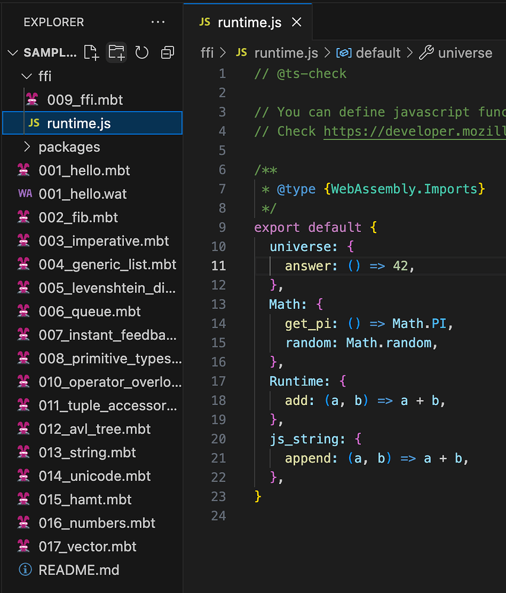
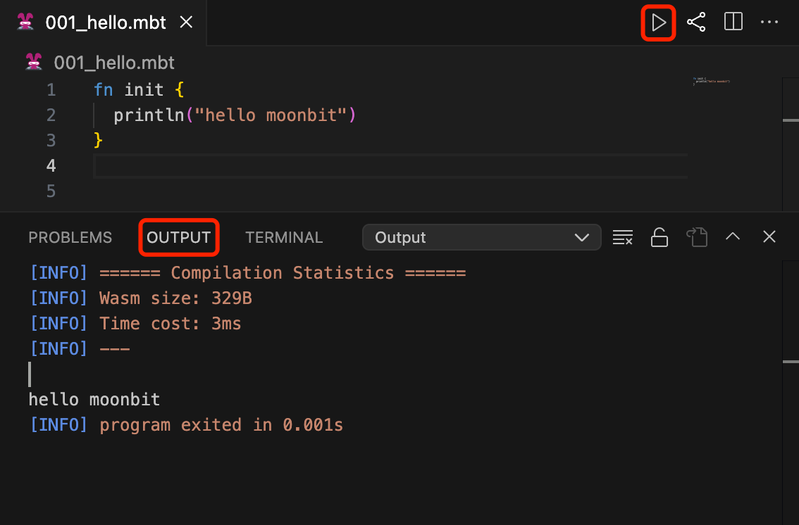
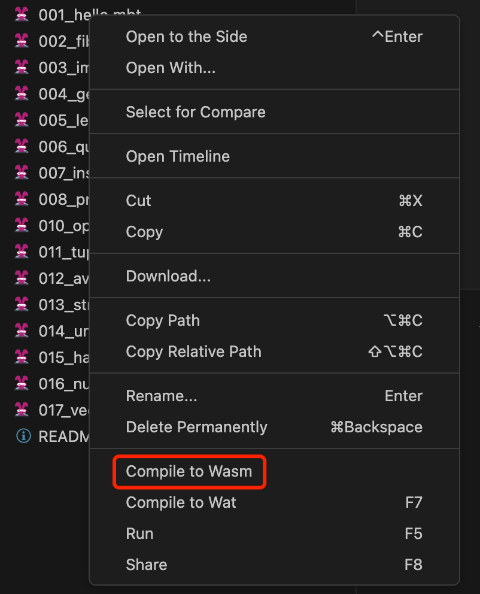

# weekly 2023-11-13

<!--truncate-->

## MoonBit 更新

### 1.性能提升

- Tokenization的性能提高了大约25%。

- 内置比较操作在早期阶段被内联，这可能对热循环（hotloop）产生较大影响。

### 2. 语法改进

根据用户反馈，不鼓励使用 `x := expr` 的形式，而推荐统一使用 `let x = expr`。未来可能会移除前者这种语法。

### 3. 整数上的方法调用现在必须加括号

修改前：`1.to_string()`

修改后：`(1).to_string()`

### 4. 基础类型支持hash方法

基础类型 `Bool`、`Char`、`Int`、`Int64`、`Double`、`String`支持 hash 方法。

```
fn init {
println("test".hash())
}
// 输出：1042293711
```

### 5. 移除内置类型Result、print_float64

- 移除内置类型`Result`，后续我们将在标准库中提供此类型。

- 移除`print_float64`FFI，此函数已经被`println`函数取代。

## IDE 更新

### 1. IDE 支持用户使用 JavaScript 定制运行时

使用样例请参考https://try.moonbitlang.cn 中的 `ffi` 文件夹 。



### 2. IDE 中添加运行按钮

IDE 中添加运行按钮，并且将打印内容的显示从调试控制台(DEBUG CONSOLE)更改到输出通道(OUTPUT)中。



### 3. 改进 IDE 对包的支持

之前用户只有在一个包中的 `moon.pkg.json` 文件上才能运行该包。现在，在包内的任意一个 `.mbt` 文件上都可以运行该包。

### 4. IDE 中添加直接编译到 Wasm 的选项



## 构建系统更新

### 1. 添加 moon build --debug 选项

添加`moon build --debug`选项，用于添加调试信息到编译产物中。

### 2. 调整 moon build 的输出目录

现在根据编译目标以及是否启用调试模式`--debug`，将编译产物的输出路径调整为`target/<arch>/<mode>`。

| 命令                                  | 输出目录                 |
| ------------------------------------- | ------------------------ |
| `moon build`                          | `target/wasm/release`    |
| `moon build --debug`                  | `target/wasm/debug`      |
| `moon build --target wasm-gc`         | `target/wasm-gc/release` |
| `moon build --target wasm-gc --debug` | `target/wasm-gc/debug`   |
