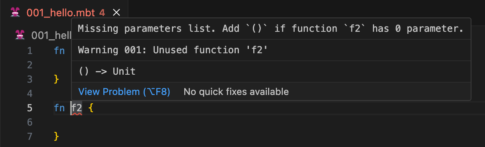
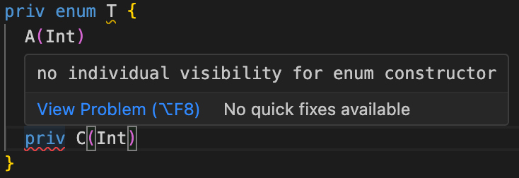

# weekly 2023-11-20

<!--truncate-->

## MoonBit更新

### 1. 优化没有间接调用的顶层函数的编译过程

优化对于没有间接调用的顶层函数的编译过程，带来约14%的编译性能提升

### 2. 优化解析器的错误恢复和报错

-修复对于`fn f2 {}`这样的顶层的函数声明没有参数时，省略括号也能通过编译，现在会直接报错



-对于试图给枚举类型构造器单独设置可见性的代码，将会报错

```
priv enum T {
  A(Int)
  pub B(Int)
  priv C(Int)
}
```



### 3. 修复死代码分析中误报未使用类型或和未使用字段的问题
